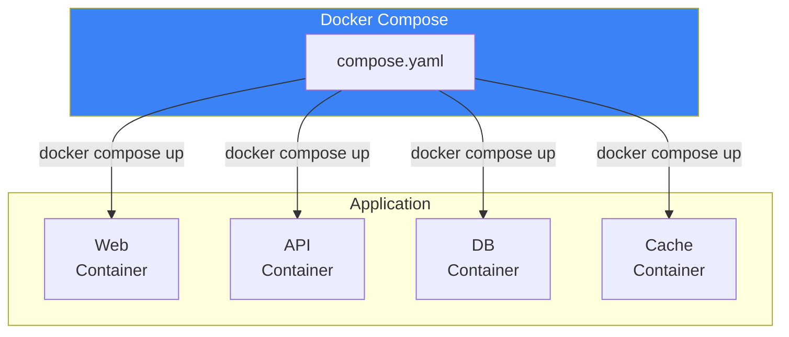
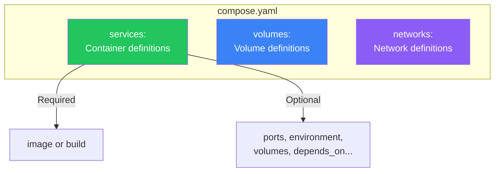
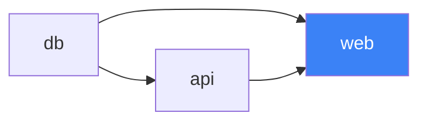

# Day 8: Managing Multiple Containers with Docker Compose

## What You'll Learn Today

- What Docker Compose is
- Writing compose.yaml files
- Using docker compose commands
- Building multi-container applications

---

## What is Docker Compose?

Docker Compose is a **tool for defining and managing multiple containers**. You describe the configuration in a YAML file and can start/stop all containers with a single command.



### Why Use Docker Compose?

| Challenge | Docker Compose Solution |
|-----------|------------------------|
| Multiple `docker run` commands | Define in one YAML file |
| Container dependencies | Make explicit with `depends_on` |
| Manual network creation | Auto-creates networks |
| Environment variable management | Centralize in files |
| Reproducibility | Version control configuration |

---

## Basic compose.yaml Structure

```yaml
# Service (container) definitions
services:
  web:
    image: nginx:latest
    ports:
      - "8080:80"

  db:
    image: postgres:16
    environment:
      POSTGRES_PASSWORD: secret

# Volume definitions (optional)
volumes:
  db-data:

# Network definitions (optional)
networks:
  backend:
```

### Main Elements



---

## Service Definitions

### image - Specify Image

```yaml
services:
  web:
    image: nginx:1.25
```

### build - Build from Dockerfile

```yaml
services:
  app:
    build: .
    # Or specify in detail
    build:
      context: ./app
      dockerfile: Dockerfile.prod
```

### ports - Port Mapping

```yaml
services:
  web:
    image: nginx
    ports:
      - "8080:80"      # host:container
      - "443:443"
```

### environment - Environment Variables

```yaml
services:
  db:
    image: postgres:16
    environment:
      POSTGRES_USER: myuser
      POSTGRES_PASSWORD: secret
      POSTGRES_DB: mydb
    # Or array format
    environment:
      - POSTGRES_USER=myuser
      - POSTGRES_PASSWORD=secret
```

### env_file - Environment Variable File

```yaml
services:
  app:
    image: myapp
    env_file:
      - .env
      - .env.local
```

### volumes - Mount Volumes

```yaml
services:
  db:
    image: postgres:16
    volumes:
      - db-data:/var/lib/postgresql/data  # Named volume
      - ./init:/docker-entrypoint-initdb.d # Bind mount

volumes:
  db-data:
```

### depends_on - Dependencies

```yaml
services:
  web:
    image: nginx
    depends_on:
      - api
      - db

  api:
    image: myapi
    depends_on:
      - db

  db:
    image: postgres:16
```



### networks - Network Connections

```yaml
services:
  web:
    image: nginx
    networks:
      - frontend
      - backend

  db:
    image: postgres:16
    networks:
      - backend

networks:
  frontend:
  backend:
```

### restart - Restart Policy

```yaml
services:
  web:
    image: nginx
    restart: always  # no, always, on-failure, unless-stopped
```

---

## Docker Compose Commands

### Start Application

```bash
# Start in foreground
docker compose up

# Start in background
docker compose up -d

# Build then start
docker compose up --build
```

### Stop Application

```bash
# Stop (containers remain)
docker compose stop

# Stop and remove containers
docker compose down

# Also remove volumes
docker compose down -v
```

### Check Status

```bash
# Service status
docker compose ps

# Show logs
docker compose logs

# Logs for specific service
docker compose logs web

# Follow logs in real-time
docker compose logs -f
```

### Other Operations

```bash
# Restart services
docker compose restart

# Execute command in service
docker compose exec web bash

# Run one-off command
docker compose run --rm web npm test
```

---

## Hands-On: Building a Web Application

Build a Node.js + PostgreSQL configuration.

### Project Structure

```
myapp/
├── compose.yaml
├── app/
│   ├── Dockerfile
│   ├── package.json
│   └── index.js
└── .env
```

### Step 1: Application Code

**app/package.json**
```json
{
  "name": "docker-compose-demo",
  "version": "1.0.0",
  "main": "index.js",
  "dependencies": {
    "express": "^4.18.2",
    "pg": "^8.11.3"
  }
}
```

**app/index.js**
```javascript
const express = require('express');
const { Pool } = require('pg');

const app = express();
const port = 3000;

const pool = new Pool({
  host: process.env.DB_HOST || 'db',
  port: process.env.DB_PORT || 5432,
  user: process.env.DB_USER || 'app',
  password: process.env.DB_PASSWORD || 'secret',
  database: process.env.DB_NAME || 'myapp',
});

app.get('/', async (req, res) => {
  try {
    const result = await pool.query('SELECT NOW()');
    res.json({
      message: 'Hello from Docker Compose!',
      dbTime: result.rows[0].now,
    });
  } catch (err) {
    res.status(500).json({ error: err.message });
  }
});

app.get('/health', (req, res) => {
  res.json({ status: 'healthy' });
});

app.listen(port, '0.0.0.0', () => {
  console.log(`App listening on port ${port}`);
});
```

### Step 2: Dockerfile

**app/Dockerfile**
```dockerfile
FROM node:20-slim

WORKDIR /app

COPY package*.json ./
RUN npm install

COPY . .

EXPOSE 3000

CMD ["node", "index.js"]
```

### Step 3: compose.yaml

```yaml
services:
  app:
    build: ./app
    ports:
      - "3000:3000"
    environment:
      DB_HOST: db
      DB_USER: app
      DB_PASSWORD: secret
      DB_NAME: myapp
    depends_on:
      db:
        condition: service_healthy
    restart: unless-stopped

  db:
    image: postgres:16
    environment:
      POSTGRES_USER: app
      POSTGRES_PASSWORD: secret
      POSTGRES_DB: myapp
    volumes:
      - db-data:/var/lib/postgresql/data
    healthcheck:
      test: ["CMD-SHELL", "pg_isready -U app -d myapp"]
      interval: 5s
      timeout: 5s
      retries: 5
    restart: unless-stopped

volumes:
  db-data:
```

### Step 4: Start and Verify

```bash
# Start
docker compose up -d

# Check status
docker compose ps

# Check logs
docker compose logs -f app

# Verify
curl http://localhost:3000
```

### Step 5: Cleanup

```bash
docker compose down -v
```

---

## Advanced Configuration

### Health Checks

```yaml
services:
  web:
    image: nginx
    healthcheck:
      test: ["CMD", "curl", "-f", "http://localhost"]
      interval: 30s
      timeout: 10s
      retries: 3
      start_period: 40s
```

### depends_on with condition

```yaml
services:
  app:
    depends_on:
      db:
        condition: service_healthy  # Wait until health check passes
```

### Profiles

Define different services for development vs production.

```yaml
services:
  app:
    image: myapp

  debug:
    image: debug-tools
    profiles:
      - debug
```

```bash
# Start with debug profile
docker compose --profile debug up
```

### Multiple Compose Files

```bash
# Merge multiple files
docker compose -f compose.yaml -f compose.prod.yaml up
```

---

## Managing Environment Variables

### .env File

**`.env`**
```env
POSTGRES_USER=app
POSTGRES_PASSWORD=secret
POSTGRES_DB=myapp
APP_PORT=3000
```

**compose.yaml**
```yaml
services:
  db:
    image: postgres:16
    environment:
      POSTGRES_USER: ${POSTGRES_USER}
      POSTGRES_PASSWORD: ${POSTGRES_PASSWORD}
      POSTGRES_DB: ${POSTGRES_DB}

  app:
    build: ./app
    ports:
      - "${APP_PORT}:3000"
```

### Variable Priority

1. Shell environment variables
2. `.env` file
3. Default values in compose.yaml

---

## Common Patterns

### Hot Reload for Development

```yaml
services:
  app:
    build: ./app
    volumes:
      - ./app:/app        # Mount source code
      - /app/node_modules # Exclude node_modules
    command: npm run dev
```

### Database + Admin Tool

```yaml
services:
  db:
    image: postgres:16
    environment:
      POSTGRES_PASSWORD: secret

  adminer:
    image: adminer
    ports:
      - "8080:8080"
```

### Adding Redis Cache

```yaml
services:
  app:
    build: ./app
    depends_on:
      - db
      - redis

  db:
    image: postgres:16

  redis:
    image: redis:7-alpine
```

---

## Summary

| Command | Description |
|---------|-------------|
| `docker compose up` | Start services |
| `docker compose up -d` | Start in background |
| `docker compose down` | Stop and remove services |
| `docker compose ps` | Show service status |
| `docker compose logs` | Show logs |
| `docker compose exec` | Execute command in container |
| `docker compose build` | Build images |
| `docker compose restart` | Restart services |

### Key Points

1. Define multiple containers declaratively in compose.yaml
2. Control startup order with `depends_on`
3. Persist data with named volumes
4. Manage environment variables with `.env` files
5. Use health checks for more reliable dependencies

---

## Practice Problems

### Problem 1: Basic Configuration
Create a compose.yaml with:
- Nginx (exposed on port 8080)
- Redis (internal communication only)
- Both connected to the same network

### Problem 2: Add Volumes
Add the following to Problem 1:
- A volume to persist Redis data
- A bind mount for Nginx configuration

### Challenge Problem
Create a WordPress and MySQL configuration:
- WordPress: exposed on port 80
- MySQL: data persisted
- Environment variables managed in `.env` file
- Health check ensures MySQL starts before WordPress

---

## References

- [Docker Compose Overview](https://docs.docker.com/compose/)
- [Compose File Reference](https://docs.docker.com/reference/compose-file/)
- [docker compose CLI Reference](https://docs.docker.com/reference/cli/docker/compose/)

---

**Next Up**: In Day 9, we'll learn about "Advanced Dockerfiles." You'll master multi-stage builds and image optimization techniques.
