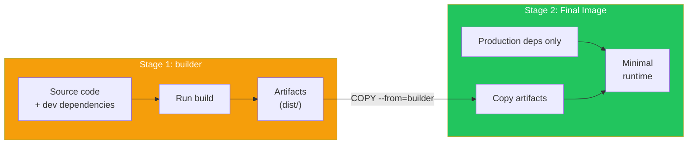
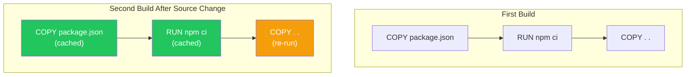

# Day 9: Advanced Dockerfiles

## What You'll Learn Today

- Multi-stage builds
- Image size optimization
- Security best practices
- Efficient cache utilization

---

## Multi-Stage Builds

Multi-stage builds separate the build environment from the runtime environment. This significantly reduces final image size.

### Problem: Build Tools Remain

With regular Dockerfiles, build tools remain in the image.

```dockerfile
# Traditional approach (problematic)
FROM node:20

WORKDIR /app
COPY package*.json ./
RUN npm install
COPY . .
RUN npm run build  # Compile TypeScript

CMD ["node", "dist/index.js"]

# Problem: node_modules (including dev), TypeScript compiler, etc. remain
# Image size: ~1GB+
```

### Solution: Multi-Stage Builds

```dockerfile
# Stage 1: Build environment
FROM node:20 AS builder

WORKDIR /app
COPY package*.json ./
RUN npm install
COPY . .
RUN npm run build

# Stage 2: Runtime environment
FROM node:20-slim

WORKDIR /app
COPY package*.json ./
RUN npm install --only=production
COPY --from=builder /app/dist ./dist

CMD ["node", "dist/index.js"]

# Result: No build tools, production dependencies only
# Image size: ~200MB
```



### Go Application Example

Go benefits greatly from multi-stage builds.

```dockerfile
# Stage 1: Build
FROM golang:1.22 AS builder

WORKDIR /app
COPY go.mod go.sum ./
RUN go mod download
COPY . .
RUN CGO_ENABLED=0 GOOS=linux go build -o main .

# Stage 2: Runtime (scratch = empty image)
FROM scratch

COPY --from=builder /app/main /main

ENTRYPOINT ["/main"]

# Image size: ~10MB (no Go runtime needed)
```

| Stage | Size |
|-------|------|
| golang:1.22 | ~800MB |
| Final image (scratch) | ~10MB |

---

## Image Size Optimization

### 1. Choose Lightweight Base Images

```dockerfile
# ❌ Full image (~1GB)
FROM python:3.11

# ✅ Slim image (~150MB)
FROM python:3.11-slim

# ✅ Alpine image (~50MB)
FROM python:3.11-alpine
```

### 2. Minimize Layers

Each `RUN` instruction creates a layer. Combine when possible.

```dockerfile
# ❌ Bad: Too many layers
RUN apt-get update
RUN apt-get install -y curl
RUN apt-get install -y git
RUN rm -rf /var/lib/apt/lists/*

# ✅ Good: Combined into one RUN
RUN apt-get update && \
    apt-get install -y --no-install-recommends \
        curl \
        git && \
    rm -rf /var/lib/apt/lists/*
```

### 3. Exclude Unnecessary Files

**.dockerignore**
```
.git
node_modules
*.log
.env
.DS_Store
__pycache__
*.pyc
.pytest_cache
coverage/
dist/
build/
```

### 4. Clean Up Caches

```dockerfile
# Python
RUN pip install --no-cache-dir -r requirements.txt

# Node.js
RUN npm ci --only=production && npm cache clean --force

# apt
RUN apt-get update && \
    apt-get install -y package && \
    rm -rf /var/lib/apt/lists/*

# apk (Alpine)
RUN apk add --no-cache package
```

---

## Efficient Cache Utilization

### Copy Dependency Files First

Copy less frequently changed files first to maximize cache usage.

```dockerfile
# ✅ Good example
WORKDIR /app

# 1. Copy dependency definition files (change frequency: low)
COPY package.json package-lock.json ./

# 2. Install dependencies (cached)
RUN npm ci

# 3. Copy source code (change frequency: high)
COPY . .

# If only source code changes, steps 1-2 use cache
```



### BuildKit Cache Mounts

```dockerfile
# Caching with BuildKit feature
RUN --mount=type=cache,target=/root/.cache/pip \
    pip install -r requirements.txt

RUN --mount=type=cache,target=/root/.npm \
    npm ci
```

---

## Security Best Practices

### 1. Run as Non-Root User

```dockerfile
FROM node:20-slim

# Create user
RUN useradd --create-home --shell /bin/bash appuser

WORKDIR /app

COPY --chown=appuser:appuser . .

# Switch user
USER appuser

CMD ["node", "index.js"]
```

### 2. Minimal Permissions

```dockerfile
# Restrict file permissions
COPY --chmod=555 script.sh /app/
```

### 3. Don't Include Secrets

```dockerfile
# ❌ Never do this
COPY .env /app/
ENV API_KEY=secret123

# ✅ Pass as runtime environment variables
# docker run -e API_KEY=xxx myimage
```

### 4. Pin Specific Versions

```dockerfile
# ❌ Bad
FROM python:latest
RUN pip install flask

# ✅ Good
FROM python:3.11.7-slim-bookworm
RUN pip install flask==3.0.0
```

### 5. Vulnerability Scanning

```bash
# Scan with Docker Scout
docker scout cves myimage:latest

# Using Trivy
docker run --rm -v /var/run/docker.sock:/var/run/docker.sock \
  aquasec/trivy image myimage:latest
```

---

## Practical Dockerfile Patterns

### Python Application

```dockerfile
# Multi-stage build
FROM python:3.11-slim AS builder

WORKDIR /app

# Create virtual environment
RUN python -m venv /opt/venv
ENV PATH="/opt/venv/bin:$PATH"

COPY requirements.txt .
RUN pip install --no-cache-dir -r requirements.txt

# Final image
FROM python:3.11-slim

# Non-root user
RUN useradd --create-home appuser
USER appuser

WORKDIR /app

# Copy virtual environment
COPY --from=builder /opt/venv /opt/venv
ENV PATH="/opt/venv/bin:$PATH"

COPY --chown=appuser:appuser . .

EXPOSE 8000

CMD ["gunicorn", "--bind", "0.0.0.0:8000", "app:app"]
```

### Node.js Application

```dockerfile
FROM node:20-slim AS builder

WORKDIR /app

COPY package*.json ./
RUN npm ci

COPY . .
RUN npm run build && npm prune --production

# Final image
FROM node:20-slim

RUN useradd --create-home appuser
USER appuser

WORKDIR /app

COPY --from=builder --chown=appuser:appuser /app/dist ./dist
COPY --from=builder --chown=appuser:appuser /app/node_modules ./node_modules
COPY --from=builder --chown=appuser:appuser /app/package.json ./

EXPOSE 3000

CMD ["node", "dist/index.js"]
```

### React Frontend + Nginx

```dockerfile
# Build stage
FROM node:20 AS builder

WORKDIR /app
COPY package*.json ./
RUN npm ci
COPY . .
RUN npm run build

# Serve with Nginx
FROM nginx:alpine

COPY --from=builder /app/build /usr/share/nginx/html
COPY nginx.conf /etc/nginx/conf.d/default.conf

EXPOSE 80

CMD ["nginx", "-g", "daemon off;"]
```

---

## HEALTHCHECK Instruction

Monitor container health.

```dockerfile
FROM nginx:alpine

HEALTHCHECK --interval=30s --timeout=3s --start-period=5s --retries=3 \
  CMD curl -f http://localhost/ || exit 1
```

| Option | Description |
|--------|-------------|
| `--interval` | Check interval |
| `--timeout` | Timeout duration |
| `--start-period` | Startup wait time |
| `--retries` | Failure tolerance count |

---

## LABEL Instruction for Metadata

```dockerfile
FROM python:3.11-slim

LABEL maintainer="your@email.com"
LABEL version="1.0.0"
LABEL description="My awesome app"
LABEL org.opencontainers.image.source="https://github.com/user/repo"
```

---

## Checking Image Size

```bash
# Check image size
docker images myapp

# Detailed analysis
docker history myapp:latest

# Layer analysis with dive tool
docker run --rm -it \
  -v /var/run/docker.sock:/var/run/docker.sock \
  wagoodman/dive myapp:latest
```

---

## Summary

| Technique | Effect |
|-----------|--------|
| Multi-stage builds | Exclude build tools, reduce size |
| Lightweight base images | Reduce base size |
| Layer consolidation | Reduce layer count and size |
| .dockerignore | Exclude unnecessary files |
| Cache cleanup | Exclude temporary files |
| Copy deps first | Leverage build cache |
| Non-root user | Improve security |
| Version pinning | Reproducibility and security |

### Key Points

1. Minimize final image with multi-stage builds
2. Copy less frequently changed items first for cache
3. Always run as non-root user
4. Never include secrets in images
5. Pin explicit versions in production

---

## Practice Problems

### Problem 1: Multi-Stage Build
Create a multi-stage Dockerfile for a TypeScript Node.js app:
- Stage 1: Build (npm run build)
- Stage 2: Run with production dependencies only

### Problem 2: Optimization
Identify and fix the issues in this Dockerfile:

```dockerfile
FROM python:3.11
WORKDIR /app
COPY . .
RUN pip install -r requirements.txt
RUN apt-get update
RUN apt-get install -y curl
CMD ["python", "app.py"]
```

### Challenge Problem
Create a multi-stage Dockerfile for a Go application and get the final image under 10MB. Hint: Use the `scratch` image.

---

## References

- [Multi-Stage Builds](https://docs.docker.com/build/building/multi-stage/)
- [Dockerfile Best Practices](https://docs.docker.com/develop/develop-images/dockerfile_best-practices/)
- [Docker Security](https://docs.docker.com/engine/security/)
- [BuildKit](https://docs.docker.com/build/buildkit/)

---

**Next Up**: In Day 10, we'll learn about "Production Preparation and Best Practices." We'll cover security, logging, monitoring, and your next steps into Kubernetes.
