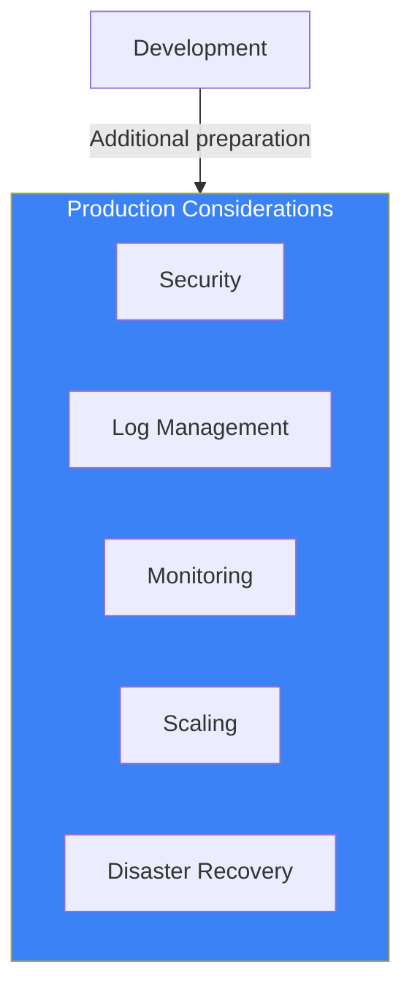
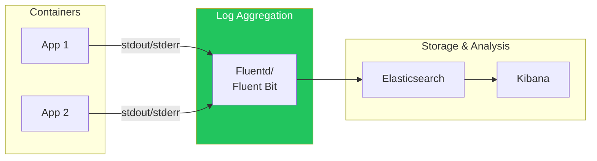
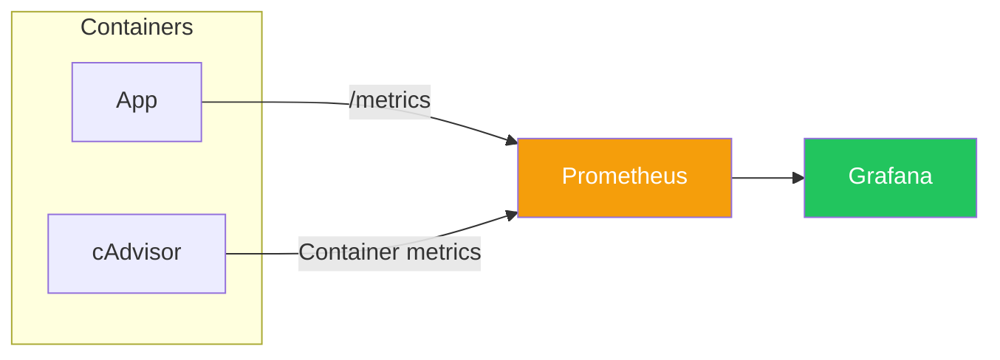
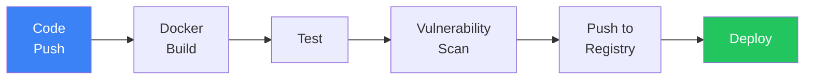
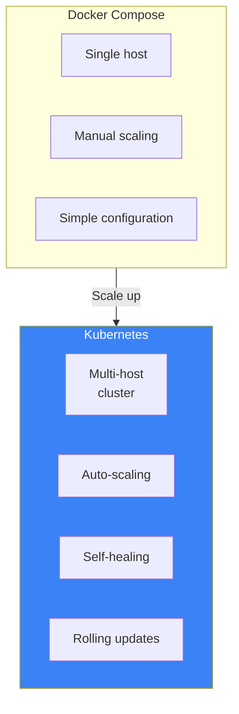

# Day 10: Production Preparation and Best Practices

## What You'll Learn Today

- Container security
- Logging and monitoring
- CI/CD integration
- Production operations best practices
- Next steps: Introduction to Kubernetes

---

## Docker in Production

Running containers in production requires additional considerations beyond development.



---

## Security Best Practices

### 1. Image Trust

```bash
# Use official images
docker pull nginx  # Official Image

# Verify image signatures
docker trust inspect nginx:latest

# Vulnerability scanning
docker scout cves nginx:latest
```

### 2. Principle of Least Privilege

```dockerfile
# Run as non-root user
FROM node:20-slim

RUN useradd --create-home --shell /bin/bash appuser
USER appuser

WORKDIR /home/appuser/app
COPY --chown=appuser:appuser . .

CMD ["node", "app.js"]
```

### 3. Read-Only Filesystem

```bash
# Start with read-only filesystem
docker run --read-only \
  --tmpfs /tmp \
  --tmpfs /var/run \
  nginx
```

### 4. Resource Limits

```bash
# Limit CPU and memory
docker run -d \
  --memory="512m" \
  --cpus="1.0" \
  --pids-limit=100 \
  nginx
```

```yaml
# Docker Compose configuration
services:
  app:
    image: myapp
    deploy:
      resources:
        limits:
          cpus: '1.0'
          memory: 512M
        reservations:
          cpus: '0.5'
          memory: 256M
```

### 5. Network Isolation

```yaml
services:
  web:
    networks:
      - frontend

  api:
    networks:
      - frontend
      - backend

  db:
    networks:
      - backend  # Not accessible from web

networks:
  frontend:
  backend:
```

### Security Checklist

| Item | Check |
|------|-------|
| Base image | Official or regularly updated? |
| User | Running as non-root? |
| Secrets | Not included in image? |
| Vulnerabilities | Scan executed? |
| Network | Only necessary ports exposed? |
| Resources | Limits configured? |

---

## Log Management

### Docker Log Drivers

```bash
# Default (json-file)
docker run -d nginx

# Send to syslog
docker run -d \
  --log-driver=syslog \
  --log-opt syslog-address=tcp://192.168.1.100:514 \
  nginx

# Send to fluentd
docker run -d \
  --log-driver=fluentd \
  --log-opt fluentd-address=localhost:24224 \
  nginx
```

### Logging Best Practices



1. **Output to stdout**: Not files, but standard output
2. **Structured logs**: Output in JSON format
3. **Log aggregation**: Collect with Fluentd, Logstash, etc.
4. **Rotation**: `--log-opt max-size=10m --log-opt max-file=3`

```bash
# Limit log size
docker run -d \
  --log-opt max-size=10m \
  --log-opt max-file=3 \
  nginx
```

---

## Monitoring

### Health Checks

```dockerfile
HEALTHCHECK --interval=30s --timeout=10s --retries=3 \
  CMD curl -f http://localhost/health || exit 1
```

```yaml
# Docker Compose
services:
  app:
    image: myapp
    healthcheck:
      test: ["CMD", "curl", "-f", "http://localhost/health"]
      interval: 30s
      timeout: 10s
      retries: 3
      start_period: 40s
```

### Metrics Collection



### Prometheus + Grafana Example

```yaml
services:
  app:
    image: myapp
    ports:
      - "8080:8080"

  prometheus:
    image: prom/prometheus
    ports:
      - "9090:9090"
    volumes:
      - ./prometheus.yml:/etc/prometheus/prometheus.yml

  grafana:
    image: grafana/grafana
    ports:
      - "3000:3000"
    depends_on:
      - prometheus
```

### docker stats Command

```bash
# Real-time resource usage
docker stats

# Specific containers only
docker stats web api db
```

---

## CI/CD Integration

### GitHub Actions Example

```yaml
# .github/workflows/docker.yml
name: Docker Build and Push

on:
  push:
    branches: [main]

jobs:
  build:
    runs-on: ubuntu-latest
    steps:
      - uses: actions/checkout@v4

      - name: Set up Docker Buildx
        uses: docker/setup-buildx-action@v3

      - name: Login to Docker Hub
        uses: docker/login-action@v3
        with:
          username: ${{ secrets.DOCKERHUB_USERNAME }}
          password: ${{ secrets.DOCKERHUB_TOKEN }}

      - name: Build and push
        uses: docker/build-push-action@v5
        with:
          context: .
          push: true
          tags: user/app:latest,user/app:${{ github.sha }}
          cache-from: type=gha
          cache-to: type=gha,mode=max
```

### CI/CD Pipeline Flow



### Image Tagging Strategy

```bash
# Semantic versioning
myapp:1.0.0
myapp:1.0
myapp:1

# Git commit hash
myapp:abc123f

# Environment-specific
myapp:staging
myapp:production

# Date
myapp:2025-01-21
```

---

## Production Operations Best Practices

### 1. Pin Image Versions

```yaml
# ❌ Avoid latest
services:
  web:
    image: nginx:latest

# ✅ Specify exact version
services:
  web:
    image: nginx:1.25.3
```

### 2. Restart Policy

```yaml
services:
  app:
    image: myapp
    restart: unless-stopped
```

| Policy | Description |
|--------|-------------|
| `no` | Don't restart (default) |
| `always` | Always restart |
| `on-failure` | Restart only on failure |
| `unless-stopped` | Restart unless manually stopped |

### 3. Graceful Shutdown

```yaml
services:
  app:
    image: myapp
    stop_grace_period: 30s  # Grace period before stop
```

### 4. Environment Variable Management

```yaml
services:
  app:
    image: myapp
    env_file:
      - .env.production
    secrets:
      - db_password

secrets:
  db_password:
    file: ./secrets/db_password.txt
```

### 5. Backup Strategy

```bash
# Backup volume
docker run --rm \
  -v myapp-data:/data \
  -v $(pwd)/backup:/backup \
  alpine tar czf /backup/data-$(date +%Y%m%d).tar.gz /data
```

---

## Troubleshooting

### Common Problems and Solutions

| Problem | Check Command | Solution |
|---------|---------------|----------|
| Container won't start | `docker logs container` | Check logs for errors |
| Out of memory | `docker stats` | Increase memory limit |
| Network connection failed | `docker network inspect` | Check network config |
| Disk space full | `docker system df` | Remove unused resources |

### Debugging Techniques

```bash
# Start shell inside container
docker exec -it container bash

# Check logs of stopped container
docker logs container

# Monitor events
docker events

# Check resource usage
docker system df -v
```

---

## Next Steps: Kubernetes

After mastering Docker, Kubernetes is next.

### Why Kubernetes?



| Feature | Docker Compose | Kubernetes |
|---------|---------------|------------|
| Target scale | Small-medium | Medium-large |
| Host count | Single | Multiple (cluster) |
| Scaling | Manual | Automatic |
| Self-healing | Limited | Automatic |
| Learning curve | Low | High |

### Kubernetes Basic Concepts

```yaml
# Kubernetes manifest example
apiVersion: apps/v1
kind: Deployment
metadata:
  name: myapp
spec:
  replicas: 3
  selector:
    matchLabels:
      app: myapp
  template:
    metadata:
      labels:
        app: myapp
    spec:
      containers:
      - name: myapp
        image: myapp:1.0.0
        ports:
        - containerPort: 8080
```

### Learning Resources

- **Minikube**: Learn Kubernetes locally
- **kind**: Run Kubernetes in Docker
- **Kubernetes Official Tutorial**: Learn from basics

---

## 10-Day Summary

### What You Learned

| Day | Topic | Key Content |
|-----|-------|-------------|
| 1 | Welcome to Docker | Container concepts, VM differences |
| 2 | Environment Setup | Docker Desktop, Docker Hub |
| 3 | Container Operations | run, stop, rm, logs, exec |
| 4 | Understanding Images | Layers, tags, registries |
| 5 | Dockerfiles | FROM, COPY, RUN, CMD |
| 6 | Data Persistence | Volumes, Bind Mounts |
| 7 | Networking | Bridge, Port Mapping |
| 8 | Docker Compose | Multi-container management |
| 9 | Advanced Dockerfiles | Multi-stage, optimization |
| 10 | Production Operations | Security, logging, CI/CD |

### Essential Commands

```bash
# Container operations
docker run -d -p 8080:80 --name web nginx
docker stop web
docker rm web
docker logs -f web
docker exec -it web bash

# Image operations
docker pull nginx:1.25
docker build -t myapp:v1 .
docker push user/myapp:v1
docker images
docker rmi myapp:v1

# Volumes
docker volume create mydata
docker run -v mydata:/data nginx

# Networks
docker network create mynet
docker run --network mynet nginx

# Docker Compose
docker compose up -d
docker compose down
docker compose logs -f

# Management
docker system df
docker system prune -a
```

---

## Checklist: Production Readiness

- [ ] Images from official or trusted sources
- [ ] Using specific version tags (avoid latest)
- [ ] Running as non-root user
- [ ] Resource limits configured
- [ ] Health checks implemented
- [ ] Logs to stdout
- [ ] Secrets not in images
- [ ] Vulnerability scan executed
- [ ] Backup strategy defined
- [ ] CI/CD pipeline built

---

## Practice Problems

### Problem 1: Security Hardening
Improve the Python app Dockerfile from Day 5 following security best practices.

### Problem 2: CI/CD
Create a GitHub Actions workflow to automate:
1. Docker image build
2. Push to Docker Hub
3. (Optional) Vulnerability scan

### Challenge Problem
Create a complete production configuration:
- Application (any language)
- Database (PostgreSQL)
- Cache (Redis)
- Reverse proxy (Nginx)
- Log collection (Fluentd)

Manage everything with Docker Compose and apply security and monitoring best practices.

---

## References

- [Docker Security](https://docs.docker.com/engine/security/)
- [Docker Logging Drivers](https://docs.docker.com/config/containers/logging/)
- [CI/CD with Docker](https://docs.docker.com/build/ci/)
- [Kubernetes Official Tutorial](https://kubernetes.io/docs/tutorials/)
- [Docker Scout](https://docs.docker.com/scout/)

---

## Conclusion

In 10 days, you've learned Docker from basics to production operations. Container technology is an essential skill in modern software development.

Next steps:
- **Use in real projects**: Apply what you've learned in practice
- **Learn Kubernetes**: Prepare for larger-scale operations
- **Cloud services**: AWS ECS, Google Cloud Run, Azure Container Instances

Your container journey starts here. Happy Containerizing!
