# Day 1: Welcome to the World of JavaScript

## What You'll Learn Today

- What JavaScript is and why it matters
- How to set up your development environment
- Creating your first "Hello, World!" program
- Using browser developer tools

---

## What is JavaScript?

JavaScript is the **universal language of the Web**. The overwhelming majority of websites use JavaScript, and all modern web browsers—on desktops, tablets, and phones—include JavaScript interpreters. This makes JavaScript **the most-deployed programming language in history**.

### A Brief History of JavaScript


> **Fun fact**: The name "JavaScript" suggests a relationship to Java, but JavaScript and Java are **completely different languages**. The naming was a marketing strategy to capitalize on Java's popularity at the time.

### What Can You Do with JavaScript?

```mermaid
flowchart TB
    subgraph Frontend["🌐 Frontend"]
        F1["Dynamic web page updates"]
        F2["Respond to user interactions"]
        F3["Animations and effects"]
        F4["Form validation"]
    end

    subgraph Backend["🖥️ Backend (Node.js)"]
        B1["Build web servers"]
        B2["API development"]
        B3["Database operations"]
        B4["File processing"]
    end

    subgraph Other["📱 Other Platforms"]
        O1["Mobile apps (React Native)"]
        O2["Desktop apps (Electron)"]
        O3["Game development"]
        O4["IoT devices"]
    end

    JS["JavaScript"] --> Frontend
    JS --> Backend
    JS --> Other

    style JS fill:#f7df1e,color:#000
    style Frontend fill:#61dafb,color:#000
    style Backend fill:#68a063,color:#fff
    style Other fill:#8b5cf6,color:#fff
```



| Domain | Description | Popular Frameworks/Tools |
|--------|-------------|--------------------------|
| Web Frontend | Build UIs that run in browsers | React, Vue.js, Angular |
| Web Backend | Server-side processing | Node.js, Express, Fastify |
| Mobile Apps | iOS/Android development | React Native, Ionic |
| Desktop Apps | Windows/Mac/Linux applications | Electron |

---

## Setting Up Your Development Environment

One of the biggest advantages of starting with JavaScript is that **you don't need to install any special software**. With just a web browser, you can start writing and running code immediately.

### What You Need

1. **Web Browser** (any of the following)
   - Google Chrome (recommended)
   - Mozilla Firefox
   - Microsoft Edge
   - Safari

2. **Text Editor** (for more serious development)
   - Visual Studio Code (recommended, free)
   - Sublime Text
   - Atom

### Installing Visual Studio Code

For a more comfortable development experience, we recommend installing Visual Studio Code (VS Code).

1. Visit [code.visualstudio.com](https://code.visualstudio.com/)
2. Download the installer for your operating system
3. Run the installer and complete the setup

#### Recommended Extensions

| Extension Name | Description |
|----------------|-------------|
| Live Server | Instantly preview HTML files on a local server |
| Prettier | Automatically format your code |
| ESLint | Detect problems in your code |
| JavaScript (ES6) code snippets | Common code snippets |

---

## Your First Program: Hello, World!

It's a programming tradition to start by creating a program that displays "Hello, World!"

### Method 1: Running in the Browser Console

The simplest way is to use your browser's developer tools.

1. Open your browser (any page works)
2. Open the developer tools

| Browser | Windows/Linux | Mac |
|---------|---------------|-----|
| Chrome | `F12` or `Ctrl+Shift+J` | `Cmd+Option+J` |
| Firefox | `F12` or `Ctrl+Shift+K` | `Cmd+Option+K` |
| Edge | `F12` or `Ctrl+Shift+J` | `Cmd+Option+J` |
| Safari | - | `Cmd+Option+C` (after enabling Developer menu) |

3. Click the "Console" tab
4. Type the following code and press Enter:

```javascript
console.log("Hello, World!");
```

**Result**: `Hello, World!` will appear in the console.

### Method 2: Running in an HTML File

For a more practical approach, let's learn how to embed JavaScript in an HTML file.

1. Create a new file in your text editor
2. Enter the following code:

```html
<!DOCTYPE html>
<html lang="en">
<head>
    <meta charset="UTF-8">
    <meta name="viewport" content="width=device-width, initial-scale=1.0">
    <title>My First JavaScript</title>
</head>
<body>
    <h1>Learning JavaScript</h1>
    <p id="output"></p>

    <script>
        // Output to console
        console.log("Hello, World!");

        // Output to the page
        document.getElementById("output").textContent = "Hello, World!";

        // Output as popup
        // alert("Hello, World!");
    </script>
</body>
</html>
```

3. Save as `hello.html`
4. Open the file in your browser

### Code Explanation


| Method | Description | Use Case |
|--------|-------------|----------|
| `console.log()` | Output to developer console | Debugging, testing |
| `document.getElementById()` | Get and manipulate HTML elements | Dynamic page content |
| `alert()` | Display in popup | User notifications (rarely used today) |

---

## Using Browser Developer Tools

Developer tools are **the most important tool** for learning JavaScript.

### Main Tabs


| Tab | Description | Primary Use |
|-----|-------------|-------------|
| Elements | Inspect and edit HTML structure and CSS styles | Layout adjustments |
| Console | Execute JavaScript and view logs | Debugging, experimentation |
| Sources | View source code and debug | Setting breakpoints |
| Network | Monitor network traffic | Check API calls |
| Application | Inspect storage and cookies | Verify data persistence |

### Experimenting in the Console

In the developer console, you can directly type JavaScript and experiment. Try these:

```javascript
// Calculations
2 + 3

// String operations
"Hello" + " " + "World"

// Current date and time
new Date()

// Get the page title
document.title

// Change the page title
document.title = "Changed by JavaScript!"
```

---

## Summary

Let's review what we learned today.

| Concept | Description |
|---------|-------------|
| JavaScript | The standard language of the Web. Used for frontend, backend, mobile apps, and more |
| Developer Tools | Built-in browser development features. Open with F12 |
| console.log() | A method for debug output |
| `<script>` tag | Tag for embedding JavaScript in HTML |

### Key Takeaways

1. You can start JavaScript with just a browser
2. The Console tab in developer tools is the ultimate learning environment
3. `console.log()` is fundamental for debugging

---

## Exercises

### Exercise 1: Console Calculations
Open your browser's developer console and perform the following calculations:
- `100 + 200`
- `50 * 4`
- `1000 / 8`

### Exercise 2: Hello, [Your Name]
Use `console.log()` to output a message that includes your name.

Example: `console.log("Hello, Taro!");`

### Exercise 3: Create an HTML File
Following "Method 2" above, create your own HTML file and display your favorite message on the web page.

### Challenge
In the developer console, try the following:
1. Execute `document.body.style.backgroundColor = "lightblue"`
2. What happened?
3. Try other colors like `"pink"`, `"yellow"`, `"#ff6600"`, etc.

---

## References

- [MDN Web Docs - JavaScript First Steps](https://developer.mozilla.org/en-US/docs/Learn/JavaScript/First_steps)
- [JavaScript.info - An Introduction to JavaScript](https://javascript.info/intro)
- [Chrome DevTools Documentation](https://developer.chrome.com/docs/devtools/)
- [Visual Studio Code Download](https://code.visualstudio.com/)

---

**Coming Up Next**: In Day 2, we'll learn about "Values and Variables"—the foundation of JavaScript. You'll master data types like numbers, strings, and booleans, and learn how to store them in variables!
