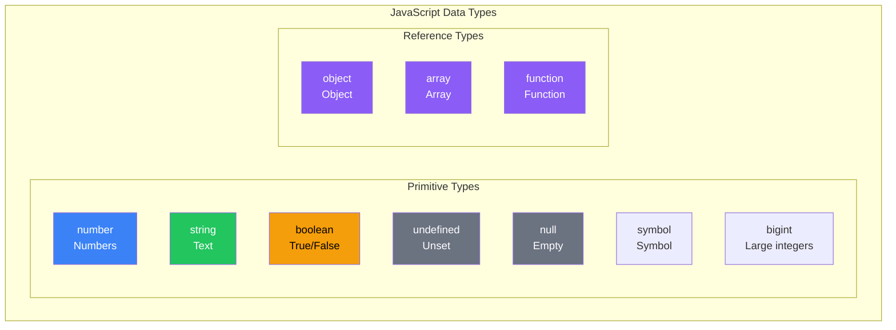
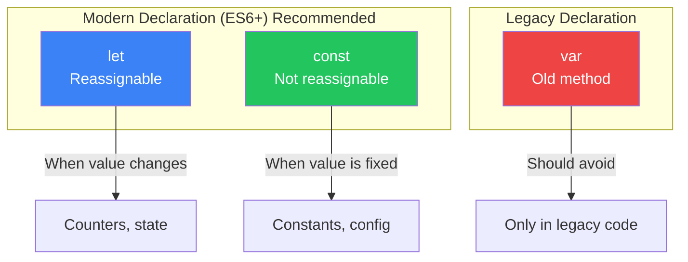

# Day 2: Values and Variables

## What You'll Learn Today

- Understanding JavaScript data types
- Working with numbers and strings
- Declaring variables with let, const, and var
- How type conversion works

---

## What Are Data Types?

Computer programs work by manipulating **values**. In JavaScript, every value has a **data type**. Understanding data types is one of the most fundamental programming skills.

### JavaScript Data Types



| Data Type | Description | Examples |
|-----------|-------------|----------|
| `number` | Numbers (integers and decimals) | `42`, `3.14`, `-10` |
| `string` | Text | `"Hello"`, `'World'` |
| `boolean` | True or false values | `true`, `false` |
| `undefined` | Value not set | `undefined` |
| `null` | Intentionally empty | `null` |
| `symbol` | Unique identifier (ES6+) | `Symbol("id")` |
| `bigint` | Large integers (ES2020+) | `9007199254740991n` |

> **Today's Focus**: This chapter focuses on the most commonly used types: `number`, `string`, and `boolean`.

---

## Numbers

JavaScript's number type doesn't distinguish between integers and decimals. They're all the same `number` type.

### Number Literals

```javascript
// Integers
let age = 25;
let year = 2026;
let negative = -100;

// Decimals (floating-point numbers)
let pi = 3.14159;
let price = 19.99;

// Scientific notation
let billion = 1e9;      // 1,000,000,000
let micro = 1e-6;       // 0.000001

// Binary, octal, hexadecimal
let binary = 0b1010;    // 10 (binary)
let octal = 0o755;      // 493 (octal)
let hex = 0xff;         // 255 (hexadecimal)
```

### Arithmetic Operations

```javascript
console.log(10 + 3);    // 13 (addition)
console.log(10 - 3);    // 7 (subtraction)
console.log(10 * 3);    // 30 (multiplication)
console.log(10 / 3);    // 3.3333... (division)
console.log(10 % 3);    // 1 (remainder/modulo)
console.log(10 ** 3);   // 1000 (exponentiation)
```

### Special Numbers

JavaScript has some special numeric values.

```javascript
console.log(Infinity);      // Infinity
console.log(-Infinity);     // Negative infinity
console.log(NaN);           // Not a Number

// Examples that produce NaN
console.log(0 / 0);         // NaN
console.log("hello" * 2);   // NaN
console.log(Math.sqrt(-1)); // NaN

// NaN's special property
console.log(NaN === NaN);   // false (NaN is not equal to itself!)
console.log(Number.isNaN(NaN)); // true (correct way to check for NaN)
```

### Floating-Point Precision

```javascript
// A famous problem
console.log(0.1 + 0.2);     // 0.30000000000000004 (expected 0.3)

// Solutions: round the result
console.log((0.1 + 0.2).toFixed(1));  // "0.3"
console.log(Math.round((0.1 + 0.2) * 10) / 10); // 0.3
```

> **Why does this happen?** Computers use binary to represent numbers, and some decimal fractions like 0.1 cannot be represented exactly. This is called **floating-point error**.

---

## Strings

Strings represent text data.

### String Literals

```javascript
// Single quotes
let single = 'Hello, World!';

// Double quotes
let double = "Hello, World!";

// Template literals (backticks) ES6+
let template = `Hello, World!`;

// All three produce the same result
console.log(single === double);   // true
console.log(double === template); // true
```

### Escape Sequences

```javascript
// Including special characters
let newline = "Hello\nWorld";     // Newline
let tab = "Hello\tWorld";         // Tab
let quote = "He said \"Hi\"";     // Double quote
let backslash = "C:\\Users\\";    // Backslash

console.log(newline);
// Hello
// World
```

| Escape | Meaning |
|--------|---------|
| `\n` | Newline |
| `\t` | Tab |
| `\"` | Double quote |
| `\'` | Single quote |
| `\\` | Backslash |

### String Methods

```javascript
let str = "JavaScript";

// Length
console.log(str.length);        // 10

// Get character (index starts at 0)
console.log(str[0]);            // "J"
console.log(str.charAt(4));     // "S"

// Substring
console.log(str.slice(0, 4));   // "Java"
console.log(str.slice(4));      // "Script"
console.log(str.substring(0, 4)); // "Java"

// Case conversion
console.log(str.toUpperCase()); // "JAVASCRIPT"
console.log(str.toLowerCase()); // "javascript"

// Search
console.log(str.indexOf("Script")); // 4
console.log(str.includes("Java"));  // true

// Replace
console.log(str.replace("Java", "Type")); // "TypeScript"

// Split
console.log("a,b,c".split(","));  // ["a", "b", "c"]

// Trim whitespace
console.log("  hello  ".trim()); // "hello"
```

### Template Literals (Important!)

Template literals, introduced in ES6, make string manipulation much easier.

```javascript
let name = "John";
let age = 25;

// Old way (string concatenation)
let message1 = "My name is " + name + ". I am " + age + " years old.";

// Template literals (recommended)
let message2 = `My name is ${name}. I am ${age} years old.`;

console.log(message2); // "My name is John. I am 25 years old."

// Multi-line strings are easy
let multiline = `
  This is
  a multi-line
  string
`;

// Expressions can be embedded
console.log(`2 + 3 = ${2 + 3}`); // "2 + 3 = 5"
```

---

## Booleans

Booleans can only have two values: `true` or `false`. They play a crucial role in conditional logic.

```javascript
let isLoggedIn = true;
let hasPermission = false;

// Comparison results are booleans
console.log(10 > 5);    // true
console.log(10 < 5);    // false
console.log(10 === 10); // true
console.log("a" === "b"); // false
```

---

## Variable Declaration

Variables are like "boxes" that store values with names. JavaScript has three ways to declare variables.

### Differences Between let, const, and var



| Keyword | Reassignment | Redeclaration | Scope | Recommendation |
|---------|--------------|---------------|-------|----------------|
| `const` | ❌ No | ❌ No | Block | ⭐⭐⭐ Prefer |
| `let` | ✅ Yes | ❌ No | Block | ⭐⭐ When needed |
| `var` | ✅ Yes | ✅ Yes | Function | ⭐ Avoid |

### const (Constants)

```javascript
// Use const by default
const PI = 3.14159;
const APP_NAME = "MyApp";
const MAX_USERS = 100;

// Reassignment causes an error
// PI = 3.14; // TypeError: Assignment to constant variable.

// However, object/array contents can be modified
const user = { name: "John" };
user.name = "Jane"; // OK (modifying contents)
// user = { name: "Jane" }; // Error (reassignment)

const numbers = [1, 2, 3];
numbers.push(4); // OK (modifying contents)
// numbers = [1, 2, 3, 4]; // Error (reassignment)
```

### let (Variables)

```javascript
// Use let when value may change
let count = 0;
count = 1;  // OK
count = 2;  // OK

let score;  // Can be declared without initial value (becomes undefined)
score = 100;

// Redeclaration in same scope is an error
// let count = 5; // SyntaxError: Identifier 'count' has already been declared
```

### var (Not Recommended)

```javascript
// var is the old way (avoid using it)
var oldStyle = "legacy code";

// Problems with var
var x = 1;
var x = 2; // Redeclaration OK (can cause bugs)

// Function-scoped, ignores blocks
if (true) {
    var leaked = "leaks out";
}
console.log(leaked); // "leaks out" (accessible outside block)

// With let
if (true) {
    let contained = "stays inside";
}
// console.log(contained); // ReferenceError
```

### Naming Conventions

```javascript
// camelCase is the standard
let firstName = "John";
let lastName = "Doe";
let isLoggedIn = true;
let maxRetryCount = 3;

// UPPER_SNAKE_CASE is also used for constants
const MAX_SIZE = 100;
const API_BASE_URL = "https://api.example.com";

// Invalid names
// let 2name = "NG";    // Cannot start with number
// let my-name = "NG";  // Hyphens not allowed
// let class = "NG";    // Reserved words not allowed
```

---

## Type Conversion

JavaScript is a **dynamically typed language**, so type conversion happens frequently.

### Implicit Type Conversion (Automatic)

```javascript
// Conversion to string
console.log("5" + 3);       // "53" (number becomes string)
console.log("Hello" + 123); // "Hello123"

// Conversion to number
console.log("5" - 3);       // 2 (string becomes number)
console.log("5" * 2);       // 10
console.log("10" / 2);      // 5

// Conversion to boolean
console.log(!"");           // true (empty string is falsy)
console.log(!0);            // true (0 is falsy)
console.log(!null);         // true (null is falsy)
```

### Explicit Type Conversion (Manual)

```javascript
// To string
String(123);        // "123"
(123).toString();   // "123"
123 + "";           // "123"

// To number
Number("123");      // 123
parseInt("123");    // 123 (integer)
parseFloat("3.14"); // 3.14 (decimal)
+"123";             // 123 (unary plus operator)

// To boolean
Boolean(1);         // true
Boolean(0);         // false
Boolean("hello");   // true
Boolean("");        // false
!!1;                // true (double negation)
```

### Falsy and Truthy Values

```javascript
// Falsy (treated as false)
console.log(Boolean(false));     // false
console.log(Boolean(0));         // false
console.log(Boolean(-0));        // false
console.log(Boolean(""));        // false
console.log(Boolean(null));      // false
console.log(Boolean(undefined)); // false
console.log(Boolean(NaN));       // false

// Truthy (treated as true) - everything else
console.log(Boolean(true));      // true
console.log(Boolean(1));         // true
console.log(Boolean("hello"));   // true
console.log(Boolean([]));        // true (empty array too!)
console.log(Boolean({}));        // true (empty object too!)
```

| Value | Boolean Conversion |
|-------|-------------------|
| `false` | `false` |
| `0`, `-0` | `false` |
| `""` (empty string) | `false` |
| `null` | `false` |
| `undefined` | `false` |
| `NaN` | `false` |
| Everything else | `true` |

---

## The typeof Operator

Use the `typeof` operator to check a value's data type.

```javascript
console.log(typeof 42);          // "number"
console.log(typeof "hello");     // "string"
console.log(typeof true);        // "boolean"
console.log(typeof undefined);   // "undefined"
console.log(typeof null);        // "object" (historical bug)
console.log(typeof {});          // "object"
console.log(typeof []);          // "object" (arrays are objects)
console.log(typeof function(){}); // "function"
```

> **Note**: `typeof null` returning `"object"` is a historical bug in JavaScript. `null` is actually a primitive type.

---

## Summary

| Concept | Description |
|---------|-------------|
| Primitive types | `number`, `string`, `boolean`, `null`, `undefined`, `symbol`, `bigint` |
| Variable declaration | `const` (constant), `let` (variable), `var` (avoid) |
| Template literals | Enclosed in backticks, embed values with `${}` |
| Type conversion | Implicit (automatic) and explicit (manual) |
| Falsy values | `false`, `0`, `""`, `null`, `undefined`, `NaN` |

### Key Takeaways

1. **Prefer `const`** - Use `let` only when reassignment is needed
2. **Avoid `var`** - It has scope issues
3. **Template literals** make string manipulation easier
4. **Be aware of type conversion** - Especially the difference between `==` and `===`

---

## Exercises

### Exercise 1: Variable Declaration
Store the following values in appropriate variables (choose `const` or `let`):
- Pi: 3.14159
- User's age (may change)
- Application name: "MyApp"

### Exercise 2: String Manipulation
Store your name in a variable called `name`, and use template literals to display "Hello, [name]!"

### Exercise 3: Type Checking
Predict the result of `typeof` for each of the following, then verify in the console:
- `42`
- `"42"`
- `true`
- `null`
- `undefined`
- `[]`

### Exercise 4: Type Conversion
Predict the result of each expression:
```javascript
"5" + 3
"5" - 3
"5" * "2"
"hello" - 1
```

### Challenge
Create variables for a user's name, age, and occupation, then create an introduction like this:

```
My name is John Doe.
I am 25 years old and work as an engineer.
Next year I will be 26.
```

---

## References

- [MDN - JavaScript Data Types and Data Structures](https://developer.mozilla.org/en-US/docs/Web/JavaScript/Data_structures)
- [MDN - String](https://developer.mozilla.org/en-US/docs/Web/JavaScript/Reference/Global_Objects/String)
- [MDN - let](https://developer.mozilla.org/en-US/docs/Web/JavaScript/Reference/Statements/let)
- [MDN - const](https://developer.mozilla.org/en-US/docs/Web/JavaScript/Reference/Statements/const)
- [JavaScript.info - Data Types](https://javascript.info/types)

---

**Coming Up Next**: In Day 3, we'll learn about "Operators and Expressions." You'll master comparison operators, logical operators, and the important difference between `==` and `===`!
