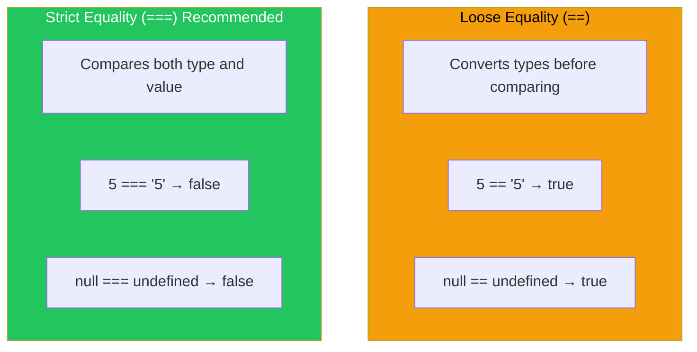
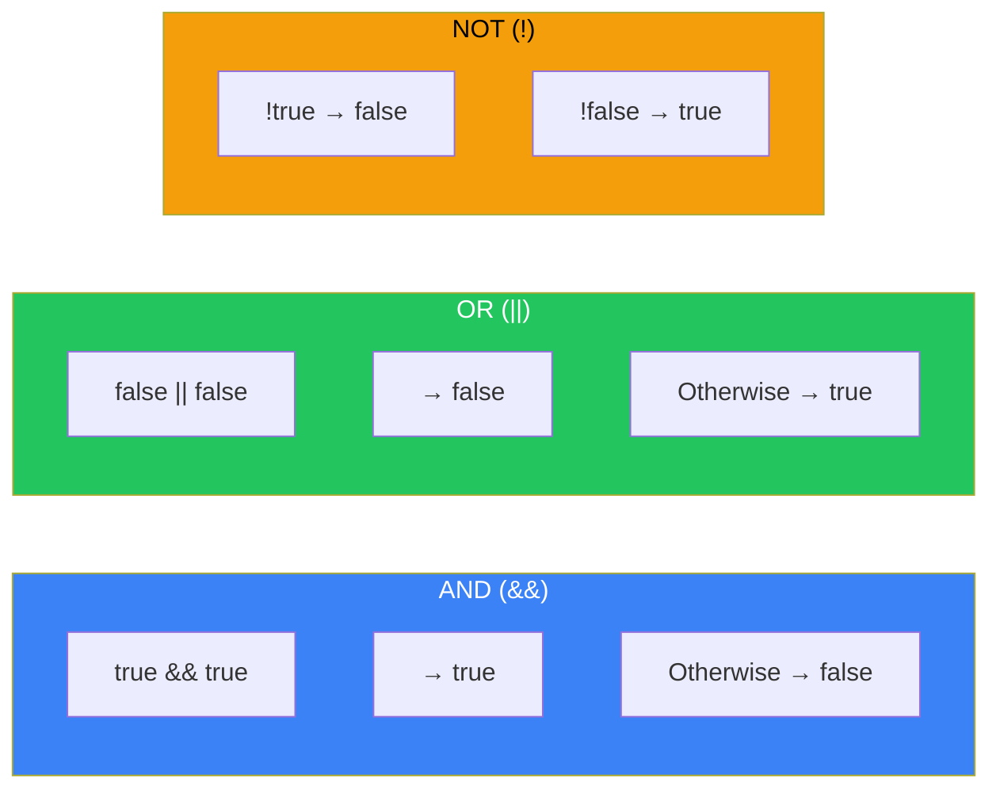
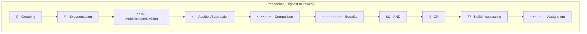

# Day 3: Operators and Expressions

## What You'll Learn Today

- Performing calculations with arithmetic operators
- Comparing values with comparison operators (== vs ===)
- Combining conditions with logical operators
- Writing efficient code with assignment operators
- Understanding operator precedence

---

## What Is an Expression?

An **expression** is a piece of JavaScript code that produces a value.

```javascript
// These are all expressions
42              // Literal expression: produces 42
"hello"         // Literal expression: produces "hello"
x               // Variable expression: produces the value of x
2 + 3           // Arithmetic expression: produces 5
Math.max(1, 2)  // Function call expression: produces 2
```

**Operators** combine expressions to create more complex expressions.

---

## Arithmetic Operators

Operators used for numerical calculations.

### Basic Arithmetic Operators

```javascript
let a = 10;
let b = 3;

console.log(a + b);   // 13 (addition)
console.log(a - b);   // 7 (subtraction)
console.log(a * b);   // 30 (multiplication)
console.log(a / b);   // 3.3333... (division)
console.log(a % b);   // 1 (remainder/modulo)
console.log(a ** b);  // 1000 (exponentiation: 10 to the power of 3)
```

| Operator | Name | Example | Result |
|----------|------|---------|--------|
| `+` | Addition | `5 + 3` | `8` |
| `-` | Subtraction | `5 - 3` | `2` |
| `*` | Multiplication | `5 * 3` | `15` |
| `/` | Division | `5 / 2` | `2.5` |
| `%` | Remainder | `5 % 2` | `1` |
| `**` | Exponentiation | `5 ** 2` | `25` |

### Unary Operators

```javascript
let x = 5;

// Sign inversion
console.log(-x);    // -5
console.log(+x);    // 5

// Increment and decrement
let count = 0;

count++;  // Post-increment: use count, then add 1
++count;  // Pre-increment: add 1, then use count
count--;  // Post-decrement
--count;  // Pre-decrement

// Difference between pre and post
let a = 5;
let b = a++;  // b is 5, a is 6 (assign first, then increment)

let c = 5;
let d = ++c;  // d is 6, c is 6 (increment first, then assign)
```

### String Concatenation

The `+` operator is also used for string concatenation.

```javascript
console.log("Hello" + " " + "World");  // "Hello World"
console.log("Score: " + 100);          // "Score: 100"
console.log(1 + 2 + "3");              // "33" (1+2=3, then 3+"3"="33")
console.log("1" + 2 + 3);              // "123" ("1"+2="12", "12"+3="123")
```

> **Note**: When `+` includes a string, it becomes concatenation. Convert to numbers first if you want arithmetic.

---

## Comparison Operators

Compare values and return a boolean (`true` or `false`).

### Equality Comparison



```javascript
// == (loose equality): converts types before comparing
console.log(5 == "5");        // true (string "5" converted to number 5)
console.log(0 == false);      // true
console.log(null == undefined); // true
console.log("" == false);     // true

// === (strict equality): compares both type and value [RECOMMENDED]
console.log(5 === "5");       // false (different types)
console.log(0 === false);     // false
console.log(null === undefined); // false
console.log("" === false);    // false

// != and !==
console.log(5 != "5");        // false (negation of ==)
console.log(5 !== "5");       // true (negation of ===)
```

| Operator | Name | Description |
|----------|------|-------------|
| `==` | Loose equality | Compares after type conversion (avoid) |
| `===` | Strict equality | Compares type and value (recommended) |
| `!=` | Loose inequality | Negation of `==` |
| `!==` | Strict inequality | Negation of `===` (recommended) |

> **Best Practice**: Always use `===` and `!==`. The `==` operator can cause bugs due to unexpected type conversions.

### Relational Comparison

```javascript
console.log(10 > 5);    // true
console.log(10 < 5);    // false
console.log(10 >= 10);  // true
console.log(10 <= 9);   // false

// String comparison (lexicographic order)
console.log("apple" < "banana");  // true
console.log("Apple" < "apple");   // true (uppercase is less than lowercase)
console.log("10" < "9");          // true (compared as strings!)

// Number and string
console.log(10 < "9");            // false ("9" converted to number)
```

| Operator | Name | Example | Result |
|----------|------|---------|--------|
| `>` | Greater than | `5 > 3` | `true` |
| `<` | Less than | `5 < 3` | `false` |
| `>=` | Greater than or equal | `5 >= 5` | `true` |
| `<=` | Less than or equal | `5 <= 3` | `false` |

---

## Logical Operators

Combine boolean values to create more complex conditions.

### AND (&&), OR (||), NOT (!)



```javascript
// AND (&&): true only if both are true
console.log(true && true);    // true
console.log(true && false);   // false
console.log(false && true);   // false
console.log(false && false);  // false

// OR (||): true if either is true
console.log(true || true);    // true
console.log(true || false);   // true
console.log(false || true);   // true
console.log(false || false);  // false

// NOT (!): inverts the value
console.log(!true);   // false
console.log(!false);  // true
console.log(!!true);  // true (double negation returns original)
```

### Truth Table

| A | B | A && B | A \|\| B | !A |
|---|---|--------|----------|-----|
| true | true | true | true | false |
| true | false | false | true | false |
| false | true | false | true | true |
| false | false | false | false | true |

### Practical Examples

```javascript
let age = 25;
let hasLicense = true;

// Combining multiple conditions
let canDrive = age >= 18 && hasLicense;
console.log(canDrive);  // true

let isWeekend = true;
let isHoliday = false;

// Either is a day off
let isDayOff = isWeekend || isHoliday;
console.log(isDayOff);  // true
```

### Short-Circuit Evaluation

Logical operators use "short-circuit evaluation." They stop evaluating as soon as the result is determined.

```javascript
// &&: returns left if falsy, otherwise returns right
console.log(false && "hello");  // false
console.log("hello" && "world"); // "world"
console.log("" && "hello");     // ""

// ||: returns left if truthy, otherwise returns right
console.log(true || "hello");   // true
console.log(false || "hello");  // "hello"
console.log("" || "default");   // "default"

// Practical usage
let username = "";
let displayName = username || "Guest";
console.log(displayName);  // "Guest"

// Safe object property access
let user = null;
let name = user && user.name;  // Returns null without error
```

### Nullish Coalescing Operator (??)

The `??` operator, introduced in ES2020, returns the right side only when the left side is `null` or `undefined`.

```javascript
// Difference from ||
console.log(0 || "default");    // "default" (0 is falsy)
console.log(0 ?? "default");    // 0 (0 is not null or undefined)

console.log("" || "default");   // "default" (empty string is falsy)
console.log("" ?? "default");   // "" (empty string is not null or undefined)

console.log(null ?? "default"); // "default"
console.log(undefined ?? "default"); // "default"

// Practical usage
let config = {
    timeout: 0,  // Setting of 0 seconds
    retries: null
};

// || ignores 0
let timeout1 = config.timeout || 30;  // 30 (0 is falsy)
// ?? treats 0 as a valid value
let timeout2 = config.timeout ?? 30;  // 0

let retries = config.retries ?? 3;    // 3
```

---

## Assignment Operators

Operators that assign values to variables.

### Compound Assignment Operators

```javascript
let x = 10;

x += 5;   // x = x + 5;  → 15
x -= 3;   // x = x - 3;  → 12
x *= 2;   // x = x * 2;  → 24
x /= 4;   // x = x / 4;  → 6
x %= 4;   // x = x % 4;  → 2
x **= 3;  // x = x ** 3; → 8

// Works with strings too
let str = "Hello";
str += " World";  // "Hello World"
```

| Operator | Equivalent |
|----------|------------|
| `x += y` | `x = x + y` |
| `x -= y` | `x = x - y` |
| `x *= y` | `x = x * y` |
| `x /= y` | `x = x / y` |
| `x %= y` | `x = x % y` |
| `x **= y` | `x = x ** y` |

---

## Ternary Operator (Conditional Operator)

A convenient operator that lets you write `if-else` in one line.

```javascript
// Syntax: condition ? valueIfTrue : valueIfFalse

let age = 20;
let status = age >= 18 ? "Adult" : "Minor";
console.log(status);  // "Adult"

// Traditional if-else equivalent
let status2;
if (age >= 18) {
    status2 = "Adult";
} else {
    status2 = "Minor";
}

// Nesting is possible (but avoid for readability)
let score = 85;
let grade = score >= 90 ? "A" :
            score >= 80 ? "B" :
            score >= 70 ? "C" : "D";
console.log(grade);  // "B"
```

---

## Operator Precedence

When multiple operators are present, the order of evaluation matters.



```javascript
// Examples: evaluation order based on precedence
console.log(2 + 3 * 4);      // 14 (* before +)
console.log((2 + 3) * 4);    // 20 (parentheses change order)

console.log(true || false && false);  // true (&& before ||)
console.log((true || false) && false); // false

// Exponentiation is right-to-left
console.log(2 ** 3 ** 2);    // 512 (2 ** 9 = 512)
console.log((2 ** 3) ** 2);  // 64 (8 ** 2 = 64)
```

| Precedence | Operators | Associativity |
|------------|-----------|---------------|
| 1 | `()` | - |
| 2 | `**` | Right to left |
| 3 | `* / %` | Left to right |
| 4 | `+ -` | Left to right |
| 5 | `< > <= >=` | Left to right |
| 6 | `== === != !==` | Left to right |
| 7 | `&&` | Left to right |
| 8 | `\|\|` | Left to right |
| 9 | `??` | Left to right |
| 10 | `= += -=` etc. | Right to left |

> **Best Practice**: Instead of memorizing precedence, use parentheses `()` to make your intent explicit. It makes code more readable.

---

## typeof and instanceof

Operators for checking types.

```javascript
// typeof: check primitive types
console.log(typeof 42);          // "number"
console.log(typeof "hello");     // "string"
console.log(typeof true);        // "boolean"
console.log(typeof undefined);   // "undefined"
console.log(typeof null);        // "object" (historical bug)
console.log(typeof {});          // "object"
console.log(typeof []);          // "object"
console.log(typeof function(){}); // "function"

// instanceof: check object types
console.log([] instanceof Array);   // true
console.log({} instanceof Object);  // true
console.log(new Date() instanceof Date); // true
```

---

## Summary

| Category | Operators | Description |
|----------|-----------|-------------|
| Arithmetic | `+ - * / % **` | Perform calculations |
| Comparison | `== === != !== < > <= >=` | Compare values, return boolean |
| Logical | `&& \|\| ! ??` | Combine conditions |
| Assignment | `= += -= *= /=` | Assign values to variables |
| Ternary | `? :` | Select value based on condition |
| Type | `typeof instanceof` | Check types |

### Key Takeaways

1. **Use `===`** - `==` causes unexpected type conversions
2. **Leverage short-circuit evaluation** - Useful for default values
3. **Know `??` vs `||`** - Use `??` when `0` or `""` are valid values
4. **Use parentheses** - More readable than memorizing precedence

---

## Exercises

### Exercise 1: Comparison Operators
Predict the result of each expression:
```javascript
5 == "5"
5 === "5"
null == undefined
null === undefined
```

### Exercise 2: Logical Operators
Predict the result of each expression:
```javascript
true && false
true || false
!true
true && true || false
```

### Exercise 3: Short-Circuit Evaluation
Predict the result of each expression:
```javascript
"hello" && "world"
"" || "default"
0 ?? "fallback"
null ?? "fallback"
```

### Exercise 4: Compound Assignment
Starting with `x = 10`, what is the value of `x` after each operation in sequence?
```javascript
x += 5
x *= 2
x -= 10
x /= 4
```

### Challenge
Write code that calculates admission price based on age and membership status:
- Under 12: $5
- 12 to 64: $10
- 65 and over: $8
- Members get $2 off any price

Try writing it as a single expression using the ternary operator.

---

## References

- [MDN - Expressions and Operators](https://developer.mozilla.org/en-US/docs/Web/JavaScript/Guide/Expressions_and_operators)
- [MDN - Equality Comparisons and Sameness](https://developer.mozilla.org/en-US/docs/Web/JavaScript/Equality_comparisons_and_sameness)
- [MDN - Logical Operators](https://developer.mozilla.org/en-US/docs/Web/JavaScript/Reference/Operators/Logical_Operators)
- [JavaScript.info - Comparisons](https://javascript.info/comparison)

---

**Coming Up Next**: In Day 4, we'll learn about "Conditionals and Loops." Master `if` statements, `switch` statements, `for` loops, and `while` loops to control program flow!
