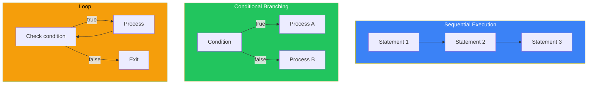
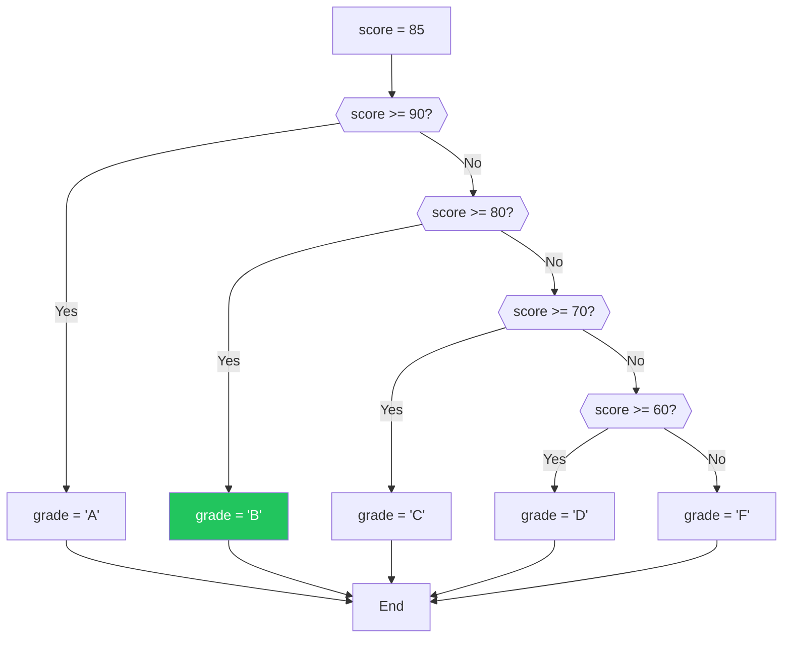
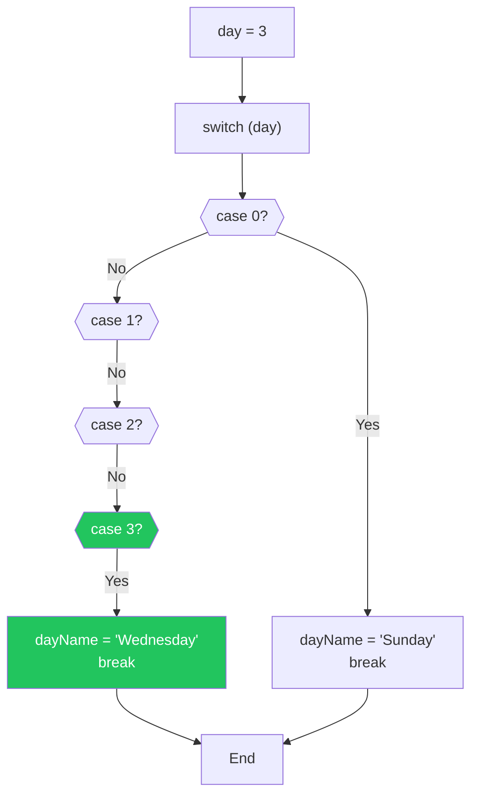
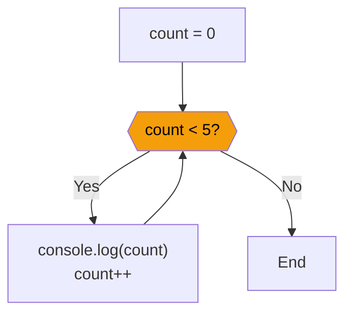
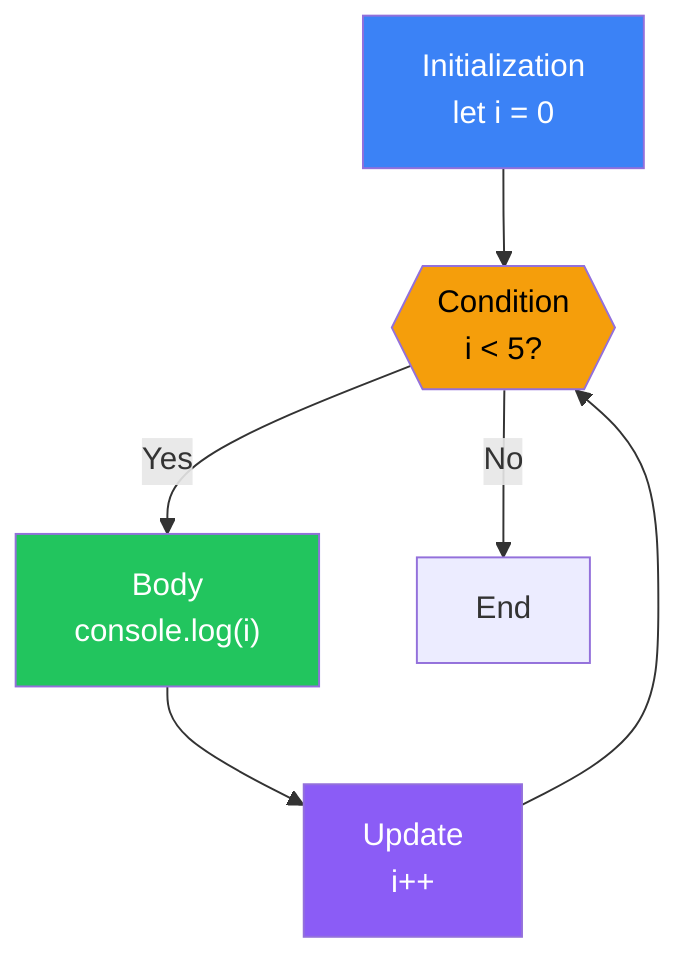
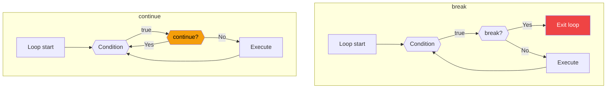

# Day 4: Conditionals and Loops

## What You'll Learn Today

- Using if statements for conditional processing
- Handling multiple conditions efficiently with switch statements
- Repeating operations with while/do-while loops
- Iterating a fixed number of times with for loops
- Controlling loops with break/continue

---

## Program Flow

Programs normally execute from top to bottom in sequence. However, real programs need to change behavior based on conditions or repeat the same operations multiple times.



---

## if Statements

The most basic conditional branching. Executes code when the condition is `true`.

### Basic if Statement

```javascript
let age = 20;

if (age >= 18) {
    console.log("You are an adult");
}
// Output: "You are an adult"
```

### if-else Statement

You can also specify what happens when the condition is `false`.

```javascript
let age = 15;

if (age >= 18) {
    console.log("You are an adult");
} else {
    console.log("You are a minor");
}
// Output: "You are a minor"
```

### else if Statement

Check multiple conditions in sequence.

```javascript
let score = 85;
let grade;

if (score >= 90) {
    grade = "A";
} else if (score >= 80) {
    grade = "B";
} else if (score >= 70) {
    grade = "C";
} else if (score >= 60) {
    grade = "D";
} else {
    grade = "F";
}

console.log(`Your grade is ${grade}`);
// Output: "Your grade is B"
```



### Nested if Statements

You can write if statements inside other if statements (though deep nesting becomes hard to read).

```javascript
let isLoggedIn = true;
let isAdmin = true;

if (isLoggedIn) {
    if (isAdmin) {
        console.log("Logged in as administrator");
    } else {
        console.log("Logged in as regular user");
    }
} else {
    console.log("Please log in");
}

// Better approach (using &&)
if (isLoggedIn && isAdmin) {
    console.log("Logged in as administrator");
} else if (isLoggedIn) {
    console.log("Logged in as regular user");
} else {
    console.log("Please log in");
}
```

### Automatic Boolean Conversion

if conditions can use non-boolean values. Falsy values are treated as `false`, truthy values as `true`.

```javascript
let username = "";

if (username) {
    console.log(`Hello, ${username}`);
} else {
    console.log("Please enter a username");
}
// Output: "Please enter a username" (empty string is falsy)

let items = [];

if (items.length) {
    console.log(`You have ${items.length} items`);
} else {
    console.log("No items");
}
// Output: "No items" (0 is falsy)
```

---

## switch Statements

Useful when comparing one value against multiple cases.

### Basic switch Statement

```javascript
let day = 3;
let dayName;

switch (day) {
    case 0:
        dayName = "Sunday";
        break;
    case 1:
        dayName = "Monday";
        break;
    case 2:
        dayName = "Tuesday";
        break;
    case 3:
        dayName = "Wednesday";
        break;
    case 4:
        dayName = "Thursday";
        break;
    case 5:
        dayName = "Friday";
        break;
    case 6:
        dayName = "Saturday";
        break;
    default:
        dayName = "Invalid day";
}

console.log(dayName);  // "Wednesday"
```



### Forgetting break Causes Fall-Through

Without `break`, the next case also executes (fall-through).

```javascript
let fruit = "apple";

switch (fruit) {
    case "apple":
        console.log("A red fruit");
        // No break, so next case also executes
    case "banana":
        console.log("A popular fruit");
        break;
    case "orange":
        console.log("A citrus fruit");
        break;
}
// Output:
// "A red fruit"
// "A popular fruit"
```

### Intentional Fall-Through

Sometimes fall-through is used intentionally.

```javascript
let month = 2;
let season;

switch (month) {
    case 12:
    case 1:
    case 2:
        season = "Winter";
        break;
    case 3:
    case 4:
    case 5:
        season = "Spring";
        break;
    case 6:
    case 7:
    case 8:
        season = "Summer";
        break;
    case 9:
    case 10:
    case 11:
        season = "Fall";
        break;
    default:
        season = "Invalid month";
}

console.log(season);  // "Winter"
```

### switch vs if-else

| Situation | Recommended |
|-----------|-------------|
| Comparing one value to multiple values | switch |
| Range comparisons (>=, <=) | if-else |
| Complex conditions (&&, \|\|) | if-else |
| Few conditions (2-3) | if-else |

---

## while Loops

Repeats while the condition is `true`.

### Basic while Loop

```javascript
let count = 0;

while (count < 5) {
    console.log(`Count: ${count}`);
    count++;
}
// Output:
// Count: 0
// Count: 1
// Count: 2
// Count: 3
// Count: 4
```



### Beware of Infinite Loops

If the condition is always `true`, you get an infinite loop.

```javascript
// ⚠️ Dangerous! Infinite loop
// while (true) {
//     console.log("Never stops!");
// }

// Correct example: always include an exit condition
let i = 0;
while (i < 10) {
    console.log(i);
    i++;  // Without this, infinite loop!
}
```

### do-while Loop

Use when you want to execute at least once.

```javascript
let count = 0;

do {
    console.log(`Count: ${count}`);
    count++;
} while (count < 5);

// Difference from while: executes once even if condition is initially false
let x = 10;

do {
    console.log("This executes once");
} while (x < 5);  // Condition is false, but already executed once

while (x < 5) {
    console.log("This never executes");
}
```

---

## for Loops

Best for a fixed number of iterations.

### Basic for Loop

```javascript
for (let i = 0; i < 5; i++) {
    console.log(`Index: ${i}`);
}
// Output:
// Index: 0
// Index: 1
// Index: 2
// Index: 3
// Index: 4
```

### Structure of for Loop

```javascript
for (initialization; condition; update) {
    // Code to repeat
}

// Execution order
for (let i = 0; i < 3; i++) {
    console.log(i);
}
// 1. Initialization: let i = 0 (once only)
// 2. Check condition: i < 3 → true
// 3. Execute body: console.log(0)
// 4. Update: i++ (i becomes 1)
// 5. Check condition: i < 3 → true
// 6. Execute body: console.log(1)
// 7. Update: i++ (i becomes 2)
// 8. Check condition: i < 3 → true
// 9. Execute body: console.log(2)
// 10. Update: i++ (i becomes 3)
// 11. Check condition: i < 3 → false
// 12. Loop ends
```



### Various for Loops

```javascript
// Countdown
for (let i = 5; i > 0; i--) {
    console.log(i);
}
// 5, 4, 3, 2, 1

// Increment by 2
for (let i = 0; i <= 10; i += 2) {
    console.log(i);
}
// 0, 2, 4, 6, 8, 10

// Multiple variables
for (let i = 0, j = 10; i < j; i++, j--) {
    console.log(`i=${i}, j=${j}`);
}
// i=0, j=10
// i=1, j=9
// ...
// i=4, j=6
```

### for...of Loop (for Arrays)

Convenient for iterating through array elements (covered in detail in Day 6).

```javascript
const fruits = ["apple", "banana", "orange"];

for (const fruit of fruits) {
    console.log(fruit);
}
// apple
// banana
// orange
```

### for...in Loop (for Objects)

Enumerates object properties (covered in detail in Day 7).

```javascript
const person = {
    name: "John",
    age: 25,
    city: "Tokyo"
};

for (const key in person) {
    console.log(`${key}: ${person[key]}`);
}
// name: John
// age: 25
// city: Tokyo
```

---

## break and continue

Statements that control loop flow.

### break: Exit the Loop

```javascript
for (let i = 0; i < 10; i++) {
    if (i === 5) {
        break;  // Completely exit the loop
    }
    console.log(i);
}
// 0, 1, 2, 3, 4 (nothing after 5)

// Search example
const numbers = [1, 3, 5, 7, 9, 11];
let found = false;

for (const num of numbers) {
    if (num > 6) {
        console.log(`First number greater than 6: ${num}`);
        found = true;
        break;
    }
}
// Output: "First number greater than 6: 7"
```

### continue: Skip to Next Iteration

```javascript
for (let i = 0; i < 10; i++) {
    if (i % 2 === 0) {
        continue;  // Skip even numbers
    }
    console.log(i);
}
// 1, 3, 5, 7, 9 (only odd numbers)

// Skip specific values
const scores = [85, -1, 92, 78, -1, 88];

for (const score of scores) {
    if (score < 0) {
        continue;  // Skip invalid scores
    }
    console.log(`Score: ${score}`);
}
```



### Labeled break/continue

Control outer loops from nested loops.

```javascript
outer: for (let i = 0; i < 3; i++) {
    for (let j = 0; j < 3; j++) {
        if (i === 1 && j === 1) {
            break outer;  // Exit outer loop too
        }
        console.log(`i=${i}, j=${j}`);
    }
}
// i=0, j=0
// i=0, j=1
// i=0, j=2
// i=1, j=0
// (break outer at i=1, j=1 exits both loops)
```

---

## Choosing the Right Loop

| Loop | Use Case |
|------|----------|
| `for` | Fixed number of iterations |
| `while` | Repeat while condition is true |
| `do-while` | Execute at least once |
| `for...of` | Process array elements in order |
| `for...in` | Enumerate object properties |

---

## Practical Example: Simple Game

```javascript
// Number guessing game (pseudocode)
const secretNumber = 7;  // Actually use Math.random()
let attempts = 0;
let maxAttempts = 5;
let guessed = false;

while (attempts < maxAttempts && !guessed) {
    // Actually receive user input
    let guess = attempts + 5;  // Dummy guess

    attempts++;

    if (guess === secretNumber) {
        console.log(`Correct! You got it in ${attempts} attempts!`);
        guessed = true;
    } else if (guess < secretNumber) {
        console.log("Higher!");
    } else {
        console.log("Lower!");
    }
}

if (!guessed) {
    console.log(`Sorry! The answer was ${secretNumber}`);
}
```

---

## Summary

| Syntax | Purpose |
|--------|---------|
| `if-else` | Branch based on conditions |
| `switch` | Compare one value against multiple cases |
| `while` | Repeat while condition is true |
| `do-while` | Execute once, then check condition |
| `for` | Fixed number of iterations |
| `break` | Exit the loop |
| `continue` | Skip to next iteration |

### Key Takeaways

1. Use `===` for comparisons in **if statements**
2. Don't forget `break` in **switch statements**
3. Watch out for infinite loops with **while**
4. **for loops** have three parts: initialization, condition, update
5. Use **break/continue** for flexible loop control

---

## Exercises

### Exercise 1: FizzBuzz
Print numbers from 1 to 30, but:
- For multiples of 3, print "Fizz"
- For multiples of 5, print "Buzz"
- For multiples of both, print "FizzBuzz"

### Exercise 2: Factorial
Write a program to calculate 5! (5 factorial = 5 × 4 × 3 × 2 × 1 = 120).

### Exercise 3: Find Maximum
Find the maximum value in the array `[3, 7, 2, 9, 4, 1, 8]` without using `Math.max()`.

### Exercise 4: switch Statement
Write a program that takes a day number (0-6) and outputs the day name and whether it's a "Weekday" or "Weekend".

### Challenge
Write a program to print a multiplication table.

```
1 x 1 = 1
1 x 2 = 2
...
9 x 9 = 81
```

---

## References

- [MDN - if...else](https://developer.mozilla.org/en-US/docs/Web/JavaScript/Reference/Statements/if...else)
- [MDN - switch](https://developer.mozilla.org/en-US/docs/Web/JavaScript/Reference/Statements/switch)
- [MDN - for](https://developer.mozilla.org/en-US/docs/Web/JavaScript/Reference/Statements/for)
- [MDN - while](https://developer.mozilla.org/en-US/docs/Web/JavaScript/Reference/Statements/while)
- [JavaScript.info - Loops: while and for](https://javascript.info/while-for)

---

**Coming Up Next**: In Day 5, we'll learn about "Functions." Divide your code into reusable components and write more organized programs!
