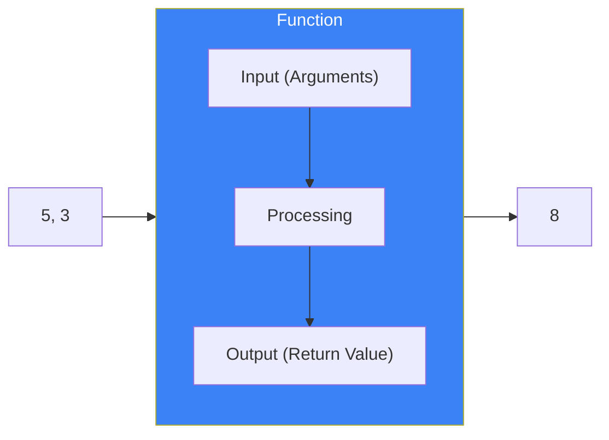
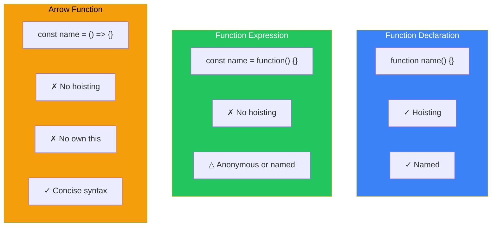
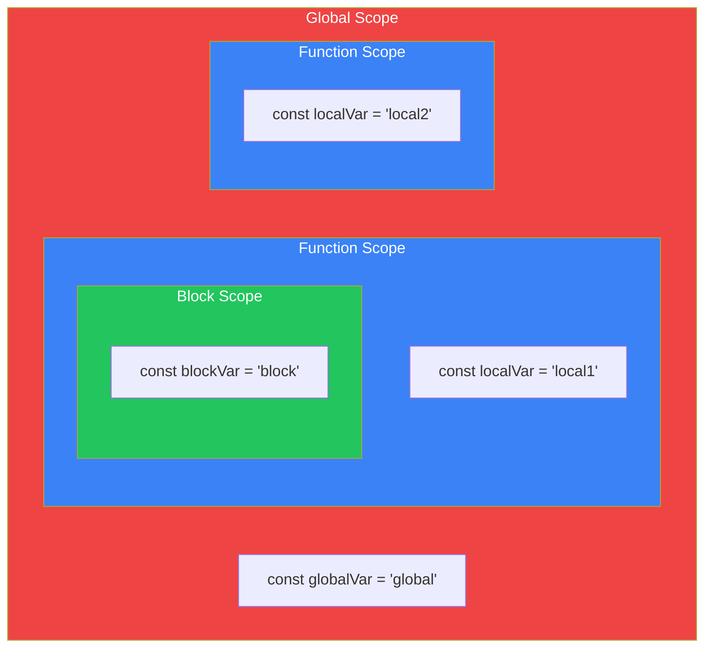
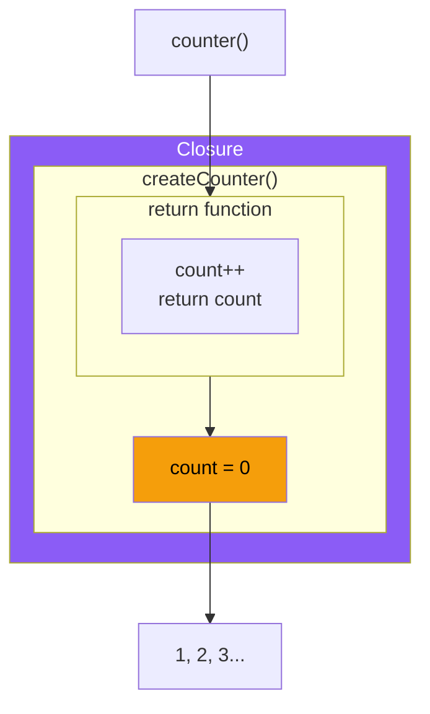
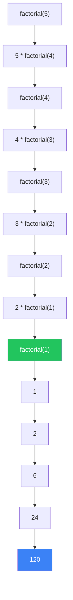

# Day 5: Functions

## What You'll Learn Today

- Basic concepts and ways to define functions
- Difference between function declarations and function expressions
- How to write arrow functions
- Parameters and default values
- How to use return values
- Basics of scope and closures

---

## What Is a Function?

A **function** is a block of code that performs a specific task. Once defined, it can be called and reused multiple times.



### Why Use Functions?

| Benefit | Description |
|---------|-------------|
| Reusability | Avoid writing the same code multiple times |
| Readability | Give code meaningful names to clarify intent |
| Maintainability | Only need to modify one place when changes are needed |
| Testability | Test in small units |

---

## Ways to Define Functions

JavaScript has multiple ways to define functions.

### Function Declaration

The most basic method.

```javascript
function greet(name) {
    console.log(`Hello, ${name}!`);
}

// Calling the function
greet("John");  // "Hello, John!"
greet("Jane");  // "Hello, Jane!"
```

### Function Expression

Assign a function to a variable.

```javascript
const greet = function(name) {
    console.log(`Hello, ${name}!`);
};

greet("John");  // "Hello, John!"
```

### Arrow Function

A concise syntax introduced in ES6.

```javascript
const greet = (name) => {
    console.log(`Hello, ${name}!`);
};

greet("John");  // "Hello, John!"

// Curly braces can be omitted for single-line functions
const square = (x) => x * x;
console.log(square(5));  // 25

// Parentheses can be omitted for single parameter
const double = x => x * 2;
console.log(double(5));  // 10
```

### Comparing Definition Methods



| Feature | Function Declaration | Function Expression | Arrow Function |
|---------|---------------------|---------------------|----------------|
| Syntax | `function name() {}` | `const name = function() {}` | `const name = () => {}` |
| Hoisting | Yes | No | No |
| this | Dynamic | Dynamic | Inherits from outer scope |
| Recommended for | Regular functions | Callbacks | Short callbacks |

---

## Parameters (Arguments)

Values passed to a function are called **arguments**.

### Basic Parameters

```javascript
function add(a, b) {
    return a + b;
}

console.log(add(5, 3));   // 8
console.log(add(10, 20)); // 30
```

### Default Parameters

Set default values when arguments are not provided.

```javascript
function greet(name = "Guest") {
    console.log(`Hello, ${name}!`);
}

greet("John");  // "Hello, John!"
greet();        // "Hello, Guest!"

// Multiple default parameters
function createUser(name, age = 20, role = "user") {
    return { name, age, role };
}

console.log(createUser("John"));           // { name: "John", age: 20, role: "user" }
console.log(createUser("Jane", 25));       // { name: "Jane", age: 25, role: "user" }
console.log(createUser("Admin", 30, "admin")); // { name: "Admin", age: 30, role: "admin" }
```

### Rest Parameters

Accept any number of arguments as an array.

```javascript
function sum(...numbers) {
    let total = 0;
    for (const num of numbers) {
        total += num;
    }
    return total;
}

console.log(sum(1, 2));           // 3
console.log(sum(1, 2, 3, 4, 5));  // 15

// Combining with regular parameters
function introduce(greeting, ...names) {
    for (const name of names) {
        console.log(`${greeting}, ${name}!`);
    }
}

introduce("Hello", "John", "Jane", "Bob");
// Hello, John!
// Hello, Jane!
// Hello, Bob!
```

---

## Return Values

Functions can return values using the `return` statement.

```javascript
function add(a, b) {
    return a + b;
}

const result = add(5, 3);
console.log(result);  // 8

// Using return value directly
console.log(add(10, 20) * 2);  // 60
```

### Early Return

Exit a function early based on conditions.

```javascript
function divide(a, b) {
    if (b === 0) {
        return "Error: Cannot divide by zero";
    }
    return a / b;
}

console.log(divide(10, 2));  // 5
console.log(divide(10, 0));  // "Error: Cannot divide by zero"

// Guard clause pattern
function processUser(user) {
    if (!user) {
        return;  // Returns undefined
    }
    if (!user.name) {
        return;
    }
    console.log(`Processing: ${user.name}`);
}
```

### Returning Multiple Values

Return multiple values using objects or arrays.

```javascript
// Return as object
function getMinMax(numbers) {
    return {
        min: Math.min(...numbers),
        max: Math.max(...numbers)
    };
}

const { min, max } = getMinMax([3, 1, 4, 1, 5]);
console.log(min, max);  // 1 5

// Return as array
function divideWithRemainder(a, b) {
    return [Math.floor(a / b), a % b];
}

const [quotient, remainder] = divideWithRemainder(10, 3);
console.log(quotient, remainder);  // 3 1
```

---

## Scope

The range where a variable can be referenced is called **scope**.

### Global and Local Scope



```javascript
const globalVar = "global";  // Global scope

function outer() {
    const outerVar = "outer";  // Function scope

    function inner() {
        const innerVar = "inner";  // Function scope
        console.log(globalVar);  // "global" (accessible)
        console.log(outerVar);   // "outer" (accessible)
        console.log(innerVar);   // "inner" (accessible)
    }

    inner();
    // console.log(innerVar);  // Error! innerVar not visible
}

outer();
// console.log(outerVar);  // Error! outerVar not visible
```

### Block Scope

`let` and `const` have block scope.

```javascript
if (true) {
    const blockScoped = "in block";
    var functionScoped = "function/global";
}

// console.log(blockScoped);  // Error!
console.log(functionScoped);  // "function/global" (var leaks)
```

---

## Closures

A mechanism where a function "remembers" the scope where it was defined.

```javascript
function createCounter() {
    let count = 0;  // This variable is not accessible from outside

    return function() {
        count++;
        return count;
    };
}

const counter = createCounter();
console.log(counter());  // 1
console.log(counter());  // 2
console.log(counter());  // 3

// A new counter is independent
const counter2 = createCounter();
console.log(counter2());  // 1
```



### Practical Closure Example

```javascript
// Private variables
function createBankAccount(initialBalance) {
    let balance = initialBalance;

    return {
        deposit(amount) {
            balance += amount;
            return balance;
        },
        withdraw(amount) {
            if (amount > balance) {
                return "Insufficient funds";
            }
            balance -= amount;
            return balance;
        },
        getBalance() {
            return balance;
        }
    };
}

const account = createBankAccount(1000);
console.log(account.getBalance());  // 1000
console.log(account.deposit(500));  // 1500
console.log(account.withdraw(200)); // 1300
// console.log(account.balance);    // undefined (no direct access)
```

---

## Callback Functions

Functions passed to other functions are called **callback functions**.

```javascript
function processArray(arr, callback) {
    const result = [];
    for (const item of arr) {
        result.push(callback(item));
    }
    return result;
}

const numbers = [1, 2, 3, 4, 5];

// Pass a function as an argument
const doubled = processArray(numbers, x => x * 2);
console.log(doubled);  // [2, 4, 6, 8, 10]

const squared = processArray(numbers, x => x * x);
console.log(squared);  // [1, 4, 9, 16, 25]
```

### Callbacks in Built-in Methods

```javascript
const numbers = [1, 2, 3, 4, 5];

// forEach: process each element
numbers.forEach(num => console.log(num));

// map: transform each element
const doubled = numbers.map(num => num * 2);

// filter: extract elements matching a condition
const evens = numbers.filter(num => num % 2 === 0);

// find: first element matching a condition
const found = numbers.find(num => num > 3);

// setTimeout: delayed execution
setTimeout(() => {
    console.log("Executed after 3 seconds");
}, 3000);
```

---

## Immediately Invoked Function Expression (IIFE)

A function that is defined and executed simultaneously.

```javascript
// IIFE
(function() {
    const privateVar = "Not accessible from outside";
    console.log("Immediately executed!");
})();

// Arrow function version
(() => {
    console.log("Arrow function IIFE");
})();

// Receiving a return value
const result = (function(a, b) {
    return a + b;
})(5, 3);

console.log(result);  // 8
```

---

## Recursive Functions

Functions that call themselves.

```javascript
// Calculate factorial
function factorial(n) {
    if (n <= 1) {
        return 1;
    }
    return n * factorial(n - 1);
}

console.log(factorial(5));  // 120 (5 * 4 * 3 * 2 * 1)

// Fibonacci sequence
function fibonacci(n) {
    if (n <= 1) {
        return n;
    }
    return fibonacci(n - 1) + fibonacci(n - 2);
}

console.log(fibonacci(10));  // 55
```



---

## Summary

| Concept | Description |
|---------|-------------|
| Function Declaration | `function name() {}` - Has hoisting |
| Function Expression | `const name = function() {}` - Assigned to variable |
| Arrow Function | `const name = () => {}` - Concise syntax |
| Default Parameters | `function(a = 10)` - Default when omitted |
| Rest Parameters | `function(...args)` - Variable arguments |
| Scope | Range where variables can be referenced |
| Closure | Function that remembers outer scope |
| Callback | Function passed to another function |

### Key Takeaways

1. **Arrow functions** are great for short callbacks
2. **Default parameters** create flexible functions
3. **Early returns** make code more readable
4. **Closures** enable private variables
5. Aim for **pure functions** (minimize side effects)

---

## Exercises

### Exercise 1: Basic Function
Create a function `average(a, b)` that returns the average of two numbers.

### Exercise 2: Default Parameters
Create a function `createGreeting(name, greeting = "Hello")` that returns a greeting message.

### Exercise 3: Arrow Function
Create an arrow function that returns a new array with each element squared.

### Exercise 4: Higher-Order Function
Create a function `myMap(arr, fn)` that takes an array and a function, and returns a new array with the function applied to each element.

### Challenge
Using closures, create a counter with these features:
- `increment()`: Add 1
- `decrement()`: Subtract 1
- `getValue()`: Get current value
- `reset()`: Reset to 0

---

## References

- [MDN - Functions](https://developer.mozilla.org/en-US/docs/Web/JavaScript/Guide/Functions)
- [MDN - Arrow function expressions](https://developer.mozilla.org/en-US/docs/Web/JavaScript/Reference/Functions/Arrow_functions)
- [MDN - Closures](https://developer.mozilla.org/en-US/docs/Web/JavaScript/Closures)
- [JavaScript.info - Functions](https://javascript.info/function-basics)

---

**Coming Up Next**: In Day 6, we'll learn about "Arrays." Master efficient list management and powerful methods like map, filter, and reduce!
