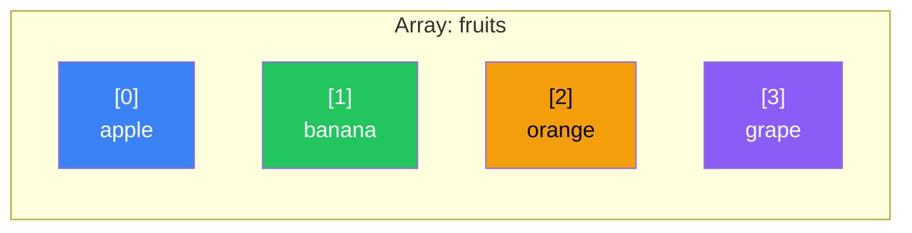
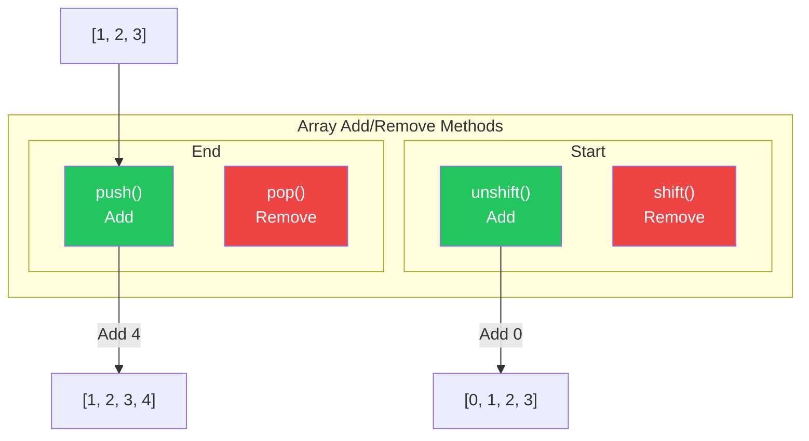
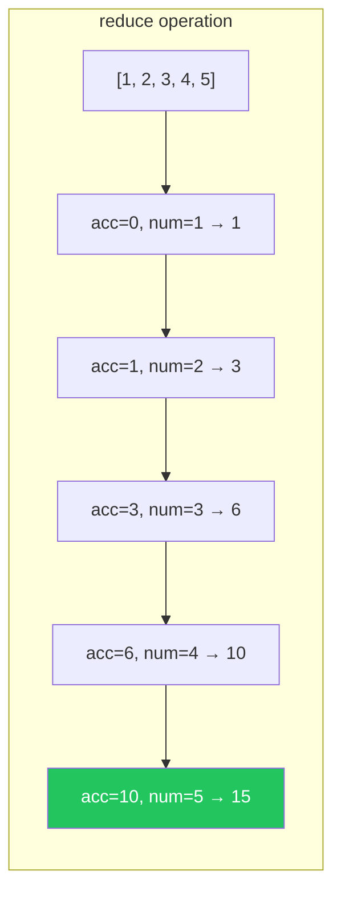

# Day 6: Arrays

## What You'll Learn Today

- Creating arrays and accessing elements
- Adding, removing, and modifying elements
- Powerful array methods (map, filter, reduce)
- Destructuring and spread syntax
- Searching and sorting arrays

---

## What Is an Array?

An **array** is a data structure that stores multiple values in an ordered collection. Each value is called an **element**, and is identified by a numeric **index**.



> **Important**: JavaScript array indexes **start at 0**. The first element is at `[0]`.

---

## Creating Arrays

### Array Literals

The most common method.

```javascript
// Empty array
const empty = [];

// Array with values
const fruits = ["apple", "banana", "orange"];
const numbers = [1, 2, 3, 4, 5];
const mixed = [1, "hello", true, null];  // Can mix different types

// Multidimensional array
const matrix = [
    [1, 2, 3],
    [4, 5, 6],
    [7, 8, 9]
];
```

### Array Constructor

```javascript
// Specify length
const arr1 = new Array(5);  // Empty array of length 5
console.log(arr1.length);   // 5

// Specify elements
const arr2 = new Array(1, 2, 3);  // [1, 2, 3]

// Array.of() (ES6+)
const arr3 = Array.of(5);   // [5] (length 1, element is 5)

// Array.from() (ES6+)
const arr4 = Array.from("hello");  // ["h", "e", "l", "l", "o"]
const arr5 = Array.from({ length: 5 }, (_, i) => i * 2);  // [0, 2, 4, 6, 8]
```

---

## Accessing Elements

### Access by Index

```javascript
const fruits = ["apple", "banana", "orange"];

console.log(fruits[0]);  // "apple"
console.log(fruits[1]);  // "banana"
console.log(fruits[2]);  // "orange"
console.log(fruits[3]);  // undefined (doesn't exist)

// Last element
console.log(fruits[fruits.length - 1]);  // "orange"

// ES2022: at() method
console.log(fruits.at(-1));  // "orange" (negative index)
console.log(fruits.at(-2));  // "banana"
```

### Modifying Elements

```javascript
const fruits = ["apple", "banana", "orange"];

fruits[1] = "melon";
console.log(fruits);  // ["apple", "melon", "orange"]

// Assigning to non-existent index
fruits[5] = "grape";
console.log(fruits);  // ["apple", "melon", "orange", empty × 2, "grape"]
console.log(fruits.length);  // 6
```

---

## Array Length

```javascript
const fruits = ["apple", "banana", "orange"];

console.log(fruits.length);  // 3

// Change length (truncate)
fruits.length = 2;
console.log(fruits);  // ["apple", "banana"]

// Change length (extend)
fruits.length = 5;
console.log(fruits);  // ["apple", "banana", empty × 3]
```

---

## Adding and Removing Elements

### Operations at the End

```javascript
const fruits = ["apple", "banana"];

// push(): add to end
fruits.push("orange");
console.log(fruits);  // ["apple", "banana", "orange"]

// Add multiple
fruits.push("melon", "grape");
console.log(fruits);  // ["apple", "banana", "orange", "melon", "grape"]

// pop(): remove from end
const last = fruits.pop();
console.log(last);    // "grape"
console.log(fruits);  // ["apple", "banana", "orange", "melon"]
```

### Operations at the Start

```javascript
const fruits = ["apple", "banana"];

// unshift(): add to start
fruits.unshift("melon");
console.log(fruits);  // ["melon", "apple", "banana"]

// shift(): remove from start
const first = fruits.shift();
console.log(first);   // "melon"
console.log(fruits);  // ["apple", "banana"]
```



### splice(): Add/Remove at Any Position

```javascript
const fruits = ["apple", "banana", "orange", "melon"];

// Remove: splice(start, deleteCount)
const removed = fruits.splice(1, 2);
console.log(removed);  // ["banana", "orange"]
console.log(fruits);   // ["apple", "melon"]

// Add: splice(start, 0, items...)
fruits.splice(1, 0, "grape", "strawberry");
console.log(fruits);   // ["apple", "grape", "strawberry", "melon"]

// Replace: splice(start, deleteCount, items...)
fruits.splice(1, 2, "kiwi");
console.log(fruits);   // ["apple", "kiwi", "melon"]
```

---

## Combining and Slicing Arrays

### concat(): Combine Arrays

```javascript
const arr1 = [1, 2, 3];
const arr2 = [4, 5, 6];

const combined = arr1.concat(arr2);
console.log(combined);  // [1, 2, 3, 4, 5, 6]
console.log(arr1);      // [1, 2, 3] (original unchanged)

// Combine multiple arrays
const arr3 = [7, 8];
const all = arr1.concat(arr2, arr3);
console.log(all);  // [1, 2, 3, 4, 5, 6, 7, 8]
```

### slice(): Get a Portion

```javascript
const fruits = ["apple", "banana", "orange", "melon", "grape"];

// slice(start, end) - end not included
console.log(fruits.slice(1, 3));   // ["banana", "orange"]
console.log(fruits.slice(2));      // ["orange", "melon", "grape"]
console.log(fruits.slice(-2));     // ["melon", "grape"]
console.log(fruits.slice(1, -1));  // ["banana", "orange", "melon"]

// Copy an array
const copy = fruits.slice();
console.log(copy);  // ["apple", "banana", "orange", "melon", "grape"]
```

---

## Spread Syntax

A powerful syntax introduced in ES6.

```javascript
const arr1 = [1, 2, 3];
const arr2 = [4, 5, 6];

// Combine arrays
const combined = [...arr1, ...arr2];
console.log(combined);  // [1, 2, 3, 4, 5, 6]

// Copy array (shallow copy)
const copy = [...arr1];
console.log(copy);  // [1, 2, 3]

// Add elements in the middle
const withMiddle = [...arr1, 10, 20, ...arr2];
console.log(withMiddle);  // [1, 2, 3, 10, 20, 4, 5, 6]

// Spread as function arguments
const numbers = [5, 2, 8, 1, 9];
console.log(Math.max(...numbers));  // 9
```

---

## Destructuring Assignment

Extract array elements into individual variables.

```javascript
const fruits = ["apple", "banana", "orange"];

// Basic destructuring
const [first, second, third] = fruits;
console.log(first);   // "apple"
console.log(second);  // "banana"
console.log(third);   // "orange"

// Get only some elements
const [a, , c] = fruits;  // Skip second
console.log(a, c);  // "apple" "orange"

// Get rest as array
const [head, ...rest] = fruits;
console.log(head);  // "apple"
console.log(rest);  // ["banana", "orange"]

// Default values
const [x, y, z, w = "default"] = fruits;
console.log(w);  // "default"

// Swap variables
let a1 = 1, b1 = 2;
[a1, b1] = [b1, a1];
console.log(a1, b1);  // 2 1
```

---

## Higher-Order Functions (Array Methods)

Methods that apply functions to each element.

### forEach(): Process Each Element

```javascript
const fruits = ["apple", "banana", "orange"];

fruits.forEach((fruit, index) => {
    console.log(`${index}: ${fruit}`);
});
// 0: apple
// 1: banana
// 2: orange
```

### map(): Transform and Create New Array

```javascript
const numbers = [1, 2, 3, 4, 5];

const doubled = numbers.map(num => num * 2);
console.log(doubled);  // [2, 4, 6, 8, 10]

const squared = numbers.map(num => num ** 2);
console.log(squared);  // [1, 4, 9, 16, 25]

// Extract specific property from objects
const users = [
    { name: "John", age: 25 },
    { name: "Jane", age: 30 },
    { name: "Bob", age: 20 }
];

const names = users.map(user => user.name);
console.log(names);  // ["John", "Jane", "Bob"]
```

### filter(): Extract Matching Elements

```javascript
const numbers = [1, 2, 3, 4, 5, 6, 7, 8, 9, 10];

const evens = numbers.filter(num => num % 2 === 0);
console.log(evens);  // [2, 4, 6, 8, 10]

const bigNumbers = numbers.filter(num => num > 5);
console.log(bigNumbers);  // [6, 7, 8, 9, 10]

// Filter array of objects
const users = [
    { name: "John", age: 25, active: true },
    { name: "Jane", age: 30, active: false },
    { name: "Bob", age: 20, active: true }
];

const activeUsers = users.filter(user => user.active);
console.log(activeUsers);
// [{ name: "John", age: 25, active: true }, { name: "Bob", age: 20, active: true }]
```

### reduce(): Aggregate to a Single Value

```javascript
const numbers = [1, 2, 3, 4, 5];

// Sum
const sum = numbers.reduce((acc, num) => acc + num, 0);
console.log(sum);  // 15

// Maximum
const max = numbers.reduce((acc, num) => (num > acc ? num : acc), numbers[0]);
console.log(max);  // 5

// Convert to object
const fruits = ["apple", "banana", "apple", "orange", "banana", "apple"];

const count = fruits.reduce((acc, fruit) => {
    acc[fruit] = (acc[fruit] || 0) + 1;
    return acc;
}, {});

console.log(count);  // { apple: 3, banana: 2, orange: 1 }
```



### Method Chaining

```javascript
const users = [
    { name: "John", age: 25, score: 80 },
    { name: "Jane", age: 30, score: 90 },
    { name: "Bob", age: 20, score: 70 },
    { name: "Alice", age: 35, score: 85 }
];

// Average score of users 30 and older
const averageScore = users
    .filter(user => user.age >= 30)
    .map(user => user.score)
    .reduce((sum, score, _, arr) => sum + score / arr.length, 0);

console.log(averageScore);  // 87.5
```

---

## Search Methods

### find() / findIndex()

```javascript
const users = [
    { id: 1, name: "John" },
    { id: 2, name: "Jane" },
    { id: 3, name: "Bob" }
];

// First element matching condition
const user = users.find(u => u.id === 2);
console.log(user);  // { id: 2, name: "Jane" }

// Index of first element matching condition
const index = users.findIndex(u => u.id === 2);
console.log(index);  // 1
```

### includes() / indexOf()

```javascript
const fruits = ["apple", "banana", "orange"];

// Check existence
console.log(fruits.includes("banana"));  // true
console.log(fruits.includes("melon"));   // false

// Get index
console.log(fruits.indexOf("banana"));   // 1
console.log(fruits.indexOf("melon"));    // -1 (not found)
```

### some() / every()

```javascript
const numbers = [1, 2, 3, 4, 5];

// some: does any element match?
console.log(numbers.some(num => num > 3));   // true
console.log(numbers.some(num => num > 10));  // false

// every: do all elements match?
console.log(numbers.every(num => num > 0));  // true
console.log(numbers.every(num => num > 3));  // false
```

---

## Sorting

### sort()

```javascript
// String sort
const fruits = ["orange", "apple", "banana"];
fruits.sort();
console.log(fruits);  // ["apple", "banana", "orange"]

// Number sort (caution needed!)
const numbers = [10, 2, 30, 4, 5];
numbers.sort();  // Sorted as strings
console.log(numbers);  // [10, 2, 30, 4, 5] → Wrong!

// Correct numeric sort
numbers.sort((a, b) => a - b);
console.log(numbers);  // [2, 4, 5, 10, 30]

// Descending order
numbers.sort((a, b) => b - a);
console.log(numbers);  // [30, 10, 5, 4, 2]
```

### reverse()

```javascript
const arr = [1, 2, 3, 4, 5];
arr.reverse();
console.log(arr);  // [5, 4, 3, 2, 1]
```

---

## Array Method Categories

| Method | Mutates | Returns | Purpose |
|--------|---------|---------|---------|
| `push()` | ✅ | New length | Add to end |
| `pop()` | ✅ | Removed element | Remove from end |
| `shift()` | ✅ | Removed element | Remove from start |
| `unshift()` | ✅ | New length | Add to start |
| `splice()` | ✅ | Removed elements | Add/remove anywhere |
| `sort()` | ✅ | Sorted array | Sort |
| `reverse()` | ✅ | Reversed array | Reverse |
| `concat()` | ❌ | New array | Combine |
| `slice()` | ❌ | New array | Get portion |
| `map()` | ❌ | New array | Transform |
| `filter()` | ❌ | New array | Filter |
| `reduce()` | ❌ | Single value | Aggregate |

> **Best Practice**: Prefer "non-mutating" methods that don't modify the original array.

---

## Summary

| Concept | Description |
|---------|-------------|
| Array literal | Create array with `[]` |
| Index | Element position starting at 0 |
| Spread syntax | Expand array with `...` |
| Destructuring | Extract elements with `[a, b] = arr` |
| map | Transform each element |
| filter | Filter by condition |
| reduce | Aggregate to single value |

### Key Takeaways

1. **Indexes start at 0**
2. **Spread syntax** for concise array operations
3. **map/filter/reduce** are non-mutating and safe
4. **sort() for numbers** requires a compare function
5. **Method chaining** makes complex operations concise

---

## Exercises

### Exercise 1: Basic Operations
Given array `[1, 2, 3]`, add 0 to the start and 4 to the end to create `[0, 1, 2, 3, 4]`.

### Exercise 2: map
Convert each element in `["hello", "world", "javascript"]` to uppercase.

### Exercise 3: filter
Extract only multiples of 3 from `[1, 2, 3, 4, 5, 6, 7, 8, 9, 10]`.

### Exercise 4: reduce
Multiply all elements in `[1, 2, 3, 4, 5]` together (result: 120).

### Challenge
From the following user data, get the names of users 20 and older, sorted by age (ascending).

```javascript
const users = [
    { name: "John", age: 25 },
    { name: "Jane", age: 18 },
    { name: "Bob", age: 30 },
    { name: "Alice", age: 15 },
    { name: "Charlie", age: 22 }
];
```

---

## References

- [MDN - Array](https://developer.mozilla.org/en-US/docs/Web/JavaScript/Reference/Global_Objects/Array)
- [MDN - Array.prototype.map()](https://developer.mozilla.org/en-US/docs/Web/JavaScript/Reference/Global_Objects/Array/map)
- [MDN - Array.prototype.filter()](https://developer.mozilla.org/en-US/docs/Web/JavaScript/Reference/Global_Objects/Array/filter)
- [MDN - Array.prototype.reduce()](https://developer.mozilla.org/en-US/docs/Web/JavaScript/Reference/Global_Objects/Array/reduce)
- [JavaScript.info - Arrays](https://javascript.info/array)

---

**Coming Up Next**: In Day 7, we'll learn about "Objects." Manage data with key-value pairs and work with more complex data structures!
