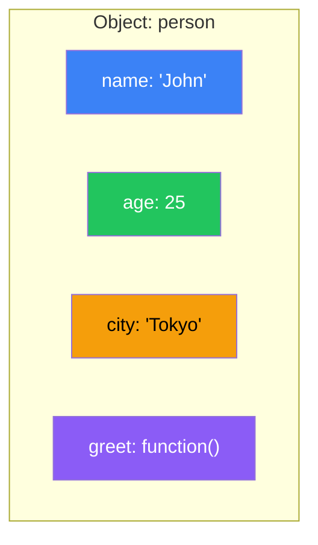

# Day 7: Objects

## What You'll Learn Today

- Creating objects and accessing properties
- Adding, modifying, and deleting properties
- Defining methods and the `this` keyword
- Object destructuring and spread syntax
- Converting data with JSON

---

## What Is an Object?

An **object** is a collection of related data and functionality. It manages data as **key-value** pairs.



---

## Creating Objects

### Object Literals

```javascript
// Empty object
const empty = {};

// Object with properties
const person = {
    name: "John",
    age: 25,
    city: "Tokyo"
};

// Nested objects
const user = {
    name: "Jane",
    address: {
        city: "Osaka",
        zip: "530-0001"
    },
    hobbies: ["reading", "travel"]
};
```

### Property Shorthand (ES6+)

```javascript
const name = "John";
const age = 25;

// Traditional way
const person1 = { name: name, age: age };

// Shorthand
const person2 = { name, age };
console.log(person2);  // { name: "John", age: 25 }
```

### Computed Property Names

```javascript
const key = "dynamicKey";

const obj = {
    [key]: "dynamic value",
    [`${key}2`]: "another value"
};

console.log(obj.dynamicKey);   // "dynamic value"
console.log(obj.dynamicKey2);  // "another value"
```

---

## Accessing Properties

### Dot Notation and Bracket Notation

```javascript
const person = {
    name: "John",
    age: 25,
    "full-name": "John Doe"  // Key with hyphen
};

// Dot notation
console.log(person.name);  // "John"
console.log(person.age);   // 25

// Bracket notation
console.log(person["name"]);       // "John"
console.log(person["full-name"]);  // "John Doe"

// Access with variable
const key = "age";
console.log(person[key]);  // 25
```

| Notation | Syntax | Use Case |
|----------|--------|----------|
| Dot | `obj.prop` | Normal access |
| Bracket | `obj["prop"]` | Variables or special characters in key |

### Optional Chaining (?.)

A safe way to access properties that might not exist.

```javascript
const user = {
    name: "John",
    address: {
        city: "Tokyo"
    }
};

// Traditional way
const zip1 = user.address && user.address.zip;

// Optional chaining (ES2020+)
const zip2 = user.address?.zip;
console.log(zip2);  // undefined (no error)

// Deep nested access
const country = user.address?.country?.name;
console.log(country);  // undefined

// Works with method calls too
const result = user.greet?.();  // Returns undefined (no error)
```

---

## Adding, Modifying, and Deleting Properties

```javascript
const person = { name: "John" };

// Add
person.age = 25;
person["city"] = "Tokyo";
console.log(person);  // { name: "John", age: 25, city: "Tokyo" }

// Modify
person.age = 26;
console.log(person.age);  // 26

// Delete
delete person.city;
console.log(person);  // { name: "John", age: 26 }

// Check property existence
console.log("name" in person);     // true
console.log("city" in person);     // false
console.log(person.hasOwnProperty("name"));  // true
```

---

## Methods

Functions defined as object properties are called **methods**.

```javascript
const person = {
    name: "John",
    age: 25,

    // Method (traditional syntax)
    greet: function() {
        console.log(`Hello, I'm ${this.name}`);
    },

    // Method (shorthand - ES6+)
    introduce() {
        console.log(`${this.name}, ${this.age} years old`);
    }
};

person.greet();      // "Hello, I'm John"
person.introduce();  // "John, 25 years old"
```

### The this Keyword

`this` refers to the object that called the method.

```javascript
const calculator = {
    value: 0,

    add(n) {
        this.value += n;
        return this;  // For method chaining
    },

    subtract(n) {
        this.value -= n;
        return this;
    },

    getResult() {
        return this.value;
    }
};

// Method chaining
const result = calculator.add(10).add(5).subtract(3).getResult();
console.log(result);  // 12
```

> **Note**: Arrow functions don't have their own `this`, so they're not suitable for methods.

---

## Iterating Over Objects

### for...in Loop

```javascript
const person = { name: "John", age: 25, city: "Tokyo" };

for (const key in person) {
    console.log(`${key}: ${person[key]}`);
}
// name: John
// age: 25
// city: Tokyo
```

### Object.keys() / Object.values() / Object.entries()

```javascript
const person = { name: "John", age: 25, city: "Tokyo" };

// Array of keys
console.log(Object.keys(person));
// ["name", "age", "city"]

// Array of values
console.log(Object.values(person));
// ["John", 25, "Tokyo"]

// Array of [key, value] pairs
console.log(Object.entries(person));
// [["name", "John"], ["age", 25], ["city", "Tokyo"]]

// Iterating with entries
for (const [key, value] of Object.entries(person)) {
    console.log(`${key}: ${value}`);
}
```

---

## Object Destructuring

```javascript
const person = {
    name: "John",
    age: 25,
    city: "Tokyo",
    country: "Japan"
};

// Basic destructuring
const { name, age } = person;
console.log(name, age);  // "John" 25

// Rename variables
const { name: userName, age: userAge } = person;
console.log(userName, userAge);  // "John" 25

// Default values
const { name: n, job = "Unknown" } = person;
console.log(n, job);  // "John" "Unknown"

// Get the rest
const { name: personName, ...rest } = person;
console.log(personName);  // "John"
console.log(rest);        // { age: 25, city: "Tokyo", country: "Japan" }

// Nested objects
const user = {
    name: "Jane",
    address: { city: "Osaka", zip: "530-0001" }
};

const { address: { city, zip } } = user;
console.log(city, zip);  // "Osaka" "530-0001"
```

### Destructuring in Function Parameters

```javascript
function greet({ name, age }) {
    console.log(`Hello, ${name} (${age} years old)!`);
}

const person = { name: "John", age: 25 };
greet(person);  // "Hello, John (25 years old)!"

// With default values
function createUser({ name, role = "user", active = true } = {}) {
    return { name, role, active };
}

console.log(createUser({ name: "John" }));
// { name: "John", role: "user", active: true }
```

---

## Spread Syntax

```javascript
const person = { name: "John", age: 25 };

// Copy object (shallow copy)
const copy = { ...person };
console.log(copy);  // { name: "John", age: 25 }

// Merge objects
const details = { city: "Tokyo", job: "Engineer" };
const fullPerson = { ...person, ...details };
console.log(fullPerson);
// { name: "John", age: 25, city: "Tokyo", job: "Engineer" }

// Override properties
const updated = { ...person, age: 26 };
console.log(updated);  // { name: "John", age: 26 }

// Conditional properties
const includeCity = true;
const obj = {
    name: "John",
    ...(includeCity && { city: "Tokyo" })
};
```

---

## JSON

**JSON (JavaScript Object Notation)** is a text format for data exchange.

```javascript
const person = {
    name: "John",
    age: 25,
    hobbies: ["reading", "travel"]
};

// Object → JSON string
const jsonString = JSON.stringify(person);
console.log(jsonString);
// '{"name":"John","age":25,"hobbies":["reading","travel"]}'

// Pretty print
console.log(JSON.stringify(person, null, 2));
/*
{
  "name": "John",
  "age": 25,
  "hobbies": [
    "reading",
    "travel"
  ]
}
*/

// JSON string → Object
const parsed = JSON.parse(jsonString);
console.log(parsed.name);  // "John"
```

| Method | Description |
|--------|-------------|
| `JSON.stringify()` | Object → JSON string |
| `JSON.parse()` | JSON string → Object |

---

## Object Utility Methods

```javascript
const person = { name: "John", age: 25 };

// Freeze object (prevent modifications)
Object.freeze(person);
person.age = 30;  // Ignored (error in strict mode)
console.log(person.age);  // 25

// Seal (prevent add/delete, allow value changes)
const obj = { x: 1 };
Object.seal(obj);
obj.x = 2;  // OK
obj.y = 3;  // Ignored

// Check object state
console.log(Object.isFrozen(person));  // true
console.log(Object.isSealed(obj));     // true

// Create with prototype
const proto = { greet() { console.log("Hello"); } };
const child = Object.create(proto);
child.greet();  // "Hello"

// Copy properties
const target = { a: 1 };
const source = { b: 2 };
Object.assign(target, source);
console.log(target);  // { a: 1, b: 2 }
```

---

## Summary

| Concept | Description |
|---------|-------------|
| Object literal | Create object with `{}` |
| Dot notation | Access with `obj.prop` |
| Bracket notation | Dynamic access with `obj["prop"]` |
| Optional chaining | Safe access with `?.` |
| Method | Function inside object |
| this | Object that called the method |
| Destructuring | Extract with `{ a, b } = obj` |
| Spread syntax | Expand object with `...` |
| JSON | Text format for data exchange |

### Key Takeaways

1. **Dot notation is primary**, use bracket for variables or special characters
2. **Optional chaining** prevents null/undefined errors
3. **Destructuring** makes code concise
4. **Spread syntax** for immutable updates
5. **JSON** is essential for API communication

---

## Exercises

### Exercise 1: Create an Object
Create an object with name, age, and hobbies (array), then add one more hobby.

### Exercise 2: Destructuring
Extract `title` and `author` from the following object using destructuring.
```javascript
const book = { title: "JavaScript Guide", author: "John Doe", year: 2024 };
```

### Exercise 3: Spread Syntax
Merge `{ a: 1, b: 2 }` and `{ c: 3, d: 4 }` to create a new object.

### Exercise 4: JSON
Convert object `{ name: "John", scores: [80, 90, 85] }` to JSON string, then back to object.

### Challenge
Convert the following user array to an object keyed by ID.
```javascript
const users = [
    { id: 1, name: "John" },
    { id: 2, name: "Jane" },
    { id: 3, name: "Bob" }
];
// Expected: { 1: { id: 1, name: "John" }, 2: {...}, 3: {...} }
```

---

## References

- [MDN - Object](https://developer.mozilla.org/en-US/docs/Web/JavaScript/Reference/Global_Objects/Object)
- [MDN - JSON](https://developer.mozilla.org/en-US/docs/Web/JavaScript/Reference/Global_Objects/JSON)
- [MDN - Destructuring assignment](https://developer.mozilla.org/en-US/docs/Web/JavaScript/Reference/Operators/Destructuring_assignment)
- [JavaScript.info - Objects](https://javascript.info/object)

---

**Coming Up Next**: In Day 8, we'll learn about "Classes and Modules." Master the basics of object-oriented programming and the module system for organizing code!
