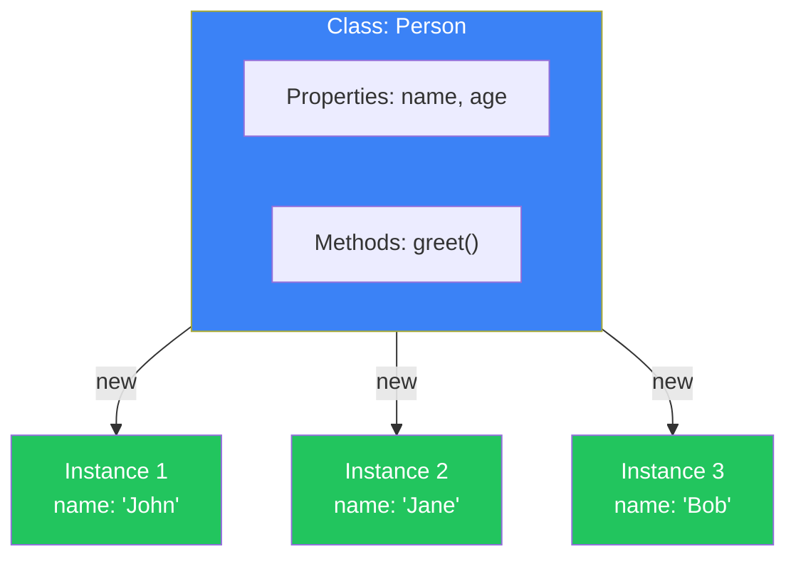
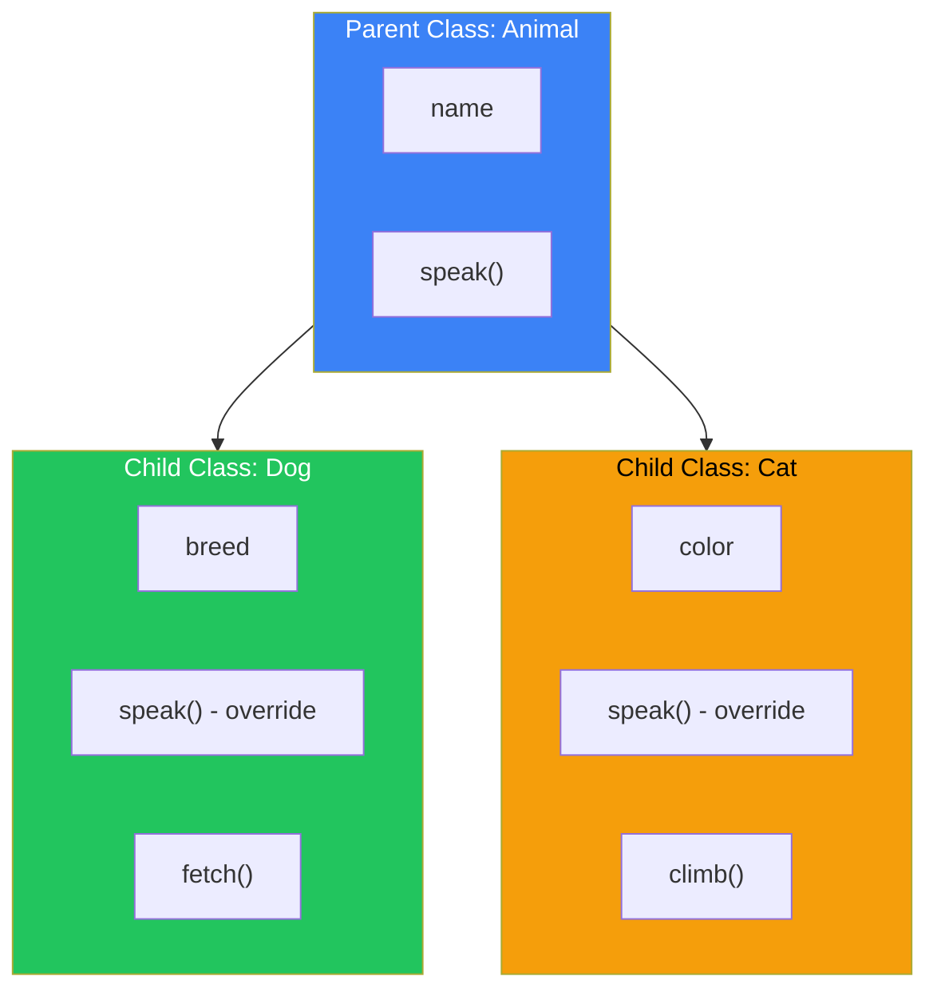
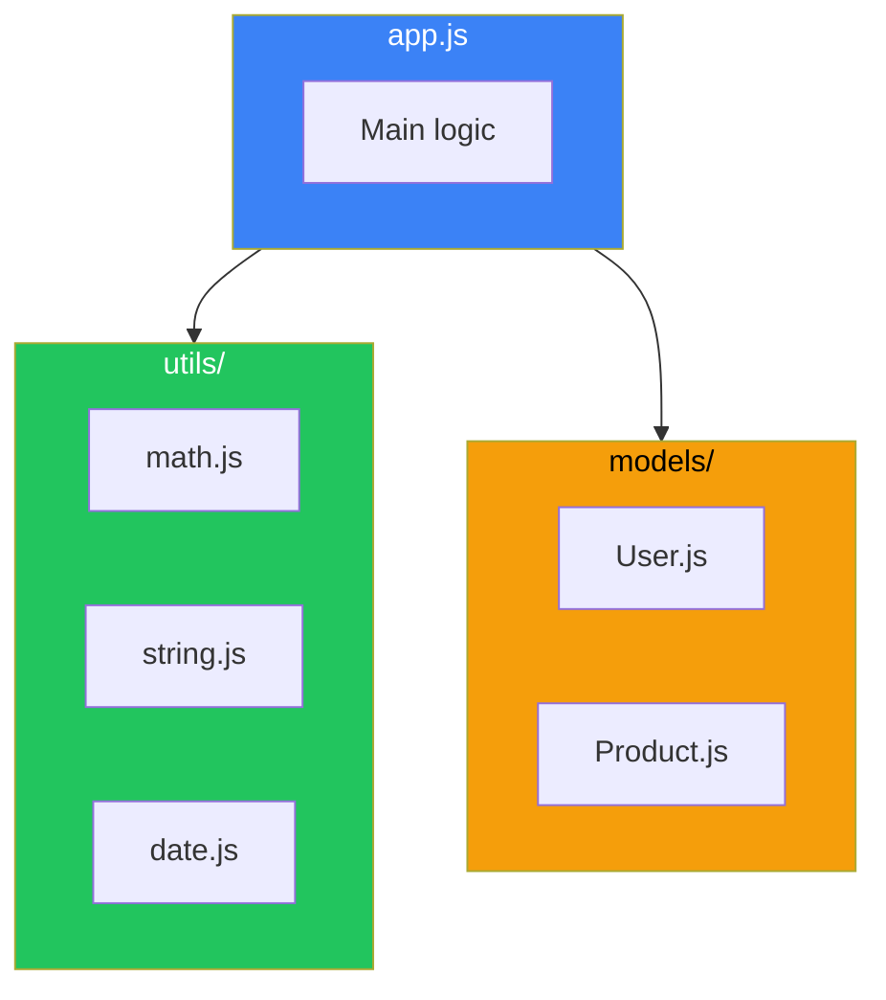

# Day 8: Classes and Modules

## What You'll Learn Today

- Basic class syntax and instantiation
- Constructors and methods
- Inheritance (extends, super)
- Static methods and properties
- Module system (import/export)

---

## What Is a Class?

A **class** is a blueprint (template) for creating objects. It was introduced in ES6.



---

## Basic Class Syntax

```javascript
class Person {
    // Constructor: called when creating an instance
    constructor(name, age) {
        this.name = name;
        this.age = age;
    }

    // Method
    greet() {
        console.log(`Hello, I'm ${this.name}`);
    }

    // Method
    introduce() {
        console.log(`${this.name}, ${this.age} years old`);
    }
}

// Creating instances
const person1 = new Person("John", 25);
const person2 = new Person("Jane", 30);

person1.greet();      // "Hello, I'm John"
person2.introduce();  // "Jane, 30 years old"

console.log(person1.name);  // "John"
console.log(person2.age);   // 30
```

---

## Getters and Setters

Customize access to properties.

```javascript
class Rectangle {
    constructor(width, height) {
        this._width = width;
        this._height = height;
    }

    // Getters
    get width() {
        return this._width;
    }

    get height() {
        return this._height;
    }

    get area() {
        return this._width * this._height;
    }

    // Setters
    set width(value) {
        if (value <= 0) throw new Error("Width must be positive");
        this._width = value;
    }

    set height(value) {
        if (value <= 0) throw new Error("Height must be positive");
        this._height = value;
    }
}

const rect = new Rectangle(10, 5);
console.log(rect.area);    // 50 (access like property, not method call)

rect.width = 20;
console.log(rect.area);    // 100

// rect.width = -5;        // Error: Width must be positive
```

---

## Static Methods and Properties

Methods and properties that belong to the class itself, not instances.

```javascript
class MathUtils {
    static PI = 3.14159;

    static add(a, b) {
        return a + b;
    }

    static multiply(a, b) {
        return a * b;
    }

    static circleArea(radius) {
        return MathUtils.PI * radius ** 2;
    }
}

// Call directly from class (no instance needed)
console.log(MathUtils.PI);           // 3.14159
console.log(MathUtils.add(5, 3));    // 8
console.log(MathUtils.circleArea(5)); // 78.53975

// Cannot access from instance
// const utils = new MathUtils();
// utils.add(5, 3);  // Error
```

---

## Inheritance

Extend existing classes to create new ones.



```javascript
// Parent class
class Animal {
    constructor(name) {
        this.name = name;
    }

    speak() {
        console.log(`${this.name} makes a sound`);
    }

    eat() {
        console.log(`${this.name} eats`);
    }
}

// Child class
class Dog extends Animal {
    constructor(name, breed) {
        super(name);  // Call parent constructor
        this.breed = breed;
    }

    // Override method
    speak() {
        console.log(`${this.name} barks`);
    }

    // New method
    fetch() {
        console.log(`${this.name} fetches the ball`);
    }
}

class Cat extends Animal {
    speak() {
        console.log(`${this.name} meows`);
    }

    climb() {
        console.log(`${this.name} climbs a tree`);
    }
}

const dog = new Dog("Buddy", "Golden Retriever");
const cat = new Cat("Whiskers");

dog.speak();   // "Buddy barks"
dog.eat();     // "Buddy eats" (inherited from parent)
dog.fetch();   // "Buddy fetches the ball"

cat.speak();   // "Whiskers meows"
cat.climb();   // "Whiskers climbs a tree"

console.log(dog instanceof Dog);    // true
console.log(dog instanceof Animal); // true
```

### The super Keyword

```javascript
class Employee {
    constructor(name, salary) {
        this.name = name;
        this.salary = salary;
    }

    getInfo() {
        return `${this.name}: $${this.salary}`;
    }
}

class Manager extends Employee {
    constructor(name, salary, department) {
        super(name, salary);  // Call parent constructor
        this.department = department;
    }

    getInfo() {
        // Call parent method and extend
        return `${super.getInfo()} (${this.department} dept)`;
    }
}

const manager = new Manager("Alice", 75000, "Engineering");
console.log(manager.getInfo());  // "Alice: $75000 (Engineering dept)"
```

---

## Private Fields (ES2022+)

Fields starting with `#` cannot be accessed outside the class.

```javascript
class BankAccount {
    #balance = 0;  // Private field

    constructor(initialBalance) {
        this.#balance = initialBalance;
    }

    deposit(amount) {
        if (amount > 0) {
            this.#balance += amount;
        }
    }

    withdraw(amount) {
        if (amount > 0 && amount <= this.#balance) {
            this.#balance -= amount;
            return amount;
        }
        return 0;
    }

    getBalance() {
        return this.#balance;
    }
}

const account = new BankAccount(1000);
account.deposit(500);
console.log(account.getBalance());  // 1500

// console.log(account.#balance);  // SyntaxError: Private field
```

---

## Module System

Organize code across multiple files.

### Export

```javascript
// math.js

// Named exports
export const PI = 3.14159;

export function add(a, b) {
    return a + b;
}

export function multiply(a, b) {
    return a * b;
}

// Export class
export class Calculator {
    add(a, b) { return a + b; }
    subtract(a, b) { return a - b; }
}

// Default export (one per file)
export default function subtract(a, b) {
    return a - b;
}
```

### Import

```javascript
// app.js

// Named imports
import { PI, add, multiply } from './math.js';

console.log(PI);        // 3.14159
console.log(add(5, 3)); // 8

// Import with alias
import { add as sum } from './math.js';
console.log(sum(5, 3)); // 8

// Import all
import * as MathUtils from './math.js';
console.log(MathUtils.PI);
console.log(MathUtils.multiply(4, 5));

// Default import
import subtract from './math.js';
console.log(subtract(10, 3)); // 7

// Default and named together
import subtract, { PI, add } from './math.js';
```

### Module Structure Example



---

## Practical Example: User Management System

```javascript
// User.js
export class User {
    #password;

    constructor(name, email, password) {
        this.name = name;
        this.email = email;
        this.#password = password;
    }

    checkPassword(input) {
        return this.#password === input;
    }

    getInfo() {
        return `${this.name} <${this.email}>`;
    }
}

// Admin.js
import { User } from './User.js';

export class Admin extends User {
    static permissions = ['create', 'read', 'update', 'delete'];

    constructor(name, email, password, department) {
        super(name, email, password);
        this.department = department;
        this.role = 'admin';
    }

    getInfo() {
        return `[Admin] ${super.getInfo()} - ${this.department}`;
    }

    hasPermission(action) {
        return Admin.permissions.includes(action);
    }
}

// app.js
import { User } from './User.js';
import { Admin } from './Admin.js';

const user = new User("John", "john@example.com", "secret123");
const admin = new Admin("Admin", "admin@example.com", "admin456", "IT");

console.log(user.getInfo());   // "John <john@example.com>"
console.log(admin.getInfo());  // "[Admin] Admin <admin@example.com> - IT"
console.log(admin.hasPermission('delete'));  // true
```

---

## Summary

| Concept | Description |
|---------|-------------|
| class | Blueprint for objects |
| constructor | Method called when creating instance |
| this | Reference to the instance itself |
| extends | Inherit from a class |
| super | Reference to parent class |
| static | Members belonging to class itself |
| #field | Private field |
| export | Expose from module |
| import | Load module |

### Key Takeaways

1. **Classes** are templates for creating objects
2. **Inheritance** for code reuse
3. **super** to access parent class
4. **Private fields** for encapsulation
5. **Modules** to organize code

---

## Exercises

### Exercise 1: Basic Class
Create a `Product` class with `name` and `price`, and a `getInfo()` method that returns "Product name: $price".

### Exercise 2: Inheritance
Extend `Product` to create a `SaleProduct` class with a `discount` property. Add a `getFinalPrice()` method that returns the discounted price.

### Exercise 3: Static Method
Create a `Counter` class with a static method `getCount()` that returns the total number of instances created.

### Challenge
Create a `Shape` class (abstract parent) and `Circle`, `Rectangle` classes, each with a `getArea()` method that calculates the area.

---

## References

- [MDN - Classes](https://developer.mozilla.org/en-US/docs/Web/JavaScript/Reference/Classes)
- [MDN - export](https://developer.mozilla.org/en-US/docs/Web/JavaScript/Reference/Statements/export)
- [MDN - import](https://developer.mozilla.org/en-US/docs/Web/JavaScript/Reference/Statements/import)
- [JavaScript.info - Classes](https://javascript.info/classes)

---

**Coming Up Next**: In Day 9, we'll learn about "Asynchronous JavaScript." Master Promises and async/await to fetch data from APIs!
