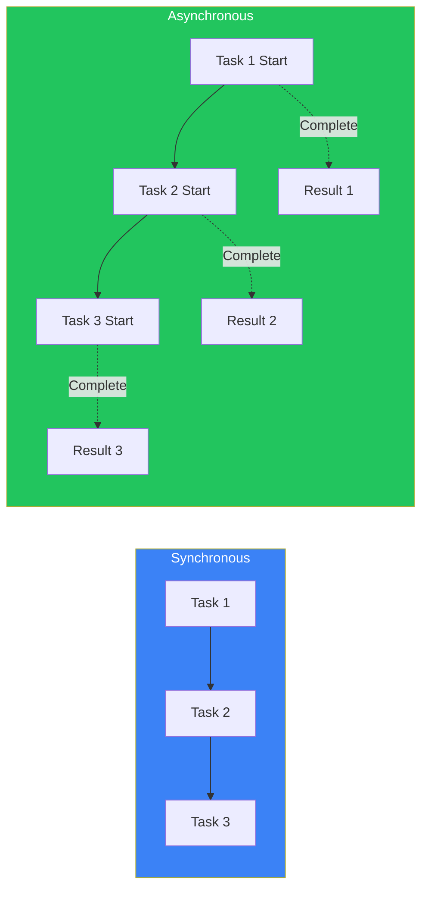
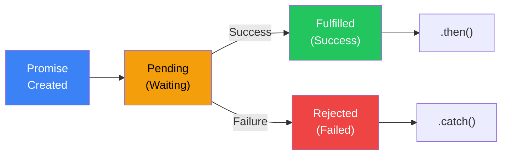
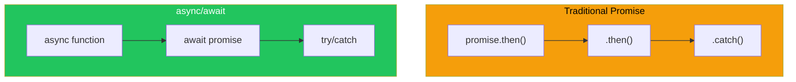

# Day 9: Asynchronous JavaScript

## What You'll Learn Today

- Difference between synchronous and asynchronous processing
- Callback functions
- Promise
- async/await
- Fetching data with fetch API

---

## Synchronous vs Asynchronous



### Synchronous Processing

Code executes from top to bottom, one at a time.

```javascript
console.log("First");
console.log("Second");
console.log("Third");
// Output: "First" → "Second" → "Third"
```

### Asynchronous Processing

Continues to next operation without waiting for time-consuming tasks.

```javascript
console.log("First");

setTimeout(() => {
    console.log("Second (after 1 second)");
}, 1000);

console.log("Third");

// Output: "First" → "Third" → "Second (after 1 second)"
```

### Why Do We Need Asynchronous Processing?

| Type | Example | Reason |
|------|---------|--------|
| Network | API calls | Waiting for server response |
| File I/O | File reading | Disk access takes time |
| Timers | setTimeout | Execute after specified time |
| User Input | Clicks, keypress | Unknown when it occurs |

---

## Callback Functions

A pattern where you pass a function to execute after async operation completes.

```javascript
function fetchData(callback) {
    setTimeout(() => {
        const data = { name: "John", age: 25 };
        callback(data);  // Execute callback after data is ready
    }, 1000);
}

fetchData((data) => {
    console.log("Received data:", data);
});

console.log("Fetching data...");

// Output:
// "Fetching data..."
// "Received data:" { name: "John", age: 25 }
```

### Callback Hell

Nested callbacks make code hard to read.

```javascript
// Example of callback hell
getUser(userId, (user) => {
    getOrders(user.id, (orders) => {
        getOrderDetails(orders[0].id, (details) => {
            getProduct(details.productId, (product) => {
                console.log(product);
                // More nesting continues...
            });
        });
    });
});
```

**Promise** was introduced to solve this problem.

---

## Promise

A **Promise** is an object representing a future value. It's the standard way to handle async operations.



### Three States of a Promise

| State | Description |
|-------|-------------|
| pending | Processing (result not yet determined) |
| fulfilled | Success (value resolved) |
| rejected | Failure (error occurred) |

### Creating a Promise

```javascript
const promise = new Promise((resolve, reject) => {
    // Async operation
    setTimeout(() => {
        const success = true;

        if (success) {
            resolve("Success!");  // On success
        } else {
            reject("An error occurred");  // On failure
        }
    }, 1000);
});
```

### Using Promises (then/catch)

```javascript
promise
    .then((result) => {
        console.log(result);  // "Success!"
    })
    .catch((error) => {
        console.log(error);   // Executed on error
    })
    .finally(() => {
        console.log("Processing complete");  // Always executed
    });
```

### Promise Chaining

Chain `.then()` calls to execute operations in sequence.

```javascript
function fetchUser(id) {
    return new Promise((resolve) => {
        setTimeout(() => {
            resolve({ id, name: "John" });
        }, 500);
    });
}

function fetchOrders(userId) {
    return new Promise((resolve) => {
        setTimeout(() => {
            resolve([{ id: 1, item: "Book" }, { id: 2, item: "Pen" }]);
        }, 500);
    });
}

// Promise chain
fetchUser(1)
    .then((user) => {
        console.log("User:", user);
        return fetchOrders(user.id);
    })
    .then((orders) => {
        console.log("Orders:", orders);
    })
    .catch((error) => {
        console.log("Error:", error);
    });
```

### Promise Static Methods

```javascript
// When all Promises succeed
Promise.all([
    fetch("/api/users"),
    fetch("/api/products"),
    fetch("/api/orders")
])
.then(([users, products, orders]) => {
    console.log("All data fetched");
});

// Get result of first completed Promise
Promise.race([
    fetch("/api/fast"),
    fetch("/api/slow")
])
.then((result) => {
    console.log("Fastest result:", result);
});

// When all Promises complete (regardless of success/failure)
Promise.allSettled([
    Promise.resolve("success"),
    Promise.reject("failure")
])
.then((results) => {
    console.log(results);
    // [{ status: "fulfilled", value: "success" },
    //  { status: "rejected", reason: "failure" }]
});
```

| Method | Description |
|--------|-------------|
| `Promise.all()` | Completes when all succeed, rejects if any fails |
| `Promise.race()` | Result of first to complete |
| `Promise.allSettled()` | Waits for all to complete (success or failure) |
| `Promise.any()` | Result of first to succeed |

---

## async/await

**async/await** is syntax to write Promises more readably (ES2017+).



### Basic Syntax

```javascript
// Declaring an async function
async function fetchData() {
    // await waits for Promise to complete
    const result = await somePromise;
    return result;
}

// Also works with arrow functions
const fetchData = async () => {
    const result = await somePromise;
    return result;
};
```

### Promise vs async/await

```javascript
// Using Promise
function getData() {
    return fetch("/api/data")
        .then(response => response.json())
        .then(data => {
            console.log(data);
            return data;
        });
}

// Using async/await
async function getData() {
    const response = await fetch("/api/data");
    const data = await response.json();
    console.log(data);
    return data;
}
```

### Error Handling

```javascript
async function fetchUser(id) {
    try {
        const response = await fetch(`/api/users/${id}`);

        if (!response.ok) {
            throw new Error(`HTTP error: ${response.status}`);
        }

        const user = await response.json();
        return user;
    } catch (error) {
        console.error("Error fetching user:", error);
        throw error;  // Re-throw if needed
    }
}
```

### Parallel Execution

```javascript
// Sequential execution (slow)
async function sequential() {
    const user = await fetchUser(1);      // Wait 1 second
    const orders = await fetchOrders(1);  // Wait another second
    // Total: 2 seconds
}

// Parallel execution (fast)
async function parallel() {
    const [user, orders] = await Promise.all([
        fetchUser(1),    // Start simultaneously
        fetchOrders(1)   // Start simultaneously
    ]);
    // Total: 1 second (time of slowest operation)
}
```

---

## fetch API

**fetch** is the standard API for making network requests.

### Basic GET Request

```javascript
// Simple GET request
async function getUsers() {
    const response = await fetch("https://api.example.com/users");
    const users = await response.json();
    return users;
}

// Usage
getUsers().then(users => console.log(users));
```

### POST Request

```javascript
async function createUser(userData) {
    const response = await fetch("https://api.example.com/users", {
        method: "POST",
        headers: {
            "Content-Type": "application/json"
        },
        body: JSON.stringify(userData)
    });

    const newUser = await response.json();
    return newUser;
}

// Usage
createUser({ name: "John", email: "john@example.com" })
    .then(user => console.log("Created user:", user));
```

### Handling Response

```javascript
async function fetchData(url) {
    const response = await fetch(url);

    // Check status code
    console.log(response.status);     // 200, 404, 500, etc.
    console.log(response.ok);         // true (200-299) or false
    console.log(response.statusText); // "OK", "Not Found", etc.

    // Response headers
    console.log(response.headers.get("Content-Type"));

    // Get body (depending on format)
    const json = await response.json();    // JSON
    // const text = await response.text();  // Text
    // const blob = await response.blob();  // Binary

    return json;
}
```

### Error Handling

```javascript
async function fetchWithErrorHandling(url) {
    try {
        const response = await fetch(url);

        // Check for HTTP errors
        if (!response.ok) {
            throw new Error(`HTTP error! status: ${response.status}`);
        }

        return await response.json();
    } catch (error) {
        if (error.name === "TypeError") {
            // Network error
            console.error("Network error:", error.message);
        } else {
            // Other errors
            console.error("Error:", error.message);
        }
        throw error;
    }
}
```

---

## Practical Example: Fetching and Displaying API Data

```javascript
// Fetch and display user list
async function displayUsers() {
    const loadingEl = document.getElementById("loading");
    const userListEl = document.getElementById("user-list");
    const errorEl = document.getElementById("error");

    try {
        // Show loading
        loadingEl.textContent = "Loading...";
        errorEl.textContent = "";

        // Fetch data
        const response = await fetch("https://jsonplaceholder.typicode.com/users");

        if (!response.ok) {
            throw new Error("Failed to fetch user data");
        }

        const users = await response.json();

        // Display
        userListEl.innerHTML = users
            .map(user => `
                <div class="user-card">
                    <h3>${user.name}</h3>
                    <p>Email: ${user.email}</p>
                    <p>City: ${user.address.city}</p>
                </div>
            `)
            .join("");

    } catch (error) {
        errorEl.textContent = `Error: ${error.message}`;
    } finally {
        loadingEl.textContent = "";
    }
}

// Run on page load
displayUsers();
```

### Fetching from Multiple APIs

```javascript
async function fetchDashboardData() {
    try {
        // Fetch data in parallel
        const [users, posts, comments] = await Promise.all([
            fetch("https://api.example.com/users").then(r => r.json()),
            fetch("https://api.example.com/posts").then(r => r.json()),
            fetch("https://api.example.com/comments").then(r => r.json())
        ]);

        return {
            totalUsers: users.length,
            totalPosts: posts.length,
            totalComments: comments.length
        };
    } catch (error) {
        console.error("Failed to fetch dashboard data:", error);
        throw error;
    }
}
```

---

## Summary

| Concept | Description |
|---------|-------------|
| Synchronous | Execute one at a time in order |
| Asynchronous | Continue without waiting |
| Callback | Function called after completion |
| Promise | Object representing future value |
| async/await | Syntax to write Promises synchronously |
| fetch | API for HTTP requests |

### Key Takeaways

1. **Async processing** is essential for UI responsiveness
2. **Promise** makes async operations manageable
3. **async/await** for synchronous-looking code
4. **try/catch** for error handling
5. **Promise.all** for efficient parallel execution

---

## Exercises

### Exercise 1: Creating a Promise
Create a Promise that returns the message "Done!" after 2 seconds.

### Exercise 2: async/await
Create a function that fetches data from the URL below and displays the first 5 titles.
```
https://jsonplaceholder.typicode.com/posts
```

### Exercise 3: Error Handling
Create a function that displays an error message when accessing a non-existent URL.

### Exercise 4: Parallel Execution
Create a function that fetches data from these two URLs simultaneously and returns both results in an array.
```
https://jsonplaceholder.typicode.com/users
https://jsonplaceholder.typicode.com/posts
```

### Challenge
Implement a search feature: search for users from an API based on text input, adding 300ms debounce processing.

---

## References

- [MDN - Promise](https://developer.mozilla.org/en-US/docs/Web/JavaScript/Reference/Global_Objects/Promise)
- [MDN - async/await](https://developer.mozilla.org/en-US/docs/Learn/JavaScript/Asynchronous/Promises)
- [MDN - fetch API](https://developer.mozilla.org/en-US/docs/Web/API/Fetch_API)
- [JavaScript.info - Promise](https://javascript.info/promise-basics)

---

**Coming Up Next**: In Day 10, we'll learn about "DOM and Events." Master how to dynamically manipulate web pages and implement user interactions!
