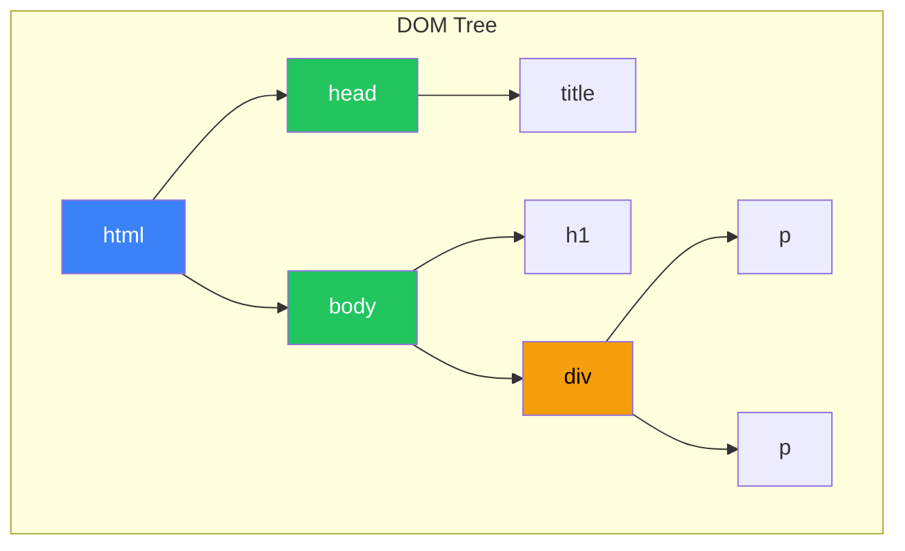
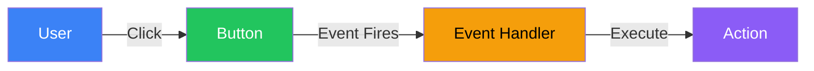
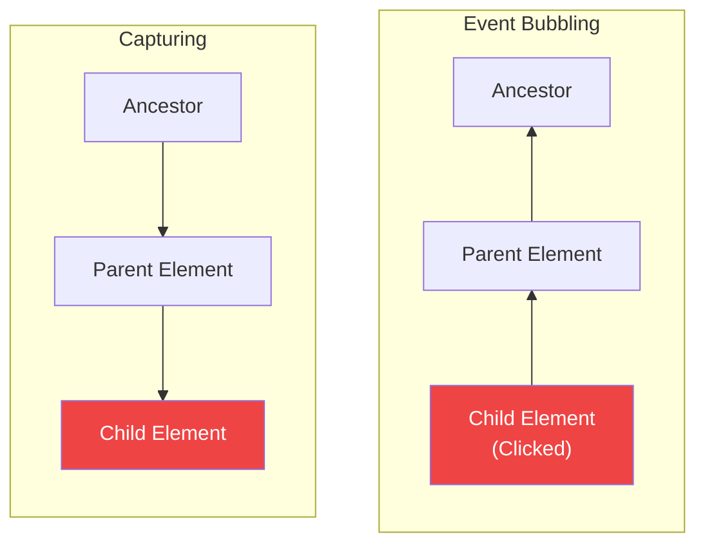

# Day 10: DOM and Events

## What You'll Learn Today

- What is DOM
- Selecting elements (querySelector, etc.)
- Manipulating elements (content, styles, attributes)
- Event listeners
- Final Project: Todo App

---

## What Is the DOM?

**DOM (Document Object Model)** is an interface for manipulating HTML with JavaScript.



```html
<!DOCTYPE html>
<html>
  <head>
    <title>Sample</title>
  </head>
  <body>
    <h1>Heading</h1>
    <div>
      <p>Paragraph 1</p>
      <p>Paragraph 2</p>
    </div>
  </body>
</html>
```

---

## Selecting Elements

### querySelector / querySelectorAll

The most convenient way to select elements using CSS selectors.

```javascript
// Select a single element
const header = document.querySelector("h1");
const firstButton = document.querySelector(".btn");
const submitBtn = document.querySelector("#submit-btn");

// Select multiple elements (NodeList)
const allParagraphs = document.querySelectorAll("p");
const allButtons = document.querySelectorAll(".btn");

// Loop through NodeList
allParagraphs.forEach((p) => {
    console.log(p.textContent);
});
```

### Other Selection Methods

```javascript
// Select by ID
const element = document.getElementById("my-id");

// Select by class name (HTMLCollection)
const elements = document.getElementsByClassName("my-class");

// Select by tag name (HTMLCollection)
const paragraphs = document.getElementsByTagName("p");

// Select by name attribute
const inputs = document.getElementsByName("email");
```

| Method | Returns | Selects |
|--------|---------|---------|
| `querySelector()` | Element | First match |
| `querySelectorAll()` | NodeList | All matches |
| `getElementById()` | Element | By ID |
| `getElementsByClassName()` | HTMLCollection | By class |
| `getElementsByTagName()` | HTMLCollection | By tag |

---

## Manipulating Element Content

### textContent and innerHTML

```javascript
const div = document.querySelector("#content");

// Text only (ignores HTML tags)
console.log(div.textContent);
div.textContent = "New text";

// Content including HTML
console.log(div.innerHTML);
div.innerHTML = "<strong>Bold</strong> text";

// Safely display without HTML (XSS protection)
div.textContent = "<script>dangerous</script>";  // Displays as-is
```

> **Note**: Inserting user input into `innerHTML` risks XSS attacks. Use `textContent` instead.

### Creating and Adding Elements

```javascript
// Create element
const newDiv = document.createElement("div");
newDiv.textContent = "New element";
newDiv.className = "card";

// Add to parent
const container = document.querySelector("#container");
container.appendChild(newDiv);

// Insert at specific position
const firstChild = container.firstElementChild;
container.insertBefore(newDiv, firstChild);  // Insert at beginning

// Modern addition methods
container.append(newDiv);        // Add at end
container.prepend(newDiv);       // Add at beginning
container.after(newDiv);         // Add after element
container.before(newDiv);        // Add before element
```

### Removing Elements

```javascript
// Remove element
const element = document.querySelector("#target");
element.remove();

// Remove child from parent (older method)
const parent = document.querySelector("#parent");
const child = document.querySelector("#child");
parent.removeChild(child);

// Remove all children
container.innerHTML = "";
// or
while (container.firstChild) {
    container.removeChild(container.firstChild);
}
```

---

## Manipulating Styles

### style Property

```javascript
const box = document.querySelector(".box");

// Set inline styles
box.style.backgroundColor = "blue";
box.style.color = "white";
box.style.padding = "20px";
box.style.borderRadius = "8px";

// Get style
console.log(box.style.backgroundColor);

// Set multiple styles at once
box.style.cssText = "background: red; color: white; padding: 10px;";
```

> **Note**: CSS property names are converted to camelCase (`background-color` → `backgroundColor`)

### classList

Add, remove, and toggle classes.

```javascript
const element = document.querySelector(".card");

// Add class
element.classList.add("active");
element.classList.add("highlight", "important");  // Add multiple

// Remove class
element.classList.remove("active");

// Toggle class (add if missing, remove if present)
element.classList.toggle("visible");

// Check if class exists
if (element.classList.contains("active")) {
    console.log("Has active class");
}

// Replace class
element.classList.replace("old-class", "new-class");
```

---

## Manipulating Attributes

```javascript
const link = document.querySelector("a");

// Get attribute
console.log(link.getAttribute("href"));
console.log(link.href);  // Also accessible as property

// Set attribute
link.setAttribute("href", "https://example.com");
link.setAttribute("target", "_blank");

// Remove attribute
link.removeAttribute("target");

// Check if attribute exists
if (link.hasAttribute("href")) {
    console.log("Has href attribute");
}

// data-* custom attributes
const card = document.querySelector(".card");
card.dataset.id = "123";        // data-id="123"
card.dataset.userName = "John"; // data-user-name="John"
console.log(card.dataset.id);   // "123"
```

---

## Events

A mechanism to respond to user actions and browser activities.



### Registering Event Listeners

```javascript
const button = document.querySelector("#my-button");

// addEventListener (recommended)
button.addEventListener("click", () => {
    console.log("Button was clicked");
});

// Using named function
function handleClick() {
    console.log("Clicked!");
}
button.addEventListener("click", handleClick);

// Remove event listener
button.removeEventListener("click", handleClick);
```

### Common Events

| Event | Triggers When |
|-------|---------------|
| `click` | Clicked |
| `dblclick` | Double-clicked |
| `mouseenter` | Mouse enters element |
| `mouseleave` | Mouse leaves element |
| `keydown` | Key pressed |
| `keyup` | Key released |
| `submit` | Form submitted |
| `change` | Value changed |
| `input` | Input (real-time) |
| `focus` | Focused |
| `blur` | Lost focus |
| `load` | Loaded |
| `DOMContentLoaded` | DOM ready |

### Event Object

```javascript
button.addEventListener("click", (event) => {
    // Event info
    console.log(event.type);        // "click"
    console.log(event.target);      // Clicked element
    console.log(event.currentTarget); // Element with listener

    // Mouse position
    console.log(event.clientX, event.clientY);  // Viewport-relative
    console.log(event.pageX, event.pageY);      // Page-relative

    // Prevent default behavior
    event.preventDefault();

    // Stop event propagation
    event.stopPropagation();
});

// Keyboard events
document.addEventListener("keydown", (event) => {
    console.log(event.key);     // "Enter", "a", "Escape", etc.
    console.log(event.code);    // "Enter", "KeyA", "Escape", etc.
    console.log(event.shiftKey); // Is Shift pressed?
    console.log(event.ctrlKey);  // Is Ctrl pressed?
});
```

### Event Propagation (Bubbling)



```javascript
// Event bubbling (default)
parent.addEventListener("click", () => {
    console.log("Parent clicked");
});

child.addEventListener("click", (event) => {
    console.log("Child clicked");
    event.stopPropagation();  // Stop bubbling
});

// Handle during capture phase
parent.addEventListener("click", () => {
    console.log("Parent (capture)");
}, true);  // Third argument true
```

### Event Delegation

Register one listener on parent to handle child events.

```javascript
// Bad: Listener on each button
document.querySelectorAll(".delete-btn").forEach(btn => {
    btn.addEventListener("click", () => {
        // Delete logic
    });
});

// Good: Delegate to parent
const list = document.querySelector("#task-list");
list.addEventListener("click", (event) => {
    // Check clicked element
    if (event.target.classList.contains("delete-btn")) {
        const taskItem = event.target.closest(".task-item");
        taskItem.remove();
    }
});
```

---

## Working with Forms

```javascript
const form = document.querySelector("#my-form");
const nameInput = document.querySelector("#name");
const emailInput = document.querySelector("#email");

// Get and set values
console.log(nameInput.value);
nameInput.value = "John";

// Form submit event
form.addEventListener("submit", (event) => {
    event.preventDefault();  // Prevent page reload

    const formData = {
        name: nameInput.value,
        email: emailInput.value
    };

    console.log("Submit data:", formData);

    // Reset form
    form.reset();
});

// Real-time input validation
nameInput.addEventListener("input", (event) => {
    const value = event.target.value;
    if (value.length < 3) {
        nameInput.classList.add("error");
    } else {
        nameInput.classList.remove("error");
    }
});
```

---

## Final Project: Todo App

Let's build a simple Todo app using what we've learned.

### HTML

```html
<!DOCTYPE html>
<html lang="en">
<head>
    <meta charset="UTF-8">
    <meta name="viewport" content="width=device-width, initial-scale=1.0">
    <title>Todo App</title>
    <style>
        * { box-sizing: border-box; }
        body { font-family: sans-serif; max-width: 500px; margin: 50px auto; padding: 20px; }
        h1 { text-align: center; color: #333; }
        .input-area { display: flex; gap: 10px; margin-bottom: 20px; }
        #todo-input { flex: 1; padding: 10px; font-size: 16px; border: 2px solid #ddd; border-radius: 5px; }
        #add-btn { padding: 10px 20px; background: #3b82f6; color: white; border: none; border-radius: 5px; cursor: pointer; }
        #add-btn:hover { background: #2563eb; }
        #todo-list { list-style: none; padding: 0; }
        .todo-item { display: flex; align-items: center; padding: 15px; margin-bottom: 10px; background: #f9f9f9; border-radius: 5px; }
        .todo-item.completed { opacity: 0.6; }
        .todo-item.completed .todo-text { text-decoration: line-through; }
        .todo-text { flex: 1; margin-left: 10px; }
        .delete-btn { padding: 5px 10px; background: #ef4444; color: white; border: none; border-radius: 3px; cursor: pointer; }
        .filter-area { display: flex; gap: 10px; margin-bottom: 20px; }
        .filter-btn { padding: 5px 15px; border: 1px solid #ddd; background: white; border-radius: 3px; cursor: pointer; }
        .filter-btn.active { background: #3b82f6; color: white; border-color: #3b82f6; }
    </style>
</head>
<body>
    <h1>Todo App</h1>

    <div class="input-area">
        <input type="text" id="todo-input" placeholder="Enter a task...">
        <button id="add-btn">Add</button>
    </div>

    <div class="filter-area">
        <button class="filter-btn active" data-filter="all">All</button>
        <button class="filter-btn" data-filter="active">Active</button>
        <button class="filter-btn" data-filter="completed">Completed</button>
    </div>

    <ul id="todo-list"></ul>

    <script src="app.js"></script>
</body>
</html>
```

### JavaScript (app.js)

```javascript
// Get DOM elements
const todoInput = document.querySelector("#todo-input");
const addBtn = document.querySelector("#add-btn");
const todoList = document.querySelector("#todo-list");
const filterArea = document.querySelector(".filter-area");

// Todo list data
let todos = JSON.parse(localStorage.getItem("todos")) || [];
let currentFilter = "all";

// Save todos
function saveTodos() {
    localStorage.setItem("todos", JSON.stringify(todos));
}

// Render todos
function renderTodos() {
    // Filter
    const filteredTodos = todos.filter(todo => {
        if (currentFilter === "active") return !todo.completed;
        if (currentFilter === "completed") return todo.completed;
        return true;
    });

    // Generate HTML
    todoList.innerHTML = filteredTodos
        .map(todo => `
            <li class="todo-item ${todo.completed ? "completed" : ""}" data-id="${todo.id}">
                <input type="checkbox" ${todo.completed ? "checked" : ""}>
                <span class="todo-text">${escapeHtml(todo.text)}</span>
                <button class="delete-btn">Delete</button>
            </li>
        `)
        .join("");
}

// HTML escape (XSS protection)
function escapeHtml(text) {
    const div = document.createElement("div");
    div.textContent = text;
    return div.innerHTML;
}

// Add todo
function addTodo() {
    const text = todoInput.value.trim();
    if (!text) return;

    const todo = {
        id: Date.now(),
        text,
        completed: false
    };

    todos.push(todo);
    saveTodos();
    renderTodos();
    todoInput.value = "";
    todoInput.focus();
}

// Event listener: Add button
addBtn.addEventListener("click", addTodo);

// Event listener: Enter key
todoInput.addEventListener("keypress", (event) => {
    if (event.key === "Enter") {
        addTodo();
    }
});

// Event listener: List operations (event delegation)
todoList.addEventListener("click", (event) => {
    const todoItem = event.target.closest(".todo-item");
    if (!todoItem) return;

    const id = Number(todoItem.dataset.id);

    // Checkbox
    if (event.target.type === "checkbox") {
        const todo = todos.find(t => t.id === id);
        if (todo) {
            todo.completed = event.target.checked;
            saveTodos();
            renderTodos();
        }
    }

    // Delete button
    if (event.target.classList.contains("delete-btn")) {
        todos = todos.filter(t => t.id !== id);
        saveTodos();
        renderTodos();
    }
});

// Event listener: Filter
filterArea.addEventListener("click", (event) => {
    if (!event.target.classList.contains("filter-btn")) return;

    // Update active state
    document.querySelectorAll(".filter-btn").forEach(btn => {
        btn.classList.remove("active");
    });
    event.target.classList.add("active");

    // Apply filter
    currentFilter = event.target.dataset.filter;
    renderTodos();
});

// Initial render
renderTodos();
```

### Completed Features

- Add tasks (button/Enter key)
- Toggle task complete/incomplete
- Delete tasks
- Filter (All/Active/Completed)
- Data persistence with localStorage
- XSS protection (HTML escaping)

---

## Summary

| Concept | Description |
|---------|-------------|
| DOM | Interface for manipulating HTML |
| querySelector | Select elements with CSS selectors |
| textContent | Get/set text content |
| innerHTML | Get/set HTML content |
| classList | Add/remove/toggle classes |
| addEventListener | Register event listeners |
| event.preventDefault | Prevent default behavior |
| Event delegation | Handle events on parent |

### Key Takeaways

1. **querySelector** is the most convenient selection method
2. **textContent** for XSS protection
3. **classList** for class manipulation
4. **Event delegation** for efficient event handling
5. **localStorage** for data persistence

---

## Exercises

### Exercise 1: Select and Manipulate
Write code that changes a paragraph's text to "Changed!" when a button is clicked.

### Exercise 2: Toggle Styles
Write code that toggles a box's background color between red and blue on each button click.

### Exercise 3: Input Validation
Write code that shows a red border for less than 5 characters and green border for 5 or more characters in a text input.

### Challenge
Add an "edit feature" to the Todo app. Double-clicking a task should enable edit mode, allowing the text to be changed.

---

## References

- [MDN - Introduction to the DOM](https://developer.mozilla.org/en-US/docs/Web/API/Document_Object_Model/Introduction)
- [MDN - Events](https://developer.mozilla.org/en-US/docs/Learn/JavaScript/Building_blocks/Events)
- [MDN - querySelector](https://developer.mozilla.org/en-US/docs/Web/API/Document/querySelector)
- [JavaScript.info - Document](https://javascript.info/document)

---

## Congratulations!

You've completed the 10-day JavaScript learning journey!

### What You Learned

1. **Day 1**: JavaScript basics and development environment
2. **Day 2**: Values and variables
3. **Day 3**: Operators and expressions
4. **Day 4**: Conditionals and loops
5. **Day 5**: Functions
6. **Day 6**: Arrays
7. **Day 7**: Objects
8. **Day 8**: Classes and modules
9. **Day 9**: Asynchronous JavaScript
10. **Day 10**: DOM and events

### Next Steps

- Learn frameworks (React, Vue, Angular)
- Server-side development with Node.js
- Write type-safe code with TypeScript
- Build real projects to gain experience

Keep learning and build amazing web applications!
