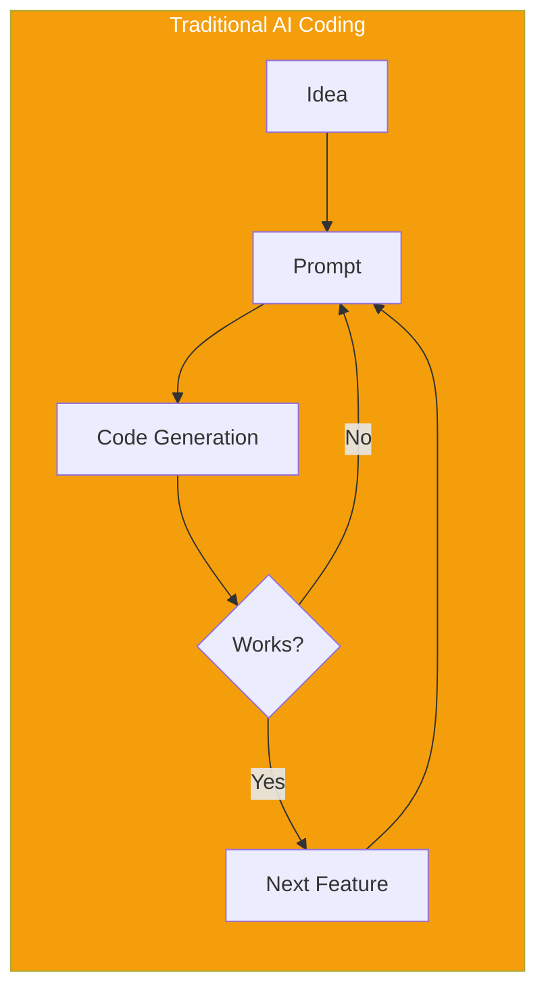
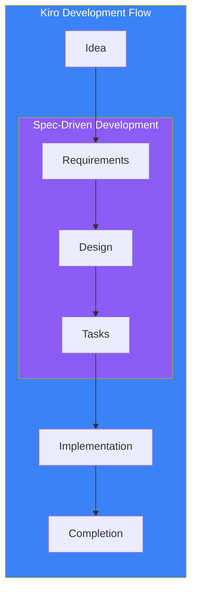
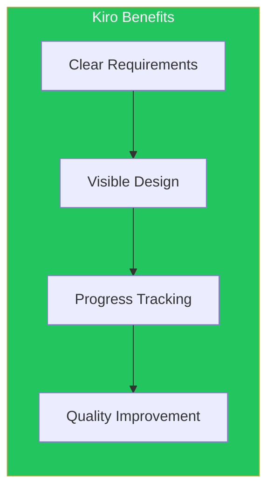
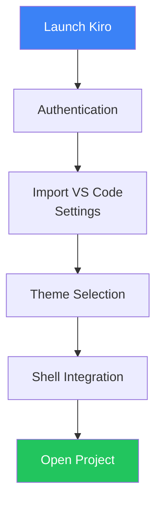
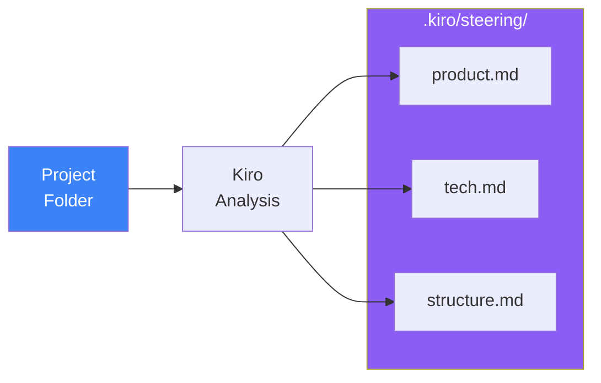

# Day 1: Welcome to Kiro

## What You'll Learn Today

- What Kiro is and why it matters
- How Kiro differs from other AI coding tools
- Installing and setting up Kiro
- Starting your first project

---

## The Evolution of AI Coding Tools

Since 2023, AI coding tools have evolved rapidly. GitHub Copilot, Cursor, Claude Code, and many others have significantly improved developer productivity.

However, these tools share common challenges.

### The "Vibe Coding" Problem



In traditional AI coding, developers repeatedly adjust prompts and iterate until the generated code works. This is called "Vibe Coding" and leads to several problems:

| Problem | Impact |
|---------|--------|
| **Vague Requirements** | Development proceeds without clear goals |
| **Missing Documentation** | No record of what was built or why |
| **Insufficient Testing** | Can't write tests without clear requirements |
| **Technical Debt** | Ad-hoc code accumulates over time |

---

## What is Kiro?

Kiro is an **agentic IDE** released by AWS in July 2025. Built on Code OSS (the same foundation as VS Code), it feels immediately familiar to VS Code users.



### Key Features

What sets Kiro apart from other AI coding tools is its **Spec-Driven Development** approach.

| Feature | Description |
|---------|-------------|
| **Spec-Driven Development** | Clarify requirements, design, and tasks before coding |
| **Agentic** | AI autonomously performs file operations and commands |
| **Steering** | Teach AI your project's rules and conventions |
| **Hooks** | Automate actions on events like file changes |
| **MCP Integration** | Connect external tools and data sources |
| **Powers** | Add domain expertise with one click |

### Why Use Kiro?



1. **Clear Requirements**: Transform vague ideas into structured requirements
2. **Visible Design**: Document architecture and data flows
3. **Progress Tracking**: Monitor task completion in real-time
4. **Quality Improvement**: Traceability from requirements to tests

---

## Installing Kiro

### System Requirements

Kiro runs on:

- **macOS**: Apple Silicon (M1 and later) / Intel
- **Windows**: Windows 10 or later
- **Linux**: Major distributions

### Installation Steps

1. **Download**: Visit [kiro.dev](https://kiro.dev) and download the installer for your OS

2. **Install**: Open the downloaded file and follow the installation instructions

3. **Launch**: Open Kiro IDE

### Initial Setup

When you first launch Kiro, you'll see several setup screens.



#### 1. Authentication

Sign in with social login (Google, GitHub, etc.) or AWS credentials. An AWS account is not required.

#### 2. Import VS Code Settings (Optional)

Existing VS Code users can import their settings and extensions, preserving keybindings, themes, and other preferences.

#### 3. Theme Selection

Choose between dark or light themes.

#### 4. Shell Integration

Allow Kiro to execute terminal commands. This enables the AI to run builds, tests, and perform file operations.

---

## Your First Project

Once Kiro is set up, let's open your first project.

### Opening a Project

You can open a project in three ways:

1. **From Menu**: File > Open Folder and select your project
2. **Drag & Drop**: Drag your project folder into Kiro
3. **Command Line**: Run `kiro .`

### Opening the Kiro Panel

Click the **Kiro ghost icon** in the Activity Bar (the leftmost icon column) to open the Kiro panel.

```
┌─────────────────────────────────────────────┐
│ [Ghost Icon]  Kiro                          │
├─────────────────────────────────────────────┤
│                                             │
│  💬 Chat                                    │
│  📋 Specs                                   │
│  🔧 Hooks                                   │
│  🔌 MCP                                     │
│                                             │
└─────────────────────────────────────────────┘
```

### Generating Steering Documents

The most important first step in Kiro is generating **Steering documents**.

Select "**Generate Steering Docs**" from the Kiro panel. Kiro will analyze your project and create three files in the `.kiro/steering/` folder:

| File | Contents |
|------|----------|
| **product.md** | Product purpose, users, and features |
| **tech.md** | Technologies, frameworks, and libraries |
| **structure.md** | Directory structure, naming conventions, architecture |



With these files, Kiro understands your project's context and can provide more relevant suggestions and code generation.

---

## Kiro's Interface

Kiro's interface is nearly identical to VS Code, with some additional features.

```
┌─────────────────────────────────────────────────────────────────┐
│ Menu Bar                                                        │
├────┬────────────────────────────────────────────────────────────┤
│    │                                                            │
│ A  │                                                            │
│ c  │              Editor Area                                   │
│ t  │                                                            │
│ i  │                                                            │
│ v  ├────────────────────────────────────────────────────────────┤
│ i  │                                                            │
│ t  │              Panel (Terminal, Output, etc.)                │
│ y  │                                                            │
│    │                                                            │
│ B  ├────────────────────────────────────────────────────────────┤
│ a  │              Kiro Chat Panel                               │
│ r  │                                                            │
│    │                                                            │
└────┴────────────────────────────────────────────────────────────┘
```

### Key Elements

| Element | Description |
|---------|-------------|
| **Activity Bar** | Left icon column containing the Kiro ghost icon |
| **Editor Area** | Main code editing area |
| **Panel** | Terminal, output, problems display |
| **Kiro Chat Panel** | AI interaction, Specs, Hooks, MCP management |

---

## Pricing Plans

Kiro exited public preview in October 2025 and introduced paid plans.

| Plan | Monthly | Agent Interactions |
|------|---------|-------------------|
| **Free** | $0 | 50/month |
| **Pro** | $19 | 1,000/month |
| **Pro+** | $39 | 3,000/month |

> **Note**: Pricing may change. Check [kiro.dev](https://kiro.dev) for current information.

---

## Summary

| Concept | Description |
|---------|-------------|
| **Kiro** | Agentic IDE provided by AWS |
| **Spec-Driven Development** | Develop in order: requirements → design → tasks |
| **Steering** | Documents that tell AI about your project |
| **Code OSS** | Same foundation as VS Code, easy migration |

### Key Points

1. **Kiro helps you "think before you build"**
2. **Migration from VS Code is smooth**
3. **Steering documents are the foundation for project understanding**
4. **Try it free with the basic plan**

---

## Exercises

### Exercise 1: Basics

Install Kiro and open an existing project (or create a new folder). Generate Steering documents and examine the three files (product.md, tech.md, structure.md).

### Exercise 2: Applied

Review the generated Steering documents. Check if the project description is accurate. If anything is incorrect, try editing it manually.

### Challenge

If migrating from VS Code to Kiro, investigate which settings and extensions transfer. Also consider: in what situations would Kiro-specific features (Specs, Hooks, MCP) be most useful?

---

## References

- [Kiro Official Site](https://kiro.dev/)
- [Kiro Documentation](https://kiro.dev/docs/)
- [Getting Started](https://kiro.dev/docs/getting-started/)
- [Introducing Kiro Blog Post](https://kiro.dev/blog/introducing-kiro/)

---

**Coming Up**: In Day 2, we'll dive deep into "Steering Files" and learn how to teach Kiro your project's rules and conventions.
