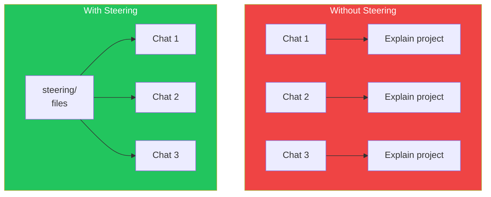
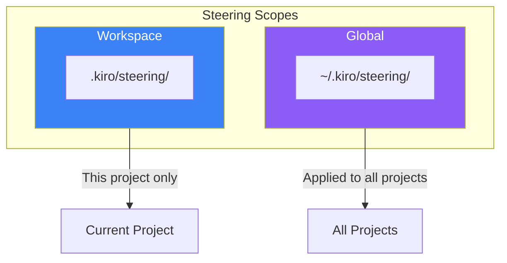
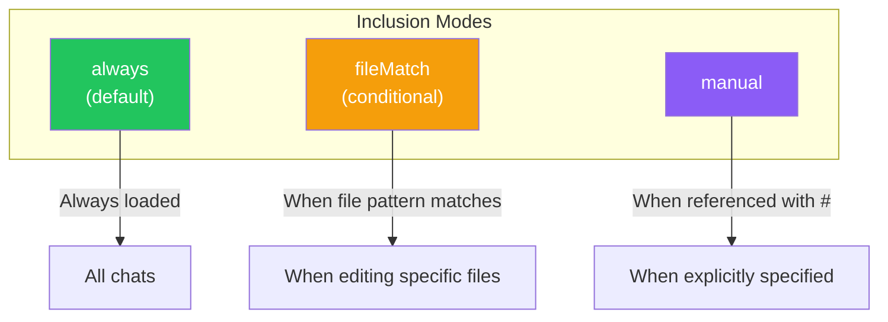

# Day 2: Steering Files

## What You'll Learn Today

- The role and importance of steering files
- The three foundational files (product.md, tech.md, structure.md)
- Configuring inclusion modes
- Creating custom steering files

---

## What Are Steering Files?

Steering files are **Markdown files that provide Kiro with persistent knowledge** about your project. Instead of explaining the same conventions in every chat, you write them once in steering files, and Kiro consistently follows them.



### Why Steering Matters

| Challenge | Solution with Steering |
|-----------|----------------------|
| **Repetitive explanations** | Write once, apply automatically |
| **Inconsistent suggestions** | Suggestions follow project rules |
| **Missing context** | Always maintains project information |
| **Team differences** | Unified shared rules |

---

## Types of Steering Files

Kiro supports steering files at two scopes.



### Workspace Steering

Placed in the `.kiro/steering/` folder at your project root. Defines patterns and conventions specific to that project.

```
my-project/
├── .kiro/
│   └── steering/
│       ├── product.md
│       ├── tech.md
│       └── structure.md
└── src/
```

### Global Steering

Placed in the `~/.kiro/steering/` folder in your home directory. Defines common rules that apply to all workspaces.

```
~/.kiro/
└── steering/
    ├── coding-style.md
    └── commit-conventions.md
```

> **Priority**: When workspace and global instructions conflict, **workspace takes precedence**. This lets you set global rules while overriding them for specific projects.

---

## The Three Foundational Files

Let's examine the three basic steering files that Kiro auto-generates.

### 1. product.md

Defines the product's purpose, users, and features. Used to align technical decisions with business objectives.

```markdown
# Product Overview

## Purpose
A task management application that helps individuals and teams
organize tasks and track progress.

## Target Users
- Individual users: Daily task management
- Small teams: Project management

## Key Features
- Create, edit, and delete tasks
- Categorization by priority and labels
- Deadline setting and reminders
- Assignment to team members

## Business Goals
- Increase user acquisition
- Improve conversion to paid plans
```

### 2. tech.md

Documents technologies, frameworks, and technical constraints. Used for consistent tool selection.

```markdown
# Technical Stack

## Frontend
- Framework: Next.js 15
- Language: TypeScript 5
- UI Library: React 19
- Styling: Tailwind CSS 4

## Backend
- Runtime: Node.js 22
- API: tRPC
- Database: PostgreSQL 16
- ORM: Prisma

## Infrastructure
- Hosting: Vercel
- Database Hosting: Supabase
- CI/CD: GitHub Actions

## Constraints
- No IE11 support required
- Mobile-first design
- Must meet Core Web Vitals standards
```

### 3. structure.md

Outlines file organization, naming conventions, and architecture patterns.

```markdown
# Project Structure

## Directory Layout
```
src/
├── app/           # Next.js App Router
├── components/    # Reusable UI components
│   ├── ui/       # Basic UI components
│   └── features/ # Feature-specific components
├── lib/          # Utility functions
├── hooks/        # Custom hooks
├── types/        # TypeScript type definitions
└── styles/       # Global styles
```

## Naming Conventions
- Components: PascalCase (e.g., TaskCard.tsx)
- Hooks: camelCase with 'use' prefix (e.g., useTaskList.ts)
- Utilities: camelCase (e.g., formatDate.ts)
- Types: PascalCase with suffix (e.g., TaskType.ts)

## Architecture Patterns
- Components use Container/Presentational pattern
- State management with React Context + useReducer
- API calls use tRPC hooks
```

---

## Inclusion Modes

Control when steering files are loaded into Kiro's context by adding YAML front matter at the top of files.



### always (Default)

Automatically loaded for all Kiro interactions. Use for core standards that should always apply.

```yaml
---
inclusion: always
---

# Coding Standards

All code must follow:
- ESLint configuration
- Prettier formatting
- Comments in English
```

### fileMatch (Conditional)

Only loaded when working with files matching specific patterns. Use for domain-specific guidance.

```yaml
---
inclusion:
  fileMatch:
    - "**/*.tsx"
    - "**/*.jsx"
---

# React Component Guidelines

## Component Structure
- Define props with interface
- Use default exports
- Use Tailwind classes for styling

## Hooks
- Custom hooks use 'use' prefix
- Manage side effects with useEffect
```

### manual

Only loaded when explicitly referenced in chat using `#steering-file-name` syntax.

```yaml
---
inclusion: manual
---

# Database Migration Guide

Reference this guide when working on database migrations.
Type #database-migration in chat to use.
```

---

## Creating Custom Steering Files

Beyond the three auto-generated files, you can add project-specific rules.

### How to Create

1. Click the "+" button in the Kiro panel
2. Or directly create files in the `.kiro/steering/` folder

### Recommended Custom Files

| Filename | Content |
|----------|---------|
| **api-conventions.md** | REST/GraphQL API design rules |
| **testing-guidelines.md** | How to write tests, coverage requirements |
| **security-rules.md** | Security requirements, prohibited practices |
| **git-workflow.md** | Branch strategy, commit messages |
| **error-handling.md** | Error handling patterns |

### Example: testing-guidelines.md

```yaml
---
inclusion:
  fileMatch:
    - "**/*.test.ts"
    - "**/*.test.tsx"
    - "**/*.spec.ts"
---

# Testing Guidelines

## Test Structure
- Use Arrange-Act-Assert pattern
- Tests must be independently runnable
- Minimize mocks

## Naming Convention
- describe: Target component/function name
- it: "should + expected behavior"

## Example
```typescript
describe('TaskCard', () => {
  it('should render task title', () => {
    // Arrange
    const task = { title: 'Test Task' };

    // Act
    render(<TaskCard task={task} />);

    // Assert
    expect(screen.getByText('Test Task')).toBeInTheDocument();
  });
});
```

## Coverage Requirements
- New code: 80% or higher
- Critical paths: 100%
```

---

## Using File References

You can reference actual workspace files from steering files.

```markdown
# API Design

API endpoints must follow this schema:

#[[file:src/schemas/api.schema.ts]]

Error response format:

#[[file:src/types/error.types.ts]]
```

Using this notation, Kiro considers the referenced file contents when generating code.

---

## Best Practices

### 1. Single Responsibility

Each file focuses on one domain.

```
❌ general-rules.md (everything crammed in)
✓ api-conventions.md
✓ component-patterns.md
✓ testing-guidelines.md
```

### 2. Descriptive Names

File names should indicate their content.

```
❌ rules.md
❌ stuff.md
✓ rest-api-conventions.md
✓ react-component-patterns.md
```

### 3. Explain the Why

Not just rules, but why those rules exist.

```markdown
## Error Handling

Use custom error classes for exceptions.

**Reason**:
- Can distinguish error types by type
- Stack traces are preserved
- Error messages remain consistent
```

### 4. Include Code Examples

Concrete examples are more effective than abstract descriptions.

```markdown
## Bad Example
```typescript
// Don't do this
const data = await fetch(url);
```

## Good Example
```typescript
// Do this instead
try {
  const response = await fetch(url);
  if (!response.ok) {
    throw new ApiError(response.status, response.statusText);
  }
  return await response.json();
} catch (error) {
  logger.error('API call failed', { url, error });
  throw error;
}
```
```

### 5. Avoid Sensitive Information

Don't include API keys or credentials.

```markdown
❌ API_KEY=sk-xxxxx
✓ Use environment variable API_KEY
```

---

## Summary

| Concept | Description |
|---------|-------------|
| **Steering** | Markdown files providing Kiro persistent knowledge |
| **Workspace** | `.kiro/steering/` - project-specific |
| **Global** | `~/.kiro/steering/` - shared across all projects |
| **Inclusion** | Control loading timing with always / fileMatch / manual |

### Key Points

1. **Steering is "write once, use many times"**
2. **Three foundational files create the base**
3. **Use fileMatch to load only when needed**
4. **Include reasoning and concrete examples for effectiveness**

---

## Exercises

### Exercise 1: Basics

Review the auto-generated steering files (product.md, tech.md, structure.md) in your project and add any missing information.

### Exercise 2: Applied

Create a `testing-guidelines.md` steering file that includes:
- fileMatch configuration for test files only
- Test naming conventions
- Minimum coverage requirements

### Challenge

For team development, create the following steering files:
1. `git-workflow.md` - Branch strategy and commit message conventions
2. `security-rules.md` - Security requirements and prohibited practices

Consider which could be used as global steering versus project-specific.

---

## References

- [Kiro Steering Documentation](https://kiro.dev/docs/steering/)
- [Teaching Kiro new tricks with agent steering and MCP](https://kiro.dev/blog/teaching-kiro-new-tricks-with-agent-steering-and-mcp/)
- [Your first project - Steering Files](https://kiro.dev/docs/getting-started/first-project/)

---

**Coming Up**: In Day 3, we'll learn about "Agentic Chat" and master effective interaction methods using context providers.
