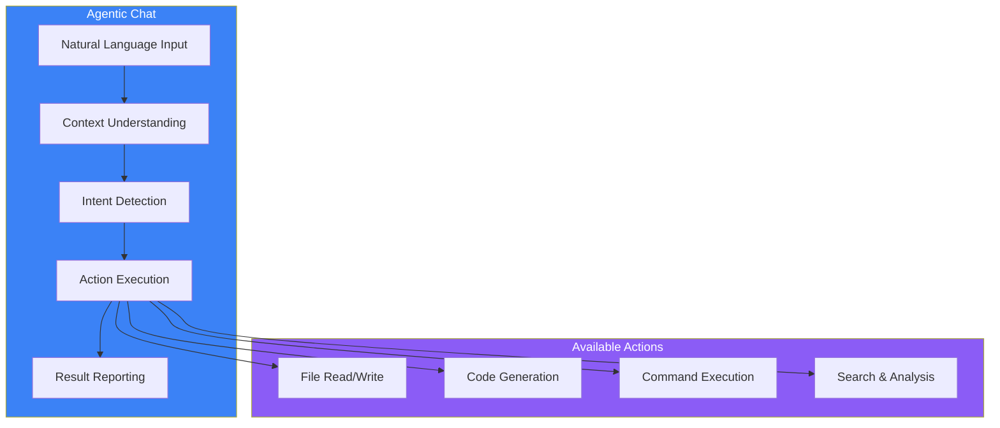
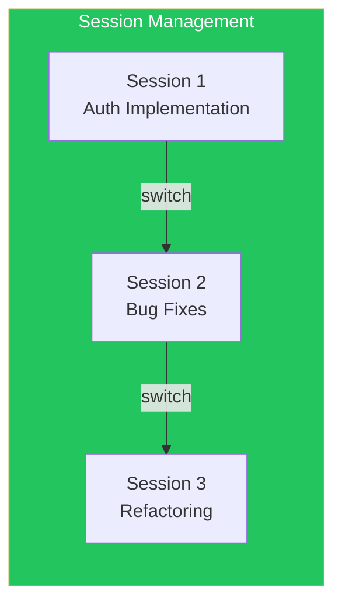
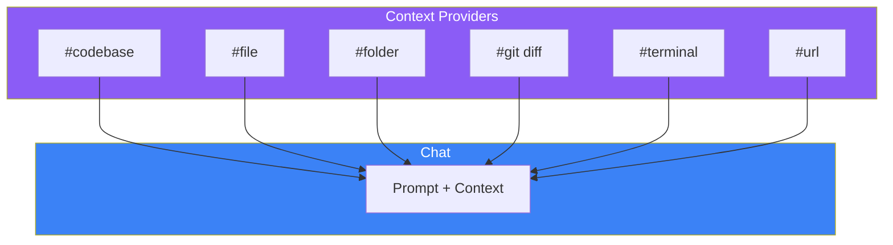
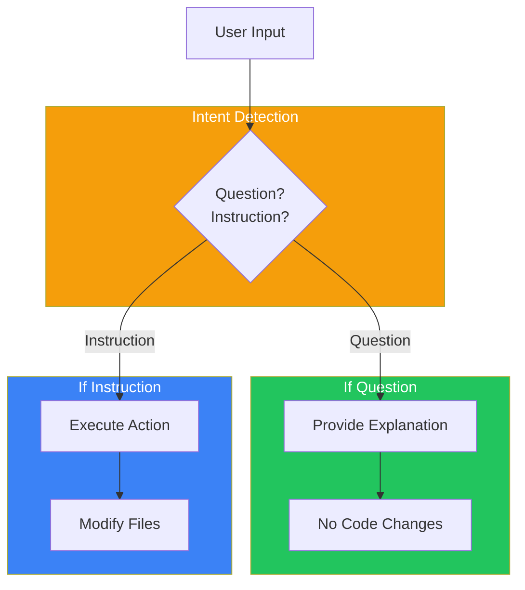
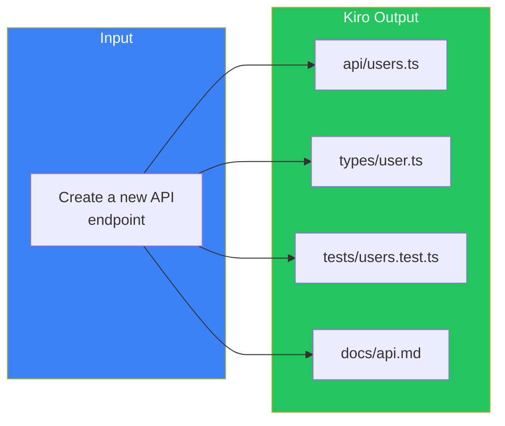

# Day 3: Agentic Chat

## What You'll Learn Today

- Basic operations of agentic chat
- Using context providers effectively
- Intent detection and automatic decisions
- Writing effective prompts

---

## What is Agentic Chat?

Kiro's agentic chat is more than just an AI chat. It's a conversational interface that understands your entire project's context and can **autonomously** perform file operations and command execution.



### Difference from Traditional AI Chat

| Feature | Traditional AI Chat | Kiro Agentic Chat |
|---------|-------------------|-------------------|
| **Context** | Conversation history only | Entire project + Steering |
| **File Operations** | Manual copy-paste | Automatic read/write |
| **Command Execution** | Suggestions only | Executes with permission |
| **Multi-file** | Difficult | Edit multiple files simultaneously |

---

## Basic Chat Operations

### Opening the Chat Panel

Open via the "Chat" tab in the Kiro panel, or use shortcuts:

- **Mac**: `Cmd + Shift + I`
- **Windows/Linux**: `Ctrl + Shift + I`

### Basic Conversation

```
You: Explain the structure of this project

Kiro: This project is a web application using Next.js 15.

      Main directory structure:
      - src/app/ - Pages via App Router
      - src/components/ - Reusable components
      - src/lib/ - Utility functions
      ...
```

### Session Management

Manage multiple conversation threads:



- **New Session**: Start a new topic
- **Switch Session**: Return to past conversations
- **Search History**: Find code changes and command outputs

---

## Context Providers

Context providers add information to your chat. Type `#` followed by the provider name.



### Key Context Providers

| Provider | Description | Example |
|----------|-------------|---------|
| `#codebase` | Auto-search relevant files | `#codebase explain how auth works` |
| `#file` | Reference specific file | `#file:src/auth.ts review this code` |
| `#folder` | Include folder contents | `#folder:src/components list UI components` |
| `#git diff` | Current change diff | `#git diff review these changes` |
| `#terminal` | Terminal history/output | `#terminal analyze this error` |
| `#url` | Web documentation | `#url:https://react.dev summarize new React features` |
| `#code` | Code snippet | Reference selected code |
| `#repository` | Project structure | `#repository analyze the architecture` |
| `#current` | Active editor file | `#current find issues in this file` |
| `#steering` | Steering files | `#steering:api-rules check API rules` |
| `#docs` | Documentation content | `#docs reference project docs` |
| `#spec` | Requirements/design files | `#spec:auth-feature check auth requirements` |
| `#mcp` | MCP tools | `#mcp show available tools` |

### Combining Providers

Combine multiple providers for more accurate responses:

```
#codebase #file:src/auth.ts

Explain how the authentication system works with the database
```

In this example:
1. `#codebase` auto-searches related files
2. `#file:src/auth.ts` explicitly references the main auth file
3. Both contexts are used to generate the answer

---

## Intent Detection

Kiro automatically determines the **intent** of your message.



### Questions (Seeking Explanation)

```
"How does this function work?"
"Explain the authentication flow"
"Why is this pattern used?"
```

→ Kiro provides **explanation only**, no code changes.

### Instructions (Requesting Action)

```
"Create a login component"
"Fix this bug"
"Add tests"
```

→ Kiro **creates/edits files**.

### Explicit Instructions

To clarify intent, use action verbs:

| Intent | Verbs to Use |
|--------|--------------|
| Create | create, add, implement |
| Fix | fix, correct, repair |
| Modify | update, modify, change |
| Delete | remove, delete |
| Explain | explain, describe, how does |

---

## Multi-File Editing

One of Kiro's powerful features is simultaneous multi-file editing.



### Example: Adding a New Feature

```
Add a user profile editing feature.
Include:
- Component
- API endpoint
- Type definitions
- Tests
```

Kiro creates all necessary files while maintaining consistency with existing code.

---

## Writing Effective Prompts

### 1. Be Specific

```
❌ "Add authentication"

✓ "Add user authentication using JWT.
    - /api/auth/login endpoint
    - /api/auth/logout endpoint
    - Tokens expire after 24 hours"
```

### 2. Provide Context

```
❌ "Fix this error"

✓ "#terminal #file:src/api.ts
    Fix this error.
    TypeError is showing in the terminal."
```

### 3. State Constraints

```
❌ "Create a form"

✓ "Create a user registration form.
    Constraints:
    - Use React Hook Form
    - Validate with Zod
    - Reuse existing UI components"
```

### 4. Request Incrementally

Break complex tasks into steps:

```
Step 1: "First, create the user model type definitions"
Step 2: "Next, create CRUD API using that model"
Step 3: "Finally, add tests for the API"
```

---

## Practical Examples

### Example 1: Code Review

```
#git diff

Review these changes.
Check specifically for:
- Security issues
- Performance impact
- Consistency with existing code
```

### Example 2: Bug Fix

```
#terminal #codebase

Getting "Cannot read property 'map' of undefined" error.
Identify the cause and fix it.
```

### Example 3: Refactoring

```
#file:src/components/Dashboard.tsx

Refactor this component:
1. Split into smaller components (it's too large)
2. Extract logic into custom hooks
3. Maintain existing functionality
```

### Example 4: Documentation

```
#folder:src/api

Create a README for this API directory.
Include descriptions and usage examples for each endpoint.
```

---

## Chat Best Practices

### Do (Recommended)

1. **Use context providers**
   - Explicitly reference relevant files
   - Include terminal when there's error info

2. **Describe specific requirements**
   - Clear about what you want to achieve
   - Note any technical constraints

3. **Progress incrementally**
   - Break large tasks into parts
   - Verify results at each step

### Don't (Avoid)

1. **Vague instructions**
   - "Make it look nice"
   - "Something's wrong, fix it"

2. **Questions without context**
   - Asking about errors without referencing files

3. **Requesting massive changes at once**
   - Makes review difficult

---

## Summary

| Concept | Description |
|---------|-------------|
| **Agentic Chat** | Conversational interface understanding entire project |
| **Context Providers** | Add information with `#` |
| **Intent Detection** | Auto-distinguish questions from instructions |
| **Multi-File Editing** | Change multiple files simultaneously |

### Key Points

1. **Enrich context with # providers**
2. **Describe specific requirements and constraints**
3. **Clearly distinguish questions from instructions**
4. **Handle complex tasks incrementally**

---

## Exercises

### Exercise 1: Basics

Use the `#codebase` provider to ask about your project's main features. Observe which files Kiro references.

### Exercise 2: Applied

Create prompts for these scenarios:
1. Investigate why tests are failing
2. Add a new utility function
3. Improve existing code performance

### Challenge

Combine multiple context providers to:
1. Check recent changes with `#git diff`
2. Check test results with `#terminal`
3. Identify a bug related to the changes and request a fix

---

## References

- [Kiro Agentic Chat Documentation](https://kiro.dev/docs/chat/)
- [Context Providers Reference](https://kiro.dev/docs/chat/context-providers/)
- [Best Practices for AI-Assisted Coding](https://kiro.dev/blog/kiro-and-the-future-of-software-development/)

---

**Coming Up**: In Day 4, we'll learn "Introduction to Specs" and understand the fundamentals of spec-driven development, Kiro's core feature.
