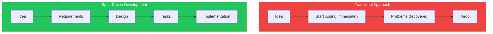
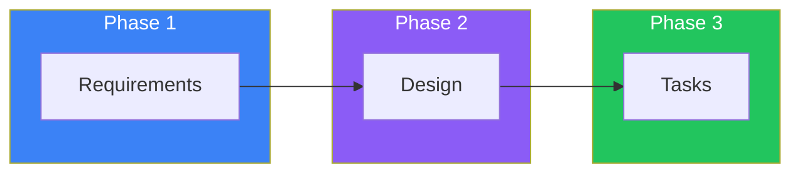
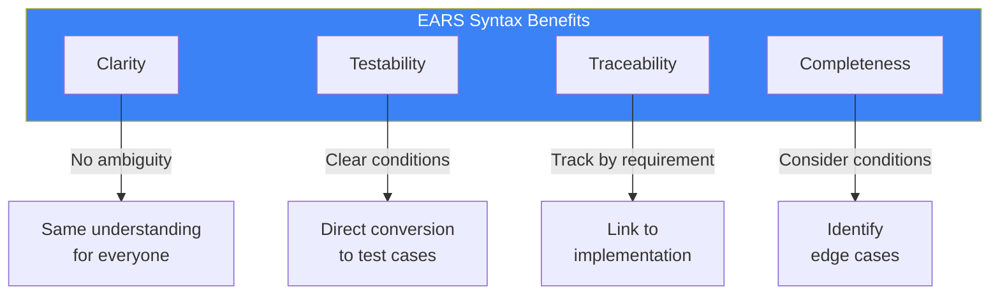

# Day 4: Introduction to Specs

## What You'll Learn Today

- What spec-driven development is
- The three phases of Specs
- Requirements definition using EARS syntax
- Creating your first Spec

---

## What is Spec-Driven Development?

Spec-driven development is an approach that **clarifies requirements, design, and tasks before writing code**. This is Kiro's core feature and solves the "Vibe Coding" problem.



### Why Spec-Driven Development?

| Traditional Problem | Spec-Driven Solution |
|--------------------|---------------------|
| Developing with vague requirements | Document clear requirements |
| Implementing without design | Design architecture upfront |
| Invisible progress | Track progress by task |
| Writing tests after | Derive tests from requirements |
| No documentation | Requirements and design auto-documented |

---

## The Three Phases of Specs

Kiro Specs consists of three phases.



### Phase 1: Requirements

Define user stories and acceptance criteria. Use **EARS syntax** to write unambiguous requirements.

```
.kiro/specs/user-auth/
└── requirements.md
```

### Phase 2: Design

Document technical architecture and implementation approach. Describe component interactions and data flows.

```
.kiro/specs/user-auth/
├── requirements.md
└── design.md
```

### Phase 3: Tasks

Break down into concrete implementation tasks. Each task is trackable with explicit dependencies.

```
.kiro/specs/user-auth/
├── requirements.md
├── design.md
└── tasks.md
```

---

## EARS Syntax

EARS (Easy Approach to Requirements Syntax) is a syntax for writing clear requirements.

### Basic Syntax

```
WHEN [condition/event] THE SYSTEM SHALL [expected behavior]
```

### Examples

```markdown
## User Story: Login Feature

### Requirements

1. WHEN a user enters valid credentials
   THE SYSTEM SHALL authenticate the user and redirect to dashboard

2. WHEN a user enters invalid credentials
   THE SYSTEM SHALL display an error message and remain on login page

3. WHEN a user is already logged in
   THE SYSTEM SHALL redirect to dashboard without re-authentication

4. WHEN a login session exceeds 24 hours
   THE SYSTEM SHALL automatically log out the user
```

### Benefits of EARS Syntax



| Benefit | Description |
|---------|-------------|
| **Clarity** | Requirements are unambiguous, same understanding for all readers |
| **Testability** | Each requirement directly converts to test cases |
| **Traceability** | Individual requirements can be tracked to implementation |
| **Completeness** | Thinking about WHEN conditions reveals edge cases |

---

## Creating Your First Spec

### Step 1: Start a Spec

Click the "+" button in the "Specs" section of the Kiro panel, or select "Spec" from chat.

### Step 2: Describe the Feature

Describe the feature you want to build in natural language:

```
I want to create a user registration feature.
- Register with email and password
- Password must be 8+ characters
- Send confirmation email after registration
- Activate by clicking link in email
```

### Step 3: Generate Requirements

Kiro converts your description into EARS syntax requirements:

```markdown
# User Registration Feature

## User Stories

### US-1: Basic Registration
As a new user, I want to register with email and password
so that I can create an account.

### US-2: Email Verification
As a registered user, I want to verify my email
so that my account becomes active.

## Requirements

### Registration Process

1. WHEN a user submits registration form with valid email and password
   THE SYSTEM SHALL create a new user account with "pending" status

2. WHEN a user submits password less than 8 characters
   THE SYSTEM SHALL display validation error "Password must be at least 8 characters"

3. WHEN a user submits email already registered
   THE SYSTEM SHALL display error "Email already in use"

### Email Verification

4. WHEN a new account is created
   THE SYSTEM SHALL send verification email within 5 seconds

5. WHEN user clicks verification link
   THE SYSTEM SHALL activate the account and redirect to login

6. WHEN verification link is older than 24 hours
   THE SYSTEM SHALL display "Link expired" and offer to resend
```

### Step 4: Review and Adjust

Review generated requirements and modify as needed. Add missing requirements:

```
Additional requirements:
- Password must contain uppercase, lowercase, and number
- Confirmation email can be resent up to 3 times per hour
```

---

## Spec File Structure

Specs are saved in the `.kiro/specs/` folder.

```
.kiro/
└── specs/
    └── user-registration/
        ├── requirements.md    # Requirements
        ├── design.md          # Design (Day 5)
        └── tasks.md           # Tasks (Day 5)
```

### Example requirements.md

```markdown
---
feature: User Registration
version: 1.0
status: draft
---

# User Registration

## Overview
Allow new users to create accounts using email and password,
with email verification for account activation.

## User Stories

### US-1: Basic Registration
**As a** new visitor
**I want to** register with my email and password
**So that** I can create an account to use the application

**Acceptance Criteria:**
- [ ] Registration form with email and password fields
- [ ] Password validation (minimum 8 characters)
- [ ] Duplicate email check
- [ ] Success message after registration

### US-2: Email Verification
**As a** registered user
**I want to** verify my email address
**So that** my account becomes active

**Acceptance Criteria:**
- [ ] Verification email sent automatically
- [ ] Clickable verification link
- [ ] Account activation upon link click
- [ ] Link expiration after 24 hours

## Functional Requirements

### FR-1: Registration Form Validation
WHEN a user submits the registration form
THE SYSTEM SHALL validate:
- Email format is valid
- Password is at least 8 characters
- Password contains uppercase, lowercase, and number

### FR-2: Account Creation
WHEN validation passes
THE SYSTEM SHALL:
- Create user record with "pending" status
- Hash password using bcrypt
- Generate unique verification token

### FR-3: Verification Email
WHEN a new account is created
THE SYSTEM SHALL send verification email containing:
- Welcome message
- Verification link with token
- Link expiration notice (24 hours)

## Non-Functional Requirements

### NFR-1: Performance
- Registration should complete within 3 seconds
- Email should be sent within 5 seconds of registration

### NFR-2: Security
- Passwords must be hashed (never stored in plain text)
- Verification tokens must be cryptographically random
- Rate limit: 3 verification emails per hour
```

---

## Spec Status Management

Specs have the following statuses:


| Status | Description |
|--------|-------------|
| **draft** | Being created, not finalized |
| **review** | Awaiting review |
| **approved** | Approved, ready for implementation |
| **implementing** | Currently being implemented |
| **completed** | Done |

---

## Requirements Definition Best Practices

### 1. Write from User Perspective

```
❌ "Save user to database"

✓ "WHEN a user completes registration
    THE SYSTEM SHALL save user information securely"
```

### 2. Make It Measurable

```
❌ "Password should be sufficiently long"

✓ "WHEN password is less than 8 characters
    THE SYSTEM SHALL reject and display error"
```

### 3. Consider Edge Cases

```markdown
## Happy Path
WHEN user enters valid data
THE SYSTEM SHALL create account

## Edge Cases
WHEN user enters email with + symbol (e.g., user+test@example.com)
THE SYSTEM SHALL accept as valid email

WHEN user's session times out during registration
THE SYSTEM SHALL preserve form data and allow retry

WHEN email service is unavailable
THE SYSTEM SHALL queue email and retry within 5 minutes
```

### 4. Include Non-Functional Requirements

```markdown
## Non-Functional Requirements

### Performance
- Registration: < 3 seconds response time
- Email delivery: < 5 seconds after registration

### Security
- All passwords hashed with bcrypt (cost factor 12)
- HTTPS required for all endpoints
- Rate limiting: 5 registration attempts per IP per hour

### Accessibility
- Form must be keyboard navigable
- Error messages announced by screen readers
```

---

## Summary

| Concept | Description |
|---------|-------------|
| **Spec-Driven Development** | Define requirements, design, tasks before code |
| **EARS Syntax** | Write requirements with WHEN...THE SYSTEM SHALL |
| **Three Phases** | Requirements → Design → Tasks |
| **Traceability** | Track from requirements to tests |

### Key Points

1. **A tool for "think before you build"**
2. **EARS syntax eliminates ambiguity**
3. **User stories clarify purpose**
4. **Don't forget edge cases and non-functional requirements**

---

## Exercises

### Exercise 1: Basics

Write user stories for the following feature:
- User uploads a profile picture

### Exercise 2: Applied

Write at least 5 EARS syntax requirements for:
- Password reset feature

Include requirements for:
- Sending reset email
- Token expiration
- New password validation
- Error cases

### Challenge

Use Kiro to create a Spec for:
- Adding a product to cart feature

Review generated requirements and add any missing edge cases.

---

## References

- [Kiro Specs Documentation](https://kiro.dev/docs/specs/)
- [Specs Concepts](https://kiro.dev/docs/specs/concepts/)
- [EARS Requirements Syntax](https://alistairmavin.com/ears/)

---

**Coming Up**: In Day 5, we'll learn "Specs in Practice." We'll master creating design documents in the Design phase and task management in the Tasks phase.
