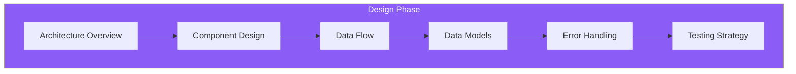
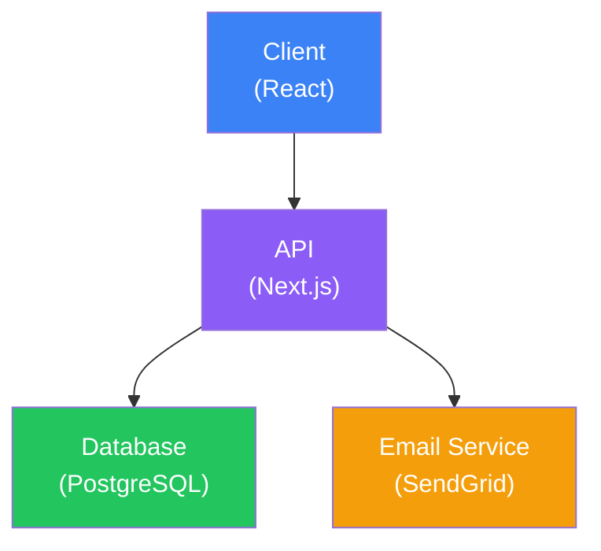
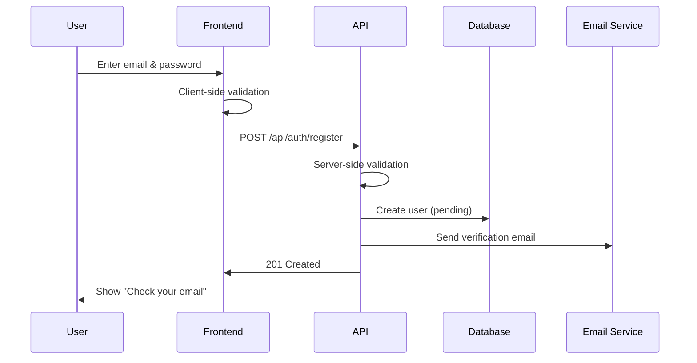
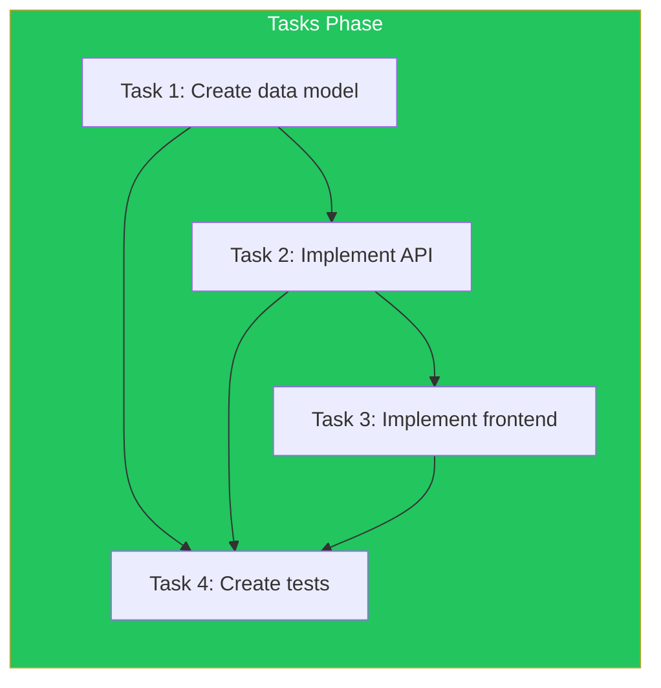
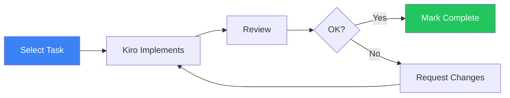
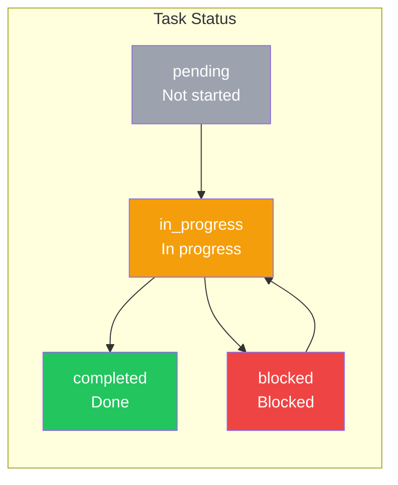
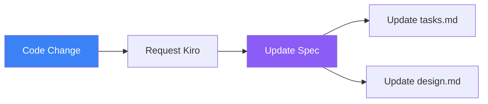

# Day 5: Specs in Practice

## What You'll Learn Today

- Creating design documents in the Design phase
- Task management in the Tasks phase
- Executing tasks and tracking progress
- Updating and syncing Specs

---

## The Design Phase

After defining "what to build" in the Requirements phase, the Design phase addresses "how to build it."



### Structure of design.md

```markdown
# User Registration - Design

## Architecture Overview



## Component Design

### Frontend Components
- `RegistrationForm`: Main form component
- `PasswordStrengthIndicator`: Password strength display
- `EmailVerificationPage`: Email confirmation page

### Backend Endpoints
- `POST /api/auth/register`: User registration
- `GET /api/auth/verify`: Email verification
- `POST /api/auth/resend-verification`: Resend confirmation email

## Data Flow

### Registration Flow


## Data Models

### User Model
```typescript
interface User {
  id: string;
  email: string;
  passwordHash: string;
  status: 'pending' | 'active' | 'suspended';
  verificationToken: string | null;
  verificationExpiry: Date | null;
  createdAt: Date;
  updatedAt: Date;
}
```

## Error Handling

| Error Case | HTTP Status | Response |
|------------|-------------|----------|
| Invalid email format | 400 | `{ error: "INVALID_EMAIL" }` |
| Password too weak | 400 | `{ error: "WEAK_PASSWORD" }` |
| Email already exists | 409 | `{ error: "EMAIL_EXISTS" }` |
| Server error | 500 | `{ error: "INTERNAL_ERROR" }` |

## Testing Strategy

### Unit Tests
- Form validation logic
- Password strength calculation
- Token generation

### Integration Tests
- Registration API endpoint
- Email verification flow
- Database operations

### E2E Tests
- Complete registration flow
- Error handling scenarios
```

---

## The Tasks Phase

Once Design is complete, break it down into concrete implementation tasks.



### Structure of tasks.md

```markdown
# User Registration - Tasks

## Task Overview

| ID | Task | Status | Dependencies |
|----|------|--------|--------------|
| T1 | Database schema | pending | - |
| T2 | User model | pending | T1 |
| T3 | Registration API | pending | T2 |
| T4 | Email service integration | pending | T2 |
| T5 | Registration form | pending | T3 |
| T6 | Verification page | pending | T3, T4 |
| T7 | Unit tests | pending | T2, T3 |
| T8 | E2E tests | pending | T5, T6 |

## Detailed Tasks

### T1: Database Schema

**Description**: Create database schema for users table

**Files to create/modify**:
- `prisma/schema.prisma`

**Subtasks**:
- [ ] Define User model
- [ ] Add indexes for email
- [ ] Run migration

**Acceptance criteria**:
- Schema matches design spec
- Migration runs successfully

---

### T2: User Model

**Description**: Implement User model with validation

**Files to create/modify**:
- `src/models/user.ts`
- `src/types/user.ts`

**Subtasks**:
- [ ] Create TypeScript interface
- [ ] Implement validation functions
- [ ] Add password hashing utility

**Acceptance criteria**:
- TypeScript types match schema
- Validation covers all rules

---

### T3: Registration API

**Description**: Implement registration endpoint

**Files to create/modify**:
- `src/app/api/auth/register/route.ts`

**Subtasks**:
- [ ] Implement POST handler
- [ ] Add input validation
- [ ] Handle duplicate email
- [ ] Return appropriate responses

**Acceptance criteria**:
- All error cases handled
- Matches API design spec

---

### T4: Email Service Integration

**Description**: Integrate SendGrid for verification emails

**Files to create/modify**:
- `src/services/email.ts`
- `src/templates/verification-email.tsx`

**Subtasks**:
- [ ] Set up SendGrid client
- [ ] Create email template
- [ ] Implement send function

**Acceptance criteria**:
- Email sent within 5 seconds
- Template includes all required info

---

### T5: Registration Form

**Description**: Build registration form component

**Files to create/modify**:
- `src/components/auth/RegistrationForm.tsx`
- `src/components/auth/PasswordStrengthIndicator.tsx`

**Subtasks**:
- [ ] Create form with React Hook Form
- [ ] Add Zod validation
- [ ] Implement password strength indicator
- [ ] Handle API errors

**Acceptance criteria**:
- Form matches design mockup
- All validation rules enforced

---

### T6: Verification Page

**Description**: Build email verification page

**Files to create/modify**:
- `src/app/auth/verify/page.tsx`
- `src/app/api/auth/verify/route.ts`

**Subtasks**:
- [ ] Create verification page
- [ ] Implement verify API
- [ ] Handle expired tokens
- [ ] Add resend functionality

**Acceptance criteria**:
- Verification flow complete
- Expired links handled gracefully
```

---

## Executing Tasks

Select and execute tasks from the Kiro panel.

### Task Execution Flow



### Execution Example

1. **Select task**: Click "T3: Registration API"
2. **Kiro implements**: Generates code based on design
3. **Review**: Check generated code
4. **Modify or approve**: Request changes if needed

```
You: Please implement T3 Registration API

Kiro: Implementing T3: Registration API.

      Created/updated the following files based on design spec:

      Created: src/app/api/auth/register/route.ts
      - POST handler implemented
      - Input validation (Zod)
      - Duplicate email check
      - Password hashing
      - Appropriate HTTP status returns

      Implementation details:
      ...
```

---

## Progress Tracking

Task status updates in real-time.



### Progress Visualization

```
User Registration Tasks
━━━━━━━━━━━━━━━━━━━━━━━━━━━━━━━━━━━━━━━━━━━
[████████████████░░░░░░░░░░░░░░░░] 50%

✓ T1: Database schema         [completed]
✓ T2: User model              [completed]
● T3: Registration API        [in_progress]
○ T4: Email service           [pending]
○ T5: Registration form       [pending]
○ T6: Verification page       [pending]
○ T7: Unit tests              [pending]
○ T8: E2E tests               [pending]
```

---

## Updating and Syncing Specs

Requirements or design may change during implementation. Kiro syncs these changes.

### Updating Spec from Code



```
You: I changed minimum password length to 10 characters.
     Please update the Spec.

Kiro: Updated the following Spec files:

      requirements.md:
      - FR-1: Changed password requirement to 10+ characters

      design.md:
      - Data Models: Updated validation rule comment

      tasks.md:
      - T5: Updated acceptance criteria
```

### Fixing Code from Spec

```
You: I added a rate limiting requirement to requirements.md.
     Please update the code.

Kiro: Reviewed new requirement.

      Added requirement:
      "WHEN more than 5 registration attempts from same IP within 1 hour
       THE SYSTEM SHALL block further attempts"

      Updated the following files:
      - src/app/api/auth/register/route.ts
        - Added rate limiting middleware
        - Added error response

      Also updated tasks.md:
      - Added rate limiting implementation to T3 subtasks
```

---

## Practical Example: Complete Spec Creation Flow

### Step 1: Describe the Feature

```
I want to create a product search feature.
- Search products by keyword
- Filter by category
- Filter by price range
- Paginate results
```

### Step 2: Generate Requirements

Review and adjust requirements generated by Kiro.

### Step 3: Generate Design

```
Requirements are finalized. Proceed to design.
Include:
- Search API design
- Frontend component design
- Data models
```

### Step 4: Generate Tasks

```
Design is finalized. Break down into tasks.
Include dependencies.
```

### Step 5: Start Implementation

```
Start implementing from T1 in order.
I'll review after each task completes.
```

---

## Best Practices

### 1. Break into Small Tasks

```
❌ Task: Implement entire auth system

✓ Task 1: Create user model
✓ Task 2: Implement registration API
✓ Task 3: Implement login API
✓ Task 4: Implement registration form
```

### 2. Make Dependencies Explicit

```markdown
| Task | Dependencies |
|------|--------------|
| T3: Registration API | T1: Schema, T2: Model |
| T5: Registration Form | T3: API |
```

### 3. Be Specific with Acceptance Criteria

```markdown
**Acceptance criteria**:
- [ ] All 5 unit tests pass
- [ ] No TypeScript errors
- [ ] API response time < 200ms
- [ ] Code coverage > 80%
```

### 4. Sync Regularly

As implementation progresses, check consistency with Spec:

```
Check for differences between current code and Spec.
Let me know if there are any inconsistencies.
```

---

## Summary

| Phase | Content | Artifact |
|-------|---------|----------|
| **Requirements** | What to build | requirements.md |
| **Design** | How to build | design.md |
| **Tasks** | What to do | tasks.md |

### Key Points

1. **Design is the blueprint for implementation**
2. **Tasks should be small with explicit dependencies**
3. **Track progress in real-time**
4. **Keep Spec and code always in sync**

---

## Exercises

### Exercise 1: Basics

Create a Design document for the User Registration Requirements from Day 4. Include:
- Architecture diagram (Mermaid)
- Data models
- Error handling table

### Exercise 2: Applied

Break down the following feature into tasks:
- Blog post creation feature

Requirements:
- Enter title and body
- Save as draft or publish
- Upload images
- Set tags

### Challenge

Use Kiro to practice this complete flow:
1. Create Requirements for "Favorites feature"
2. Generate Design
3. Generate Tasks
4. Implement the first task

After implementation, verify that Spec is correctly updated.

---

## References

- [Kiro Specs Documentation](https://kiro.dev/docs/specs/)
- [Specs Best Practices](https://kiro.dev/docs/specs/best-practices/)
- [Working with Tasks](https://kiro.dev/docs/specs/tasks/)

---

**Coming Up**: In Day 6, we'll learn "Introduction to Hooks." Understand the basics of automation triggered by events like file changes.
