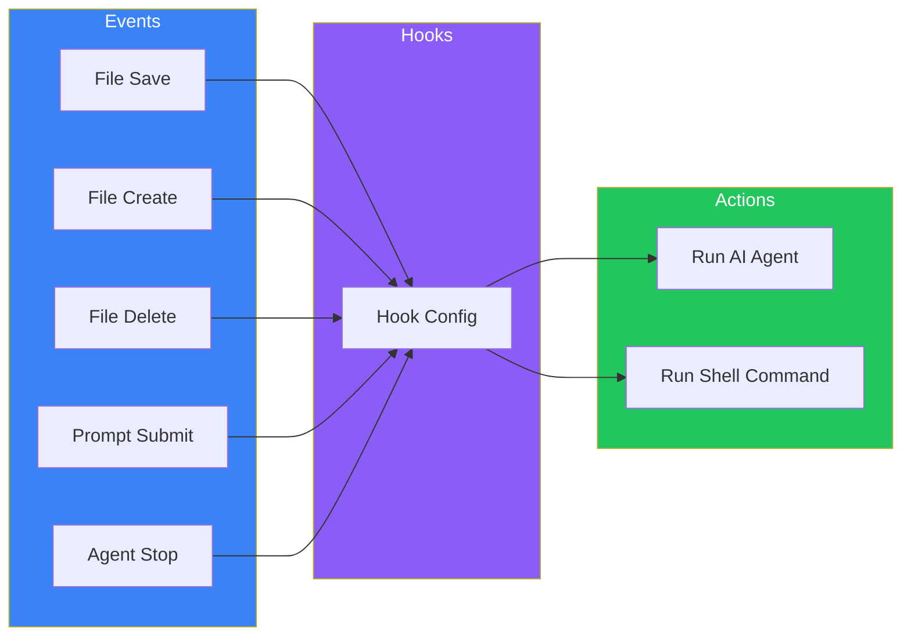
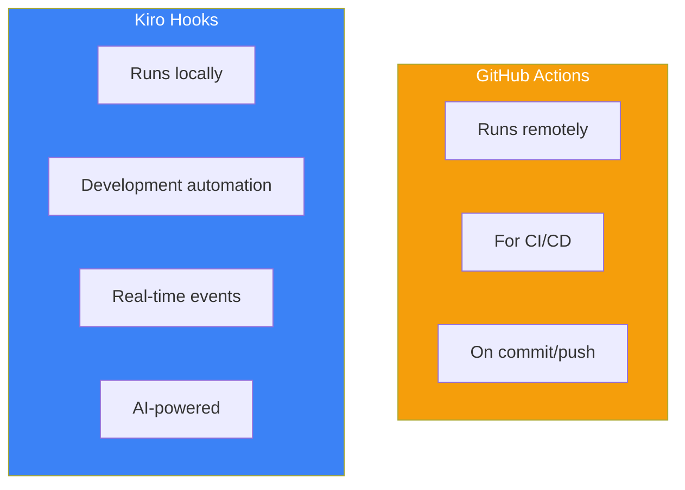

# Day 6: Introduction to Hooks

## What You'll Learn Today

- What Hooks are and why they're useful
- The six trigger types
- Creating basic Hooks
- Specifying file patterns

---

## What Are Hooks?

Hooks are Kiro's event-driven automation feature. They automatically execute AI agents or shell commands in response to events like file saves, creates, and deletes.



### Benefits of Hooks

| Traditional Method | Using Hooks |
|-------------------|-------------|
| Manual format after save | Auto-format on save |
| Manually create test files | Auto-generate on component create |
| Run lint manually each time | Auto-lint on save |
| Manually update docs after code change | Auto-update on change |

### Comparison with GitHub Actions



---

## Trigger Types

Kiro Hooks has six trigger types.

### 1. onSave (On File Save)

Triggered when a file is saved.

```yaml
trigger: onSave
pattern: "**/*.tsx"
```

**Use cases**:
- Auto-formatting
- Linting
- Updating related files
- Running tests

### 2. onCreate (On File Create)

Triggered when a new file is created.

```yaml
trigger: onCreate
pattern: "src/components/**/*.tsx"
```

**Use cases**:
- Auto-generating test files
- Adding license headers
- Inserting boilerplate

### 3. onDelete (On File Delete)

Triggered when a file is deleted.

```yaml
trigger: onDelete
pattern: "src/**/*.ts"
```

**Use cases**:
- Cleaning up related files
- Updating import references
- Updating documentation

### 4. onPromptSubmit (On Prompt Submit)

Triggered when a prompt is submitted in chat.

```yaml
trigger: onPromptSubmit
```

**Use cases**:
- Adding context
- Validating prompts
- Audit logging

### 5. onAgentStop (On Agent Complete)

Triggered when AI agent processing completes.

```yaml
trigger: onAgentStop
```

**Use cases**:
- Code compilation/testing
- Applying formatting
- Review and feedback

### 6. manual (Manual Trigger)

Only triggered when explicitly executed.

```yaml
trigger: manual
```

**Use cases**:
- Code review
- Documentation generation
- Security scanning

---

## Creating Hooks

### Method 1: From Kiro Panel

1. Click "+" in the "Hooks" section of Kiro panel
2. Describe the Hook in natural language
3. Press Enter or click "Submit"

```
When a React component is saved, create a corresponding test file
if one doesn't exist.
```

### Method 2: From Command Palette

1. `Cmd + Shift + P` (Mac) or `Ctrl + Shift + P` (Windows/Linux)
2. Search for "Kiro: Open Kiro Hook UI"
3. Follow the instructions

### Hook Configuration Files

Hooks are saved in the `.kiro/hooks/` folder:

```
.kiro/
└── hooks/
    ├── auto-test.yaml
    ├── format-on-save.yaml
    └── update-docs.yaml
```

---

## Basic Hook Configuration

### YAML Format

```yaml
# .kiro/hooks/auto-test.yaml
name: Auto Generate Test
description: Automatically generate test files for new components
trigger: onCreate
pattern: "src/components/**/*.tsx"
action: agent
instructions: |
  A new React component has been created.
  1. Check if a corresponding test file exists in __tests__/
  2. If not, create one with basic render tests
  3. Include tests for any props defined in the component
  4. Run the test to verify it passes
```

### Configuration Fields

| Field | Required | Description |
|-------|----------|-------------|
| `name` | Yes | Hook name |
| `description` | No | Hook description |
| `trigger` | Yes | Trigger type |
| `pattern` | No* | File pattern (for file events) |
| `action` | Yes | `agent` or `shell` |
| `instructions` | Yes* | Instructions for AI (when action: agent) |
| `command` | Yes* | Command to run (when action: shell) |

---

## File Patterns

For file-based triggers, use glob patterns to specify target files.

### Basic Patterns

```yaml
# All TypeScript files
pattern: "**/*.ts"

# Components in src folder
pattern: "src/components/**/*.tsx"

# Files in specific folder
pattern: "src/api/*.ts"

# Exclude test files (if supported)
pattern: "src/**/*.ts"
exclude: "**/*.test.ts"
```

### Pattern Examples

| Pattern | Matches |
|---------|---------|
| `*.ts` | ts files in root |
| `**/*.ts` | All ts files |
| `src/*.ts` | ts files directly in src |
| `src/**/*.ts` | All ts files under src |
| `**/*.{ts,tsx}` | ts and tsx files |
| `!**/*.test.ts` | Exclude test files |

---

## Action Types

### Agent Action

Have the AI agent execute instructions.

```yaml
action: agent
instructions: |
  When a React component is saved:
  1. Check if the component has proper TypeScript types
  2. Verify all props are documented
  3. Suggest improvements if needed
```

**Characteristics**:
- Leverages AI understanding
- Handles complex tasks
- Context-aware decisions

### Shell Action

Execute shell commands.

```yaml
action: shell
command: "npm run lint -- ${file}"
```

**Characteristics**:
- Fast execution
- No credit consumption
- For simple tasks

### Environment Variables

Variables available in Shell Actions:

| Variable | Description |
|----------|-------------|
| `${file}` | Target file path |
| `${USER_PROMPT}` | User's prompt (on onPromptSubmit) |
| `${workspaceFolder}` | Workspace root path |

---

## Practical Examples

### Example 1: Auto-Format on Save

```yaml
# .kiro/hooks/format-on-save.yaml
name: Format on Save
description: Run Prettier on saved files
trigger: onSave
pattern: "**/*.{ts,tsx,js,jsx}"
action: shell
command: "npx prettier --write ${file}"
```

### Example 2: Generate Test on Component Create

```yaml
# .kiro/hooks/auto-test.yaml
name: Auto Generate Test
description: Generate test file for new components
trigger: onCreate
pattern: "src/components/**/*.tsx"
action: agent
instructions: |
  A new React component has been created at ${file}.

  1. Analyze the component's props and functionality
  2. Create a test file at the corresponding __tests__ location
  3. Include:
     - Basic render test
     - Props validation tests
     - Event handler tests if applicable
  4. Use React Testing Library patterns
  5. Run the test to verify it works
```

### Example 3: Cleanup on Delete

```yaml
# .kiro/hooks/cleanup-on-delete.yaml
name: Cleanup Related Files
description: Remove related files when a component is deleted
trigger: onDelete
pattern: "src/components/**/*.tsx"
action: agent
instructions: |
  A component file has been deleted: ${file}

  1. Check for related test files
  2. Check for related style files
  3. Check for related story files (Storybook)
  4. Remove any related files that exist
  5. Update any imports that reference the deleted file
```

### Example 4: Add Context on Prompt Submit

```yaml
# .kiro/hooks/add-context.yaml
name: Add Project Context
description: Add relevant context before agent processes prompt
trigger: onPromptSubmit
action: agent
instructions: |
  Before processing the user's request, consider:

  1. Current project conventions (check .kiro/steering/)
  2. Related files that might be affected
  3. Any recent changes in git diff

  Then proceed with the user's request while
  following project guidelines.
```

---

## Managing Hooks

### Enable/Disable

Enable or disable individual Hooks from the Kiro panel.

```
Hooks
├── ✓ Format on Save          [enabled]
├── ✓ Auto Generate Test      [enabled]
└── ○ Cleanup on Delete       [disabled]
```

### Edit and Delete

1. Click the target Hook in Kiro panel
2. Edit or delete in the edit screen

### Check Execution Logs

View Hook execution results in the Output panel:

1. View > Output (or `Cmd/Ctrl + Shift + U`)
2. Select "Kiro - Hooks" from dropdown

---

## Summary

| Concept | Description |
|---------|-------------|
| **Hooks** | Event-driven automation feature |
| **Triggers** | onSave, onCreate, onDelete, onPromptSubmit, onAgentStop, manual |
| **Patterns** | Specify files with glob patterns |
| **Actions** | agent (AI execution) or shell (command execution) |

### Key Points

1. **Hooks prevent forgetting tasks**
2. **Real-time automation on file events**
3. **Choose between AI and shell commands appropriately**
4. **Use patterns to limit scope**

---

## Exercises

### Exercise 1: Basics

Create the following Hook:
- Trigger: On file save
- Pattern: All TypeScript files
- Action: Shell command
- Content: Run ESLint

### Exercise 2: Applied

Create the following Hook:
- Trigger: On React component create
- Action: AI agent
- Content:
  - Check TypeScript types for props
  - Suggest additions if types are missing

### Challenge

For team development, create this Hook set:
1. Auto-format on save (Prettier)
2. Update docs on API file change
3. Insert template on test file create

---

## References

- [Kiro Hooks Documentation](https://kiro.dev/docs/hooks/)
- [Hook Types](https://kiro.dev/docs/hooks/types/)
- [Hook Actions](https://kiro.dev/docs/hooks/actions/)

---

**Coming Up**: In Day 7, we'll learn "Hooks in Practice." Master more advanced Hook patterns and team development use cases.
