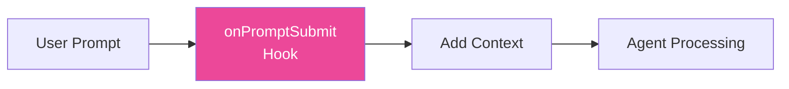
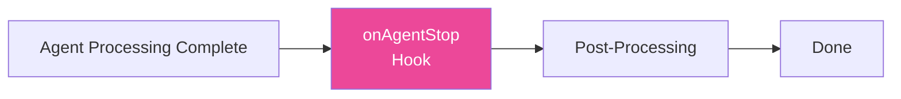
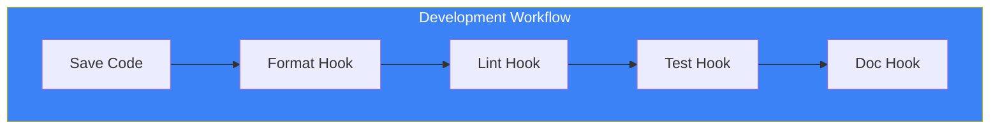

# Day 7: Hooks in Practice

## What You'll Learn Today

- Advanced Hook patterns
- Using context Hooks
- Hook chaining and workflows
- Best practices for team development

---

## Advanced Hook Patterns

Let's build on Day 6 basics with more practical Hook patterns.

### Pattern 1: Conditional Execution

Perform different processing based on file content.

```yaml
# .kiro/hooks/smart-lint.yaml
name: Smart Lint
description: Run appropriate linter based on file type
trigger: onSave
pattern: "src/**/*.{ts,tsx,css,scss}"
action: agent
instructions: |
  A file has been saved: ${file}

  Based on the file extension:
  - For .ts/.tsx files: Run ESLint and fix auto-fixable issues
  - For .css/.scss files: Run Stylelint and fix auto-fixable issues

  Only report errors that couldn't be auto-fixed.
  Keep fixes minimal and non-breaking.
```

### Pattern 2: Multi-File Sync

Automatically sync related files.

```yaml
# .kiro/hooks/sync-types.yaml
name: Sync Type Definitions
description: Keep API types in sync with schema
trigger: onSave
pattern: "prisma/schema.prisma"
action: agent
instructions: |
  The Prisma schema has been updated.

  1. Run `npx prisma generate` to update the client
  2. Check src/types/ for any types that need updating
  3. If API response types don't match the schema, update them
  4. Run TypeScript compiler to verify no type errors

  Report any breaking changes that need manual attention.
```

### Pattern 3: Security Check

Auto-detect security issues in code.

```yaml
# .kiro/hooks/security-check.yaml
name: Security Check
description: Check for common security issues
trigger: onSave
pattern: "src/**/*.{ts,tsx}"
action: agent
instructions: |
  Check the saved file for security issues:

  1. Hard-coded secrets (API keys, passwords, tokens)
  2. SQL injection vulnerabilities
  3. XSS vulnerabilities in React components
  4. Unsafe use of eval() or Function()
  5. Insecure random number generation

  If issues are found:
  - Mark the line with a comment: // SECURITY: [issue description]
  - Provide a suggested fix

  Don't make changes automatically for security issues.
```

---

## Context Hooks

`onPromptSubmit` and `onAgentStop` are powerful Hooks for customizing AI behavior.

### Using onPromptSubmit



#### Example: Enforce Project Rules

```yaml
# .kiro/hooks/enforce-rules.yaml
name: Enforce Project Rules
description: Add project rules to every prompt
trigger: onPromptSubmit
action: agent
instructions: |
  Before processing the user's request, ensure:

  ## Code Style
  - Use functional components with hooks (no class components)
  - All functions must have TypeScript return types
  - Use named exports, not default exports

  ## Naming
  - Components: PascalCase
  - Functions/variables: camelCase
  - Constants: UPPER_SNAKE_CASE

  ## Testing
  - Every new component needs a test file
  - Use React Testing Library, not Enzyme

  Now process the user's request while following these rules.
```

#### Example: Auto-Add Context

```yaml
# .kiro/hooks/auto-context.yaml
name: Auto Add Context
description: Automatically include relevant context
trigger: onPromptSubmit
action: agent
instructions: |
  Analyze the user's prompt and automatically include
  relevant context:

  1. If mentioning a component, include its current implementation
  2. If mentioning an API, include the route handler
  3. If mentioning a type, include the type definition
  4. If mentioning tests, include existing test patterns

  Add this context silently before processing the request.
```

### Using onAgentStop



#### Example: Auto Test Run

```yaml
# .kiro/hooks/auto-test-run.yaml
name: Auto Test Run
description: Run tests after agent makes changes
trigger: onAgentStop
action: shell
command: "npm test -- --changedSince=HEAD --passWithNoTests"
```

#### Example: Code Review

```yaml
# .kiro/hooks/auto-review.yaml
name: Auto Code Review
description: Review changes made by the agent
trigger: onAgentStop
action: agent
instructions: |
  Review the changes just made by the agent:

  1. Check for potential bugs or logic errors
  2. Verify TypeScript types are correct
  3. Ensure error handling is appropriate
  4. Check for performance concerns
  5. Verify the changes match the original request

  If issues are found, list them clearly.
  Don't make automatic changes - just report findings.
```

---

## Hook Chaining

Combine multiple Hooks to build workflows.



### Example: Complete Quality Assurance Workflow

```yaml
# .kiro/hooks/1-format.yaml
name: "1. Format Code"
trigger: onSave
pattern: "src/**/*.{ts,tsx}"
action: shell
command: "npx prettier --write ${file}"
---
# .kiro/hooks/2-lint.yaml
name: "2. Lint Code"
trigger: onSave
pattern: "src/**/*.{ts,tsx}"
action: shell
command: "npx eslint ${file} --fix"
---
# .kiro/hooks/3-typecheck.yaml
name: "3. Type Check"
trigger: onSave
pattern: "src/**/*.{ts,tsx}"
action: shell
command: "npx tsc --noEmit"
```

### Controlling Execution Order

Hooks execute in alphabetical order by name. Use number prefixes to control order:

```
.kiro/hooks/
├── 1-format.yaml      # Runs first
├── 2-lint.yaml        # Second
├── 3-typecheck.yaml   # Third
└── 4-test.yaml        # Last
```

---

## Best Practices for Team Development

### 1. Version Control Hooks

Manage `.kiro/hooks/` folder in git to share with the whole team.

```bash
# Don't include in .gitignore
# Commit .kiro/hooks/
```

### 2. Separate Common and Personal Hooks

```
.kiro/
├── hooks/              # Team common (commit)
│   ├── format.yaml
│   └── lint.yaml
└── hooks-local/        # Personal (.gitignore)
    └── my-custom.yaml
```

### 3. Document Hooks

```yaml
# .kiro/hooks/README.yaml
name: Hooks Documentation
description: |
  ## Available Hooks

  | Hook | Trigger | Description |
  |------|---------|-------------|
  | format | onSave | Auto-format with Prettier |
  | lint | onSave | Run ESLint |
  | test-gen | onCreate | Generate test files |

  ## Setup Requirements
  - Node.js 18+
  - npm packages: prettier, eslint

  ## Customization
  See individual hook files for configuration.
```

### 4. Consider Performance

```yaml
# Good: Limit to specific folder
pattern: "src/components/**/*.tsx"

# Bad: All files
pattern: "**/*"
```

### 5. Error Handling

```yaml
# .kiro/hooks/safe-format.yaml
name: Safe Format
trigger: onSave
pattern: "src/**/*.ts"
action: shell
command: "npx prettier --write ${file} || echo 'Format failed, continuing...'"
```

---

## Practical Example: Project Setup

Create a comprehensive Hook set for new projects.

### Development Efficiency Hooks

```yaml
# .kiro/hooks/dev-format.yaml
name: Dev Format
description: Format code on save
trigger: onSave
pattern: "**/*.{ts,tsx,js,jsx,json,md}"
action: shell
command: "npx prettier --write ${file}"
```

```yaml
# .kiro/hooks/dev-imports.yaml
name: Dev Import Organizer
description: Organize imports on save
trigger: onSave
pattern: "src/**/*.{ts,tsx}"
action: agent
instructions: |
  Organize imports in the saved file:
  1. Group by: external packages, internal modules, relative imports
  2. Sort alphabetically within groups
  3. Remove unused imports
  Keep the changes minimal.
```

### Quality Management Hooks

```yaml
# .kiro/hooks/quality-test-gen.yaml
name: Quality Test Generator
description: Generate tests for new components
trigger: onCreate
pattern: "src/components/**/*.tsx"
action: agent
instructions: |
  A new component was created: ${file}

  Generate a comprehensive test file:
  1. Test rendering without errors
  2. Test all props variations
  3. Test user interactions
  4. Test accessibility basics

  Place in __tests__/ with .test.tsx extension.
```

```yaml
# .kiro/hooks/quality-review.yaml
name: Quality Review
description: Review agent changes
trigger: onAgentStop
action: agent
instructions: |
  Review the recent changes for quality:

  Checklist:
  - [ ] No TypeScript errors
  - [ ] All new functions have return types
  - [ ] Error handling is appropriate
  - [ ] No console.log left in production code
  - [ ] No TODO comments without issue links

  Report any issues found.
```

### Documentation Update Hooks

```yaml
# .kiro/hooks/docs-api.yaml
name: Docs API Update
description: Update API documentation
trigger: onSave
pattern: "src/app/api/**/*.ts"
action: agent
instructions: |
  An API route was modified: ${file}

  Update the API documentation:
  1. Check docs/api/ for existing documentation
  2. Update endpoint description if changed
  3. Update request/response examples
  4. Update error codes if changed

  Keep documentation in sync with implementation.
```

---

## Summary

| Pattern | Use Case |
|---------|----------|
| **Conditional Execution** | Process based on file type |
| **Multi-File Sync** | Auto-update related files |
| **Security Check** | Auto-detect vulnerabilities |
| **Context Hooks** | Customize AI behavior |
| **Hook Chaining** | Automate workflows |

### Key Points

1. **Make AI smarter with context Hooks**
2. **Chain multiple Hooks for complete workflows**
3. **Share and standardize Hooks across teams**
4. **Balance performance and scope**

---

## Exercises

### Exercise 1: Basics

Create a Hook using the `onAgentStop` trigger that automatically displays git diff after agent changes.

### Exercise 2: Applied

Create a Hook set meeting these requirements:
1. Format TypeScript files on save
2. Generate Storybook stories on component create
3. Check TypeScript errors on agent complete

### Challenge

Use `onPromptSubmit` to create a Hook that:
- Analyzes the user's prompt
- Automatically adds relevant Spec files to context
- Enforces suggestions matching the project's tech stack

---

## References

- [Kiro Hooks Documentation](https://kiro.dev/docs/hooks/)
- [Hook Best Practices](https://kiro.dev/docs/hooks/best-practices/)
- [Hook Management](https://kiro.dev/docs/hooks/management/)

---

**Coming Up**: In Day 8, we'll learn "MCP Integration." Master connecting Kiro with external tools and data sources.
