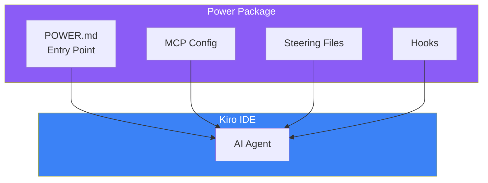
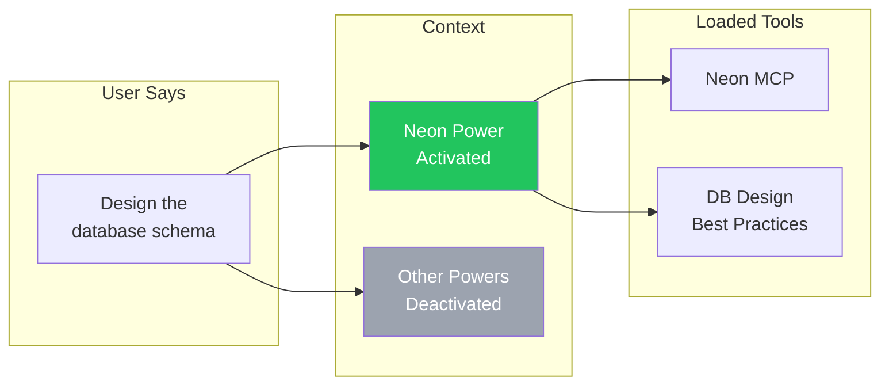
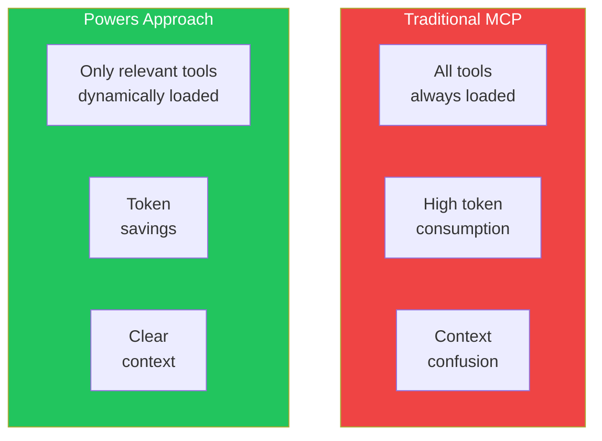

# Day 9: Using Powers

## What You'll Learn Today

- What Powers are
- Dynamic context loading
- Using partner Powers
- Creating custom Powers

---

## What Are Powers?

Powers are reusable capability packages that bundle MCP, Steering, and Hooks into one. Add domain expertise to Kiro with one click.



### Difference Between Powers and MCP

| Feature | MCP | Powers |
|---------|-----|--------|
| **Components** | Tools only | MCP + Steering + Hooks |
| **Context** | Always loaded | Dynamically loaded |
| **Expertise** | Tool usage only | Includes best practices |
| **Setup** | Manual JSON config | One click |

---

## Dynamic Context Loading

The innovative aspect of Powers is **dynamic context loading**. Related context loads only when needed.



### Problems with Traditional Approach



---

## Partner Powers

Kiro provides Powers in partnership with major technology partners.

### Available Powers

| Power | Category | Features |
|-------|----------|----------|
| **Supabase** | Backend | DB ops, auth, storage |
| **Neon** | Database | PostgreSQL, branching |
| **Stripe** | Payment | Payments, subscriptions |
| **Netlify** | Deployment | Deploy, serverless |
| **Postman** | API | API testing, docs |
| **Datadog** | Monitoring | Monitoring, logs |
| **Dynatrace** | Observability | Performance analysis |
| **Figma** | Design | Design systems |
| **Amazon Aurora** | Database | AWS DB |
| **Strands Agents** | AI | AI agent development |

### Installing Powers

#### Method 1: From Kiro IDE

1. Open "Powers" tab in Kiro panel
2. Browse available Powers
3. Click "Install"
4. Configure API keys if needed

#### Method 2: From kiro.dev

1. Visit [kiro.dev/powers](https://kiro.dev/powers)
2. Select desired Power
3. Click "Add to Kiro"

---

## Power Usage Examples

### Example 1: Supabase Power

```
Implement user authentication with Supabase.
- Email/password auth
- Google OAuth
- Session management
```

Kiro automatically:
1. Activates Supabase Power
2. Uses Supabase MCP tools
3. Generates code following Supabase best practices

### Example 2: Neon Power

```
Create a database branch on Neon and
test the new migration.
```

Kiro:
1. Activates Neon Power
2. Guides through branch creation workflow
3. Applies migration best practices

### Example 3: Stripe Power

```
Implement subscription payments with Stripe.
- Monthly and annual plans
- Trial period
- Webhook handling
```

Kiro:
1. Activates Stripe Power
2. Applies latest recommended Stripe API patterns
3. Includes webhook security best practices

---

## Power Structure

A Power consists of these files:

```
my-power/
├── POWER.md           # Entry point
├── mcp.json           # MCP config
├── steering/
│   ├── best-practices.md
│   └── patterns.md
└── hooks/
    └── auto-validate.yaml
```

### POWER.md

The entry point file for the Power.

```markdown
---
name: My Custom Power
version: 1.0.0
description: Custom power for specific workflows
triggers:
  - "database"
  - "schema"
  - "migration"
---

# My Custom Power

## Available Tools

This power provides the following MCP tools:
- `db_query`: Execute database queries
- `db_migrate`: Run migrations

## Best Practices

When working with databases:
1. Always use transactions for multiple operations
2. Add indexes for frequently queried columns
3. Use prepared statements to prevent SQL injection

## Activation

This power activates when you mention:
- Database operations
- Schema design
- Migrations
```

### Trigger Keywords

The Power automatically activates when keywords specified in `triggers` appear in the prompt.

---

## Creating Custom Powers

Package team-specific workflows as Powers.

### Step 1: Create Directory Structure

```bash
mkdir -p .kiro/powers/my-team-power
cd .kiro/powers/my-team-power
```

### Step 2: Create POWER.md

```markdown
---
name: My Team Power
version: 1.0.0
description: Team-specific development workflows
triggers:
  - "api"
  - "endpoint"
  - "rest"
---

# My Team API Power

## Purpose

Standardize API development across the team.

## Tools

- Custom API validation
- Auto-documentation generation
- Contract testing

## Guidelines

### API Design

- Use RESTful conventions
- Version APIs with /v1/ prefix
- Return consistent error formats

### Response Format

```json
{
  "data": {},
  "meta": {
    "timestamp": "ISO-8601",
    "version": "1.0"
  }
}
```

### Error Format

```json
{
  "error": {
    "code": "ERROR_CODE",
    "message": "Human readable message",
    "details": {}
  }
}
```
```

### Step 3: Add Steering Files

```markdown
<!-- .kiro/powers/my-team-power/steering/api-patterns.md -->
---
inclusion: always
---

# API Development Patterns

## Endpoint Naming

- Use plural nouns: `/users`, `/products`
- Use kebab-case: `/user-profiles`
- Avoid verbs in URLs

## HTTP Methods

| Method | Usage |
|--------|-------|
| GET | Retrieve resources |
| POST | Create new resource |
| PUT | Full update |
| PATCH | Partial update |
| DELETE | Remove resource |
```

### Step 4: Add Hooks

```yaml
# .kiro/powers/my-team-power/hooks/validate-api.yaml
name: Validate API
trigger: onSave
pattern: "src/api/**/*.ts"
action: agent
instructions: |
  Validate the API endpoint against team standards:
  1. Check response format matches specification
  2. Verify error handling is consistent
  3. Ensure proper HTTP status codes
```

---

## Sharing Powers

### Team Sharing

```bash
# Manage with Git
git add .kiro/powers/my-team-power
git commit -m "Add team API power"
git push
```

### Community Sharing

Import Powers from GitHub URLs:

```
Power URL: https://github.com/myorg/my-power
```

---

## Powers Best Practices

### 1. Clear Trigger Setup

```yaml
# Good: Specific triggers
triggers:
  - "supabase"
  - "auth"
  - "realtime"

# Bad: Vague triggers
triggers:
  - "database"  # Conflicts with other DB Powers
```

### 2. Progressive Context

```markdown
# POWER.md

## Quick Reference
(Brief basic usage)

## Detailed Guide
(Detailed explanations on-demand only)
```

### 3. Version Management

```yaml
---
name: My Power
version: 2.0.0
breaking_changes:
  - "Removed deprecated tool X"
  - "Changed response format"
---
```

---

## Summary

| Concept | Description |
|---------|-------------|
| **Powers** | Package of MCP + Steering + Hooks |
| **Dynamic Loading** | Load context only when needed |
| **Triggers** | Auto-activate Power by keywords |
| **Partners** | Official integrations with major services |

### Key Points

1. **Add functionality with one click via Powers**
2. **Optimize context with dynamic loading**
3. **Package team-specific workflows as Powers**
4. **Activate only when needed via triggers**

---

## Exercises

### Exercise 1: Basics

Check available partner Powers and install one. Execute a simple task using that Power's functionality.

### Exercise 2: Applied

Create a custom Power meeting these requirements:
- Triggers: "component", "ui", "react"
- Content: React component development best practices
- Hook: Auto-check on component save

### Challenge

Package your team's development workflow as a Power:
1. API development guidelines
2. Testing strategy
3. Code review checklist

Create in a format shareable via GitHub repository.

---

## References

- [Kiro Powers](https://kiro.dev/powers/)
- [Introducing Kiro Powers Blog](https://kiro.dev/blog/introducing-powers/)
- [Creating Custom Powers](https://kiro.dev/docs/powers/custom/)

---

**Coming Up**: In Day 10, we'll learn "Kiro CLI & Putting It All Together." Master CLI usage and practical workflows combining everything we've learned.
