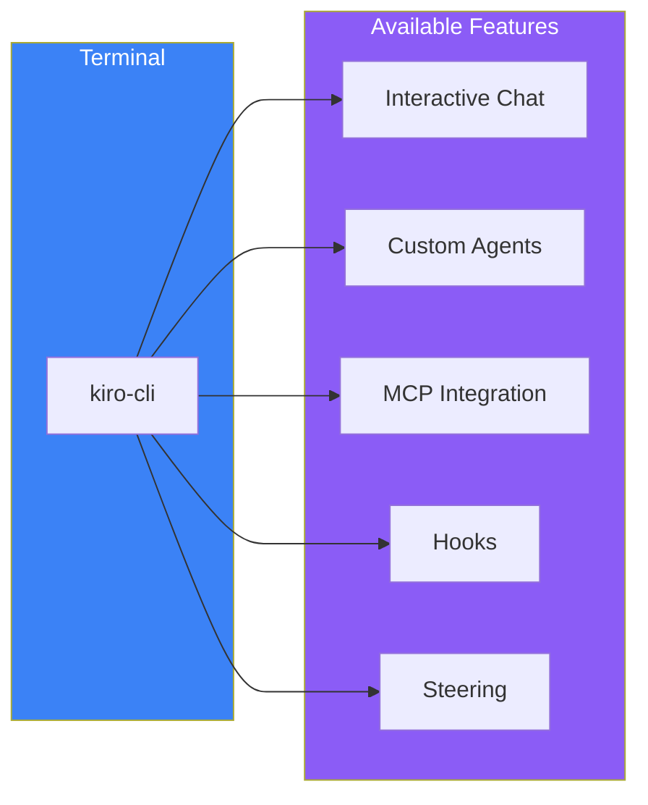
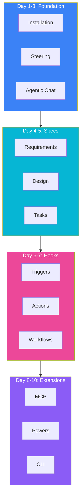
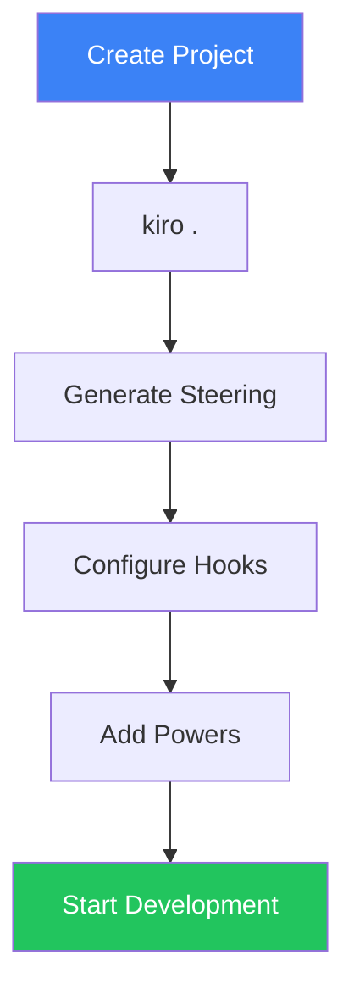
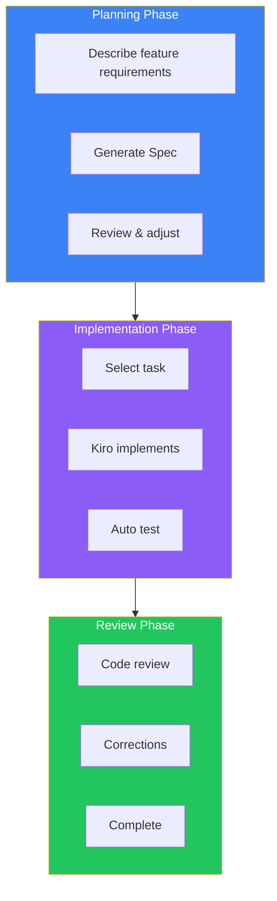

# Day 10: Kiro CLI & Putting It All Together

## What You'll Learn Today

- Kiro CLI basics
- Using Kiro from the terminal
- 10-day comprehensive review
- Practical development workflows

---

## What is Kiro CLI?

Kiro CLI is a command-line interface that lets you use Kiro features from the terminal. Use the AI assistant without opening the IDE.



### Difference from IDE Version

| Feature | Kiro IDE | Kiro CLI |
|---------|----------|----------|
| **Interface** | GUI | Terminal |
| **Chat** | Panel | Interactive |
| **File Editing** | Editor | Auto/confirm |
| **Specs** | UI managed | Direct files |
| **Hooks** | GUI config | Config files |

---

## Installation and Basic Usage

### Installation

```bash
curl -fsSL https://cli.kiro.dev/install | bash
```

Available on macOS and Linux.

### Basic Usage

```bash
# Start in project directory
cd my-project
kiro-cli
```

### Interactive Mode

```
$ kiro-cli

Welcome to Kiro CLI!

You: Explain the project structure

Kiro: This project is a web application using Next.js 15...

You: /exit
Goodbye!
```

---

## CLI Commands

### Basic Commands

| Command | Description |
|---------|-------------|
| `kiro-cli` | Start interactive mode |
| `kiro-cli "prompt"` | Run single prompt |
| `kiro-cli --help` | Show help |
| `kiro-cli --version` | Show version |

### Commands in Interactive Mode

| Command | Description |
|---------|-------------|
| `/exit` | End conversation |
| `/clear` | Clear conversation history |
| `/help` | Show command list |
| `/model` | Switch model |

### Usage Examples

```bash
# Single question
kiro-cli "Point out issues in this file" < src/api.ts

# Pipe input
cat error.log | kiro-cli "Analyze the cause of this error"

# Interactive mode
kiro-cli
```

---

## CLI Workflows

### Code Review

```bash
# Review git diff results
git diff | kiro-cli "Review these code changes"
```

### Bug Fixing

```bash
# Analyze error logs
npm run build 2>&1 | kiro-cli "How do I fix this build error?"
```

### Documentation Generation

```bash
# Generate README from files
kiro-cli "Generate README for functions in src/utils/ folder"
```

---

## 10-Day Comprehensive Review

Let's review all Kiro features we've learned.



### Feature Map

| Day | Feature | Purpose |
|-----|---------|---------|
| 1 | Installation & Basics | Understand Kiro overview |
| 2 | Steering | Share project knowledge |
| 3 | Agentic Chat | Effective communication |
| 4 | Specs (Requirements) | Clarify requirements |
| 5 | Specs (Design/Tasks) | Design and task management |
| 6 | Hooks Basics | Event-driven automation |
| 7 | Hooks Practice | Advanced automation |
| 8 | MCP | External tool integration |
| 9 | Powers | One-click feature addition |
| 10 | CLI & Integration | Terminal usage, synthesis |

---

## Practical Development Workflow

Build a practical workflow combining all features.

### Project Initial Setup



#### 1. Configure Steering

```bash
# Open project in Kiro
kiro .

# Generate Steering docs
# (From Kiro panel: "Generate Steering Docs")
```

#### 2. Configure Basic Hooks

```yaml
# .kiro/hooks/format.yaml
name: Auto Format
trigger: onSave
pattern: "**/*.{ts,tsx}"
action: shell
command: "npx prettier --write ${file}"
```

```yaml
# .kiro/hooks/lint.yaml
name: Auto Lint
trigger: onSave
pattern: "**/*.{ts,tsx}"
action: shell
command: "npx eslint ${file} --fix"
```

#### 3. Add Powers

Install needed Powers (Supabase, Stripe, etc.)

### Feature Development Flow



#### Step 1: Define Feature Requirements

```
Add user notification feature.
- Email notifications
- Push notifications
- In-app notifications
- Notification preference customization
```

#### Step 2: Generate and Review Spec

Review Requirements, Design, and Tasks generated by Kiro

#### Step 3: Execute Tasks

```
Start with T1: Create notification model
```

#### Step 4: Auto Validation

Hooks automatically:
- Format
- Lint
- Type check
- Run tests

#### Step 5: Review and Fix

```
#git diff

Review these changes.
Check especially from a security perspective.
```

---

## Best Practices Summary

### Steering

- **Keep three basic files updated**
- **Use fileMatch to load only when needed**
- **Include concrete examples and code**

### Specs

- **Use EARS syntax to eliminate ambiguity**
- **Keep tasks small with explicit dependencies**
- **Sync Specs with code**

### Hooks

- **Configure auto-checks on save**
- **Share and standardize across team**
- **Set patterns considering performance**

### MCP & Powers

- **Enable only needed tools**
- **Manage secrets with environment variables**
- **Create team-specific Powers**

---

## Troubleshooting

### Common Issues

| Issue | Solution |
|-------|----------|
| Kiro responding slowly | Optimize Steering files, disable unused MCP |
| Hooks not working | Check patterns and triggers, check logs |
| Can't connect to MCP | Check environment variables and prerequisites |
| Specs not generating correctly | Be more specific in requirements description |

### Debugging Methods

```bash
# Check Kiro CLI logs
kiro-cli --verbose

# Test MCP connection
# (Kiro panel > Output > Kiro - MCP Logs)

# Check Hook execution logs
# (Kiro panel > Output > Kiro - Hooks)
```

---

## Next Steps

You've completed 10 days of Kiro learning. To go deeper:

### Official Resources

- [Kiro Documentation](https://kiro.dev/docs/)
- [Kiro Blog](https://kiro.dev/blog/)
- [Kiro GitHub](https://github.com/kirodotdev/Kiro)

### Community

- Join Kiro forums
- Share custom Powers
- Submit feedback

### Practice

- Use Kiro on real projects
- Introduce Kiro to your team
- Continuously improve workflows

---

## Summary

| Day | What You Learned |
|-----|------------------|
| 1 | Kiro basics, installation |
| 2 | Share project knowledge with Steering |
| 3 | Communicate effectively with Agentic Chat |
| 4 | Clarify requirements with Specs |
| 5 | Manage design and implementation with Design/Tasks |
| 6 | Event-driven automation with Hooks |
| 7 | Advanced Hooks patterns |
| 8 | External tool integration with MCP |
| 9 | One-click feature addition with Powers |
| 10 | CLI usage and integrated workflows |

### Keys to Mastering Kiro

1. **Practice spec-driven development**
2. **Accumulate project knowledge in Steering**
3. **Automate repetitive tasks with Hooks**
4. **Extend capabilities with MCP and Powers**
5. **Continuously improve workflows**

---

## Final Exercise

### Comprehensive Exercise

Create a mini-project with these requirements:

1. **Configure Steering**
   - product.md: TODO app
   - tech.md: Next.js + TypeScript
   - structure.md: Appropriate structure

2. **Create Specs**
   - Requirements for task addition feature
   - Design (API design, component design)
   - Tasks breakdown

3. **Configure Hooks**
   - Auto-format on save
   - Test generation on component create

4. **Implementation**
   - Execute tasks based on Specs
   - Utilize Kiro's suggestions

5. **Review**
   - Code review with `#git diff`
   - Apply improvements

### Evaluation Points

- [ ] Steering is properly configured
- [ ] Specs use EARS syntax
- [ ] Hooks are working
- [ ] Code matches Specs
- [ ] Tests are added

---

## References

- [Kiro CLI Documentation](https://kiro.dev/docs/cli/)
- [Kiro Best Practices](https://kiro.dev/docs/best-practices/)
- [Kiro Changelog](https://kiro.dev/changelog/)

---

**Congratulations!** You've completed 10 days of Kiro learning. Now use Kiro to achieve more efficient and higher quality development.
