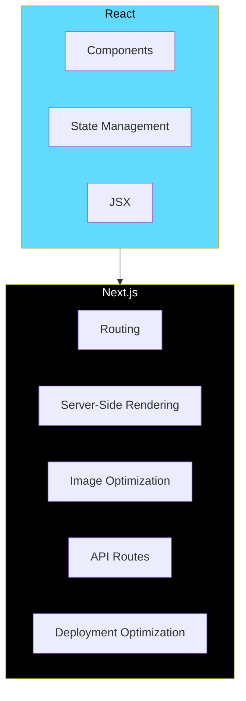
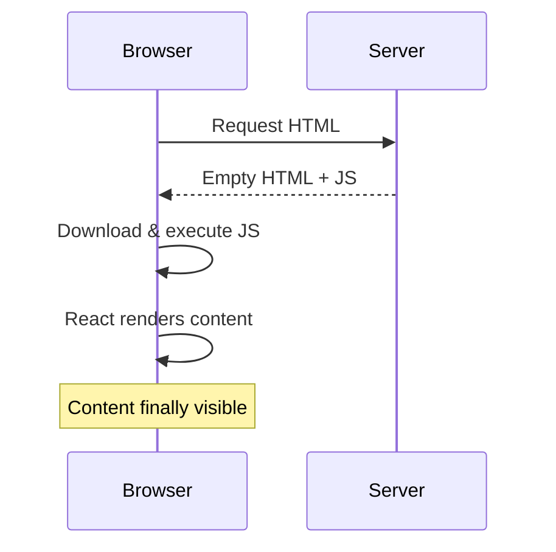
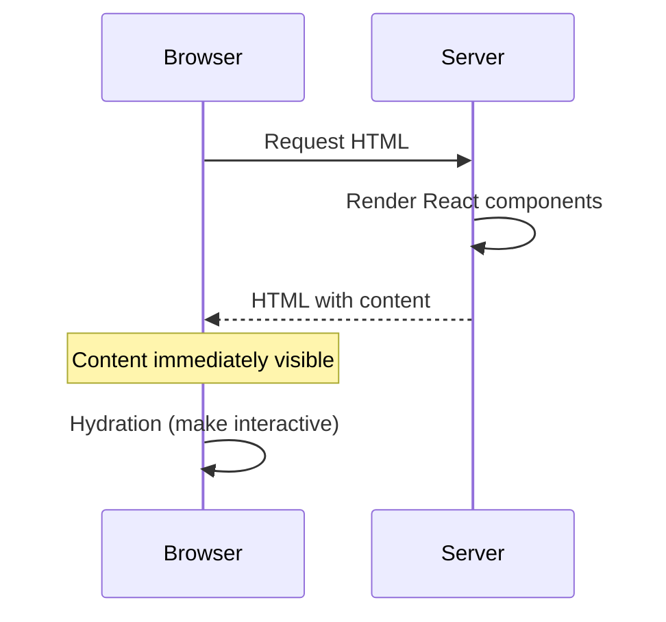
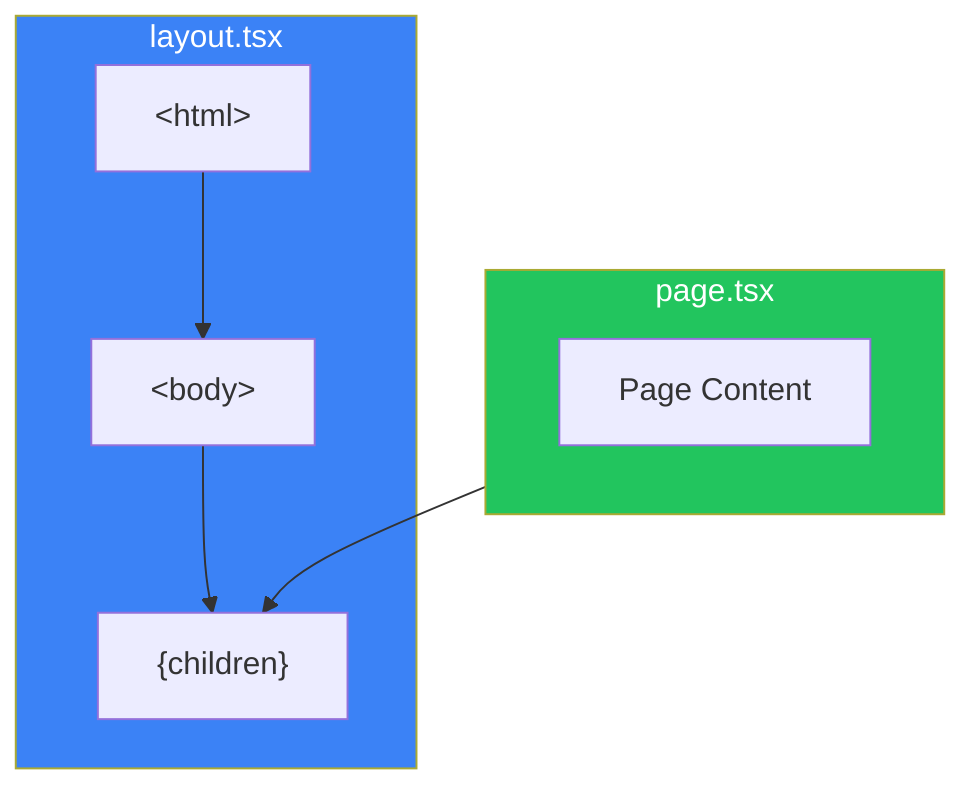
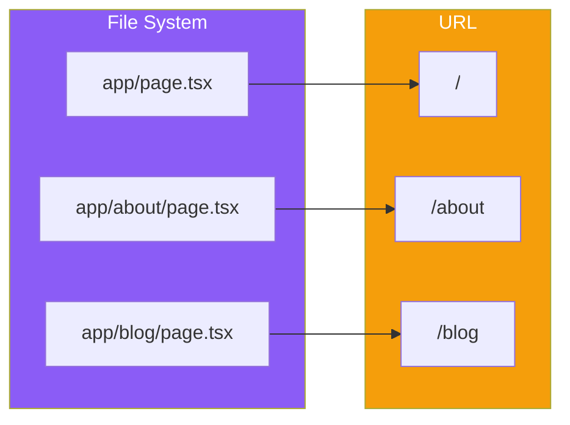

# Day 1: Welcome to Next.js

## What You'll Learn Today

- What Next.js is and how it relates to React
- Why you should use Next.js
- Overview of App Router
- Project setup
- Understanding the directory structure

---

## What is Next.js?

**Next.js** is a full-stack web framework built on React, developed by Vercel. While React provides the foundation for building user interfaces, Next.js adds routing, server-side rendering, optimizations, and everything else you need to build production-ready web applications.



### The Relationship Between React and Next.js

React is "a library for building user interfaces." It provides powerful features like components, state management, and JSX, but it doesn't include:

- **Routing**: Navigation between pages
- **Server-side rendering**: Better SEO and performance
- **Build optimization**: Production-ready optimization
- **File structure conventions**: Best practices for project organization

Next.js builds these features on top of React, providing an environment where you can start building serious applications right away.

---

## Why Use Next.js?

### 1. Server-Side Rendering (SSR)

Traditional React applications (like those from Create React App) render only on the client side. This has problems:



With Next.js, you can generate HTML on the server and send it:



### 2. File-Based Routing

URL structure matches file system structure. Routing works without any configuration files.

```
app/
├── page.tsx          → /
├── about/
│   └── page.tsx      → /about
└── blog/
    ├── page.tsx      → /blog
    └── [slug]/
        └── page.tsx  → /blog/article-slug
```

### 3. Server Components

With App Router (Next.js 13+), **React Server Components** are enabled by default. Components that run only on the server enable:

- Direct database access
- Keeping secrets like API keys away from the client
- Reduced JavaScript bundle size

### 4. Production-Ready Optimization

- Automatic code splitting
- Image optimization
- Font optimization
- Automatic static/dynamic rendering decisions

---

## Project Setup

Let's create a Next.js project.

### Creating a New Project

```bash
npx create-next-app@latest my-nextjs-app
```

Answer the interactive prompts:

```
✔ Would you like to use TypeScript? … Yes
✔ Would you like to use ESLint? … Yes
✔ Would you like to use Tailwind CSS? … Yes
✔ Would you like your code inside a `src/` directory? … Yes
✔ Would you like to use App Router? (recommended) … Yes
✔ Would you like to use Turbopack for next dev? … Yes
✔ Would you like to customize the import alias (@/*)? … No
```

### Starting the Development Server

```bash
cd my-nextjs-app
npm run dev
```

Open `http://localhost:3000` in your browser to see the Next.js welcome page.

---

## Directory Structure

Let's examine the structure of the created project:

```
my-nextjs-app/
├── src/
│   └── app/                 # App Router root
│       ├── layout.tsx       # Root layout
│       ├── page.tsx         # Home page
│       ├── globals.css      # Global CSS
│       └── favicon.ico      # Favicon
├── public/                  # Static files
├── next.config.ts           # Next.js configuration
├── tailwind.config.ts       # Tailwind CSS configuration
├── tsconfig.json            # TypeScript configuration
└── package.json             # Dependencies
```

### Key Files and Their Roles

| File | Role |
|------|------|
| `app/layout.tsx` | Layout shared across all pages (includes html, body tags) |
| `app/page.tsx` | Page displayed when accessing `/` |
| `next.config.ts` | Next.js behavior configuration |
| `public/` | Static files like images |

---

## Editing Your First Page

Open `src/app/page.tsx` and replace it with a simple page:

```tsx
export default function HomePage() {
  return (
    <main className="min-h-screen flex items-center justify-center">
      <div className="text-center">
        <h1 className="text-4xl font-bold mb-4">
          Welcome to My Next.js App
        </h1>
        <p className="text-gray-600">
          This is my first page built with Next.js
        </p>
      </div>
    </main>
  );
}
```

Save the file and the browser automatically updates (Hot Module Replacement).

---

## Understanding Layouts

Let's look at `src/app/layout.tsx`:

```tsx
import type { Metadata } from "next";
import { Inter } from "next/font/google";
import "./globals.css";

const inter = Inter({ subsets: ["latin"] });

export const metadata: Metadata = {
  title: "Create Next App",
  description: "Generated by create next app",
};

export default function RootLayout({
  children,
}: {
  children: React.ReactNode;
}) {
  return (
    <html lang="en">
      <body className={inter.className}>{children}</body>
    </html>
  );
}
```

### Key Points

1. **`<html>` and `<body>` tags**: Required in the root layout
2. **`children`**: Current page content is inserted here
3. **`metadata`**: Page title and description (for SEO)
4. **Font configuration**: Fonts optimized via `next/font`



---

## Adding a New Page

Let's create an `/about` page.

### Create the File

```bash
mkdir -p src/app/about
```

Create `src/app/about/page.tsx`:

```tsx
export default function AboutPage() {
  return (
    <main className="min-h-screen p-8">
      <h1 className="text-3xl font-bold mb-4">About Us</h1>
      <p className="text-gray-600">
        This is the About page.
      </p>
    </main>
  );
}
```

Navigate to `http://localhost:3000/about` in your browser to see the new page.

### How Routing Works



---

## Adding Navigation

Let's enable navigation between pages. In Next.js, we use the `Link` component.

### The Link Component

Update `src/app/page.tsx`:

```tsx
import Link from "next/link";

export default function HomePage() {
  return (
    <main className="min-h-screen flex items-center justify-center">
      <div className="text-center">
        <h1 className="text-4xl font-bold mb-4">
          Welcome to My Next.js App
        </h1>
        <p className="text-gray-600 mb-8">
          This is my first page built with Next.js
        </p>
        <Link
          href="/about"
          className="text-blue-600 hover:underline"
        >
          Go to About page →
        </Link>
      </div>
    </main>
  );
}
```

### Why Use `Link` Instead of `<a>`?

| Method | Behavior |
|--------|----------|
| `<a href="/about">` | Full page reload |
| `<Link href="/about">` | Client-side navigation (fast) |

The `Link` component updates the screen using JavaScript only during page transitions. This means:

- **Fast**: No full page reload
- **State preservation**: Application state is maintained
- **Prefetching**: Content is preloaded when links enter the viewport

---

## Summary

| Concept | Description |
|---------|-------------|
| Next.js | Full-stack framework built on React |
| App Router | File-based routing system |
| layout.tsx | Layout shared across multiple pages |
| page.tsx | Page component corresponding to each URL |
| Link | Component for client-side navigation |

### Key Points

1. **Next.js extends React**: Your React knowledge transfers directly
2. **File = Route**: Creating a file creates a page
3. **Server-first**: Server-side rendering by default
4. **Great DX**: Hot Reload, TypeScript support

---

## Practice Exercises

### Exercise 1: Basic
Create a `/contact` page that displays a "Contact Us" heading and contact information.

### Exercise 2: Intermediate
Add navigation links to both `/about` and `/contact` on the home page.

### Challenge
Add a shared navigation bar to `layout.tsx` that appears on all pages.

---

## References

- [Next.js Documentation](https://nextjs.org/docs)
- [Next.js Installation Guide](https://nextjs.org/docs/getting-started/installation)
- [App Router Introduction](https://nextjs.org/docs/app)

---

**Coming Up Next**: In Day 2, we'll dive deep into "App Router and Routing." We'll explore dynamic routing, route groups, and special files (loading.tsx, error.tsx).
