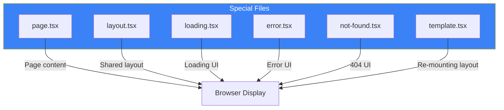
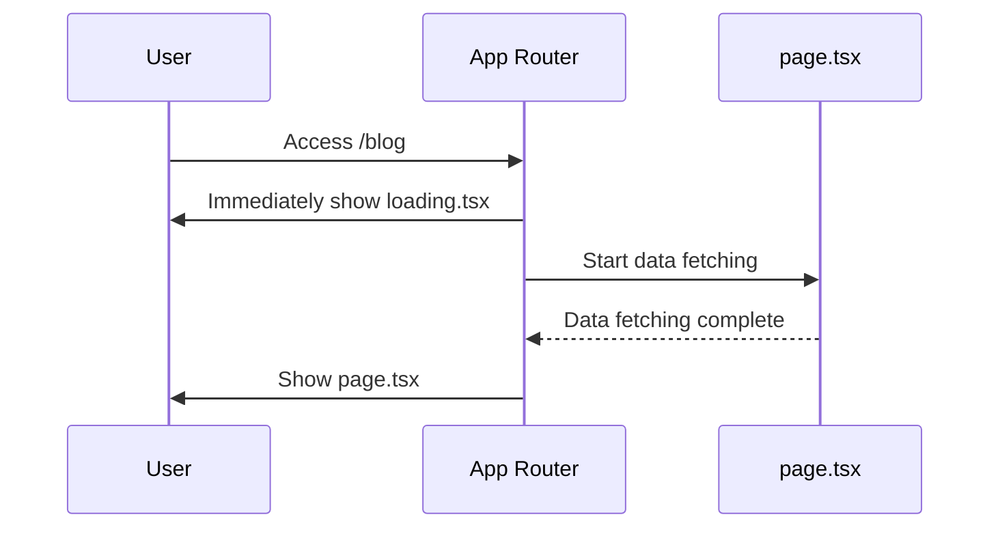
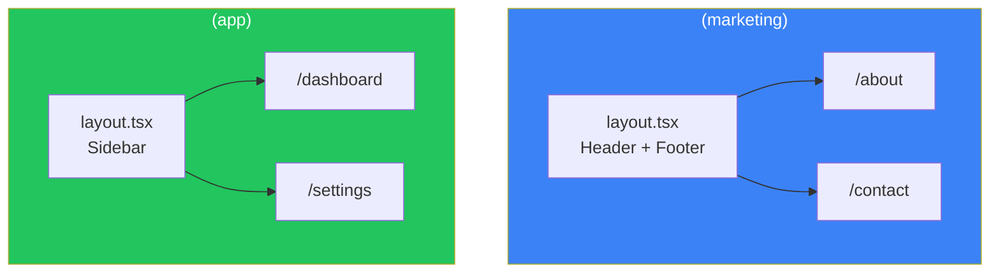
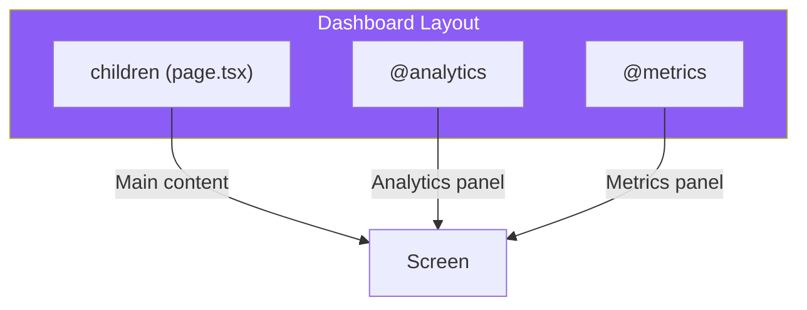

# Day 2: App Router and Routing

## What You'll Learn Today

- App Router special files
- Dynamic routing ([slug])
- Route groups ((group))
- Parallel routes and intercepting routes
- loading.tsx, error.tsx, not-found.tsx

---

## App Router Special Files

In App Router, file names have special meanings. These are called **conventions**.



### Role of Each File

| File | Role | When Displayed |
|------|------|----------------|
| `page.tsx` | Main page content | When URL is accessed |
| `layout.tsx` | Shared layout (state preserved) | Always |
| `loading.tsx` | Loading UI | During data fetching |
| `error.tsx` | Error UI | When error occurs |
| `not-found.tsx` | 404 page | When page not found |
| `template.tsx` | Layout (state reset) | Re-mounts on navigation |

---

## Showing Loading UI with loading.tsx

Create a loading UI that automatically displays during data fetching.

```tsx
// src/app/blog/loading.tsx
export default function BlogLoading() {
  return (
    <div className="animate-pulse">
      <div className="h-8 bg-gray-200 rounded w-1/3 mb-4"></div>
      <div className="space-y-3">
        <div className="h-4 bg-gray-200 rounded"></div>
        <div className="h-4 bg-gray-200 rounded w-5/6"></div>
        <div className="h-4 bg-gray-200 rounded w-4/6"></div>
      </div>
    </div>
  );
}
```

### How It Works



Next.js uses React's `<Suspense>` to automatically handle loading states.

---

## Handling Errors with error.tsx

Define UI to display when an error occurs.

```tsx
// src/app/blog/error.tsx
"use client"; // Error component must be a Client Component

import { useEffect } from "react";

export default function BlogError({
  error,
  reset,
}: {
  error: Error & { digest?: string };
  reset: () => void;
}) {
  useEffect(() => {
    console.error(error);
  }, [error]);

  return (
    <div className="text-center py-10">
      <h2 className="text-2xl font-bold text-red-600 mb-4">
        Something went wrong
      </h2>
      <p className="text-gray-600 mb-4">{error.message}</p>
      <button
        onClick={reset}
        className="px-4 py-2 bg-blue-600 text-white rounded hover:bg-blue-700"
      >
        Try again
      </button>
    </div>
  );
}
```

### Important Points

- `"use client"` is required (uses event handlers)
- `reset` function attempts to re-render
- Errors don't affect parent layouts (acts as error boundary)

---

## Customizing 404 Pages with not-found.tsx

Define UI when accessing non-existent pages.

```tsx
// src/app/not-found.tsx
import Link from "next/link";

export default function NotFound() {
  return (
    <div className="min-h-screen flex items-center justify-center">
      <div className="text-center">
        <h1 className="text-6xl font-bold text-gray-300 mb-4">404</h1>
        <h2 className="text-2xl font-semibold mb-2">
          Page Not Found
        </h2>
        <p className="text-gray-600 mb-6">
          The page you're looking for doesn't exist or has been moved.
        </p>
        <Link
          href="/"
          className="px-4 py-2 bg-blue-600 text-white rounded hover:bg-blue-700"
        >
          Go Home
        </Link>
      </div>
    </div>
  );
}
```

You can also trigger 404 programmatically:

```tsx
import { notFound } from "next/navigation";

export default async function BlogPost({ params }: { params: { slug: string } }) {
  const post = await getPost(params.slug);

  if (!post) {
    notFound(); // Displays not-found.tsx
  }

  return <article>{/* ... */}</article>;
}
```

---

## Dynamic Routing

Create dynamic routes that receive parts of the URL as variables.

### Basic Dynamic Route

```
app/
└── blog/
    └── [slug]/
        └── page.tsx    → /blog/hello-world, /blog/nextjs-guide, etc.
```

```tsx
// src/app/blog/[slug]/page.tsx
type Props = {
  params: Promise<{ slug: string }>;
};

export default async function BlogPost({ params }: Props) {
  const { slug } = await params;

  return (
    <article>
      <h1>Article: {slug}</h1>
    </article>
  );
}
```

### Multiple Segments

```
app/
└── shop/
    └── [category]/
        └── [product]/
            └── page.tsx    → /shop/electronics/iphone
```

```tsx
// src/app/shop/[category]/[product]/page.tsx
type Props = {
  params: Promise<{
    category: string;
    product: string;
  }>;
};

export default async function ProductPage({ params }: Props) {
  const { category, product } = await params;

  return (
    <div>
      <p>Category: {category}</p>
      <p>Product: {product}</p>
    </div>
  );
}
```

### Catch-all Routes

```
app/
└── docs/
    └── [...slug]/
        └── page.tsx    → /docs/a, /docs/a/b, /docs/a/b/c
```

```tsx
// src/app/docs/[...slug]/page.tsx
type Props = {
  params: Promise<{ slug: string[] }>;
};

export default async function DocsPage({ params }: Props) {
  const { slug } = await params;
  // /docs/getting-started/installation → ["getting-started", "installation"]

  return (
    <div>
      <p>Path: {slug.join(" / ")}</p>
    </div>
  );
}
```

### Optional Catch-all

```
app/
└── docs/
    └── [[...slug]]/
        └── page.tsx    → /docs, /docs/a, /docs/a/b
```

Double brackets `[[...slug]]` match including the root path (`/docs`).

---

## Route Groups

Wrap folder names in parentheses to group routes without affecting URLs.

### Use Case 1: Sharing Layouts

```
app/
├── (marketing)/
│   ├── layout.tsx      # Marketing pages layout
│   ├── about/
│   │   └── page.tsx    → /about
│   └── contact/
│       └── page.tsx    → /contact
└── (app)/
    ├── layout.tsx      # App layout
    ├── dashboard/
    │   └── page.tsx    → /dashboard
    └── settings/
        └── page.tsx    → /settings
```



### Use Case 2: Code Organization

```
app/
├── (auth)/
│   ├── login/
│   │   └── page.tsx    → /login
│   └── register/
│       └── page.tsx    → /register
└── (main)/
    └── page.tsx        → /
```

---

## Parallel Routes

Render multiple pages simultaneously for the same URL. Useful for complex UIs like dashboards.

### Directory Structure

```
app/
└── dashboard/
    ├── layout.tsx
    ├── page.tsx
    ├── @analytics/
    │   └── page.tsx
    └── @metrics/
        └── page.tsx
```

### Receiving Slots in Layout

```tsx
// src/app/dashboard/layout.tsx
export default function DashboardLayout({
  children,
  analytics,
  metrics,
}: {
  children: React.ReactNode;
  analytics: React.ReactNode;
  metrics: React.ReactNode;
}) {
  return (
    <div className="grid grid-cols-2 gap-4">
      <div className="col-span-2">{children}</div>
      <div>{analytics}</div>
      <div>{metrics}</div>
    </div>
  );
}
```



---

## Intercepting Routes

Display another route as a modal without leaving the current page.

### Use Cases

- Display clicked photo in a modal in a photo gallery
- Show login form in a modal
- Product quick view

### Directory Structure

```
app/
├── @modal/
│   └── (.)photo/
│       └── [id]/
│           └── page.tsx    # Modal version
├── photo/
│   └── [id]/
│       └── page.tsx        # Full page version
└── layout.tsx
```

### Intercept Notation

| Notation | Description |
|----------|-------------|
| `(.)` | Same level |
| `(..)` | One level up |
| `(..)(..)` | Two levels up |
| `(...)` | From root |

---

## Getting searchParams

Retrieve URL query parameters.

```tsx
// /search?q=nextjs&page=2
type Props = {
  searchParams: Promise<{ q?: string; page?: string }>;
};

export default async function SearchPage({ searchParams }: Props) {
  const { q, page } = await searchParams;

  return (
    <div>
      <h1>Search Results: {q}</h1>
      <p>Page: {page || 1}</p>
    </div>
  );
}
```

---

## Programmatic Navigation

In client components, use the `useRouter` hook to control navigation.

```tsx
"use client";

import { useRouter } from "next/navigation";

export default function NavigationButtons() {
  const router = useRouter();

  return (
    <div className="space-x-4">
      <button onClick={() => router.push("/dashboard")}>
        Go to Dashboard
      </button>
      <button onClick={() => router.back()}>
        Back
      </button>
      <button onClick={() => router.refresh()}>
        Refresh
      </button>
    </div>
  );
}
```

### useRouter Methods

| Method | Description |
|--------|-------------|
| `push(url)` | Navigate to URL |
| `replace(url)` | Navigate, replacing history |
| `back()` | Go to previous page |
| `forward()` | Go to next page |
| `refresh()` | Refresh current page |
| `prefetch(url)` | Prefetch page |

---

## Summary

| Concept | Description |
|---------|-------------|
| Special files | page, layout, loading, error, not-found |
| Dynamic routes | `[slug]`, `[...slug]`, `[[...slug]]` |
| Route groups | `(group)` for grouping without affecting URLs |
| Parallel routes | `@slot` for displaying multiple views |
| Intercepting | `(.)`, `(..)` etc. for modal display |

### Key Points

1. **Convention-based**: File names have meaning
2. **Automatic loading**: loading.tsx creates Suspense boundaries automatically
3. **Error boundaries**: error.tsx localizes errors
4. **Flexible routing**: Dynamic, groups, parallel, intercepting

---

## Practice Exercises

### Exercise 1: Basic
Create a `/products/[id]` dynamic route that displays the product ID.

### Exercise 2: Intermediate
Add custom `loading.tsx` and `error.tsx` to your blog section (`/blog`, `/blog/[slug]`).

### Challenge
Create `(marketing)` and `(app)` route groups with different layouts (e.g., with/without header) for each.

---

## References

- [Routing Fundamentals](https://nextjs.org/docs/app/building-your-application/routing)
- [Dynamic Routes](https://nextjs.org/docs/app/building-your-application/routing/dynamic-routes)
- [Route Groups](https://nextjs.org/docs/app/building-your-application/routing/route-groups)
- [Parallel Routes](https://nextjs.org/docs/app/building-your-application/routing/parallel-routes)

---

**Coming Up Next**: In Day 3, we'll learn about "Server Components and Client Components." We'll explore when to use each and how to design component boundaries.
