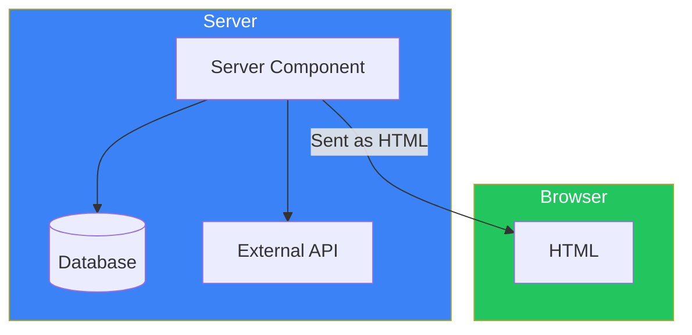
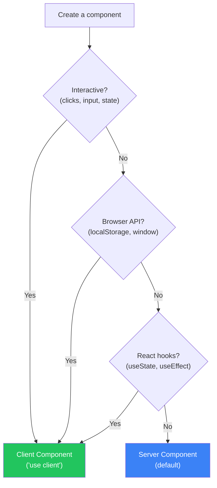
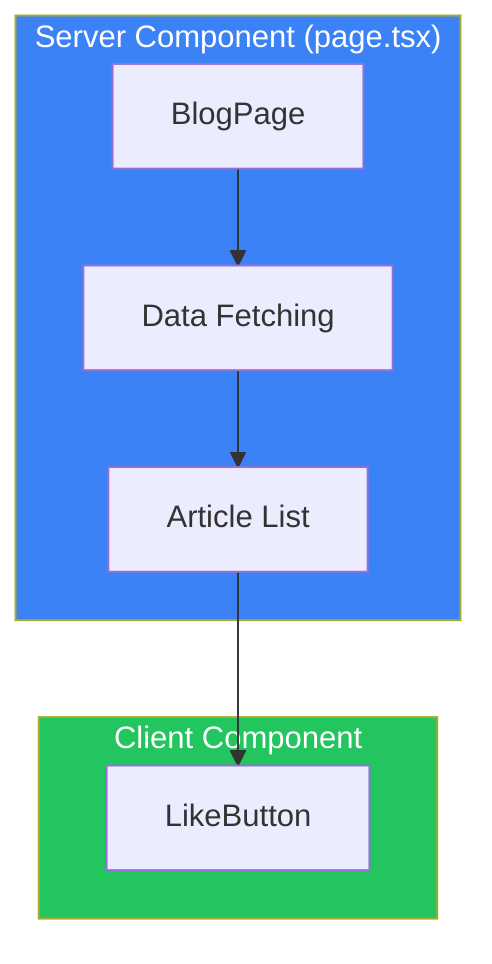
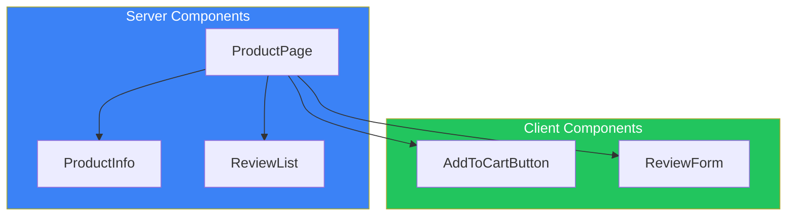

# Day 3: Server Components and Client Components

## What You'll Learn Today

- What Server Components are
- What Client Components are
- How to use the "use client" directive
- When to use which
- Designing component boundaries

---

## What are React Server Components (RSC)?

**React Server Components (RSC)** are React components that execute only on the server. In Next.js App Router, all components are Server Components by default.



### Benefits of Server Components

1. **Direct database access**: Running on the server means connecting to DB without going through an API
2. **Protect sensitive information**: API keys and tokens aren't exposed to the client
3. **Reduced bundle size**: Server-only libraries aren't sent to the client
4. **Faster initial load**: HTML is generated on the server, so content displays immediately

### Server Component Example

```tsx
// This component runs only on the server
// No "use client", so it's a Server Component by default

import { db } from "@/lib/database";

export default async function UserProfile({ userId }: { userId: string }) {
  // Direct database access (runs only on server)
  const user = await db.user.findUnique({
    where: { id: userId },
  });

  return (
    <div className="p-4 border rounded">
      <h2 className="text-xl font-bold">{user?.name}</h2>
      <p className="text-gray-600">{user?.email}</p>
    </div>
  );
}
```

---

## What are Client Components?

**Client Components** are React components that execute in the browser. Use them when you need interactive features (clicks, inputs, state management, etc.).

### The "use client" Directive

Adding `"use client"` at the top of a file makes that file and its child components Client Components.

```tsx
"use client";

import { useState } from "react";

export default function Counter() {
  const [count, setCount] = useState(0);

  return (
    <div className="p-4 border rounded">
      <p className="text-2xl mb-4">Count: {count}</p>
      <button
        onClick={() => setCount(count + 1)}
        className="px-4 py-2 bg-blue-600 text-white rounded"
      >
        +1
      </button>
    </div>
  );
}
```

### When Client Components Are Needed

| Feature | Reason |
|---------|--------|
| Event handlers (onClick, onChange) | User interactions in browser |
| useState, useReducer | Client-side state management |
| useEffect | Browser API access |
| Browser APIs (localStorage, window) | Don't exist on server |
| React hooks (useContext, useRef) | Hooks that run on client |

---

## Server vs Client: When to Use Which



### Decision Chart

| Requirement | Recommendation |
|-------------|----------------|
| Data fetching only | Server Component |
| Static UI display | Server Component |
| Form input | Client Component |
| Button clicks | Client Component |
| Animations | Client Component |
| Showing auth state | Depends (details below) |

---

## Designing Component Boundaries

Effectively combining Server Components and Client Components is key.

### Bad Example: Making Everything a Client Component

```tsx
// ❌ Bad: Unnecessarily making it a Client Component
"use client";

import { useEffect, useState } from "react";

export default function BlogPage() {
  const [posts, setPosts] = useState([]);

  useEffect(() => {
    fetch("/api/posts")
      .then((res) => res.json())
      .then(setPosts);
  }, []);

  return (
    <div>
      <h1>Blog</h1>
      {posts.map((post) => (
        <article key={post.id}>
          <h2>{post.title}</h2>
          <p>{post.content}</p>
          <LikeButton postId={post.id} />
        </article>
      ))}
    </div>
  );
}
```

### Good Example: Setting Proper Boundaries

```tsx
// ✅ Good: Server Component for data fetching
// src/app/blog/page.tsx (Server Component)

import { getPosts } from "@/lib/posts";
import { LikeButton } from "@/components/LikeButton";

export default async function BlogPage() {
  const posts = await getPosts(); // Fetch data on server

  return (
    <div>
      <h1>Blog</h1>
      {posts.map((post) => (
        <article key={post.id}>
          <h2>{post.title}</h2>
          <p>{post.content}</p>
          {/* Only the interactive part is a Client Component */}
          <LikeButton postId={post.id} />
        </article>
      ))}
    </div>
  );
}
```

```tsx
// src/components/LikeButton.tsx
"use client";

import { useState } from "react";

export function LikeButton({ postId }: { postId: string }) {
  const [liked, setLiked] = useState(false);

  return (
    <button
      onClick={() => setLiked(!liked)}
      className={liked ? "text-red-500" : "text-gray-500"}
    >
      {liked ? "❤️" : "🤍"} Like
    </button>
  );
}
```



---

## Using Server Components in Client Components

Client Components can receive Server Components as `children`.

### Pattern: Interactive Wrapper

```tsx
// src/components/Accordion.tsx
"use client";

import { useState } from "react";

export function Accordion({
  title,
  children,
}: {
  title: string;
  children: React.ReactNode;
}) {
  const [isOpen, setIsOpen] = useState(false);

  return (
    <div className="border rounded">
      <button
        onClick={() => setIsOpen(!isOpen)}
        className="w-full p-4 text-left font-bold"
      >
        {title} {isOpen ? "▲" : "▼"}
      </button>
      {isOpen && <div className="p-4 border-t">{children}</div>}
    </div>
  );
}
```

```tsx
// src/app/faq/page.tsx (Server Component)
import { Accordion } from "@/components/Accordion";
import { getFAQ } from "@/lib/faq";

export default async function FAQPage() {
  const faqs = await getFAQ(); // Fetch data on server

  return (
    <div>
      <h1>FAQ</h1>
      {faqs.map((faq) => (
        <Accordion key={faq.id} title={faq.question}>
          {/* This content renders as Server Component */}
          <p>{faq.answer}</p>
        </Accordion>
      ))}
    </div>
  );
}
```

---

## Common Mistakes

### Mistake 1: Using Hooks in Server Components

```tsx
// ❌ Error: useState can't be used in Server Components
import { useState } from "react";

export default function Profile() {
  const [name, setName] = useState(""); // Error!
  return <div>{name}</div>;
}
```

### Mistake 2: Using async Data Fetching in Client Components

```tsx
// ❌ Error: async/await can't be used directly in Client Components
"use client";

export default async function Profile() {
  const user = await fetchUser(); // Error!
  return <div>{user.name}</div>;
}
```

When fetching data in Client Components, use `useEffect`:

```tsx
"use client";

import { useEffect, useState } from "react";

export default function Profile() {
  const [user, setUser] = useState(null);

  useEffect(() => {
    fetchUser().then(setUser);
  }, []);

  if (!user) return <div>Loading...</div>;
  return <div>{user.name}</div>;
}
```

### Mistake 3: Adding "use client" Unnecessarily

```tsx
// ❌ Unnecessary: Adding "use client" without interactive features
"use client";

export default function Header() {
  return (
    <header>
      <h1>My Site</h1>
    </header>
  );
}
```

```tsx
// ✅ Good: Keep it as Server Component
export default function Header() {
  return (
    <header>
      <h1>My Site</h1>
    </header>
  );
}
```

---

## Practice: Component Design

### Scenario: Product Detail Page

- Product information display (static)
- "Add to Cart" button (interactive)
- Review list (static)
- Review submission form (interactive)



### Implementation Example

```tsx
// src/app/products/[id]/page.tsx (Server Component)
import { getProduct, getReviews } from "@/lib/products";
import { AddToCartButton } from "@/components/AddToCartButton";
import { ReviewForm } from "@/components/ReviewForm";

export default async function ProductPage({
  params,
}: {
  params: Promise<{ id: string }>;
}) {
  const { id } = await params;
  const [product, reviews] = await Promise.all([
    getProduct(id),
    getReviews(id),
  ]);

  return (
    <div className="max-w-4xl mx-auto p-4">
      {/* Product info (static) */}
      <section className="mb-8">
        <h1 className="text-3xl font-bold">{product.name}</h1>
        <p className="text-2xl text-gray-600">${product.price}</p>
        <p className="mt-4">{product.description}</p>

        {/* Cart button (interactive) */}
        <AddToCartButton productId={id} />
      </section>

      {/* Review list (static) */}
      <section className="mb-8">
        <h2 className="text-xl font-bold mb-4">Reviews</h2>
        {reviews.map((review) => (
          <div key={review.id} className="border-b py-4">
            <p className="font-bold">{review.author}</p>
            <p>{review.content}</p>
          </div>
        ))}
      </section>

      {/* Review submission (interactive) */}
      <ReviewForm productId={id} />
    </div>
  );
}
```

---

## Summary

| Concept | Description |
|---------|-------------|
| Server Components | Run only on server, default |
| Client Components | Run in browser, require "use client" |
| Component boundaries | Only interactive parts should be Client |

### Design Principles

1. **Default to Server Component**: Only add "use client" when needed
2. **Push Client to the leaves**: Make tree endpoints (buttons, forms) Client Components
3. **Fetch data on Server**: Fetch data on server whenever possible
4. **Be mindful of bundle size**: Use large libraries on server

---

## Practice Exercises

### Exercise 1: Basic
Which should be Server/Client Components?
- Navigation bar (links only)
- Search form
- Footer (static text)
- Modal dialog

### Exercise 2: Intermediate
Create a user profile page. Fetch and display user information with a Server Component, and implement a "Follow" button with a Client Component.

### Challenge
Create a tabs component. Combine tab switching (Client) with content from Server Components for each tab.

---

## References

- [Server Components](https://nextjs.org/docs/app/building-your-application/rendering/server-components)
- [Client Components](https://nextjs.org/docs/app/building-your-application/rendering/client-components)
- [Composition Patterns](https://nextjs.org/docs/app/building-your-application/rendering/composition-patterns)

---

**Coming Up Next**: In Day 4, we'll learn about "Data Fetching." We'll explore fetching data in Server Components, caching strategies, and parallel fetching.
