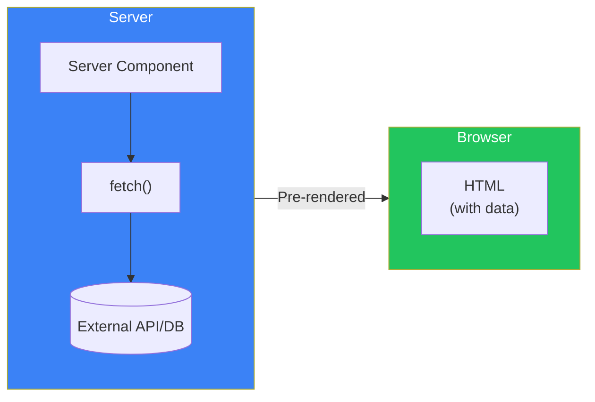
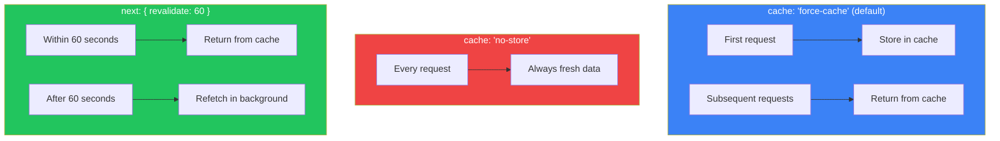
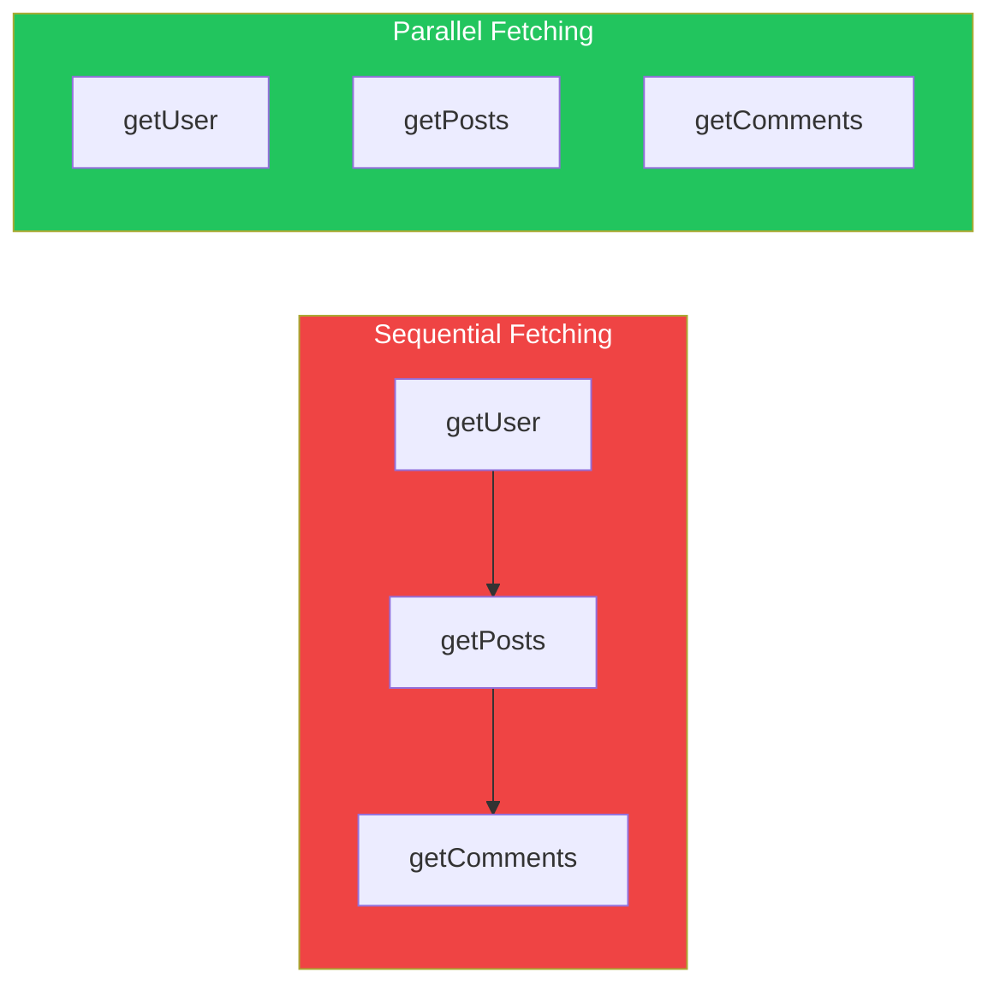
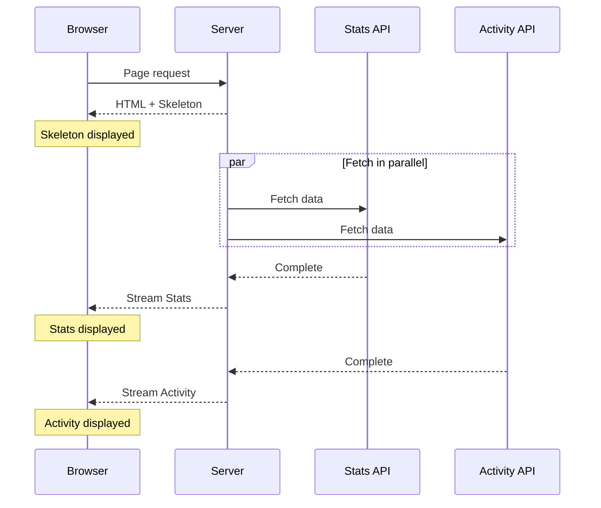

# Day 4: Data Fetching

## What You'll Learn Today

- Fetching data in Server Components
- Extended fetch API features
- Caching and revalidation
- Parallel data fetching
- Error handling

---

## Fetching Data in Server Components

With App Router, you can fetch data directly using `async/await` in Server Components. This is the recommended approach.



### Basic Data Fetching

```tsx
// src/app/users/page.tsx

type User = {
  id: number;
  name: string;
  email: string;
};

async function getUsers(): Promise<User[]> {
  const res = await fetch("https://jsonplaceholder.typicode.com/users");

  if (!res.ok) {
    throw new Error("Failed to fetch users");
  }

  return res.json();
}

export default async function UsersPage() {
  const users = await getUsers();

  return (
    <div className="p-4">
      <h1 className="text-2xl font-bold mb-4">User List</h1>
      <ul className="space-y-2">
        {users.map((user) => (
          <li key={user.id} className="p-2 border rounded">
            <p className="font-bold">{user.name}</p>
            <p className="text-gray-600">{user.email}</p>
          </li>
        ))}
      </ul>
    </div>
  );
}
```

---

## Extended fetch API

Next.js extends the Web standard `fetch` API with caching and revalidation features.

### Cache Options

```tsx
// Default: cached (static)
const res = await fetch("https://api.example.com/data");

// No cache (fetch every time)
const res = await fetch("https://api.example.com/data", {
  cache: "no-store",
});

// Time-based revalidation (refetch after 60 seconds)
const res = await fetch("https://api.example.com/data", {
  next: { revalidate: 60 },
});
```

### Cache Behavior



### When to Use Each Option

| Option | Use Case |
|--------|----------|
| Default (cached) | Infrequently changing data (blog posts, etc.) |
| `cache: "no-store"` | Real-time data (stock prices, inventory, etc.) |
| `next: { revalidate: N }` | Periodically updated data (news, etc.) |

---

## Parallel Data Fetching

When fetching multiple data sources, parallel fetching improves performance.

### Sequential Fetching (Slow)

```tsx
// ❌ Bad: Sequential fetching (waterfall)
export default async function Dashboard() {
  const user = await getUser();      // 1 second
  const posts = await getPosts();    // 1 second
  const comments = await getComments(); // 1 second
  // Total: 3 seconds
}
```

### Parallel Fetching (Fast)

```tsx
// ✅ Good: Parallel fetching
export default async function Dashboard() {
  const [user, posts, comments] = await Promise.all([
    getUser(),      // 1 second
    getPosts(),     // 1 second
    getComments(),  // 1 second
  ]);
  // Total: 1 second (depends on slowest)
}
```



---

## Data Fetching Patterns

### Pattern 1: Page-Level Fetching

```tsx
// src/app/dashboard/page.tsx
export default async function DashboardPage() {
  const data = await getDashboardData();

  return (
    <div>
      <Header user={data.user} />
      <Stats stats={data.stats} />
      <RecentActivity activities={data.activities} />
    </div>
  );
}
```

### Pattern 2: Component-Level Fetching

```tsx
// src/app/dashboard/page.tsx
export default function DashboardPage() {
  return (
    <div>
      <Header />
      <Stats />
      <RecentActivity />
    </div>
  );
}

// src/components/Stats.tsx
export default async function Stats() {
  const stats = await getStats(); // Fetch in this component

  return (
    <div className="grid grid-cols-3 gap-4">
      <StatCard title="Sales" value={stats.sales} />
      <StatCard title="Orders" value={stats.orders} />
      <StatCard title="Users" value={stats.users} />
    </div>
  );
}
```

### Which to Choose

| Pattern | Pros | Cons |
|---------|------|------|
| Page-level | Easier to manage data dependencies | Nothing displays until all data ready |
| Component-level | Each component loads independently | Potential duplicate requests |

---

## Streaming with Suspense

Use `loading.tsx` or `<Suspense>` to show loading UI during data fetching.

### Component-Level Suspense

```tsx
import { Suspense } from "react";

export default function DashboardPage() {
  return (
    <div>
      <h1>Dashboard</h1>

      <Suspense fallback={<StatsSkeleton />}>
        <Stats />
      </Suspense>

      <Suspense fallback={<ActivitySkeleton />}>
        <RecentActivity />
      </Suspense>
    </div>
  );
}
```



### Skeleton Component

```tsx
// src/components/StatsSkeleton.tsx
export function StatsSkeleton() {
  return (
    <div className="grid grid-cols-3 gap-4">
      {[1, 2, 3].map((i) => (
        <div key={i} className="animate-pulse">
          <div className="h-4 bg-gray-200 rounded w-1/2 mb-2" />
          <div className="h-8 bg-gray-200 rounded" />
        </div>
      ))}
    </div>
  );
}
```

---

## Error Handling

### Handling with try-catch

```tsx
async function getUser(id: string) {
  try {
    const res = await fetch(`https://api.example.com/users/${id}`);

    if (!res.ok) {
      throw new Error(`Failed to fetch user: ${res.status}`);
    }

    return res.json();
  } catch (error) {
    console.error("Error fetching user:", error);
    return null;
  }
}

export default async function UserPage({
  params,
}: {
  params: Promise<{ id: string }>;
}) {
  const { id } = await params;
  const user = await getUser(id);

  if (!user) {
    return <div>User not found</div>;
  }

  return <div>{user.name}</div>;
}
```

### Handling with error.tsx

When you throw an error, the nearest `error.tsx` is rendered.

```tsx
// src/lib/users.ts
export async function getUser(id: string) {
  const res = await fetch(`https://api.example.com/users/${id}`);

  if (!res.ok) {
    throw new Error("Failed to fetch user");
  }

  return res.json();
}
```

```tsx
// src/app/users/[id]/error.tsx
"use client";

export default function UserError({
  error,
  reset,
}: {
  error: Error;
  reset: () => void;
}) {
  return (
    <div className="text-center py-10">
      <h2 className="text-xl font-bold text-red-600">
        Failed to fetch user
      </h2>
      <button
        onClick={reset}
        className="mt-4 px-4 py-2 bg-blue-600 text-white rounded"
      >
        Retry
      </button>
    </div>
  );
}
```

### 404 with notFound

```tsx
import { notFound } from "next/navigation";

export default async function UserPage({
  params,
}: {
  params: Promise<{ id: string }>;
}) {
  const { id } = await params;
  const user = await getUser(id);

  if (!user) {
    notFound(); // Displays not-found.tsx
  }

  return <div>{user.name}</div>;
}
```

---

## Revalidating Data

### On-Demand Revalidation

Invalidate cache after specific actions.

```tsx
// src/app/actions.ts
"use server";

import { revalidatePath, revalidateTag } from "next/cache";

export async function createPost(formData: FormData) {
  // Create post
  await db.post.create({ ... });

  // Revalidate path
  revalidatePath("/blog");

  // Or revalidate by tag
  revalidateTag("posts");
}
```

### Tag-Based Revalidation

```tsx
// Tag when fetching
const posts = await fetch("https://api.example.com/posts", {
  next: { tags: ["posts"] },
});

// When revalidating
revalidateTag("posts"); // Invalidates all fetches with "posts" tag
```

---

## Practice: Blog App Data Fetching

```tsx
// src/lib/posts.ts
export async function getPosts() {
  const res = await fetch("https://api.example.com/posts", {
    next: { revalidate: 3600 }, // Revalidate every hour
  });

  if (!res.ok) throw new Error("Failed to fetch posts");
  return res.json();
}

export async function getPost(slug: string) {
  const res = await fetch(`https://api.example.com/posts/${slug}`, {
    next: { tags: [`post-${slug}`] },
  });

  if (!res.ok) return null;
  return res.json();
}

export async function getComments(postId: string) {
  const res = await fetch(
    `https://api.example.com/posts/${postId}/comments`,
    { cache: "no-store" } // Comments always fresh
  );

  if (!res.ok) throw new Error("Failed to fetch comments");
  return res.json();
}
```

```tsx
// src/app/blog/[slug]/page.tsx
import { Suspense } from "react";
import { notFound } from "next/navigation";
import { getPost } from "@/lib/posts";
import { Comments, CommentsSkeleton } from "@/components/Comments";

export default async function BlogPostPage({
  params,
}: {
  params: Promise<{ slug: string }>;
}) {
  const { slug } = await params;
  const post = await getPost(slug);

  if (!post) {
    notFound();
  }

  return (
    <article className="max-w-2xl mx-auto p-4">
      <h1 className="text-3xl font-bold mb-4">{post.title}</h1>
      <div className="prose" dangerouslySetInnerHTML={{ __html: post.content }} />

      <section className="mt-8">
        <h2 className="text-xl font-bold mb-4">Comments</h2>
        <Suspense fallback={<CommentsSkeleton />}>
          <Comments postId={post.id} />
        </Suspense>
      </section>
    </article>
  );
}
```

---

## Summary

| Concept | Description |
|---------|-------------|
| Fetch in Server Component | Fetch data directly with async/await |
| Cache options | force-cache, no-store, revalidate |
| Parallel fetching | Speed up with Promise.all |
| Suspense | Improve UX with streaming |
| Revalidation | revalidatePath, revalidateTag |

### Key Points

1. **Fetch in Server Components**: Don't send unnecessary JS to client
2. **Choose appropriate caching**: Match strategy to data characteristics
3. **Use parallel fetching**: Avoid waterfalls
4. **Stream with Suspense**: Start displaying content partially

---

## Practice Exercises

### Exercise 1: Basic
Create a page that fetches a user list from an external API and revalidates every hour.

### Exercise 2: Intermediate
Create a dashboard page that fetches data from 3 different APIs in parallel. Apply Suspense and skeletons to each section.

### Challenge
Implement revalidating the blog list using `revalidateTag` after creating a blog post.

---

## References

- [Data Fetching](https://nextjs.org/docs/app/building-your-application/data-fetching)
- [Caching](https://nextjs.org/docs/app/building-your-application/caching)
- [Revalidating](https://nextjs.org/docs/app/building-your-application/data-fetching/revalidating)

---

**Coming Up Next**: In Day 5, we'll learn about "Server Actions." We'll explore form handling, mutations, and optimistic UI updates.
