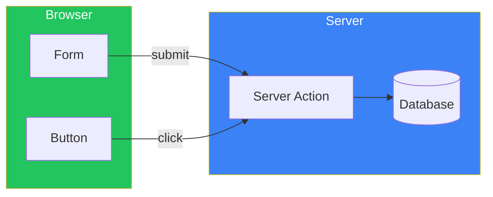
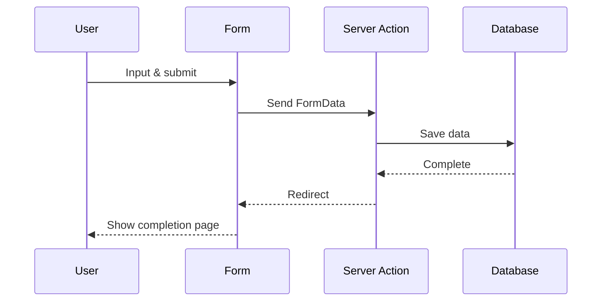
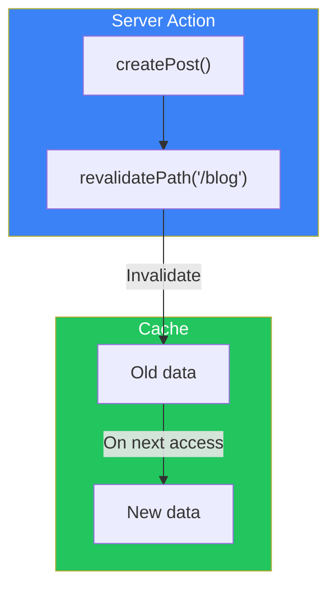
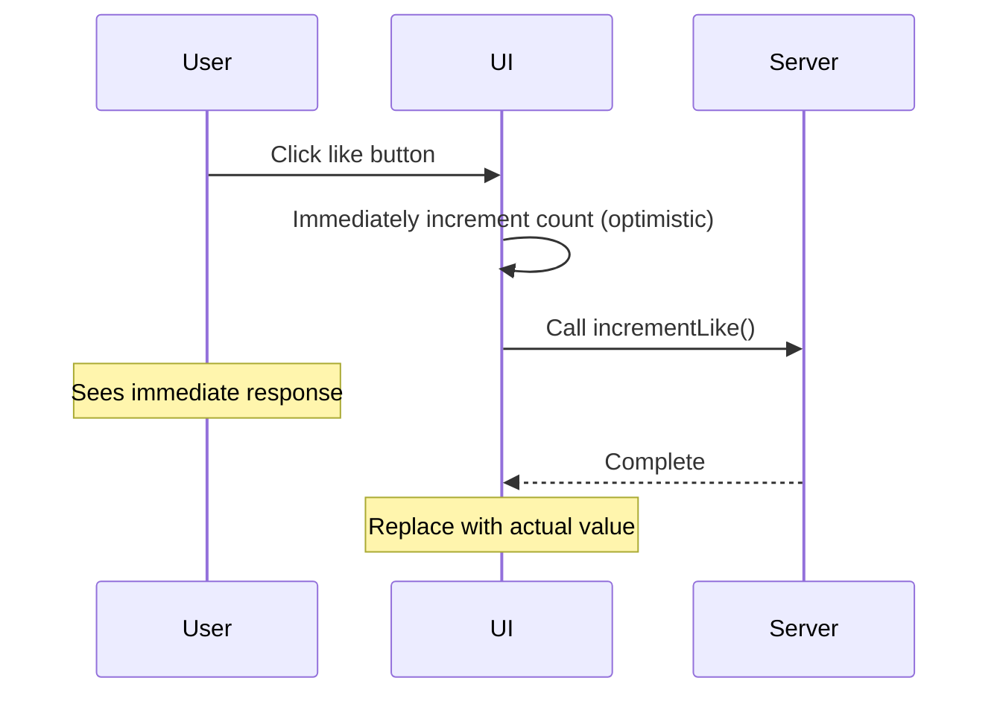

# Day 5: Server Actions

## What You'll Learn Today

- What Server Actions are
- The "use server" directive
- Form handling
- Mutations
- Optimistic UI updates

---

## What are Server Actions?

**Server Actions** are asynchronous functions that execute on the server. They simplify form submissions and data mutations.



### Server Actions Features

| Feature | Description |
|---------|-------------|
| Runs on server | Safely handle sensitive data |
| Progressive Enhancement | Works without JS |
| Simple | No need to write API routes |
| Auto cache invalidation | Works with revalidatePath |

---

## The "use server" Directive

Use `"use server"` to define Server Actions.

### Make Entire File Server Actions

```tsx
// src/app/actions.ts
"use server";

export async function createPost(formData: FormData) {
  const title = formData.get("title") as string;
  const content = formData.get("content") as string;

  await db.post.create({
    data: { title, content },
  });
}

export async function deletePost(id: string) {
  await db.post.delete({
    where: { id },
  });
}
```

### Define at Function Level

```tsx
// src/app/blog/page.tsx
export default function BlogPage() {
  async function handleSubmit(formData: FormData) {
    "use server";

    const title = formData.get("title") as string;
    // This runs on the server
  }

  return (
    <form action={handleSubmit}>
      <input name="title" />
      <button type="submit">Create</button>
    </form>
  );
}
```

---

## Basic Form Handling

### Simple Form

```tsx
// src/app/contact/page.tsx
import { redirect } from "next/navigation";

async function submitContact(formData: FormData) {
  "use server";

  const name = formData.get("name") as string;
  const email = formData.get("email") as string;
  const message = formData.get("message") as string;

  // Save data
  await db.contact.create({
    data: { name, email, message },
  });

  // Redirect to completion page
  redirect("/contact/thanks");
}

export default function ContactPage() {
  return (
    <form action={submitContact} className="max-w-md mx-auto p-4">
      <div className="mb-4">
        <label className="block mb-1">Name</label>
        <input
          name="name"
          required
          className="w-full border rounded p-2"
        />
      </div>

      <div className="mb-4">
        <label className="block mb-1">Email</label>
        <input
          name="email"
          type="email"
          required
          className="w-full border rounded p-2"
        />
      </div>

      <div className="mb-4">
        <label className="block mb-1">Message</label>
        <textarea
          name="message"
          required
          rows={4}
          className="w-full border rounded p-2"
        />
      </div>

      <button
        type="submit"
        className="w-full bg-blue-600 text-white py-2 rounded"
      >
        Submit
      </button>
    </form>
  );
}
```

### Form Flow



---

## Loading State with useFormStatus

Use the `useFormStatus` hook to get the form submission state.

```tsx
// src/components/SubmitButton.tsx
"use client";

import { useFormStatus } from "react-dom";

export function SubmitButton({ children }: { children: React.ReactNode }) {
  const { pending } = useFormStatus();

  return (
    <button
      type="submit"
      disabled={pending}
      className={`w-full py-2 rounded text-white ${
        pending ? "bg-gray-400" : "bg-blue-600 hover:bg-blue-700"
      }`}
    >
      {pending ? "Submitting..." : children}
    </button>
  );
}
```

```tsx
// src/app/contact/page.tsx
import { SubmitButton } from "@/components/SubmitButton";

export default function ContactPage() {
  return (
    <form action={submitContact}>
      {/* Form fields */}
      <SubmitButton>Submit</SubmitButton>
    </form>
  );
}
```

> **Note**: `useFormStatus` only works in descendant components of `<form>`.

---

## Validation with useActionState

Use `useActionState` to manage Server Action results (like error messages).

```tsx
// src/app/actions.ts
"use server";

type ActionState = {
  error?: string;
  success?: boolean;
};

export async function createAccount(
  prevState: ActionState,
  formData: FormData
): Promise<ActionState> {
  const email = formData.get("email") as string;
  const password = formData.get("password") as string;

  // Validation
  if (!email.includes("@")) {
    return { error: "Please enter a valid email address" };
  }

  if (password.length < 8) {
    return { error: "Password must be at least 8 characters" };
  }

  // Create account
  try {
    await db.user.create({
      data: { email, password: hashPassword(password) },
    });
    return { success: true };
  } catch {
    return { error: "Failed to create account" };
  }
}
```

```tsx
// src/app/signup/page.tsx
"use client";

import { useActionState } from "react";
import { createAccount } from "@/app/actions";
import { SubmitButton } from "@/components/SubmitButton";

export default function SignupPage() {
  const [state, formAction] = useActionState(createAccount, {});

  return (
    <form action={formAction} className="max-w-md mx-auto p-4">
      {state.error && (
        <div className="mb-4 p-3 bg-red-100 text-red-600 rounded">
          {state.error}
        </div>
      )}

      {state.success && (
        <div className="mb-4 p-3 bg-green-100 text-green-600 rounded">
          Account created successfully!
        </div>
      )}

      <div className="mb-4">
        <label className="block mb-1">Email</label>
        <input
          name="email"
          type="email"
          required
          className="w-full border rounded p-2"
        />
      </div>

      <div className="mb-4">
        <label className="block mb-1">Password</label>
        <input
          name="password"
          type="password"
          required
          className="w-full border rounded p-2"
        />
      </div>

      <SubmitButton>Create Account</SubmitButton>
    </form>
  );
}
```

---

## Cache Revalidation

After modifying data, invalidate the cache of related pages.

```tsx
// src/app/actions.ts
"use server";

import { revalidatePath, revalidateTag } from "next/cache";

export async function createPost(formData: FormData) {
  const title = formData.get("title") as string;
  const content = formData.get("content") as string;

  await db.post.create({
    data: { title, content },
  });

  // Method 1: Revalidate path
  revalidatePath("/blog");

  // Method 2: Revalidate tag
  revalidateTag("posts");
}

export async function deletePost(id: string) {
  await db.post.delete({
    where: { id },
  });

  revalidatePath("/blog");
}
```



---

## Server Actions Outside Forms

Call Server Actions from button clicks and other non-form interactions.

```tsx
// src/app/actions.ts
"use server";

export async function incrementLike(postId: string) {
  await db.post.update({
    where: { id: postId },
    data: { likes: { increment: 1 } },
  });

  revalidatePath(`/blog/${postId}`);
}
```

```tsx
// src/components/LikeButton.tsx
"use client";

import { incrementLike } from "@/app/actions";
import { useTransition } from "react";

export function LikeButton({ postId }: { postId: string }) {
  const [isPending, startTransition] = useTransition();

  const handleClick = () => {
    startTransition(() => {
      incrementLike(postId);
    });
  };

  return (
    <button
      onClick={handleClick}
      disabled={isPending}
      className="flex items-center gap-2"
    >
      {isPending ? "..." : "❤️"} Like
    </button>
  );
}
```

---

## Optimistic UI Updates

Use `useOptimistic` to update the UI without waiting for the server response.

```tsx
// src/components/LikeButton.tsx
"use client";

import { incrementLike } from "@/app/actions";
import { useOptimistic, useTransition } from "react";

export function LikeButton({
  postId,
  initialLikes,
}: {
  postId: string;
  initialLikes: number;
}) {
  const [isPending, startTransition] = useTransition();
  const [optimisticLikes, addOptimisticLike] = useOptimistic(
    initialLikes,
    (state) => state + 1
  );

  const handleClick = () => {
    startTransition(async () => {
      addOptimisticLike(null); // Update UI immediately
      await incrementLike(postId); // Execute on server
    });
  };

  return (
    <button
      onClick={handleClick}
      disabled={isPending}
      className="flex items-center gap-2"
    >
      ❤️ {optimisticLikes}
    </button>
  );
}
```



---

## Practice: Todo App

```tsx
// src/app/actions.ts
"use server";

import { revalidatePath } from "next/cache";

export async function addTodo(formData: FormData) {
  const title = formData.get("title") as string;

  await db.todo.create({
    data: { title, completed: false },
  });

  revalidatePath("/todos");
}

export async function toggleTodo(id: string) {
  const todo = await db.todo.findUnique({ where: { id } });

  await db.todo.update({
    where: { id },
    data: { completed: !todo?.completed },
  });

  revalidatePath("/todos");
}

export async function deleteTodo(id: string) {
  await db.todo.delete({ where: { id } });
  revalidatePath("/todos");
}
```

```tsx
// src/app/todos/page.tsx
import { addTodo, toggleTodo, deleteTodo } from "@/app/actions";

async function getTodos() {
  return db.todo.findMany({ orderBy: { createdAt: "desc" } });
}

export default async function TodosPage() {
  const todos = await getTodos();

  return (
    <div className="max-w-md mx-auto p-4">
      <h1 className="text-2xl font-bold mb-4">Todo List</h1>

      {/* Add form */}
      <form action={addTodo} className="mb-4 flex gap-2">
        <input
          name="title"
          required
          placeholder="New task..."
          className="flex-1 border rounded p-2"
        />
        <button
          type="submit"
          className="px-4 py-2 bg-blue-600 text-white rounded"
        >
          Add
        </button>
      </form>

      {/* Todo list */}
      <ul className="space-y-2">
        {todos.map((todo) => (
          <li
            key={todo.id}
            className="flex items-center gap-2 p-2 border rounded"
          >
            <form action={toggleTodo.bind(null, todo.id)}>
              <button type="submit">
                {todo.completed ? "✅" : "⬜"}
              </button>
            </form>

            <span className={todo.completed ? "line-through" : ""}>
              {todo.title}
            </span>

            <form
              action={deleteTodo.bind(null, todo.id)}
              className="ml-auto"
            >
              <button type="submit" className="text-red-500">
                🗑️
              </button>
            </form>
          </li>
        ))}
      </ul>
    </div>
  );
}
```

---

## Summary

| Concept | Description |
|---------|-------------|
| Server Actions | Async functions that run on server |
| "use server" | Directive to define Server Actions |
| useFormStatus | Get form submission state |
| useActionState | Manage action results |
| useOptimistic | Optimistic UI updates |

### Key Points

1. **No API routes needed**: Manipulate data directly with Server Actions
2. **Progressive Enhancement**: Works without JS
3. **Auto revalidation**: Easy cache updates with revalidatePath
4. **Optimistic updates**: Immediate UI reflection with useOptimistic

---

## Practice Exercises

### Exercise 1: Basic
Create a comment submission form. Disable the button during submission and show "Submitting...".

### Exercise 2: Intermediate
Create a user registration form with validation. Show error messages and redirect on success.

### Challenge
Implement a like button with optimistic updates. The count should increase immediately on click and be replaced with the actual value when the server processing completes.

---

## References

- [Server Actions](https://nextjs.org/docs/app/building-your-application/data-fetching/server-actions-and-mutations)
- [Forms](https://nextjs.org/docs/app/building-your-application/data-fetching/forms)
- [useFormStatus](https://react.dev/reference/react-dom/hooks/useFormStatus)
- [useOptimistic](https://react.dev/reference/react/useOptimistic)

---

**Coming Up Next**: In Day 6, we'll learn about "Image, Font, and Metadata Optimization." We'll explore next/image, next/font, and SEO practices.
