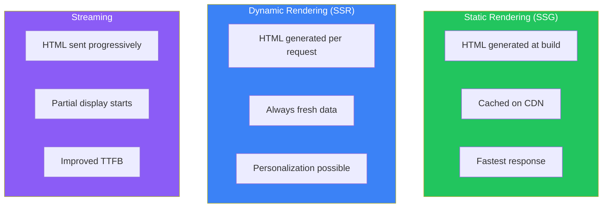
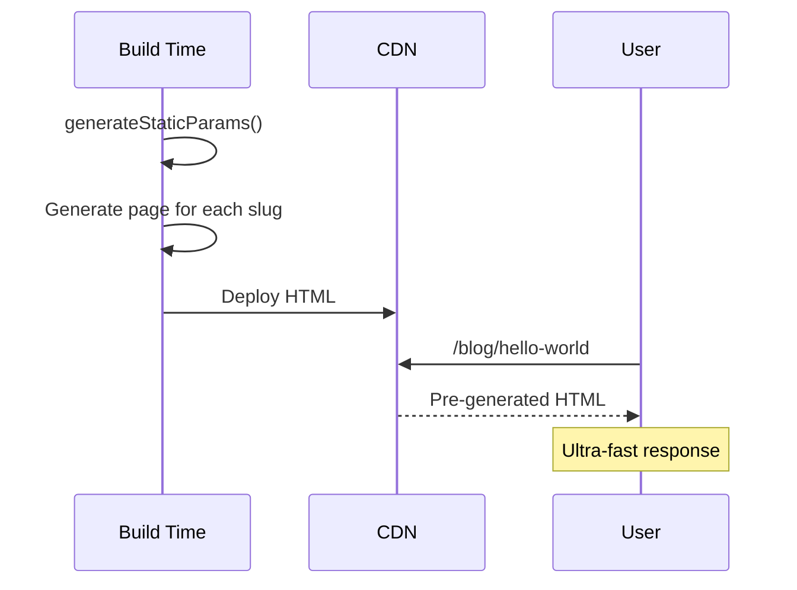
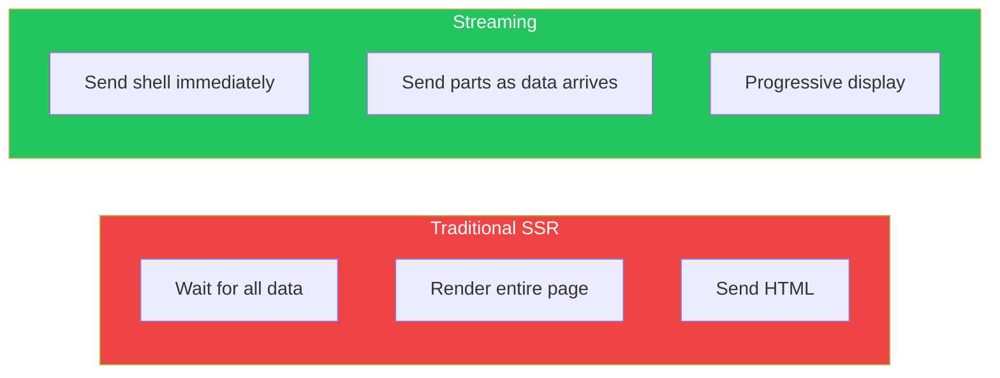
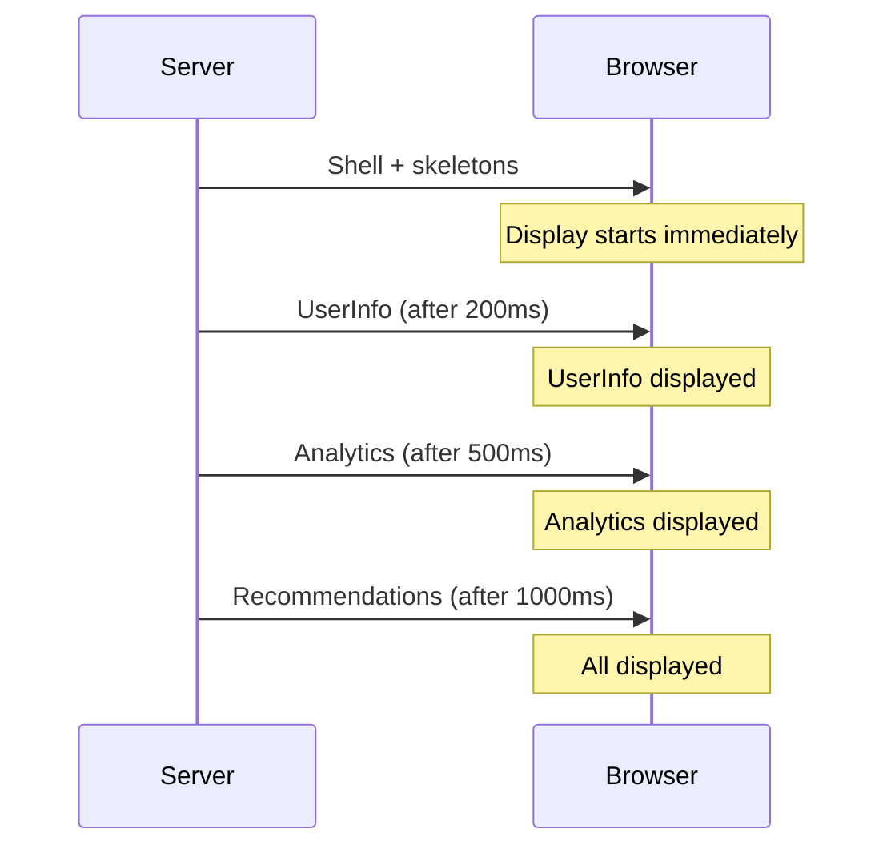
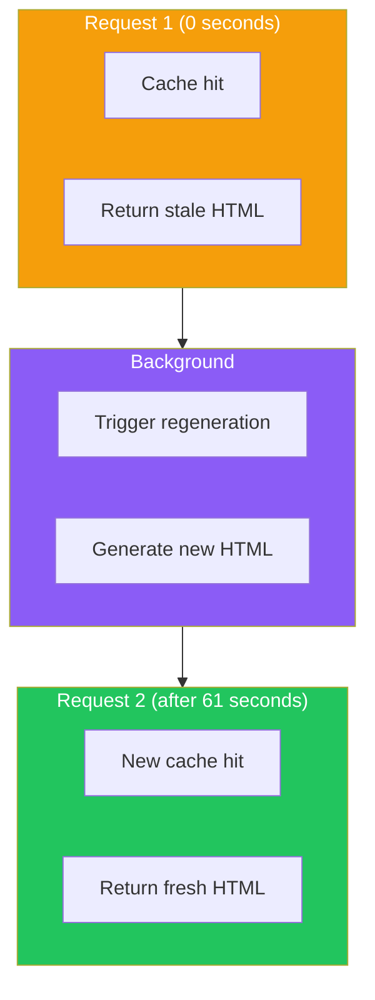
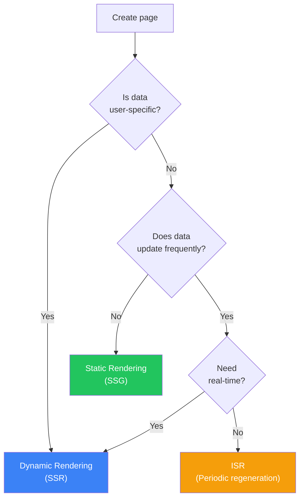

# Day 7: Rendering Strategies

## What You'll Learn Today

- Static rendering (SSG)
- Dynamic rendering (SSR)
- Streaming and Suspense
- ISR (Incremental Static Regeneration)
- How to choose the right strategy

---

## Rendering Strategies Overview

In Next.js, you can choose the optimal rendering strategy for each page or component.



---

## Static Rendering (SSG)

**Static rendering** generates HTML at build time. This is Next.js's default behavior.

### When Static Rendering Applies

- `fetch` cache is default (`force-cache`)
- No dynamic functions (`cookies()`, `headers()`, etc.)
- No dynamic route params (or pre-generated with `generateStaticParams`)

```tsx
// Statically rendered
export default async function BlogPage() {
  const posts = await fetch("https://api.example.com/posts", {
    // Cache is default
  });

  return (
    <ul>
      {posts.map((post) => (
        <li key={post.id}>{post.title}</li>
      ))}
    </ul>
  );
}
```

### Static Generation for Dynamic Routes with generateStaticParams

```tsx
// src/app/blog/[slug]/page.tsx

// Specify paths to generate at build time
export async function generateStaticParams() {
  const posts = await getAllPosts();

  return posts.map((post) => ({
    slug: post.slug,
  }));
}

export default async function BlogPost({
  params,
}: {
  params: Promise<{ slug: string }>;
}) {
  const { slug } = await params;
  const post = await getPost(slug);

  return <article>{post.content}</article>;
}
```



### Benefits of Static Rendering

| Benefit | Description |
|---------|-------------|
| Fast | Served directly from CDN |
| Low cost | No server processing required |
| SEO optimal | Complete HTML immediately available |
| Reliable | Unaffected by server downtime |

---

## Dynamic Rendering (SSR)

**Dynamic rendering** generates HTML for each request.

### When Dynamic Rendering Applies

- `fetch` uses `cache: "no-store"`
- Dynamic functions used (`cookies()`, `headers()`, `searchParams`)
- `export const dynamic = "force-dynamic"` is set

```tsx
// Dynamically rendered
import { cookies } from "next/headers";

export default async function DashboardPage() {
  const cookieStore = await cookies();
  const token = cookieStore.get("token");

  const user = await fetch("https://api.example.com/user", {
    headers: { Authorization: `Bearer ${token?.value}` },
    cache: "no-store",
  });

  return <div>Welcome, {user.name}</div>;
}
```

### Forcing Dynamic Rendering

```tsx
// src/app/dashboard/page.tsx

// This page is always dynamically rendered
export const dynamic = "force-dynamic";

export default async function DashboardPage() {
  // ...
}
```

### Dynamic Functions

Using these functions automatically triggers dynamic rendering:

| Function | Purpose |
|----------|---------|
| `cookies()` | Read cookies |
| `headers()` | Read request headers |
| `searchParams` | URL query parameters |
| `useSearchParams()` | Query params on client |

```tsx
// Using searchParams (dynamic)
type Props = {
  searchParams: Promise<{ q?: string }>;
};

export default async function SearchPage({ searchParams }: Props) {
  const { q } = await searchParams;
  const results = await search(q);

  return <SearchResults results={results} />;
}
```

---

## Streaming and Suspense

**Streaming** sends HTML progressively, allowing partial page display.



### Route-Level Streaming with loading.tsx

```tsx
// src/app/dashboard/loading.tsx
export default function DashboardLoading() {
  return (
    <div className="animate-pulse">
      <div className="h-8 bg-gray-200 rounded w-1/4 mb-4" />
      <div className="grid grid-cols-3 gap-4">
        <div className="h-32 bg-gray-200 rounded" />
        <div className="h-32 bg-gray-200 rounded" />
        <div className="h-32 bg-gray-200 rounded" />
      </div>
    </div>
  );
}
```

### Component-Level Streaming with Suspense

```tsx
import { Suspense } from "react";

export default function DashboardPage() {
  return (
    <div>
      <h1>Dashboard</h1>

      {/* Fast data */}
      <Suspense fallback={<UserSkeleton />}>
        <UserInfo />
      </Suspense>

      {/* Slow data */}
      <Suspense fallback={<AnalyticsSkeleton />}>
        <Analytics />
      </Suspense>

      {/* Another slow data */}
      <Suspense fallback={<RecommendationsSkeleton />}>
        <Recommendations />
      </Suspense>
    </div>
  );
}
```



---

## ISR (Incremental Static Regeneration)

**ISR** regenerates static pages at specified intervals. Combines static speed with dynamic freshness.

### Time-Based ISR

```tsx
// Regenerate every 60 seconds
export const revalidate = 60;

export default async function NewsPage() {
  const news = await fetch("https://api.example.com/news");
  return <NewsList news={news} />;
}
```

Or set per `fetch`:

```tsx
const news = await fetch("https://api.example.com/news", {
  next: { revalidate: 60 },
});
```

### How ISR Works



### On-Demand ISR

Manually revalidate from Server Actions or Route Handlers.

```tsx
// src/app/actions.ts
"use server";

import { revalidatePath, revalidateTag } from "next/cache";

export async function publishPost(formData: FormData) {
  // Publish post
  await db.post.create({ ... });

  // Revalidate path
  revalidatePath("/blog");

  // Or revalidate tag
  revalidateTag("posts");
}
```

---

## Choosing a Rendering Strategy

### Decision Flowchart



### Recommendations by Use Case

| Page Type | Recommended Strategy | Reason |
|-----------|---------------------|--------|
| Landing page | SSG | Rarely changes |
| Blog posts | SSG + ISR | Few changes after publish |
| Product list | ISR | Stock/prices change |
| Product detail | ISR | Stock changes |
| Dashboard | SSR | User-specific |
| Search results | SSR | Different per query |
| Social feed | SSR + Streaming | Real-time + fast |

---

## Practice: E-commerce Site Rendering Strategies

```tsx
// src/app/products/page.tsx
// Product list: ISR (regenerate every 5 minutes)
export const revalidate = 300;

export default async function ProductsPage() {
  const products = await getProducts();
  return <ProductGrid products={products} />;
}
```

```tsx
// src/app/products/[id]/page.tsx
// Product detail: Static generation + ISR

export async function generateStaticParams() {
  const products = await getProducts();
  return products.map((p) => ({ id: p.id }));
}

export const revalidate = 60;

export default async function ProductPage({
  params,
}: {
  params: Promise<{ id: string }>;
}) {
  const { id } = await params;
  const product = await getProduct(id);
  return <ProductDetail product={product} />;
}
```

```tsx
// src/app/cart/page.tsx
// Cart: Fully dynamic
export const dynamic = "force-dynamic";

import { cookies } from "next/headers";

export default async function CartPage() {
  const cookieStore = await cookies();
  const cartId = cookieStore.get("cartId");
  const cart = await getCart(cartId?.value);

  return <Cart items={cart.items} />;
}
```

---

## Summary

| Strategy | Timing | Use Case |
|----------|--------|----------|
| SSG | Build time | Static content |
| ISR | Periodic/on-demand | Semi-static content |
| SSR | Request time | Dynamic content |
| Streaming | Progressive | Improve perceived speed |

### Key Points

1. **Default is static**: SSG unless explicitly dynamic
2. **ISR for best of both**: Static speed with dynamic freshness
3. **Suspense for perceived speed**: Start partial display
4. **Right tool for the job**: Choose strategy per page

---

## Practice Exercises

### Exercise 1: Basic
Statically generate a blog list page and configure it to revalidate when new posts are published.

### Exercise 2: Intermediate
Create a dashboard page with user info (fast), statistics (medium), and recommendations (slow) wrapped in separate Suspense boundaries for streaming.

### Challenge
For an e-commerce site, implement the optimal rendering strategy for:
- Home page (static)
- Category page (ISR)
- Product detail page (ISR + stock via streaming)
- Cart page (dynamic)

---

## References

- [Static and Dynamic Rendering](https://nextjs.org/docs/app/building-your-application/rendering/server-components#static-rendering-default)
- [Streaming](https://nextjs.org/docs/app/building-your-application/routing/loading-ui-and-streaming)
- [generateStaticParams](https://nextjs.org/docs/app/api-reference/functions/generate-static-params)
- [Revalidating](https://nextjs.org/docs/app/building-your-application/data-fetching/revalidating)

---

**Coming Up Next**: In Day 8, we'll learn about "Styling and UI." We'll explore CSS Modules, Tailwind CSS, and dark mode support.
