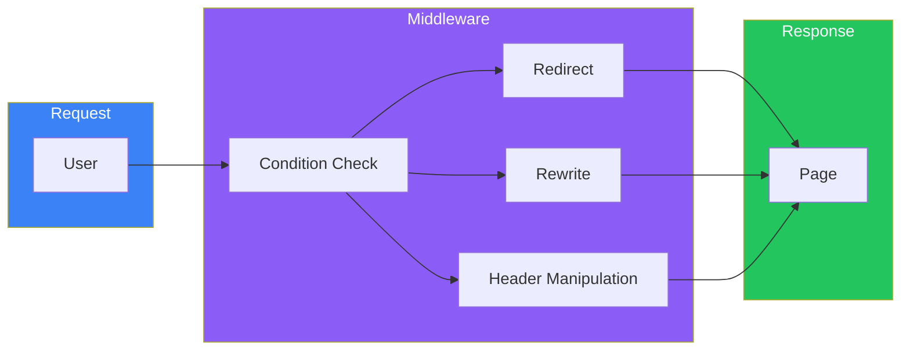
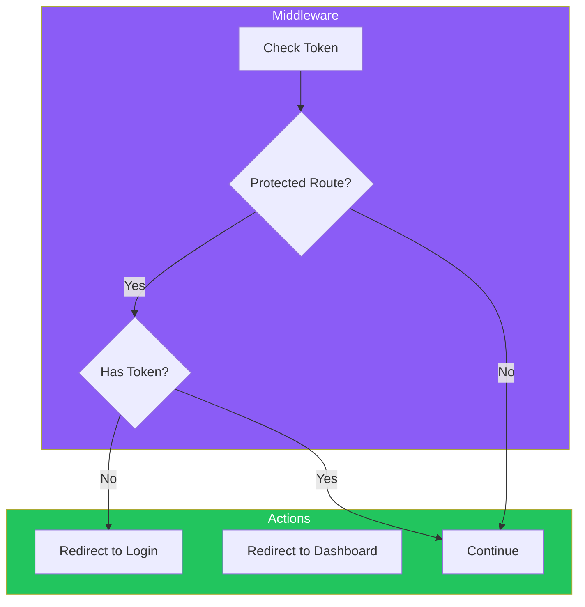

# Day 9: Authentication and Middleware

## What You'll Learn Today

- Middleware basics
- Redirects and rewrites
- Authentication with NextAuth.js (Auth.js)
- Protected routes
- Session management

---

## What is Middleware?

**Middleware** is code that runs before a request completes. Used for auth checks, redirects, header manipulation, etc.



### Basic Middleware

```tsx
// middleware.ts (place at project root)
import { NextResponse } from "next/server";
import type { NextRequest } from "next/server";

export function middleware(request: NextRequest) {
  console.log("Middleware executed:", request.nextUrl.pathname);

  return NextResponse.next();
}

// Specify matching paths
export const config = {
  matcher: [
    // Exclude static files and API
    "/((?!api|_next/static|_next/image|favicon.ico).*)",
  ],
};
```

---

## Redirects

Redirect users to different pages based on conditions.

```tsx
// middleware.ts
import { NextResponse } from "next/server";
import type { NextRequest } from "next/server";

export function middleware(request: NextRequest) {
  const { pathname } = request.nextUrl;

  // Redirect old URL to new URL
  if (pathname === "/old-page") {
    return NextResponse.redirect(new URL("/new-page", request.url));
  }

  // Pages requiring authentication
  const token = request.cookies.get("token");
  if (pathname.startsWith("/dashboard") && !token) {
    return NextResponse.redirect(new URL("/login", request.url));
  }

  return NextResponse.next();
}
```

### Redirect Types

| Method | Status | Use Case |
|--------|--------|----------|
| `redirect()` | 307 (temporary) | Temporary redirect |
| `redirect()` with status | 301 (permanent) | SEO URL changes |

```tsx
// Permanent redirect (301)
return NextResponse.redirect(new URL("/new-page", request.url), {
  status: 301,
});
```

---

## Rewrites

Render different pages without changing the URL.

```tsx
// middleware.ts
import { NextResponse } from "next/server";
import type { NextRequest } from "next/server";

export function middleware(request: NextRequest) {
  const { pathname } = request.nextUrl;

  // A/B testing
  if (pathname === "/") {
    const bucket = Math.random() < 0.5 ? "a" : "b";
    return NextResponse.rewrite(new URL(`/home/${bucket}`, request.url));
  }

  // Region-specific content
  const country = request.geo?.country || "US";
  if (pathname === "/pricing") {
    return NextResponse.rewrite(
      new URL(`/pricing/${country.toLowerCase()}`, request.url)
    );
  }

  return NextResponse.next();
}
```

---

## Header Manipulation

Add or modify headers on requests and responses.

```tsx
// middleware.ts
import { NextResponse } from "next/server";
import type { NextRequest } from "next/server";

export function middleware(request: NextRequest) {
  // Add response headers
  const response = NextResponse.next();
  response.headers.set("x-custom-header", "my-value");

  // Add security headers
  response.headers.set(
    "Content-Security-Policy",
    "default-src 'self'"
  );

  return response;
}
```

---

## NextAuth.js (Auth.js)

**NextAuth.js** (now Auth.js) is an authentication library for Next.js.

### Setup

```bash
npm install next-auth
```

```tsx
// src/app/api/auth/[...nextauth]/route.ts
import NextAuth from "next-auth";
import GithubProvider from "next-auth/providers/github";
import GoogleProvider from "next-auth/providers/google";
import CredentialsProvider from "next-auth/providers/credentials";

const handler = NextAuth({
  providers: [
    // GitHub login
    GithubProvider({
      clientId: process.env.GITHUB_ID!,
      clientSecret: process.env.GITHUB_SECRET!,
    }),

    // Google login
    GoogleProvider({
      clientId: process.env.GOOGLE_ID!,
      clientSecret: process.env.GOOGLE_SECRET!,
    }),

    // Email/password login
    CredentialsProvider({
      name: "Credentials",
      credentials: {
        email: { label: "Email", type: "email" },
        password: { label: "Password", type: "password" },
      },
      async authorize(credentials) {
        // Validate user
        const user = await validateUser(
          credentials?.email,
          credentials?.password
        );
        if (user) {
          return user;
        }
        return null;
      },
    }),
  ],
  pages: {
    signIn: "/login",
    error: "/auth/error",
  },
  callbacks: {
    async session({ session, token }) {
      if (session.user) {
        session.user.id = token.sub!;
      }
      return session;
    },
  },
});

export { handler as GET, handler as POST };
```

### Environment Variables

```bash
# .env.local
NEXTAUTH_URL=http://localhost:3000
NEXTAUTH_SECRET=your-secret-key

GITHUB_ID=your-github-client-id
GITHUB_SECRET=your-github-client-secret

GOOGLE_ID=your-google-client-id
GOOGLE_SECRET=your-google-client-secret
```

---

## SessionProvider Setup

Wrap with `SessionProvider` to use sessions in client components.

```tsx
// src/app/providers.tsx
"use client";

import { SessionProvider } from "next-auth/react";

export function Providers({ children }: { children: React.ReactNode }) {
  return <SessionProvider>{children}</SessionProvider>;
}
```

```tsx
// src/app/layout.tsx
import { Providers } from "./providers";

export default function RootLayout({
  children,
}: {
  children: React.ReactNode;
}) {
  return (
    <html lang="en">
      <body>
        <Providers>{children}</Providers>
      </body>
    </html>
  );
}
```

---

## Getting Authentication State

### In Server Components

```tsx
// src/app/dashboard/page.tsx
import { getServerSession } from "next-auth";
import { redirect } from "next/navigation";

export default async function DashboardPage() {
  const session = await getServerSession();

  if (!session) {
    redirect("/login");
  }

  return (
    <div>
      <h1>Dashboard</h1>
      <p>Welcome, {session.user?.name}</p>
    </div>
  );
}
```

### In Client Components

```tsx
// src/components/UserMenu.tsx
"use client";

import { useSession, signIn, signOut } from "next-auth/react";

export function UserMenu() {
  const { data: session, status } = useSession();

  if (status === "loading") {
    return <div>Loading...</div>;
  }

  if (!session) {
    return (
      <button
        onClick={() => signIn()}
        className="px-4 py-2 bg-blue-600 text-white rounded"
      >
        Login
      </button>
    );
  }

  return (
    <div className="flex items-center gap-4">
      <span>{session.user?.name}</span>
      <button
        onClick={() => signOut()}
        className="px-4 py-2 bg-gray-200 rounded"
      >
        Logout
      </button>
    </div>
  );
}
```

---

## Protecting Routes with Middleware

Use Middleware to protect routes that require authentication.

```tsx
// middleware.ts
import { NextResponse } from "next/server";
import type { NextRequest } from "next/server";
import { getToken } from "next-auth/jwt";

export async function middleware(request: NextRequest) {
  const token = await getToken({
    req: request,
    secret: process.env.NEXTAUTH_SECRET,
  });

  const { pathname } = request.nextUrl;

  // Protected routes
  const protectedPaths = ["/dashboard", "/settings", "/profile"];
  const isProtected = protectedPaths.some((path) =>
    pathname.startsWith(path)
  );

  if (isProtected && !token) {
    const loginUrl = new URL("/login", request.url);
    loginUrl.searchParams.set("callbackUrl", pathname);
    return NextResponse.redirect(loginUrl);
  }

  // Authenticated users accessing login page
  if (pathname === "/login" && token) {
    return NextResponse.redirect(new URL("/dashboard", request.url));
  }

  return NextResponse.next();
}

export const config = {
  matcher: ["/dashboard/:path*", "/settings/:path*", "/profile/:path*", "/login"],
};
```



---

## Implementing Login Page

```tsx
// src/app/login/page.tsx
"use client";

import { signIn } from "next-auth/react";
import { useSearchParams } from "next/navigation";
import { useState } from "react";

export default function LoginPage() {
  const searchParams = useSearchParams();
  const callbackUrl = searchParams.get("callbackUrl") || "/dashboard";
  const [email, setEmail] = useState("");
  const [password, setPassword] = useState("");
  const [error, setError] = useState("");

  const handleSubmit = async (e: React.FormEvent) => {
    e.preventDefault();

    const result = await signIn("credentials", {
      email,
      password,
      redirect: false,
    });

    if (result?.error) {
      setError("Invalid email or password");
    } else {
      window.location.href = callbackUrl;
    }
  };

  return (
    <div className="min-h-screen flex items-center justify-center">
      <div className="max-w-md w-full p-6 border rounded-lg">
        <h1 className="text-2xl font-bold mb-6 text-center">Login</h1>

        {error && (
          <div className="mb-4 p-3 bg-red-100 text-red-600 rounded">
            {error}
          </div>
        )}

        <form onSubmit={handleSubmit} className="space-y-4">
          <div>
            <label className="block mb-1">Email</label>
            <input
              type="email"
              value={email}
              onChange={(e) => setEmail(e.target.value)}
              className="w-full border rounded p-2"
              required
            />
          </div>

          <div>
            <label className="block mb-1">Password</label>
            <input
              type="password"
              value={password}
              onChange={(e) => setPassword(e.target.value)}
              className="w-full border rounded p-2"
              required
            />
          </div>

          <button
            type="submit"
            className="w-full bg-blue-600 text-white py-2 rounded"
          >
            Login
          </button>
        </form>

        <div className="mt-6">
          <div className="relative">
            <div className="absolute inset-0 flex items-center">
              <div className="w-full border-t" />
            </div>
            <div className="relative flex justify-center text-sm">
              <span className="px-2 bg-white text-gray-500">or</span>
            </div>
          </div>

          <div className="mt-4 space-y-2">
            <button
              onClick={() => signIn("github", { callbackUrl })}
              className="w-full border py-2 rounded flex items-center justify-center gap-2"
            >
              Login with GitHub
            </button>
            <button
              onClick={() => signIn("google", { callbackUrl })}
              className="w-full border py-2 rounded flex items-center justify-center gap-2"
            >
              Login with Google
            </button>
          </div>
        </div>
      </div>
    </div>
  );
}
```

---

## Summary

| Concept | Description |
|---------|-------------|
| Middleware | Code that runs before requests |
| Redirect | Forward to different URL |
| Rewrite | Change content without changing URL |
| NextAuth.js | Auth library for Next.js |
| getServerSession | Get session on server |
| useSession | Get session on client |

### Key Points

1. **Keep Middleware lightweight**: Runs on Edge Runtime
2. **Easy auth with NextAuth.js**: Supports multiple providers
3. **Protect at Middleware level**: Centralized route control
4. **Session available everywhere**: Server and Client support

---

## Practice Exercises

### Exercise 1: Basic
Use Middleware to redirect paths starting with `/admin` to `/login` if not authenticated.

### Exercise 2: Intermediate
Implement GitHub login with NextAuth.js. After login, redirect to dashboard and display user info.

### Challenge
Implement a login page supporting both email/password and GitHub authentication. Include error handling and loading states.

---

## References

- [Middleware](https://nextjs.org/docs/app/building-your-application/routing/middleware)
- [NextAuth.js](https://next-auth.js.org/)
- [Auth.js](https://authjs.dev/)
- [Protecting Routes](https://nextjs.org/docs/app/building-your-application/authentication#protecting-routes-with-middleware)

---

**Coming Up Next**: In Day 10, we'll learn about "Deployment and Production." We'll explore deploying to Vercel, environment variables, and performance optimization.
