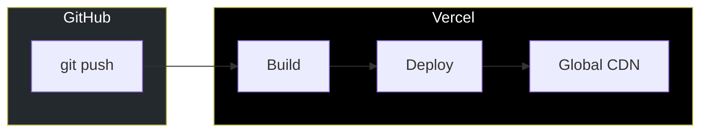
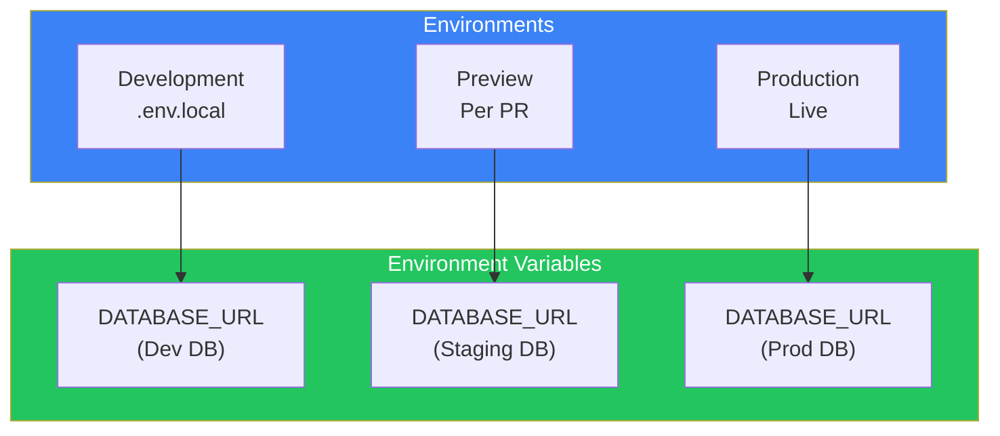
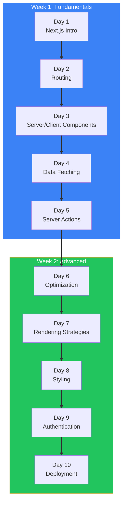

# Day 10: Deployment and Production

## What You'll Learn Today

- Deploying to Vercel
- Managing environment variables
- Performance optimization
- Error monitoring
- Next steps

---

## Building for Production

### Production Build

```bash
npm run build
```

Build output:

```
Route (app)                              Size     First Load JS
┌ ○ /                                    5.2 kB        89.5 kB
├ ○ /about                               2.1 kB        86.4 kB
├ ● /blog                                3.4 kB        87.7 kB
├ ● /blog/[slug]                         4.1 kB        88.4 kB
└ ƒ /dashboard                           6.3 kB        90.6 kB

○  (Static)   prerendered as static content
●  (SSG)      prerendered as static HTML (uses generateStaticParams)
ƒ  (Dynamic)  server-rendered on demand
```

### Test Production Mode Locally

```bash
npm run build && npm run start
```

---

## Deploying to Vercel

### Connect GitHub Repository

1. Go to [Vercel](https://vercel.com)
2. Login with GitHub
3. Click "New Project"
4. Import repository
5. Review settings and click "Deploy"



### Deploy with Vercel CLI

```bash
# Install Vercel CLI
npm install -g vercel

# Deploy
vercel

# Deploy to production
vercel --prod
```

### Preview Deployments

When you create a PR, a preview URL is automatically generated.

```
https://my-app-git-feature-branch-username.vercel.app
```

---

## Managing Environment Variables

### Local Environment

```bash
# .env.local (include in gitignore)
DATABASE_URL="postgresql://..."
NEXTAUTH_SECRET="your-secret"
NEXT_PUBLIC_API_URL="http://localhost:3000/api"
```

### Types of Environment Variables

| Prefix | Exposure |
|--------|----------|
| `NEXT_PUBLIC_` | Exposed to browser |
| None | Server only |

```tsx
// Available on server only
const secret = process.env.DATABASE_URL;

// Available in browser too
const apiUrl = process.env.NEXT_PUBLIC_API_URL;
```

### Setting Environment Variables on Vercel

1. Project Settings → Environment Variables
2. Select environment (Production, Preview, Development)
3. Enter key and value



---

## Performance Optimization

### Enable Next.js Analytics

```tsx
// src/app/layout.tsx
import { Analytics } from "@vercel/analytics/react";
import { SpeedInsights } from "@vercel/speed-insights/next";

export default function RootLayout({
  children,
}: {
  children: React.ReactNode;
}) {
  return (
    <html lang="en">
      <body>
        {children}
        <Analytics />
        <SpeedInsights />
      </body>
    </html>
  );
}
```

### Analyze Bundle Size

```bash
npm install @next/bundle-analyzer
```

```ts
// next.config.ts
import bundleAnalyzer from "@next/bundle-analyzer";

const withBundleAnalyzer = bundleAnalyzer({
  enabled: process.env.ANALYZE === "true",
});

export default withBundleAnalyzer({
  // config
});
```

```bash
ANALYZE=true npm run build
```

### Performance Checklist

| Item | Solution |
|------|----------|
| Images | Use next/image |
| Fonts | Use next/font |
| Large libraries | Dynamic imports |
| Unnecessary re-renders | Memoization (memo, useMemo) |
| Third-party scripts | Use next/script |

### Dynamic Imports

```tsx
import dynamic from "next/dynamic";

// Load only on client
const Chart = dynamic(() => import("@/components/Chart"), {
  loading: () => <div>Loading chart...</div>,
  ssr: false,
});

export default function DashboardPage() {
  return (
    <div>
      <h1>Dashboard</h1>
      <Chart />
    </div>
  );
}
```

### Third-Party Scripts with next/script

```tsx
import Script from "next/script";

export default function RootLayout({
  children,
}: {
  children: React.ReactNode;
}) {
  return (
    <html lang="en">
      <body>
        {children}
        <Script
          src="https://www.googletagmanager.com/gtag/js?id=G-XXXXXXX"
          strategy="afterInteractive"
        />
        <Script id="google-analytics" strategy="afterInteractive">
          {`
            window.dataLayer = window.dataLayer || [];
            function gtag(){dataLayer.push(arguments);}
            gtag('js', new Date());
            gtag('config', 'G-XXXXXXX');
          `}
        </Script>
      </body>
    </html>
  );
}
```

---

## Error Monitoring

### Sentry Integration

```bash
npx @sentry/wizard@latest -i nextjs
```

```ts
// sentry.client.config.ts
import * as Sentry from "@sentry/nextjs";

Sentry.init({
  dsn: process.env.NEXT_PUBLIC_SENTRY_DSN,
  tracesSampleRate: 1.0,
});
```

### Error Boundary

```tsx
// src/app/error.tsx
"use client";

import * as Sentry from "@sentry/nextjs";
import { useEffect } from "react";

export default function Error({
  error,
  reset,
}: {
  error: Error & { digest?: string };
  reset: () => void;
}) {
  useEffect(() => {
    Sentry.captureException(error);
  }, [error]);

  return (
    <div className="min-h-screen flex items-center justify-center">
      <div className="text-center">
        <h2 className="text-2xl font-bold mb-4">Something went wrong</h2>
        <button
          onClick={reset}
          className="px-4 py-2 bg-blue-600 text-white rounded"
        >
          Try again
        </button>
      </div>
    </div>
  );
}
```

---

## Security

### Security Headers

```ts
// next.config.ts
const nextConfig = {
  async headers() {
    return [
      {
        source: "/(.*)",
        headers: [
          {
            key: "X-Frame-Options",
            value: "DENY",
          },
          {
            key: "X-Content-Type-Options",
            value: "nosniff",
          },
          {
            key: "Referrer-Policy",
            value: "strict-origin-when-cross-origin",
          },
          {
            key: "Content-Security-Policy",
            value: "default-src 'self'; script-src 'self' 'unsafe-inline' 'unsafe-eval'; style-src 'self' 'unsafe-inline';",
          },
        ],
      },
    ];
  },
};

export default nextConfig;
```

### Environment Variable Security

- Only use `NEXT_PUBLIC_` prefix when necessary
- Keep sensitive info server-side only
- Always include `.env.local` in `.gitignore`

---

## Production Best Practices

### Deployment Checklist

```markdown
## Pre-Deployment Checklist

### Build
- [ ] `npm run build` succeeds
- [ ] No TypeScript errors
- [ ] No ESLint errors

### Environment Variables
- [ ] Production environment variables set
- [ ] Sensitive info not exposed to client

### Performance
- [ ] Images optimized with next/image
- [ ] Fonts optimized with next/font
- [ ] Large libraries dynamically imported

### SEO
- [ ] Metadata configured
- [ ] OGP images set
- [ ] sitemap.xml generated
- [ ] robots.txt configured

### Security
- [ ] Security headers configured
- [ ] Authentication working correctly
- [ ] API routes protected

### Monitoring
- [ ] Error monitoring configured
- [ ] Analytics configured
```

---

## 10-Day Review



### What You Learned

| Day | Topic | Key Concepts |
|-----|-------|--------------|
| 1 | Next.js Intro | App Router, file-based routing |
| 2 | Routing | Dynamic routes, route groups, loading/error |
| 3 | Components | Server Components, Client Components |
| 4 | Data Fetching | fetch, caching, parallel fetching, Suspense |
| 5 | Server Actions | Form handling, mutations, revalidation |
| 6 | Optimization | next/image, next/font, metadata |
| 7 | Rendering | SSG, SSR, ISR, streaming |
| 8 | Styling | CSS Modules, Tailwind, dark mode |
| 9 | Authentication | Middleware, NextAuth.js |
| 10 | Deployment | Vercel, environment variables, monitoring |

---

## Next Steps

### Topics to Explore Further

1. **Database Integration**
   - Prisma + PostgreSQL
   - Drizzle ORM
   - PlanetScale / Neon

2. **Advanced Features**
   - Internationalization (i18n)
   - Edge Functions
   - Turbopack

3. **Testing**
   - Jest + Testing Library
   - Playwright (E2E)

4. **Practice Projects**
   - Blog platform
   - E-commerce site
   - SaaS application

### Recommended Resources

| Resource | URL |
|----------|-----|
| Next.js Documentation | https://nextjs.org/docs |
| Next.js Learn | https://nextjs.org/learn |
| Vercel Templates | https://vercel.com/templates |
| GitHub Examples | https://github.com/vercel/next.js/tree/canary/examples |

---

## Summary

| Concept | Description |
|---------|-------------|
| Vercel Deployment | Automated deployment with GitHub |
| Environment Variables | Separate prod/preview/dev |
| Performance | Analytics, bundle analysis |
| Security | Headers, environment variable protection |
| Error Monitoring | Sentry integration |

### Final Points

1. **Vercel is optimal**: Same developers as Next.js
2. **Separate environments**: Production/staging/development
3. **Monitoring is essential**: Errors and performance
4. **Continue learning**: Follow official docs

---

## Conclusion

Congratulations on completing the 10-day journey!

Over these 10 days, you've built practical skills from Next.js fundamentals to production deployment. Next.js is an actively developed framework. Keep following the official documentation to learn the latest features and best practices.

Happy coding!

---

## References

- [Deploying](https://nextjs.org/docs/app/building-your-application/deploying)
- [Vercel Documentation](https://vercel.com/docs)
- [Environment Variables](https://nextjs.org/docs/app/building-your-application/configuring/environment-variables)
- [Performance](https://nextjs.org/docs/app/building-your-application/optimizing)
