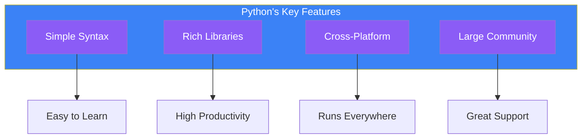
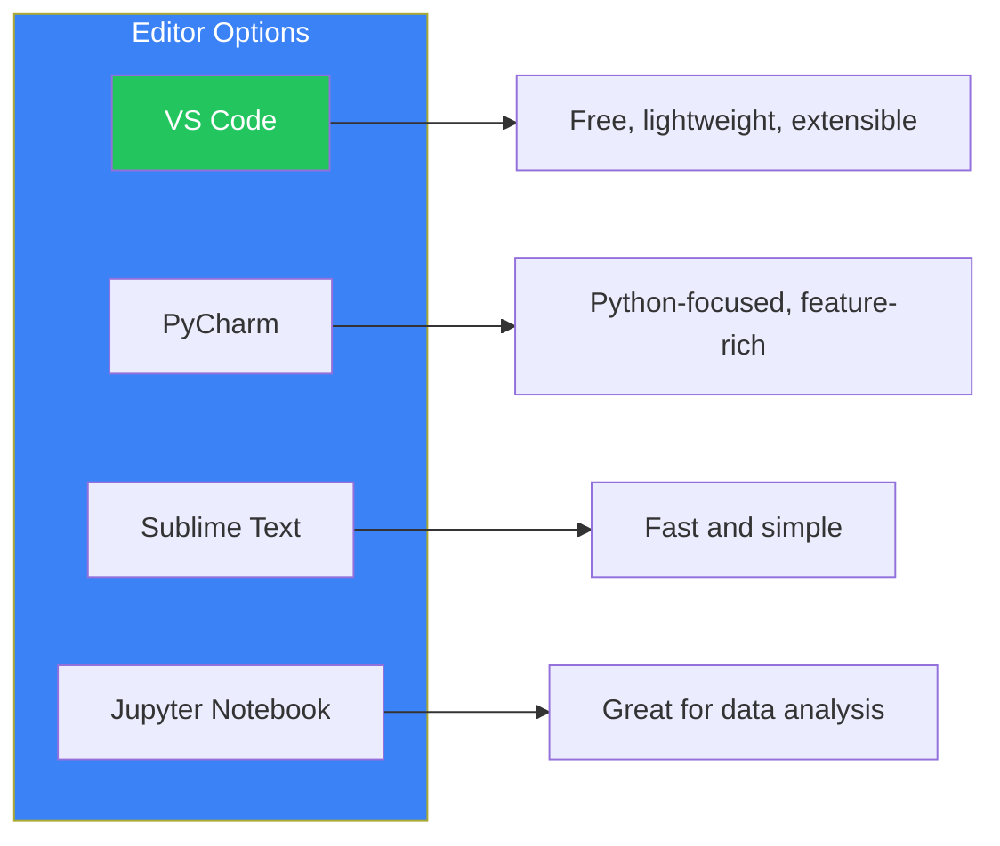

# Day 1: Welcome to Python

## What You'll Learn Today

- What Python is and why it's popular
- Setting up your development environment
- Creating and running your first program
- Using the interactive shell

---

## What is Python?

Python is a programming language created by Guido van Rossum in 1991. Known for its simple and readable syntax, Python is used by beginners and professionals alike across various industries.

### Key Features of Python



| Feature | Description |
|---------|-------------|
| **Simple Syntax** | Natural, English-like structure that's easy for beginners |
| **Rich Libraries** | Standard library and packages for virtually any task |
| **Cross-Platform** | Same code runs on Windows, macOS, and Linux |
| **Large Community** | Easy to find help and resources |

### What Can You Do with Python?

Python is an extremely versatile language:

- **Web Development**: Django, Flask, FastAPI frameworks
- **Data Analysis**: pandas, NumPy for data processing
- **Machine Learning & AI**: TensorFlow, PyTorch for deep learning
- **Automation**: Scripts to automate everyday tasks
- **Scientific Computing**: Research and computational tasks

---

## Setting Up Your Environment

### Installing Python

#### Windows

1. Visit [python.org](https://www.python.org/downloads/)
2. Download the latest version of Python
3. Run the installer
4. **Important**: Check "Add Python to PATH"
5. Click "Install Now"

#### macOS

macOS usually comes with Python pre-installed, but we recommend installing the latest version:

```bash
# Using Homebrew
brew install python
```

Or download the installer directly from [python.org](https://www.python.org/downloads/).

#### Linux

Most Linux distributions come with Python pre-installed:

```bash
# Debian/Ubuntu
sudo apt update
sudo apt install python3

# Fedora
sudo dnf install python3
```

### Verifying Installation

Open your terminal (Command Prompt on Windows) and run:

```bash
python --version
```

or

```bash
python3 --version
```

You should see output like:

```
Python 3.12.0
```

---

## Your First Program: Hello, World!

By tradition, the first program you write displays "Hello, World!" on the screen.

### Method 1: Interactive Shell

Type `python` or `python3` in your terminal and press Enter:

```bash
$ python3
Python 3.12.0 (main, Oct  2 2023, 00:00:00) [GCC 11.3.0] on linux
Type "help", "copyright", "credits" or "license" for more information.
>>>
```

The `>>>` prompt indicates Python is waiting for your command. Type the following and press Enter:

```python
>>> print("Hello, World!")
Hello, World!
```

**Congratulations!** You've run your first Python program.

To exit the shell, type `exit()` or press `Ctrl+D` (or `Ctrl+Z` on Windows).

### Method 2: Script Files

For more complex programs, save your code in a file.

1. Open a text editor (VS Code, PyCharm, or Notepad)
2. Type the following code:

```python
print("Hello, World!")
print("Welcome to Python!")
```

3. Save the file as `hello.py`
4. Navigate to the file location in your terminal and run:

```bash
python3 hello.py
```

Output:

```
Hello, World!
Welcome to Python!
```

---

## Exploring the Interactive Shell

The interactive shell is an incredibly useful tool for learning Python. You can try code instantly and see results.

### Using Python as a Calculator

```python
>>> 2 + 3
5
>>> 10 - 4
6
>>> 5 * 3
15
>>> 20 / 4
5.0
>>> 2 ** 10
1024
```

| Operator | Meaning | Example |
|----------|---------|---------|
| `+` | Addition | `2 + 3` → `5` |
| `-` | Subtraction | `10 - 4` → `6` |
| `*` | Multiplication | `5 * 3` → `15` |
| `/` | Division | `20 / 4` → `5.0` |
| `**` | Exponentiation | `2 ** 10` → `1024` |
| `//` | Floor Division | `7 // 2` → `3` |
| `%` | Modulus | `7 % 2` → `1` |

### Working with Strings

```python
>>> "Hello" + " " + "Python"
'Hello Python'
>>> "Python " * 3
'Python Python Python '
>>> len("Hello")
5
```

---

## Choosing an Editor

To write Python efficiently, choose a suitable code editor.

### Recommended Editors



| Editor | Features | Recommendation |
|--------|----------|----------------|
| **VS Code** | Free, lightweight, rich extensions | ★★★★★ |
| **PyCharm** | Python-dedicated IDE, full-featured | ★★★★☆ |
| **Sublime Text** | Fast and lightweight | ★★★☆☆ |
| **Jupyter Notebook** | Ideal for data analysis & ML | ★★★★☆ |

### Setting Up VS Code

1. Download from [code.visualstudio.com](https://code.visualstudio.com/)
2. After installation, open the Extensions tab
3. Search for "Python" and install it
4. The Python extension provides syntax highlighting and auto-completion

---

## Writing Comments

You can add comments to your programs. Comments explain your code and are ignored by Python.

```python
# This is a comment
print("Hello")  # You can add comments at the end of a line

# Multiple line comments
# use # at the start of each line
```

Comments help your future self and other developers understand your code.

---

## Summary

| Concept | Description |
|---------|-------------|
| **Python** | A simple, versatile programming language |
| **Interactive Shell** | An interactive environment for immediate code execution |
| **Script File** | Code saved with `.py` extension and executed |
| **print()** | Function that displays text on the screen |
| **Comments** | Notes starting with `#`, ignored by the program |

### Key Takeaways

1. Python is beginner-friendly and useful for many applications
2. The interactive shell lets you quickly test code
3. Save serious programs in `.py` files
4. Use comments to make your code understandable

---

## Practice Exercises

### Exercise 1: Basics
Use the interactive shell to calculate:
- 123 + 456
- 1000 minus 357
- 25 to the power of 4

### Exercise 2: Hello, World!
Create a new file called `greeting.py` that displays:
- Your name
- Today's date
- Your favorite programming language

### Challenge
Using the `print()` function, create a program that displays the following ASCII art:

```
  *
 ***
*****
 ***
  *
```

---

## References

- [Python Official Site](https://www.python.org/)
- [Python Official Documentation](https://docs.python.org/3/)
- [Python Tutorial (Official)](https://docs.python.org/3/tutorial/index.html)
- [VS Code Python Extension](https://marketplace.visualstudio.com/items?itemName=ms-python.python)

---

**Next Up**: In Day 2, you'll learn about "Variables and Data Types." Discover how to store and manipulate data!
