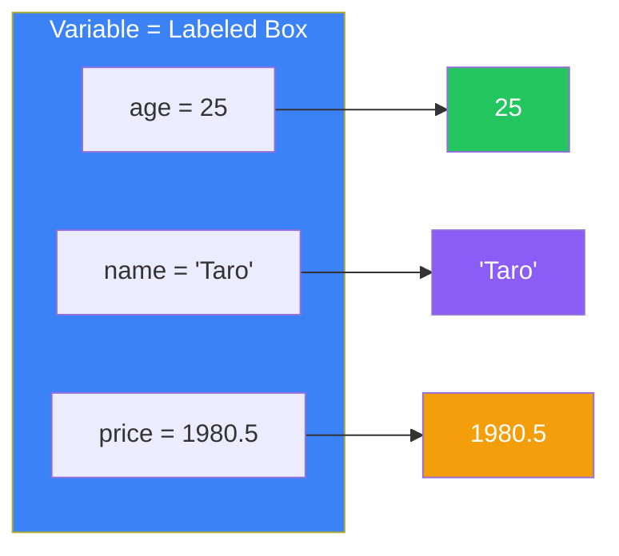
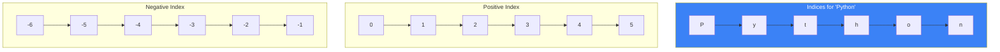
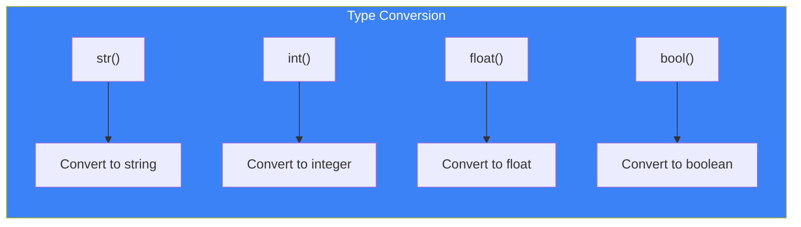

# Day 2: Variables and Data Types

## What You'll Learn Today

- What variables are and how to use them
- Numeric types (integers and floating-point numbers)
- String basics and operations
- Boolean type (True/False)
- Type conversion

---

## What Are Variables?

Variables are like "labeled boxes" for storing data. You give a value a name so you can reference or modify it later.



### Creating and Assigning Variables

In Python, use `=` (assignment operator) to assign values to variables:

```python
# Create variables and assign values
age = 25
name = "Taro"
price = 1980.5

# Display variable values
print(age)    # 25
print(name)   # Taro
print(price)  # 1980.5
```

### Reassigning Variables

Variable values can be changed later:

```python
counter = 1
print(counter)  # 1

counter = 2
print(counter)  # 2

counter = counter + 1
print(counter)  # 3
```

### Variable Naming Rules

| Rule | Valid Examples | Invalid Examples |
|------|----------------|------------------|
| Can use letters, numbers, underscores | `user_name`, `count2` | - |
| Cannot start with a number | `name1` | `1name` ❌ |
| Cannot use reserved words | `my_class` | `class` ❌ |
| Case-sensitive | `Age` and `age` are different | - |

**Recommended naming style (snake_case)**:

```python
# Good examples
user_name = "Taro"
total_price = 1000
max_retry_count = 3

# Examples to avoid
userName = "Taro"  # camelCase (not preferred in Python)
x = "Taro"         # Meaningless name
```

---

## Numeric Types

Python has two main numeric types.

### Integers (int)

Numbers without decimal points:

```python
age = 25
year = 2024
negative = -100
big_number = 1_000_000  # Underscores for readability

print(type(age))  # <class 'int'>
```

### Floating-Point Numbers (float)

Numbers with decimal points:

```python
pi = 3.14159
temperature = -5.5
price = 1980.0

print(type(pi))  # <class 'float'>
```

### Numeric Operations

```python
a = 10
b = 3

print(a + b)   # 13    Addition
print(a - b)   # 7     Subtraction
print(a * b)   # 30    Multiplication
print(a / b)   # 3.333... Division (always float)
print(a // b)  # 3     Floor division
print(a % b)   # 1     Modulus (remainder)
print(a ** b)  # 1000  Exponentiation
```

### Compound Assignment Operators

```python
count = 10

count += 5   # Same as count = count + 5
print(count)  # 15

count -= 3   # Same as count = count - 3
print(count)  # 12

count *= 2   # Same as count = count * 2
print(count)  # 24
```

| Operator | Meaning | Example |
|----------|---------|---------|
| `+=` | Add and assign | `x += 5` |
| `-=` | Subtract and assign | `x -= 3` |
| `*=` | Multiply and assign | `x *= 2` |
| `/=` | Divide and assign | `x /= 4` |
| `//=` | Floor divide and assign | `x //= 2` |
| `%=` | Modulus and assign | `x %= 3` |

---

## Strings (str)

Strings represent text data. Enclose them in single quotes `'` or double quotes `"`.

### Creating Strings

```python
# Both work
name = 'Taro'
message = "Hello, World!"

# Multi-line strings
long_text = """This is
a multi-line
string"""

print(long_text)
```

### String Concatenation

```python
first_name = "Taro"
last_name = "Yamada"

# Concatenate with +
full_name = first_name + " " + last_name
print(full_name)  # Taro Yamada

# Repeat with *
line = "-" * 20
print(line)  # --------------------
```

### f-strings (Formatted String Literals)

The most convenient way to format strings, available since Python 3.6:

```python
name = "Taro"
age = 25

# Using f-strings (recommended)
message = f"My name is {name} and I am {age} years old."
print(message)  # My name is Taro and I am 25 years old.

# Calculations are possible
price = 1000
tax = 0.1
print(f"Total with tax: ${price * (1 + tax)}")  # Total with tax: $1100.0

# Format specifications
pi = 3.14159265
print(f"Pi: {pi:.2f}")  # Pi: 3.14
```

### String Methods

```python
text = "  Hello, Python!  "

# Case conversion
print(text.upper())      # "  HELLO, PYTHON!  "
print(text.lower())      # "  hello, python!  "

# Strip whitespace
print(text.strip())      # "Hello, Python!"

# Replace
print(text.replace("Python", "World"))  # "  Hello, World!  "

# Split
words = "apple,banana,cherry".split(",")
print(words)  # ['apple', 'banana', 'cherry']

# Length
print(len(text))  # 18
```

### String Indexing and Slicing



```python
text = "Python"

# Get a single character by index
print(text[0])   # P (first character)
print(text[2])   # t
print(text[-1])  # n (last character)

# Get substrings with slicing
print(text[0:3])  # Pyt (0 to 2)
print(text[2:])   # thon (2 to end)
print(text[:3])   # Pyt (start to 2)
print(text[::2])  # Pto (every other character)
```

---

## Boolean Type (bool)

Boolean type has only two values: `True` and `False`.

```python
is_active = True
is_admin = False

print(type(is_active))  # <class 'bool'>
```

### Comparison Operators

Comparison operators return Boolean values:

```python
a = 10
b = 5

print(a > b)   # True  (greater than)
print(a < b)   # False (less than)
print(a >= b)  # True  (greater than or equal)
print(a <= b)  # False (less than or equal)
print(a == b)  # False (equal)
print(a != b)  # True  (not equal)
```

### Logical Operators

```python
x = True
y = False

print(x and y)  # False (True only if both are True)
print(x or y)   # True (True if either is True)
print(not x)    # False (negation)
```

| Operator | Meaning | Example |
|----------|---------|---------|
| `and` | Logical AND | `True and False` → `False` |
| `or` | Logical OR | `True or False` → `True` |
| `not` | Negation | `not True` → `False` |

---

## Type Conversion

You can convert data between different types.

```python
# String → Integer
age_str = "25"
age = int(age_str)
print(age + 5)  # 30

# Integer → String
number = 42
text = str(number)
print("Number: " + text)  # Number: 42

# String → Float
price_str = "19.99"
price = float(price_str)
print(price * 2)  # 39.98

# Float → Integer (truncates decimal)
pi = 3.14159
print(int(pi))  # 3
```



### Checking Types with type()

```python
print(type(42))        # <class 'int'>
print(type(3.14))      # <class 'float'>
print(type("Hello"))   # <class 'str'>
print(type(True))      # <class 'bool'>
```

---

## Getting User Input

Use the `input()` function to receive user input:

```python
name = input("What is your name? ")
print(f"Hello, {name}!")

# Convert to number if needed
age_str = input("Enter your age: ")
age = int(age_str)
print(f"Next year you'll be {age + 1}!")
```

---

## The None Type

`None` represents the absence of a value:

```python
result = None
print(result)       # None
print(type(result)) # <class 'NoneType'>

# Check if value is None
if result is None:
    print("No result yet")
```

---

## Summary

| Data Type | Description | Examples |
|-----------|-------------|----------|
| **int** | Integer | `42`, `-5`, `1_000` |
| **float** | Floating-point number | `3.14`, `-0.5`, `1.0e8` |
| **str** | String | `"Hello"`, `'Python'` |
| **bool** | Boolean | `True`, `False` |
| **None** | No value | `None` |

### Key Takeaways

1. Variables use `=` for assignment and can be changed anytime
2. Use meaningful variable names (snake_case recommended)
3. f-strings make it easy to embed variables in strings
4. Use `type()` to check data types
5. Type conversion lets you transform data between types

---

## Practice Exercises

### Exercise 1: Basics
Create the following variables and check each type with `type()`:
- Your age (integer)
- Your height (floating-point)
- Your name (string)
- Whether you like programming (boolean)

### Exercise 2: Calculation
Write a program that asks the user for two numbers and displays their sum, difference, product, and quotient.

### Challenge
Write a program that asks the user for their birth year and calculates their current age. Display the result using an f-string like "You are XX years old."

---

## References

- [Python Docs - Numeric Types](https://docs.python.org/3/library/stdtypes.html#numeric-types-int-float-complex)
- [Python Docs - Strings](https://docs.python.org/3/library/stdtypes.html#text-sequence-type-str)
- [Python Docs - f-strings](https://docs.python.org/3/reference/lexical_analysis.html#f-strings)

---

**Next Up**: In Day 3, you'll learn about "Control Flow." Master conditionals and loops to control your program's execution!
