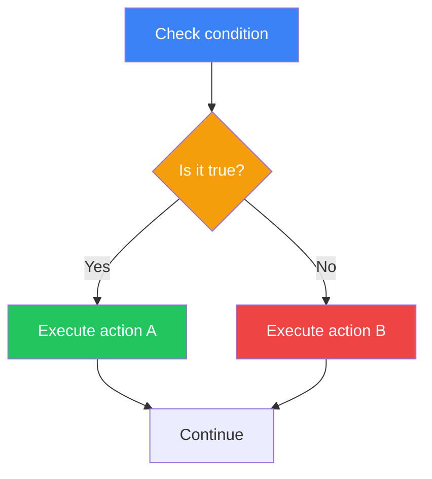
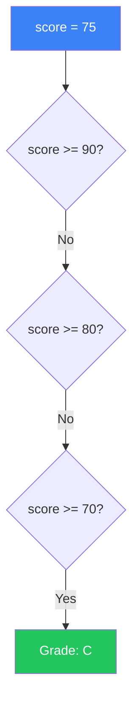
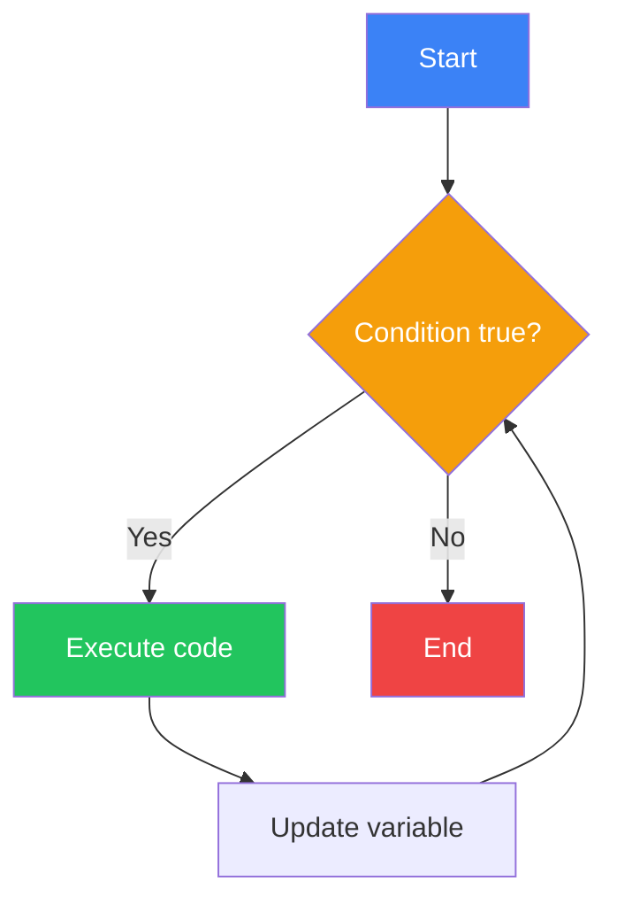

# Day 3: Control Flow

## What You'll Learn Today

- Conditional statements (if, elif, else)
- Comparison and logical operators
- Match statement (Python 3.10+)
- Loops (while, for)
- break, continue, and else

---

## Conditional Statements

Programs can execute different code based on conditions. This is called "branching."



### Basic if Statement

```python
age = 20

if age >= 18:
    print("You are an adult")
```

**Important**: In Python, indentation is part of the syntax. The block after `if` must be indented.

### if-else Statement

```python
age = 15

if age >= 18:
    print("You are an adult")
else:
    print("You are a minor")
```

### if-elif-else Statement

For checking multiple conditions:

```python
score = 75

if score >= 90:
    print("Grade: A")
elif score >= 80:
    print("Grade: B")
elif score >= 70:
    print("Grade: C")
elif score >= 60:
    print("Grade: D")
else:
    print("Grade: F")
```



### Nested Conditionals

You can nest conditionals inside each other:

```python
age = 25
has_license = True

if age >= 18:
    if has_license:
        print("You can drive")
    else:
        print("Please get a license")
else:
    print("Wait until you're 18")
```

---

## Comparison Operators

Operators used in conditional expressions:

| Operator | Meaning | Example |
|----------|---------|---------|
| `==` | Equal to | `x == 5` |
| `!=` | Not equal to | `x != 5` |
| `>` | Greater than | `x > 5` |
| `<` | Less than | `x < 5` |
| `>=` | Greater than or equal | `x >= 5` |
| `<=` | Less than or equal | `x <= 5` |

```python
x = 10

print(x == 10)  # True
print(x != 5)   # True
print(x > 5)    # True
print(x < 15)   # True
```

### String Comparison

```python
name = "Python"

print(name == "Python")  # True
print(name == "python")  # False (case-sensitive)
print(name.lower() == "python")  # True
```

---

## Logical Operators

Combine multiple conditions:

| Operator | Meaning | Example |
|----------|---------|---------|
| `and` | Both must be True | `x > 0 and x < 10` |
| `or` | Either can be True | `x < 0 or x > 10` |
| `not` | Negation | `not x > 5` |

```python
age = 25
income = 500000

# and: Both conditions must be met
if age >= 20 and income >= 300000:
    print("Eligible for loan application")

# or: Either condition must be met
day = "Saturday"
if day == "Saturday" or day == "Sunday":
    print("It's the weekend!")

# not: Reverse the condition
is_raining = False
if not is_raining:
    print("You can go outside")
```

### Chained Comparisons

Python allows mathematical notation:

```python
x = 5

# Traditional way
if x >= 1 and x <= 10:
    print("Between 1 and 10")

# Pythonic way
if 1 <= x <= 10:
    print("Between 1 and 10")
```

---

## The in Operator

Check if a value is in a sequence:

```python
fruits = ["apple", "banana", "cherry"]

if "banana" in fruits:
    print("We have bananas")

if "grape" not in fruits:
    print("We don't have grapes")

# Works with strings too
text = "Hello, Python!"
if "Python" in text:
    print("Contains Python")
```

---

## Truthiness and Falsiness

In Python, various values evaluate as `True` or `False`:

| Falsy Values | Truthy Values |
|--------------|---------------|
| `False` | `True` |
| `None` | Everything else |
| `0`, `0.0` | Non-zero numbers |
| `""` (empty string) | Non-empty strings |
| `[]` (empty list) | Non-empty lists |
| `{}` (empty dict) | Non-empty dicts |

```python
# Empty list is Falsy
items = []
if items:
    print("Has items")
else:
    print("List is empty")

# Zero is Falsy
count = 0
if count:
    print("Count is greater than 0")
else:
    print("Count is 0")
```

---

## Match Statement (Python 3.10+)

Structural pattern matching introduced in Python 3.10:

```python
command = "start"

match command:
    case "start":
        print("Starting program")
    case "stop":
        print("Stopping program")
    case "restart":
        print("Restarting program")
    case _:
        print("Unknown command")
```

### Pattern Matching Examples

```python
def describe_point(point):
    match point:
        case (0, 0):
            return "Origin"
        case (0, y):
            return f"On Y-axis: y={y}"
        case (x, 0):
            return f"On X-axis: x={x}"
        case (x, y):
            return f"Point: ({x}, {y})"

print(describe_point((0, 0)))   # Origin
print(describe_point((0, 5)))   # On Y-axis: y=5
print(describe_point((3, 4)))   # Point: (3, 4)
```

---

## while Loop

Executes code repeatedly while a condition is `True`:



```python
count = 1
while count <= 5:
    print(count)
    count += 1

# Output: 1 2 3 4 5
```

### Beware of Infinite Loops

```python
# Bad: Infinite loop (forgot to update count)
# count = 1
# while count <= 5:
#     print(count)  # Loops forever since count never changes

# Good: Always progress toward the exit condition
count = 1
while count <= 5:
    print(count)
    count += 1  # Don't forget this!
```

---

## for Loop

Iterates through elements of a sequence (list, string, etc.):

```python
# Process list elements
fruits = ["apple", "banana", "cherry"]
for fruit in fruits:
    print(fruit)

# Process each character in a string
for char in "Python":
    print(char)
```

### The range() Function

Generates a sequence of numbers:

```python
# 0 to 4
for i in range(5):
    print(i)  # 0, 1, 2, 3, 4

# 1 to 5
for i in range(1, 6):
    print(i)  # 1, 2, 3, 4, 5

# 0 to 10, step by 2
for i in range(0, 11, 2):
    print(i)  # 0, 2, 4, 6, 8, 10

# Reverse (10 down to 1)
for i in range(10, 0, -1):
    print(i)  # 10, 9, 8, ..., 1
```

### The enumerate() Function

Get both index and value:

```python
fruits = ["apple", "banana", "cherry"]

for index, fruit in enumerate(fruits):
    print(f"{index}: {fruit}")

# Output:
# 0: apple
# 1: banana
# 2: cherry
```

---

## The break Statement

Exits the loop early:

```python
for i in range(10):
    if i == 5:
        break
    print(i)

# Output: 0, 1, 2, 3, 4
```

### Practical Example: Input Validation

```python
while True:
    password = input("Enter password: ")
    if password == "secret123":
        print("Login successful!")
        break
    print("Wrong password. Try again.")
```

---

## The continue Statement

Skips to the next iteration:

```python
for i in range(10):
    if i % 2 == 0:  # Skip even numbers
        continue
    print(i)

# Output: 1, 3, 5, 7, 9 (odd numbers only)
```

---

## Loop else Clause

Executes when the loop completes without `break`:

```python
# When break doesn't occur
for i in range(5):
    print(i)
else:
    print("Loop completed normally")

# When break occurs
for i in range(5):
    if i == 3:
        break
    print(i)
else:
    print("This won't print")
```

### Practical Example: Search

```python
numbers = [1, 3, 5, 7, 9]
target = 4

for num in numbers:
    if num == target:
        print(f"Found {target}")
        break
else:
    print(f"{target} not found")
```

---

## Nested Loops

Loops can be placed inside other loops:

```python
# Multiplication table
for i in range(1, 10):
    for j in range(1, 10):
        print(f"{i * j:2}", end=" ")
    print()  # New line
```

Output:
```
 1  2  3  4  5  6  7  8  9
 2  4  6  8 10 12 14 16 18
 3  6  9 12 15 18 21 24 27
...
```

---

## Summary

| Syntax | Description | Example |
|--------|-------------|---------|
| `if` | Execute if condition is true | `if x > 0:` |
| `elif` | Execute if previous false and this true | `elif x < 0:` |
| `else` | Execute if all conditions false | `else:` |
| `match` | Pattern matching (3.10+) | `match value:` |
| `while` | Loop while condition is true | `while count < 10:` |
| `for` | Iterate over sequence | `for item in items:` |
| `break` | Exit the loop | `break` |
| `continue` | Skip to next iteration | `continue` |

### Key Takeaways

1. Python uses indentation to define code blocks
2. `if-elif-else` efficiently checks multiple conditions
3. `while` is condition-based, `for` is sequence-based
4. `break` exits the loop, `continue` skips to next iteration
5. Loop `else` runs when no `break` occurred

---

## Practice Exercises

### Exercise 1: Basics
Write a program that asks for a number and determines if it's positive, negative, or zero.

### Exercise 2: FizzBuzz
Display numbers 1-30, but print "Fizz" for multiples of 3, "Buzz" for multiples of 5, and "FizzBuzz" for multiples of both.

### Challenge
Write a program that asks for a positive integer and determines if it's a prime number.

---

## References

- [Python Docs - if Statements](https://docs.python.org/3/tutorial/controlflow.html#if-statements)
- [Python Docs - for Statements](https://docs.python.org/3/tutorial/controlflow.html#for-statements)
- [Python Docs - match Statements](https://docs.python.org/3/tutorial/controlflow.html#match-statements)

---

**Next Up**: In Day 4, you'll learn about "Data Structures." Master lists, tuples, dictionaries, and sets!
