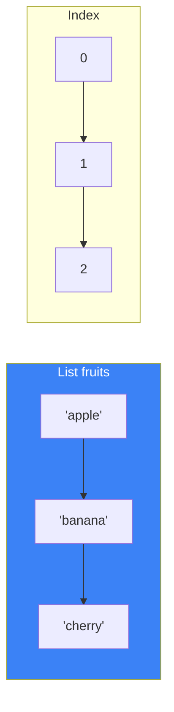
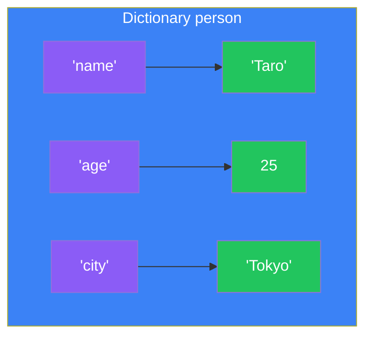
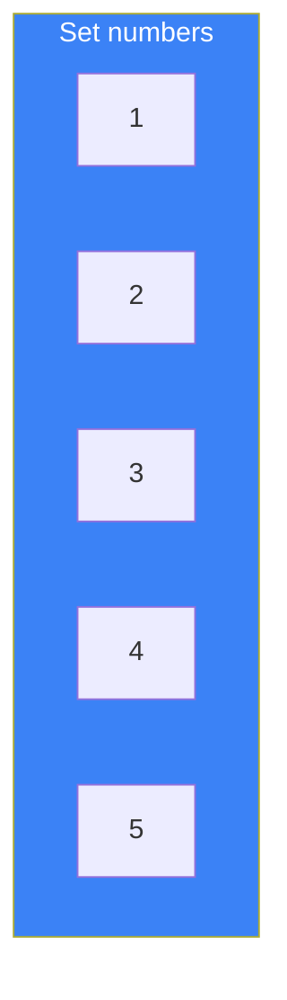
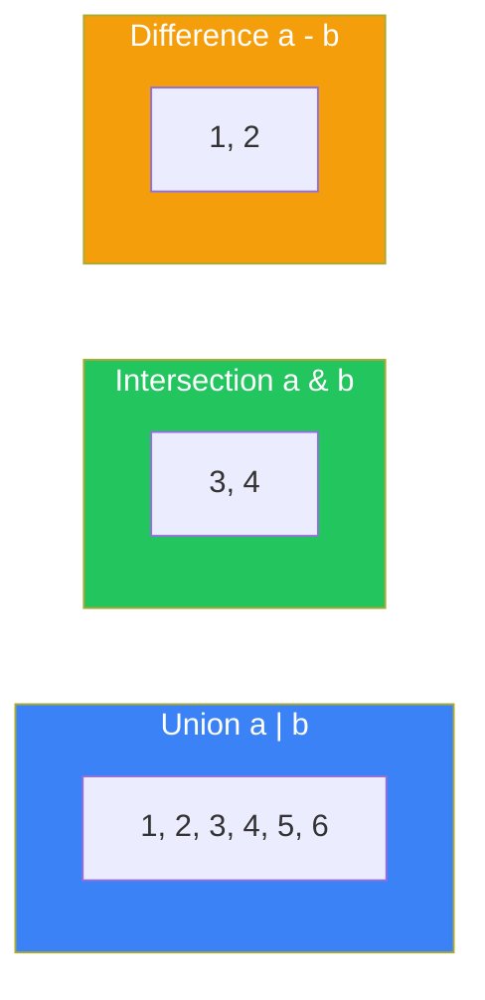

# Day 4: Data Structures

## What You'll Learn Today

- Lists: Ordered, mutable collections
- Tuples: Ordered, immutable collections
- Dictionaries: Key-value pairs
- Sets: Collections without duplicates
- List comprehensions

---

## Lists

Lists are the most commonly used data structure for storing multiple values in order.



### Creating Lists

```python
# Empty list
empty = []
also_empty = list()

# List with values
fruits = ["apple", "banana", "cherry"]
numbers = [1, 2, 3, 4, 5]
mixed = [1, "hello", 3.14, True]  # Different types allowed
```

### Accessing Elements

```python
fruits = ["apple", "banana", "cherry", "date"]

# Access by index
print(fruits[0])   # apple (first)
print(fruits[2])   # cherry
print(fruits[-1])  # date (last)
print(fruits[-2])  # cherry (second to last)
```

### Slicing

```python
fruits = ["apple", "banana", "cherry", "date", "elderberry"]

print(fruits[1:4])   # ['banana', 'cherry', 'date']
print(fruits[:3])    # ['apple', 'banana', 'cherry']
print(fruits[2:])    # ['cherry', 'date', 'elderberry']
print(fruits[::2])   # ['apple', 'cherry', 'elderberry'] (every other)
print(fruits[::-1])  # Reversed
```

### Modifying Lists

```python
fruits = ["apple", "banana", "cherry"]

# Change element
fruits[1] = "blueberry"
print(fruits)  # ['apple', 'blueberry', 'cherry']

# Add elements
fruits.append("date")        # Add to end
fruits.insert(1, "apricot")  # Insert at position

# Remove elements
fruits.remove("apple")  # Remove by value
del fruits[0]           # Remove by index
popped = fruits.pop()   # Remove and return last item
popped = fruits.pop(0)  # Remove and return item at index
```

### Key List Methods

| Method | Description | Example |
|--------|-------------|---------|
| `append(x)` | Add to end | `list.append(5)` |
| `insert(i, x)` | Insert at position i | `list.insert(0, 5)` |
| `remove(x)` | Remove value x | `list.remove(5)` |
| `pop(i)` | Remove and return item at i | `list.pop(0)` |
| `index(x)` | Return index of x | `list.index(5)` |
| `count(x)` | Count occurrences of x | `list.count(5)` |
| `sort()` | Sort in place | `list.sort()` |
| `reverse()` | Reverse in place | `list.reverse()` |
| `copy()` | Return a copy | `new = list.copy()` |
| `clear()` | Remove all items | `list.clear()` |

### Combining Lists

```python
list1 = [1, 2, 3]
list2 = [4, 5, 6]

# Concatenate with +
combined = list1 + list2  # [1, 2, 3, 4, 5, 6]

# Extend in place
list1.extend(list2)  # list1 becomes [1, 2, 3, 4, 5, 6]

# Repeat with *
repeated = [0] * 5  # [0, 0, 0, 0, 0]
```

### Sorting Lists

```python
numbers = [3, 1, 4, 1, 5, 9, 2, 6]

# sort(): Modifies original list
numbers.sort()
print(numbers)  # [1, 1, 2, 3, 4, 5, 6, 9]

numbers.sort(reverse=True)
print(numbers)  # [9, 6, 5, 4, 3, 2, 1, 1]

# sorted(): Returns new list
original = [3, 1, 4, 1, 5]
sorted_list = sorted(original)
print(original)     # [3, 1, 4, 1, 5] (unchanged)
print(sorted_list)  # [1, 1, 3, 4, 5]
```

---

## Tuples

Tuples are similar to lists but cannot be modified after creation (immutable).

```python
# Creating tuples
coordinates = (10, 20)
rgb = (255, 128, 0)
single = (42,)  # Single element requires comma

# Access (same as lists)
print(coordinates[0])  # 10
print(rgb[1:])         # (128, 0)

# Cannot modify
# coordinates[0] = 5  # TypeError!
```

### Tuple Unpacking

```python
# Assign to multiple variables at once
point = (3, 4)
x, y = point
print(x)  # 3
print(y)  # 4

# Return multiple values from function
def get_min_max(numbers):
    return min(numbers), max(numbers)

minimum, maximum = get_min_max([3, 1, 4, 1, 5])
print(minimum, maximum)  # 1 5

# Swap variables
a, b = 1, 2
a, b = b, a
print(a, b)  # 2 1
```

### Tuple vs List

| Property | Tuple | List |
|----------|-------|------|
| Mutable | ❌ | ✅ |
| Brackets | `()` | `[]` |
| Use case | Fixed data | Variable data |
| Dict key | Can be used | Cannot be used |
| Speed | Faster | Slower |

---

## Dictionaries (dict)

Dictionaries store data as key-value pairs.



### Creating Dictionaries

```python
# Empty dictionary
empty = {}
also_empty = dict()

# Dictionary with values
person = {
    "name": "Taro",
    "age": 25,
    "city": "Tokyo"
}

# Using dict()
person = dict(name="Taro", age=25, city="Tokyo")
```

### Accessing Values

```python
person = {"name": "Taro", "age": 25, "city": "Tokyo"}

# Access by key
print(person["name"])  # Taro

# Use get() (no error if key doesn't exist)
print(person.get("name"))      # Taro
print(person.get("country"))   # None
print(person.get("country", "Japan"))  # Japan (default value)
```

### Modifying Dictionaries

```python
person = {"name": "Taro", "age": 25}

# Update value
person["age"] = 26

# Add new key
person["city"] = "Tokyo"

# Update multiple
person.update({"age": 27, "job": "Engineer"})

# Delete key
del person["city"]
removed = person.pop("age")  # Get value and delete
```

### Dictionary Methods

| Method | Description | Example |
|--------|-------------|---------|
| `get(key, default)` | Get value | `d.get("name", "Unknown")` |
| `keys()` | Return keys | `d.keys()` |
| `values()` | Return values | `d.values()` |
| `items()` | Return key-value pairs | `d.items()` |
| `pop(key)` | Remove and return value | `d.pop("name")` |
| `update(dict)` | Update dictionary | `d.update({"a": 1})` |
| `clear()` | Remove all items | `d.clear()` |

### Looping Through Dictionaries

```python
person = {"name": "Taro", "age": 25, "city": "Tokyo"}

# Loop through keys
for key in person:
    print(key)

# Loop through values
for value in person.values():
    print(value)

# Loop through key-value pairs
for key, value in person.items():
    print(f"{key}: {value}")
```

### Checking for Keys

```python
person = {"name": "Taro", "age": 25}

if "name" in person:
    print("name key exists")

if "country" not in person:
    print("country key doesn't exist")
```

---

## Sets

Sets are collections of unique values (no duplicates).



### Creating Sets

```python
# Empty set
empty = set()  # Note: {} creates empty dict

# Set with values
numbers = {1, 2, 3, 4, 5}
fruits = {"apple", "banana", "cherry"}

# Create from list (removes duplicates)
numbers = set([1, 2, 2, 3, 3, 3])
print(numbers)  # {1, 2, 3}
```

### Set Operations

```python
numbers = {1, 2, 3}

# Add
numbers.add(4)
print(numbers)  # {1, 2, 3, 4}

# Remove
numbers.remove(2)     # Error if not exists
numbers.discard(10)   # No error if not exists

# Check membership
print(3 in numbers)  # True
```

### Set Theory Operations

```python
a = {1, 2, 3, 4}
b = {3, 4, 5, 6}

# Union (in either set)
print(a | b)  # {1, 2, 3, 4, 5, 6}
print(a.union(b))

# Intersection (in both sets)
print(a & b)  # {3, 4}
print(a.intersection(b))

# Difference (in a but not b)
print(a - b)  # {1, 2}
print(a.difference(b))

# Symmetric difference (in one but not both)
print(a ^ b)  # {1, 2, 5, 6}
print(a.symmetric_difference(b))
```



---

## List Comprehensions

A concise way to create lists.

### Basic Form

```python
# Traditional approach
squares = []
for x in range(5):
    squares.append(x ** 2)
print(squares)  # [0, 1, 4, 9, 16]

# List comprehension
squares = [x ** 2 for x in range(5)]
print(squares)  # [0, 1, 4, 9, 16]
```

### With Condition

```python
# Only squares of even numbers
even_squares = [x ** 2 for x in range(10) if x % 2 == 0]
print(even_squares)  # [0, 4, 16, 36, 64]

# Using if-else
results = ["even" if x % 2 == 0 else "odd" for x in range(5)]
print(results)  # ['even', 'odd', 'even', 'odd', 'even']
```

### Nested Loops

```python
# Multiplication table pairs
pairs = [(i, j) for i in range(1, 4) for j in range(1, 4)]
print(pairs)
# [(1, 1), (1, 2), (1, 3), (2, 1), (2, 2), (2, 3), (3, 1), (3, 2), (3, 3)]
```

### Dictionary Comprehension

```python
# Numbers as keys, squares as values
squares = {x: x ** 2 for x in range(5)}
print(squares)  # {0: 0, 1: 1, 2: 4, 3: 9, 4: 16}
```

### Set Comprehension

```python
# Set of squared values
squares = {x ** 2 for x in range(-3, 4)}
print(squares)  # {0, 1, 4, 9} (duplicates removed)
```

---

## Summary

| Data Structure | Brackets | Characteristics | Use Case |
|----------------|----------|-----------------|----------|
| **list** | `[]` | Ordered, mutable | General collections |
| **tuple** | `()` | Ordered, immutable | Fixed data, dict keys |
| **dict** | `{}` | Key-value pairs | Named data |
| **set** | `{}` | No duplicates, unordered | Deduplication, set operations |

### Key Takeaways

1. Lists are the most versatile—add, remove, modify freely
2. Tuples are immutable but can be used as dictionary keys
3. Dictionaries access values by key (O(1) fast lookup)
4. Sets automatically remove duplicates and support set operations
5. Comprehensions make code more concise

---

## Practice Exercises

### Exercise 1: List Operations
Create a list of numbers 1-10 and extract only the even numbers into a new list.

### Exercise 2: Dictionary
Create a dictionary with 5 people's names and ages, then calculate and display the average age.

### Challenge
Write a program using sets to find the common elements and unique elements between two lists.

```python
list1 = [1, 2, 3, 4, 5]
list2 = [4, 5, 6, 7, 8]
# Common: [4, 5]
# Only in list1: [1, 2, 3]
# Only in list2: [6, 7, 8]
```

---

## References

- [Python Docs - Lists](https://docs.python.org/3/tutorial/datastructures.html)
- [Python Docs - Dictionaries](https://docs.python.org/3/tutorial/datastructures.html#dictionaries)
- [Python Docs - Sets](https://docs.python.org/3/tutorial/datastructures.html#sets)

---

**Next Up**: In Day 5, you'll learn about "Functions." Organize your code into reusable pieces!
