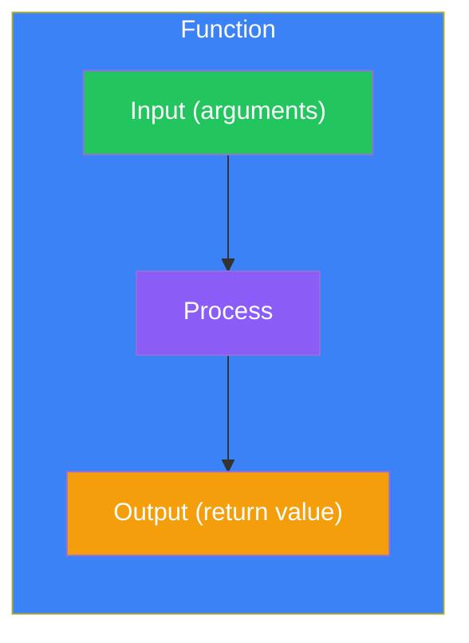
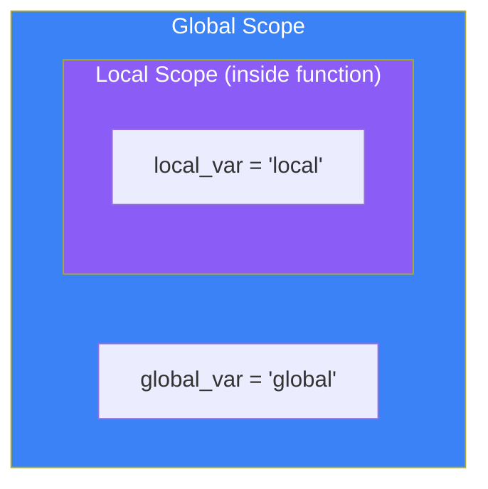
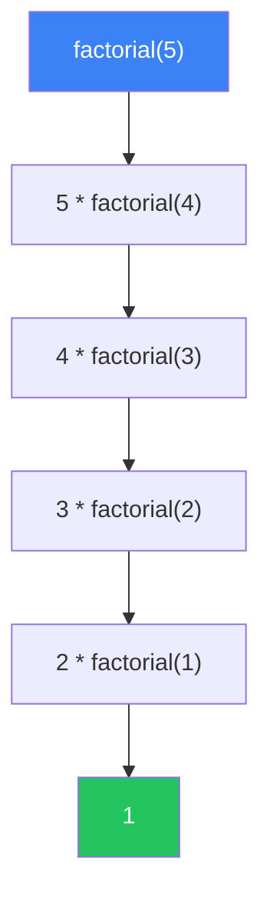

# Day 5: Functions

## What You'll Learn Today

- Defining and calling functions
- Arguments (positional, keyword, default)
- Return values
- Scope (variable visibility)
- Lambda functions
- Decorator basics

---

## What Are Functions?

Functions are reusable blocks of code that perform specific tasks.



### Why Use Functions?

| Benefit | Description |
|---------|-------------|
| **Reusability** | Write once, use many times |
| **Readability** | Organized code is easier to understand |
| **Maintainability** | Changes only need to be made in one place |
| **Testability** | Can be tested individually |

---

## Defining and Calling Functions

### Basic Syntax

```python
def function_name(parameters):
    """Documentation string"""
    # Process
    return value
```

### Simple Example

```python
# Define a function
def greet():
    print("Hello, World!")

# Call the function
greet()  # Hello, World!
```

### Function with Parameters

```python
def greet(name):
    print(f"Hello, {name}!")

greet("Taro")    # Hello, Taro!
greet("Hanako")  # Hello, Hanako!
```

### Function with Return Value

```python
def add(a, b):
    return a + b

result = add(3, 5)
print(result)  # 8

# Functions without return statement return None
def no_return():
    print("Processing")

result = no_return()  # Processing
print(result)         # None
```

---

## Types of Arguments

### Positional Arguments

Arguments are passed in order:

```python
def describe_person(name, age, city):
    print(f"{name} is {age} years old and lives in {city}.")

describe_person("Taro", 25, "Tokyo")
# Taro is 25 years old and lives in Tokyo.
```

### Keyword Arguments

You can specify argument names:

```python
describe_person(name="Hanako", city="Osaka", age=30)
# Hanako is 30 years old and lives in Osaka.

# Mix positional and keyword (positional first)
describe_person("Jiro", age=20, city="Nagoya")
```

### Default Arguments

You can set default values:

```python
def greet(name, greeting="Hello"):
    print(f"{greeting}, {name}!")

greet("Taro")            # Hello, Taro!
greet("Taro", "Hi")      # Hi, Taro!
greet("Taro", greeting="Good morning")  # Good morning, Taro!
```

**Note**: Default arguments must come after non-default arguments.

```python
# Correct
def func(a, b, c=10):
    pass

# Error
# def func(a, b=10, c):  # SyntaxError
#     pass
```

### Variable-Length Arguments (*args)

Accept any number of positional arguments:

```python
def sum_all(*numbers):
    total = 0
    for n in numbers:
        total += n
    return total

print(sum_all(1, 2, 3))        # 6
print(sum_all(1, 2, 3, 4, 5))  # 15
```

### Variable-Length Keyword Arguments (**kwargs)

Accept any number of keyword arguments:

```python
def print_info(**kwargs):
    for key, value in kwargs.items():
        print(f"{key}: {value}")

print_info(name="Taro", age=25, city="Tokyo")
# name: Taro
# age: 25
# city: Tokyo
```

### Combining Argument Types

```python
def example(a, b, *args, **kwargs):
    print(f"a: {a}")
    print(f"b: {b}")
    print(f"args: {args}")
    print(f"kwargs: {kwargs}")

example(1, 2, 3, 4, 5, x=10, y=20)
# a: 1
# b: 2
# args: (3, 4, 5)
# kwargs: {'x': 10, 'y': 20}
```

---

## Return Values

### Returning a Single Value

```python
def square(n):
    return n ** 2

result = square(5)
print(result)  # 25
```

### Returning Multiple Values

Values are returned as a tuple:

```python
def min_max(numbers):
    return min(numbers), max(numbers)

minimum, maximum = min_max([3, 1, 4, 1, 5, 9])
print(minimum)  # 1
print(maximum)  # 9
```

### Early Return

Exit early based on conditions:

```python
def divide(a, b):
    if b == 0:
        return None  # Prevent division by zero
    return a / b

print(divide(10, 2))  # 5.0
print(divide(10, 0))  # None
```

---

## Scope

The range where a variable is valid is called its "scope."



### Local and Global Variables

```python
global_var = "global"

def example():
    local_var = "local"
    print(global_var)  # Can access global
    print(local_var)   # Local variable

example()
# print(local_var)  # Error! Can't access outside function
```

### The global Keyword

To modify global variables inside a function:

```python
counter = 0

def increment():
    global counter
    counter += 1

increment()
increment()
print(counter)  # 2
```

**Note**: Avoid overusing `global`. Use return values instead.

```python
# Recommended approach
def increment(counter):
    return counter + 1

counter = 0
counter = increment(counter)
counter = increment(counter)
print(counter)  # 2
```

---

## Documentation Strings (Docstrings)

Describe what your function does:

```python
def calculate_area(width, height):
    """
    Calculate the area of a rectangle.

    Args:
        width: The width of the rectangle
        height: The height of the rectangle

    Returns:
        The area (width * height)
    """
    return width * height

# View documentation
print(calculate_area.__doc__)
help(calculate_area)
```

---

## Lambda Functions

Define short anonymous functions:

```python
# Regular function
def square(x):
    return x ** 2

# Lambda function
square = lambda x: x ** 2

print(square(5))  # 25
```

### Lambda Use Cases

```python
# As a sort key
students = [
    {"name": "Taro", "score": 80},
    {"name": "Hanako", "score": 95},
    {"name": "Jiro", "score": 70}
]

# Sort by score
students.sort(key=lambda x: x["score"])
print(students)

# With filter()
numbers = [1, 2, 3, 4, 5, 6, 7, 8, 9, 10]
even = list(filter(lambda x: x % 2 == 0, numbers))
print(even)  # [2, 4, 6, 8, 10]

# With map()
squares = list(map(lambda x: x ** 2, numbers))
print(squares)  # [1, 4, 9, 16, 25, 36, 49, 64, 81, 100]
```

---

## Functions as Arguments

In Python, functions can be passed as arguments:

```python
def apply_operation(x, y, operation):
    return operation(x, y)

def add(a, b):
    return a + b

def multiply(a, b):
    return a * b

print(apply_operation(5, 3, add))       # 8
print(apply_operation(5, 3, multiply))  # 15
```

---

## Decorators

A mechanism to extend function behavior:

```python
def log_decorator(func):
    def wrapper(*args, **kwargs):
        print(f"Calling function {func.__name__}")
        result = func(*args, **kwargs)
        print(f"Function {func.__name__} completed")
        return result
    return wrapper

@log_decorator
def greet(name):
    print(f"Hello, {name}!")

greet("Taro")
# Calling function greet
# Hello, Taro!
# Function greet completed
```

### Practical Decorator: Timing Execution

```python
import time

def timer(func):
    def wrapper(*args, **kwargs):
        start = time.time()
        result = func(*args, **kwargs)
        end = time.time()
        print(f"{func.__name__}: {end - start:.4f} seconds")
        return result
    return wrapper

@timer
def slow_function():
    time.sleep(1)
    return "Done"

slow_function()  # slow_function: 1.00XX seconds
```

---

## Recursive Functions

Functions that call themselves:

```python
def factorial(n):
    if n <= 1:
        return 1
    return n * factorial(n - 1)

print(factorial(5))  # 120 (5 * 4 * 3 * 2 * 1)
```



### Fibonacci Sequence

```python
def fibonacci(n):
    if n <= 1:
        return n
    return fibonacci(n - 1) + fibonacci(n - 2)

for i in range(10):
    print(fibonacci(i), end=" ")
# 0 1 1 2 3 5 8 13 21 34
```

**Note**: Python has a default recursion limit of about 1000. Avoid deep recursion or convert to loops.

---

## Summary

| Concept | Description | Example |
|---------|-------------|---------|
| **def** | Define a function | `def func():` |
| **return** | Return a value | `return result` |
| **Positional args** | Pass by position | `func(1, 2, 3)` |
| **Keyword args** | Pass by name | `func(a=1, b=2)` |
| **Default args** | Default values | `def func(x=10):` |
| ***args** | Variable positional | `def func(*args):` |
| ****kwargs** | Variable keyword | `def func(**kwargs):` |
| **lambda** | Anonymous function | `lambda x: x * 2` |

### Key Takeaways

1. Functions improve code reusability and readability
2. Default argument values are evaluated once at definition time
3. Local variables are only valid inside the function
4. Minimize use of `global`
5. Use lambda for short operations, regular functions for complex logic

---

## Practice Exercises

### Exercise 1: Basics
Create a function `max_of_two(a, b)` that returns the larger of two numbers.

### Exercise 2: List Processing
Create a function `filter_even(numbers)` that takes a list and returns a new list containing only even numbers.

### Challenge
Create a function `average(*args)` that accepts any number of arguments and returns their average. Return `None` if no arguments are provided.

---

## References

- [Python Docs - Defining Functions](https://docs.python.org/3/tutorial/controlflow.html#defining-functions)
- [Python Docs - Lambda Expressions](https://docs.python.org/3/tutorial/controlflow.html#lambda-expressions)
- [Python Docs - Docstrings](https://peps.python.org/pep-0257/)

---

**Next Up**: In Day 6, you'll learn about "Object-Oriented Programming." Enter the world of classes and objects!
