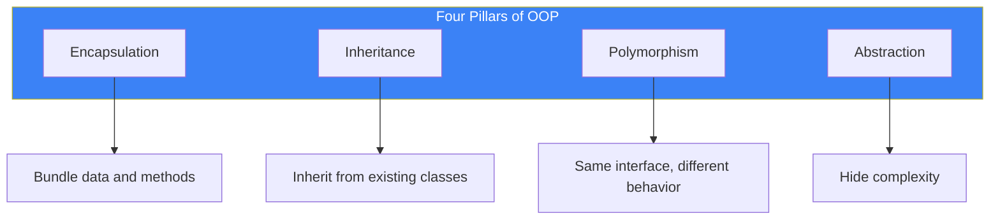
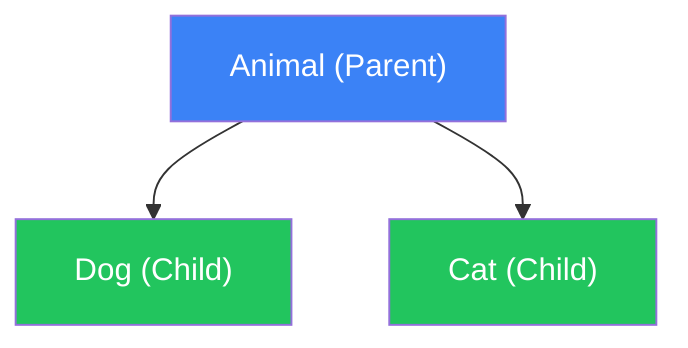

# Day 6: Object-Oriented Programming

## What You'll Learn Today

- Classes and objects basics
- Attributes and methods
- Constructor (`__init__`)
- Inheritance
- Encapsulation
- Special methods (magic methods)

---

## What is OOP?

Object-Oriented Programming (OOP) is a paradigm that organizes data and behavior into "objects."



### Classes vs Objects

| Concept | Description | Example |
|---------|-------------|---------|
| **Class** | Blueprint for objects | The concept of "Dog" |
| **Object** | Instance created from a class | "Buddy" the specific dog |
| **Attribute** | Data held by an object | name, age, breed |
| **Method** | Behavior of an object | bark, run, eat |

---

## Defining a Class

### Basic Syntax

```python
class ClassName:
    def __init__(self, parameters):
        self.attribute = parameters

    def method_name(self):
        # Code
```

### Simple Example

```python
class Dog:
    def __init__(self, name, age):
        self.name = name
        self.age = age

    def bark(self):
        print(f"{self.name} is barking!")

    def introduce(self):
        print(f"I'm {self.name}, {self.age} years old.")

# Create an object (instantiation)
my_dog = Dog("Buddy", 3)

# Call methods
my_dog.bark()       # Buddy is barking!
my_dog.introduce()  # I'm Buddy, 3 years old.

# Access attributes
print(my_dog.name)  # Buddy
print(my_dog.age)   # 3
```

### Understanding self

`self` refers to the instance itself. It must be the first parameter in method definitions.

```python
class Counter:
    def __init__(self):
        self.count = 0

    def increment(self):
        self.count += 1

    def get_count(self):
        return self.count

counter = Counter()
counter.increment()
counter.increment()
print(counter.get_count())  # 2
```

---

## Types of Attributes

### Instance Attributes

Unique to each object:

```python
class Person:
    def __init__(self, name):
        self.name = name  # Instance attribute

person1 = Person("Taro")
person2 = Person("Hanako")

print(person1.name)  # Taro
print(person2.name)  # Hanako
```

### Class Attributes

Shared by all objects:

```python
class Person:
    species = "Homo sapiens"  # Class attribute

    def __init__(self, name):
        self.name = name

person1 = Person("Taro")
person2 = Person("Hanako")

print(person1.species)  # Homo sapiens
print(person2.species)  # Homo sapiens
print(Person.species)   # Homo sapiens
```

---

## Constructor and Destructor

### `__init__` Constructor

Called automatically when an object is created:

```python
class Book:
    def __init__(self, title, author, pages=100):
        self.title = title
        self.author = author
        self.pages = pages
        print(f"'{self.title}' was created")

book = Book("Python Basics", "John Doe", 300)
# 'Python Basics' was created
```

### `__del__` Destructor

Called when an object is deleted:

```python
class Book:
    def __init__(self, title):
        self.title = title
        print(f"'{self.title}' was created")

    def __del__(self):
        print(f"'{self.title}' was deleted")

book = Book("Python Basics")  # 'Python Basics' was created
del book                       # 'Python Basics' was deleted
```

---

## Inheritance

Create new classes by inheriting features from existing classes.



### Basic Inheritance

```python
class Animal:
    def __init__(self, name):
        self.name = name

    def speak(self):
        print("Makes a sound")

class Dog(Animal):
    def speak(self):
        print(f"{self.name} says Woof!")

class Cat(Animal):
    def speak(self):
        print(f"{self.name} says Meow!")

dog = Dog("Buddy")
cat = Cat("Whiskers")

dog.speak()  # Buddy says Woof!
cat.speak()  # Whiskers says Meow!
```

### Using super() to Call Parent Class

```python
class Animal:
    def __init__(self, name, age):
        self.name = name
        self.age = age

class Dog(Animal):
    def __init__(self, name, age, breed):
        super().__init__(name, age)  # Call parent's __init__
        self.breed = breed

    def introduce(self):
        print(f"I'm {self.name}, a {self.breed}, {self.age} years old.")

dog = Dog("Buddy", 3, "Golden Retriever")
dog.introduce()  # I'm Buddy, a Golden Retriever, 3 years old.
```

### Method Overriding

Child classes can override parent methods:

```python
class Vehicle:
    def move(self):
        print("Moving")

class Car(Vehicle):
    def move(self):
        print("Driving on the road")

class Airplane(Vehicle):
    def move(self):
        print("Flying in the sky")

# Polymorphism: same method call, different behavior
vehicles = [Car(), Airplane()]
for v in vehicles:
    v.move()
# Driving on the road
# Flying in the sky
```

---

## Encapsulation

Protect data from direct external access; only allow manipulation through methods.

### Private Attributes

Attributes starting with underscore are treated as "private":

```python
class BankAccount:
    def __init__(self, initial_balance):
        self._balance = initial_balance  # Convention for private

    def deposit(self, amount):
        if amount > 0:
            self._balance += amount

    def withdraw(self, amount):
        if 0 < amount <= self._balance:
            self._balance -= amount
            return True
        return False

    def get_balance(self):
        return self._balance

account = BankAccount(1000)
account.deposit(500)
print(account.get_balance())  # 1500
```

### Name Mangling

Attributes starting with double underscore get their names changed:

```python
class Secret:
    def __init__(self):
        self.__hidden = "secret"

    def reveal(self):
        return self.__hidden

s = Secret()
print(s.reveal())       # secret
# print(s.__hidden)     # AttributeError
print(s._Secret__hidden)  # secret (accessible but not recommended)
```

---

## Properties

Customize attribute access:

```python
class Circle:
    def __init__(self, radius):
        self._radius = radius

    @property
    def radius(self):
        return self._radius

    @radius.setter
    def radius(self, value):
        if value <= 0:
            raise ValueError("Radius must be positive")
        self._radius = value

    @property
    def area(self):
        return 3.14159 * self._radius ** 2

circle = Circle(5)
print(circle.radius)  # 5
print(circle.area)    # 78.53975

circle.radius = 10
print(circle.area)    # 314.159

# circle.radius = -1  # ValueError
```

---

## Special Methods (Magic Methods)

Methods with double underscores that define special behavior.

### Common Special Methods

| Method | Description | Usage |
|--------|-------------|-------|
| `__init__` | Constructor | `obj = Class()` |
| `__str__` | String representation | `print(obj)` |
| `__repr__` | Developer representation | `repr(obj)` |
| `__len__` | Length | `len(obj)` |
| `__eq__` | Equality comparison | `obj1 == obj2` |
| `__lt__` | Less than comparison | `obj1 < obj2` |
| `__add__` | Addition | `obj1 + obj2` |

### Implementation Example

```python
class Vector:
    def __init__(self, x, y):
        self.x = x
        self.y = y

    def __str__(self):
        return f"Vector({self.x}, {self.y})"

    def __repr__(self):
        return f"Vector({self.x!r}, {self.y!r})"

    def __add__(self, other):
        return Vector(self.x + other.x, self.y + other.y)

    def __eq__(self, other):
        return self.x == other.x and self.y == other.y

    def __len__(self):
        return int((self.x ** 2 + self.y ** 2) ** 0.5)

v1 = Vector(3, 4)
v2 = Vector(1, 2)

print(v1)           # Vector(3, 4)
print(v1 + v2)      # Vector(4, 6)
print(v1 == v2)     # False
print(len(v1))      # 5
```

---

## Dataclasses (Python 3.7+)

Define simple classes concisely:

```python
from dataclasses import dataclass

@dataclass
class Person:
    name: str
    age: int
    city: str = "Tokyo"

# Automatically generates __init__, __repr__, __eq__
person = Person("Taro", 25)
print(person)  # Person(name='Taro', age=25, city='Tokyo')

person2 = Person("Taro", 25)
print(person == person2)  # True
```

---

## Class Methods and Static Methods

### Class Methods

Methods that operate on the class itself:

```python
class Person:
    population = 0

    def __init__(self, name):
        self.name = name
        Person.population += 1

    @classmethod
    def get_population(cls):
        return cls.population

    @classmethod
    def from_dict(cls, data):
        return cls(data["name"])

p1 = Person("Taro")
p2 = Person("Hanako")
print(Person.get_population())  # 2

data = {"name": "Jiro"}
p3 = Person.from_dict(data)
print(p3.name)  # Jiro
```

### Static Methods

Methods independent of class or instance:

```python
class Math:
    @staticmethod
    def add(a, b):
        return a + b

    @staticmethod
    def multiply(a, b):
        return a * b

print(Math.add(3, 5))       # 8
print(Math.multiply(3, 5))  # 15
```

---

## Summary

| Concept | Description | Keyword |
|---------|-------------|---------|
| **Class** | Blueprint for objects | `class` |
| **Instance** | Object created from class | `ClassName()` |
| **Attribute** | Object's data | `self.name` |
| **Method** | Object's behavior | `def method(self):` |
| **Inheritance** | Inherit from parent class | `class Child(Parent):` |
| **Encapsulation** | Hide data | `_private`, `__mangled` |
| **Polymorphism** | Same interface, different behavior | Method overriding |

### Key Takeaways

1. A class is a blueprint; an object is its instance
2. `self` refers to the instance itself
3. `__init__` is called automatically when creating an object
4. Inheritance extends existing class functionality
5. Encapsulation protects data

---

## Practice Exercises

### Exercise 1: Basics
Create a `Rectangle` class with width and height attributes. Implement `area()` and `perimeter()` methods.

### Exercise 2: Inheritance
Create a parent class `Shape`, and child classes `Rectangle` and `Circle`. Implement `area()` method for each.

### Challenge
Create a `BankAccount` class with the following features:
- Initialize balance
- Deposit money
- Withdraw money (show error if insufficient funds)
- Check balance
- Record and display transaction history

---

## References

- [Python Docs - Classes](https://docs.python.org/3/tutorial/classes.html)
- [Python Docs - Dataclasses](https://docs.python.org/3/library/dataclasses.html)
- [Python Docs - Special Methods](https://docs.python.org/3/reference/datamodel.html#special-method-names)

---

**Next Up**: In Day 7, you'll learn about "Modules and Packages." Organize and reuse your code!
