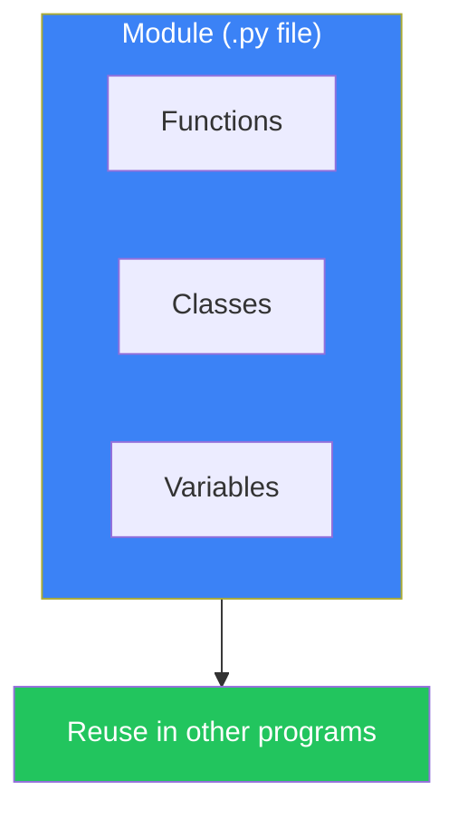
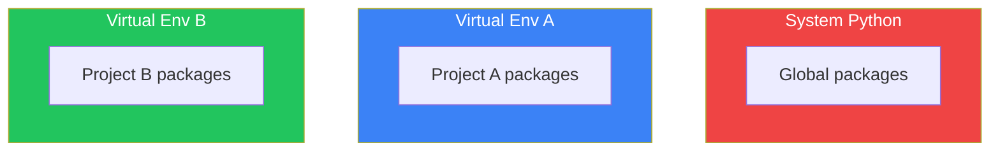

# Day 7: Modules and Packages

## What You'll Learn Today

- What modules are
- Using import statements
- Working with the standard library
- Package structure
- Virtual environments and pip

---

## What Are Modules?

A module is a Python file (`.py`) that bundles code together. It organizes functions, classes, and variables in a reusable way.



### Why Use Modules?

| Benefit | Description |
|---------|-------------|
| **Reusability** | Use same code in multiple programs |
| **Organization** | Divide code into logical units |
| **Namespace** | Avoid name collisions |
| **Maintainability** | Easier to locate and fix issues |

---

## Import Statements

### Basic Import

```python
# Import entire module
import math

print(math.pi)        # 3.141592653589793
print(math.sqrt(16))  # 4.0
```

### from ... import

Import specific elements:

```python
from math import pi, sqrt

print(pi)        # 3.141592653589793
print(sqrt(16))  # 4.0 (no need for math. prefix)
```

### Aliases

```python
import numpy as np  # Shorten long names
import pandas as pd

# Common conventions
import matplotlib.pyplot as plt
```

### Import All (Not Recommended)

```python
from math import *  # Import everything

# Why it's not recommended:
# - Hard to tell where names come from
# - Name collisions are more likely
```

---

## Creating Your Own Module

### Creating a Module

Create `my_module.py`:

```python
# my_module.py
"""Example custom module"""

PI = 3.14159

def greet(name):
    """Display a greeting"""
    print(f"Hello, {name}!")

def add(a, b):
    """Add two numbers"""
    return a + b

class Calculator:
    """Simple calculator"""
    def multiply(self, a, b):
        return a * b
```

### Using the Module

From `main.py` in the same directory:

```python
# main.py
import my_module

my_module.greet("Taro")  # Hello, Taro!
print(my_module.PI)      # 3.14159
print(my_module.add(3, 5))  # 8

calc = my_module.Calculator()
print(calc.multiply(4, 5))  # 20
```

### `__name__` and `__main__`

Detect whether a module was run directly or imported:

```python
# my_module.py
def main():
    print("Module was run directly")

if __name__ == "__main__":
    main()
```

```bash
python my_module.py  # Prints "Module was run directly"
```

```python
# Import from another file
import my_module  # main() is not executed
```

---

## Standard Library

Python includes many useful built-in modules.

### Common Standard Modules

| Module | Purpose | Examples |
|--------|---------|----------|
| `os` | OS operations | File paths, env vars |
| `sys` | System | Command line args |
| `math` | Mathematics | Trig functions, logs |
| `random` | Random numbers | Random value generation |
| `datetime` | Date/time | Date and time handling |
| `json` | JSON | Reading/writing JSON |
| `re` | Regular expressions | Pattern matching |
| `collections` | Data structures | Counter, defaultdict |

### os Module

```python
import os

# Current directory
print(os.getcwd())

# List directory contents
print(os.listdir('.'))

# Environment variables
print(os.environ.get('HOME'))

# Path operations
path = os.path.join('folder', 'file.txt')
print(path)  # folder/file.txt (OS-dependent)

# Check file existence
print(os.path.exists('file.txt'))
```

### random Module

```python
import random

# Random float from 0.0 to 1.0
print(random.random())

# Random integer in range
print(random.randint(1, 10))

# Random choice from list
fruits = ['apple', 'banana', 'cherry']
print(random.choice(fruits))

# Shuffle list
random.shuffle(fruits)
print(fruits)

# Random sample
print(random.sample(range(100), 5))
```

### datetime Module

```python
from datetime import datetime, date, timedelta

# Current datetime
now = datetime.now()
print(now)  # 2024-01-15 10:30:45.123456

# Date only
today = date.today()
print(today)  # 2024-01-15

# Create specific datetime
dt = datetime(2024, 12, 25, 10, 30)
print(dt)  # 2024-12-25 10:30:00

# Formatting
print(now.strftime('%Y-%m-%d'))  # 2024-01-15

# Date arithmetic
tomorrow = today + timedelta(days=1)
next_week = today + timedelta(weeks=1)
```

### json Module

```python
import json

# Python → JSON string
data = {'name': 'Taro', 'age': 25, 'city': 'Tokyo'}
json_str = json.dumps(data)
print(json_str)  # {"name": "Taro", "age": 25, "city": "Tokyo"}

# JSON string → Python
parsed = json.loads(json_str)
print(parsed['name'])  # Taro

# Write to file
with open('data.json', 'w') as f:
    json.dump(data, f, indent=2)

# Read from file
with open('data.json', 'r') as f:
    loaded = json.load(f)
```

---

## Packages

Packages are directories containing multiple modules.

### Package Structure

```
my_package/
├── __init__.py      # Package initialization (can be empty)
├── module1.py
├── module2.py
└── subpackage/
    ├── __init__.py
    └── module3.py
```

### `__init__.py`

Initializes the package. Executed when imported:

```python
# my_package/__init__.py
from .module1 import function1
from .module2 import function2

__all__ = ['function1', 'function2']
```

### Using Packages

```python
# Method 1: Import module
from my_package import module1
module1.function1()

# Method 2: Import function directly
from my_package.module1 import function1
function1()

# Method 3: Use what's exposed in __init__.py
from my_package import function1
function1()

# Subpackage
from my_package.subpackage import module3
```

---

## pip and External Packages

### What is pip?

pip is Python's package manager, allowing you to install packages from PyPI (Python Package Index).

### Basic Usage

```bash
# Install package
pip install requests

# Specify version
pip install requests==2.28.0

# Upgrade
pip install --upgrade requests

# Uninstall
pip uninstall requests

# List installed packages
pip list

# Package info
pip show requests
```

### requirements.txt

Manage project dependencies:

```bash
# Export current environment
pip freeze > requirements.txt

# Install from requirements.txt
pip install -r requirements.txt
```

Example `requirements.txt`:

```
requests==2.28.0
numpy>=1.20.0
pandas
```

---

## Virtual Environments

Create isolated Python environments for each project.



### Using venv

```bash
# Create virtual environment
python -m venv myenv

# Activate
# Windows
myenv\Scripts\activate
# macOS/Linux
source myenv/bin/activate

# Deactivate
deactivate
```

### Benefits of Virtual Environments

| Benefit | Description |
|---------|-------------|
| **Isolation** | Packages don't interfere between projects |
| **Reproducibility** | Same environment on different machines |
| **Clean system** | Don't pollute system Python |

---

## Module Search Path

Order Python searches for modules:

```python
import sys
print(sys.path)
```

1. Current directory
2. `PYTHONPATH` environment variable
3. Standard library
4. site-packages (pip-installed packages)

### Adding to Path

```python
import sys
sys.path.append('/path/to/my/modules')
```

---

## Summary

| Concept | Description | Example |
|---------|-------------|---------|
| **Module** | `.py` file | `import math` |
| **Package** | Directory + `__init__.py` | `from package import module` |
| **pip** | Package manager | `pip install requests` |
| **venv** | Virtual environment | `python -m venv myenv` |
| **Standard Library** | Built-in modules | os, sys, json, etc. |

### Key Takeaways

1. Modules organize and reuse code
2. `from ... import` imports specific elements
3. `__name__ == "__main__"` detects direct execution
4. pip installs external packages
5. Virtual environments isolate project dependencies

---

## Practice Exercises

### Exercise 1: Basics
Create a module `calculator.py` with `add()`, `subtract()`, `multiply()`, and `divide()` functions. Import and use it from another file.

### Exercise 2: Standard Library
Use the `random` module to generate 10 random numbers between 1 and 100, then display their sum and average.

### Challenge
Create a package:
- Package name: `utils`
- Module: `string_utils.py` (string manipulation functions)
- Module: `math_utils.py` (math calculation functions)
- Use `__init__.py` to expose commonly used functions

---

## References

- [Python Docs - Modules](https://docs.python.org/3/tutorial/modules.html)
- [Python Docs - Standard Library](https://docs.python.org/3/library/index.html)
- [pip Documentation](https://pip.pypa.io/en/stable/)
- [PyPI - Python Package Index](https://pypi.org/)

---

**Next Up**: In Day 8, you'll learn about "File I/O and Exception Handling." Master reading, writing, and error handling!
