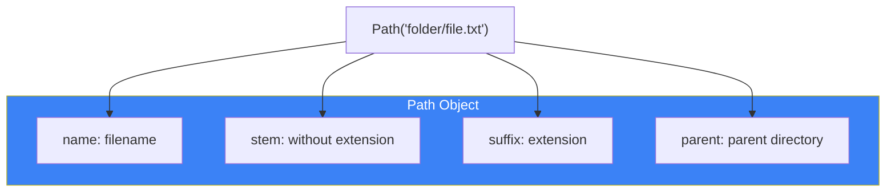
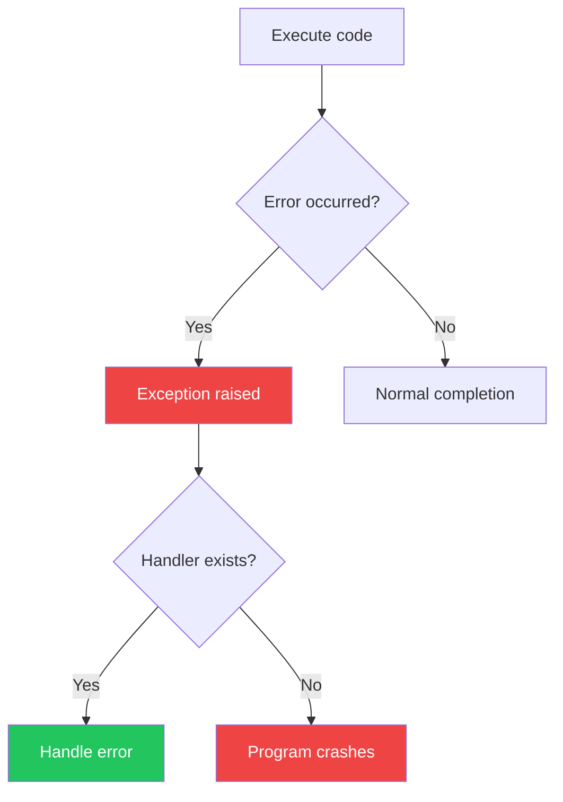

# Day 8: File I/O and Exception Handling

## What You'll Learn Today

- Reading and writing files
- Context managers (with statement)
- Various file formats (text, CSV, JSON)
- Exception handling (try-except)
- Custom exceptions

---

## Basic File Operations

### Opening Files

```python
# Basic approach
file = open('example.txt', 'r')  # Open in read mode
content = file.read()
file.close()  # Must close

# Using with statement (recommended)
with open('example.txt', 'r') as file:
    content = file.read()
# File is automatically closed
```

### File Modes

| Mode | Description |
|------|-------------|
| `'r'` | Read (default) |
| `'w'` | Write (overwrite) |
| `'a'` | Append |
| `'x'` | Create new (error if exists) |
| `'b'` | Binary mode |
| `'t'` | Text mode (default) |
| `'+'` | Read and write |

```python
# Combinations
'rb'   # Binary read
'w+'   # Read/write (overwrite)
'ab'   # Binary append
```

---

## Reading and Writing Text Files

### Reading Files

```python
# Read entire file
with open('example.txt', 'r', encoding='utf-8') as f:
    content = f.read()
    print(content)

# Read line by line
with open('example.txt', 'r', encoding='utf-8') as f:
    for line in f:
        print(line.strip())  # Remove newline

# Read as list
with open('example.txt', 'r', encoding='utf-8') as f:
    lines = f.readlines()
    print(lines)

# Read specified bytes
with open('example.txt', 'r', encoding='utf-8') as f:
    chunk = f.read(100)  # First 100 characters
```

### Writing Files

```python
# Create new or overwrite
with open('output.txt', 'w', encoding='utf-8') as f:
    f.write('Hello, World!\n')
    f.write('Python is great!\n')

# Write multiple lines at once
lines = ['Line 1\n', 'Line 2\n', 'Line 3\n']
with open('output.txt', 'w', encoding='utf-8') as f:
    f.writelines(lines)

# Append
with open('output.txt', 'a', encoding='utf-8') as f:
    f.write('Additional line\n')
```

---

## Path Operations (pathlib)

The recommended path manipulation module since Python 3.4.

```python
from pathlib import Path

# Create path
path = Path('folder') / 'subfolder' / 'file.txt'
print(path)  # folder/subfolder/file.txt

# Current directory
current = Path.cwd()
print(current)

# Home directory
home = Path.home()
print(home)

# Path information
p = Path('example.txt')
print(p.name)      # example.txt
print(p.stem)      # example
print(p.suffix)    # .txt
print(p.parent)    # .
print(p.exists())  # True/False
print(p.is_file()) # True/False
print(p.is_dir())  # True/False

# Create directory
Path('new_folder').mkdir(exist_ok=True)
Path('a/b/c').mkdir(parents=True, exist_ok=True)

# List files
for file in Path('.').glob('*.py'):
    print(file)

# Recursive search
for file in Path('.').rglob('*.txt'):
    print(file)
```



---

## Working with CSV Files

### csv Module

```python
import csv

# Read CSV
with open('data.csv', 'r', encoding='utf-8') as f:
    reader = csv.reader(f)
    for row in reader:
        print(row)  # Get as list

# Read as dictionary
with open('data.csv', 'r', encoding='utf-8') as f:
    reader = csv.DictReader(f)
    for row in reader:
        print(row)  # {'column1': 'value1', ...}

# Write CSV
data = [
    ['Name', 'Age', 'City'],
    ['Taro', 25, 'Tokyo'],
    ['Hanako', 30, 'Osaka']
]

with open('output.csv', 'w', newline='', encoding='utf-8') as f:
    writer = csv.writer(f)
    writer.writerows(data)

# Write from dictionaries
data = [
    {'Name': 'Taro', 'Age': 25, 'City': 'Tokyo'},
    {'Name': 'Hanako', 'Age': 30, 'City': 'Osaka'}
]

with open('output.csv', 'w', newline='', encoding='utf-8') as f:
    fieldnames = ['Name', 'Age', 'City']
    writer = csv.DictWriter(f, fieldnames=fieldnames)
    writer.writeheader()
    writer.writerows(data)
```

---

## Working with JSON Files

```python
import json

# Read JSON
with open('data.json', 'r', encoding='utf-8') as f:
    data = json.load(f)
    print(data)

# Write JSON
data = {
    'name': 'Taro',
    'age': 25,
    'hobbies': ['reading', 'programming']
}

with open('output.json', 'w', encoding='utf-8') as f:
    json.dump(data, f, indent=2)
```

---

## Exception Handling

### What Are Exceptions?

Errors that occur during program execution are called "exceptions."



### Basic try-except

```python
try:
    result = 10 / 0
except ZeroDivisionError:
    print("Cannot divide by zero")

# Program continues
print("Continuing execution")
```

### Catching Multiple Exceptions

```python
try:
    num = int(input("Enter a number: "))
    result = 10 / num
except ValueError:
    print("Please enter a valid number")
except ZeroDivisionError:
    print("Cannot divide by zero")

# Catch multiple at once
try:
    # Some operation
    pass
except (ValueError, TypeError) as e:
    print(f"Error: {e}")
```

### else and finally

```python
try:
    result = 10 / 2
except ZeroDivisionError:
    print("Division by zero error")
else:
    # Executed if no exception occurred
    print(f"Result: {result}")
finally:
    # Always executed (cleanup, etc.)
    print("Processing complete")
```

### Common Built-in Exceptions

| Exception | Description |
|-----------|-------------|
| `ValueError` | Invalid value |
| `TypeError` | Invalid type |
| `KeyError` | Dictionary key not found |
| `IndexError` | Index out of range |
| `FileNotFoundError` | File not found |
| `ZeroDivisionError` | Division by zero |
| `AttributeError` | Attribute not found |
| `ImportError` | Import failed |

### Raising Exceptions

```python
def validate_age(age):
    if age < 0:
        raise ValueError("Age must be 0 or greater")
    if age > 150:
        raise ValueError("Invalid age")
    return age

try:
    validate_age(-5)
except ValueError as e:
    print(f"Error: {e}")
```

---

## Custom Exceptions

Create your own exception classes:

```python
class ValidationError(Exception):
    """Validation error"""
    pass

class InsufficientFundsError(Exception):
    """Insufficient funds error"""
    def __init__(self, balance, amount):
        self.balance = balance
        self.amount = amount
        message = f"Cannot withdraw ${amount} with balance of ${balance}"
        super().__init__(message)

class BankAccount:
    def __init__(self, balance):
        self.balance = balance

    def withdraw(self, amount):
        if amount > self.balance:
            raise InsufficientFundsError(self.balance, amount)
        self.balance -= amount
        return amount

# Usage
account = BankAccount(1000)
try:
    account.withdraw(1500)
except InsufficientFundsError as e:
    print(f"Error: {e}")
    print(f"Current balance: ${e.balance}")
```

---

## File Operation Best Practices

### Safe File Reading with Error Handling

```python
from pathlib import Path

def read_file_safely(filepath):
    """Read file safely with error handling"""
    path = Path(filepath)

    if not path.exists():
        print(f"File not found: {filepath}")
        return None

    if not path.is_file():
        print(f"Not a file: {filepath}")
        return None

    try:
        with open(path, 'r', encoding='utf-8') as f:
            return f.read()
    except PermissionError:
        print(f"No permission to read file: {filepath}")
        return None
    except UnicodeDecodeError:
        print(f"Invalid file encoding: {filepath}")
        return None

# Usage
content = read_file_safely('example.txt')
if content:
    print(content)
```

### Using Temporary Files

```python
import tempfile

# Create temporary file
with tempfile.NamedTemporaryFile(mode='w', delete=False, suffix='.txt') as f:
    f.write('Temporary data')
    temp_path = f.name

print(f"Temp file: {temp_path}")

# Create temporary directory
with tempfile.TemporaryDirectory() as tmpdir:
    print(f"Temp directory: {tmpdir}")
    # Work inside directory
# Auto-deleted when exiting block
```

---

## Summary

| Concept | Description | Example |
|---------|-------------|---------|
| **open()** | Open file | `open('file.txt', 'r')` |
| **with statement** | Auto-close | `with open(...) as f:` |
| **pathlib** | Path operations | `Path('folder') / 'file'` |
| **try-except** | Exception handling | `try: ... except: ...` |
| **raise** | Raise exception | `raise ValueError("...")` |

### Key Takeaways

1. Always use `with` statement for files
2. Explicitly specify encoding (`utf-8`)
3. Wrap file operations in exception handling
4. Use `pathlib` for path operations
5. Use custom exceptions for meaningful error messages

---

## Practice Exercises

### Exercise 1: Basics
Write a program that reads a text file and displays the character count for each line.

### Exercise 2: CSV Operations
Read a CSV file in this format and calculate total and average scores:
```
Name,Math,English,Science
Taro,80,75,90
Hanako,95,88,85
```

### Challenge
Create a function that reads a JSON config file and uses default values if settings are missing. Handle exceptions appropriately for missing files or invalid JSON.

---

## References

- [Python Docs - File I/O](https://docs.python.org/3/tutorial/inputoutput.html#reading-and-writing-files)
- [Python Docs - pathlib](https://docs.python.org/3/library/pathlib.html)
- [Python Docs - Exceptions](https://docs.python.org/3/tutorial/errors.html)

---

**Next Up**: In Day 9, you'll learn about "Standard Library Utilities." Master more powerful modules!
