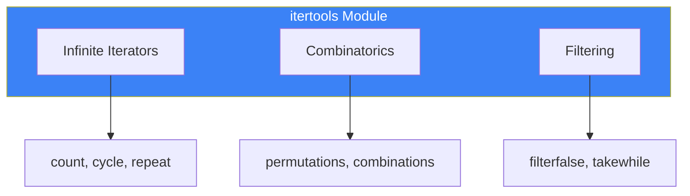

# Day 9: Standard Library Utilities

## What You'll Learn Today

- collections module
- itertools module
- functools module
- re (regular expressions) module
- logging module
- argparse module

---

## collections Module

Provides advanced data structures.

### Counter

Count element occurrences:

```python
from collections import Counter

# Count characters
text = "hello world"
counter = Counter(text)
print(counter)  # Counter({'l': 3, 'o': 2, 'h': 1, ...})

# Count list items
words = ['apple', 'banana', 'apple', 'cherry', 'banana', 'apple']
word_count = Counter(words)
print(word_count)  # Counter({'apple': 3, 'banana': 2, 'cherry': 1})

# Most common elements
print(word_count.most_common(2))  # [('apple', 3), ('banana', 2)]

# Addition
counter1 = Counter(['a', 'b', 'a'])
counter2 = Counter(['a', 'c'])
print(counter1 + counter2)  # Counter({'a': 3, 'b': 1, 'c': 1})
```

### defaultdict

Provide default values for missing keys:

```python
from collections import defaultdict

# List as default value
groups = defaultdict(list)
students = [
    ('A', 'Taro'),
    ('B', 'Hanako'),
    ('A', 'Jiro'),
    ('B', 'Yuki')
]

for group, name in students:
    groups[group].append(name)

print(dict(groups))  # {'A': ['Taro', 'Jiro'], 'B': ['Hanako', 'Yuki']}

# int as default value (counter)
counter = defaultdict(int)
for word in ['apple', 'banana', 'apple']:
    counter[word] += 1
print(dict(counter))  # {'apple': 2, 'banana': 1}
```

### namedtuple

Named tuples:

```python
from collections import namedtuple

# Definition
Point = namedtuple('Point', ['x', 'y'])
Person = namedtuple('Person', 'name age city')

# Creation
p = Point(3, 4)
print(p.x, p.y)  # 3 4

person = Person('Taro', 25, 'Tokyo')
print(person.name)  # Taro

# Works as tuple
print(p[0], p[1])  # 3 4

# Unpacking
x, y = p
print(x, y)  # 3 4
```

### deque

Double-ended queue (efficient add/remove):

```python
from collections import deque

# Create
d = deque([1, 2, 3])

# Add/remove from both ends
d.append(4)        # Add right: [1, 2, 3, 4]
d.appendleft(0)    # Add left: [0, 1, 2, 3, 4]
d.pop()            # Remove right: 4
d.popleft()        # Remove left: 0

# Max size (old elements auto-removed)
d = deque(maxlen=3)
d.extend([1, 2, 3, 4, 5])
print(d)  # deque([3, 4, 5], maxlen=3)

# Rotation
d = deque([1, 2, 3, 4, 5])
d.rotate(2)   # Rotate right: [4, 5, 1, 2, 3]
d.rotate(-2)  # Rotate left: [1, 2, 3, 4, 5]
```

---

## itertools Module

Tools for efficient iterator operations.



### Combinations

```python
from itertools import permutations, combinations, product

# Permutations (arrangements)
items = ['A', 'B', 'C']
perms = list(permutations(items, 2))
print(perms)  # [('A', 'B'), ('A', 'C'), ('B', 'A'), ('B', 'C'), ...]

# Combinations (order doesn't matter)
combs = list(combinations(items, 2))
print(combs)  # [('A', 'B'), ('A', 'C'), ('B', 'C')]

# Cartesian product
colors = ['red', 'blue']
sizes = ['S', 'M', 'L']
prod = list(product(colors, sizes))
print(prod)  # [('red', 'S'), ('red', 'M'), ..., ('blue', 'L')]
```

### Chain and Group

```python
from itertools import chain, groupby

# Chain multiple iterables
list1 = [1, 2, 3]
list2 = [4, 5, 6]
chained = list(chain(list1, list2))
print(chained)  # [1, 2, 3, 4, 5, 6]

# Groupby (requires pre-sorting)
data = [
    ('A', 1), ('A', 2), ('B', 3), ('B', 4), ('A', 5)
]
data.sort(key=lambda x: x[0])  # Sort first

for key, group in groupby(data, key=lambda x: x[0]):
    print(key, list(group))
# A [('A', 1), ('A', 2), ('A', 5)]
# B [('B', 3), ('B', 4)]
```

### Accumulate and Compress

```python
from itertools import accumulate, compress

# Cumulative sum
numbers = [1, 2, 3, 4, 5]
acc = list(accumulate(numbers))
print(acc)  # [1, 3, 6, 10, 15]

# Cumulative product
import operator
acc_prod = list(accumulate(numbers, operator.mul))
print(acc_prod)  # [1, 2, 6, 24, 120]

# Filtering with selectors
data = ['a', 'b', 'c', 'd']
selectors = [True, False, True, False]
result = list(compress(data, selectors))
print(result)  # ['a', 'c']
```

---

## functools Module

Tools for working with functions.

### reduce

Fold a list into a single value:

```python
from functools import reduce

# Sum
numbers = [1, 2, 3, 4, 5]
total = reduce(lambda x, y: x + y, numbers)
print(total)  # 15

# Find maximum
max_val = reduce(lambda x, y: x if x > y else y, numbers)
print(max_val)  # 5

# Factorial
factorial = reduce(lambda x, y: x * y, range(1, 6))
print(factorial)  # 120
```

### lru_cache

Memoization (result caching):

```python
from functools import lru_cache

@lru_cache(maxsize=128)
def fibonacci(n):
    if n < 2:
        return n
    return fibonacci(n - 1) + fibonacci(n - 2)

print(fibonacci(100))  # 354224848179261915075

# Cache info
print(fibonacci.cache_info())
# CacheInfo(hits=98, misses=101, maxsize=128, currsize=101)

# Clear cache
fibonacci.cache_clear()
```

### partial

Fix some function arguments:

```python
from functools import partial

def power(base, exponent):
    return base ** exponent

# Square function
square = partial(power, exponent=2)
print(square(5))  # 25

# Cube function
cube = partial(power, exponent=3)
print(cube(5))  # 125
```

---

## re (Regular Expressions) Module

Powerful pattern matching tools.

### Basic Usage

```python
import re

text = "My phone number is 555-123-4567."

# Pattern search
pattern = r'\d{3}-\d{3}-\d{4}'
match = re.search(pattern, text)
if match:
    print(match.group())  # 555-123-4567

# Find all matches
text = "Call 555-123-4567 or 555-987-6543"
matches = re.findall(pattern, text)
print(matches)  # ['555-123-4567', '555-987-6543']
```

### Common Patterns

| Pattern | Meaning |
|---------|---------|
| `\d` | Digit |
| `\w` | Word character (alphanumeric + _) |
| `\s` | Whitespace |
| `.` | Any single character |
| `*` | 0 or more repetitions |
| `+` | 1 or more repetitions |
| `?` | 0 or 1 occurrence |
| `{n}` | Exactly n repetitions |
| `^` | Start of line |
| `$` | End of line |

### Replace and Split

```python
import re

# Replace
text = "Hello World"
result = re.sub(r'World', 'Python', text)
print(result)  # Hello Python

# Multiple replacements
text = "2024-01-15"
result = re.sub(r'-', '/', text)
print(result)  # 2024/01/15

# Split
text = "apple,banana;cherry:date"
parts = re.split(r'[,;:]', text)
print(parts)  # ['apple', 'banana', 'cherry', 'date']
```

### Grouping

```python
import re

text = "Name: Taro, Age: 25"
pattern = r'Name: (\w+), Age: (\d+)'
match = re.search(pattern, text)

if match:
    print(match.group(0))  # Name: Taro, Age: 25
    print(match.group(1))  # Taro
    print(match.group(2))  # 25
    print(match.groups())  # ('Taro', '25')

# Named groups
pattern = r'Name: (?P<name>\w+), Age: (?P<age>\d+)'
match = re.search(pattern, text)
if match:
    print(match.group('name'))  # Taro
    print(match.group('age'))   # 25
```

---

## logging Module

Manage application logs.

```python
import logging

# Basic configuration
logging.basicConfig(
    level=logging.DEBUG,
    format='%(asctime)s - %(levelname)s - %(message)s'
)

# Log messages
logging.debug('Debug information')
logging.info('Info message')
logging.warning('Warning message')
logging.error('Error message')
logging.critical('Critical error')
```

### Log Levels

| Level | Value | Purpose |
|-------|-------|---------|
| DEBUG | 10 | Detailed diagnostic info |
| INFO | 20 | General information |
| WARNING | 30 | Warning (default) |
| ERROR | 40 | Error |
| CRITICAL | 50 | Fatal error |

### Logging to File

```python
import logging

# Output to both file and console
logging.basicConfig(
    level=logging.INFO,
    format='%(asctime)s - %(name)s - %(levelname)s - %(message)s',
    handlers=[
        logging.FileHandler('app.log'),
        logging.StreamHandler()
    ]
)

logger = logging.getLogger(__name__)
logger.info('Application started')
```

---

## argparse Module

Parse command-line arguments.

```python
import argparse

# Create parser
parser = argparse.ArgumentParser(description='Sample program')

# Add arguments
parser.add_argument('filename', help='File to process')
parser.add_argument('-o', '--output', help='Output file', default='output.txt')
parser.add_argument('-v', '--verbose', action='store_true', help='Verbose output')
parser.add_argument('-n', '--number', type=int, default=10, help='Number to process')

# Parse arguments
args = parser.parse_args()

print(f"Input file: {args.filename}")
print(f"Output file: {args.output}")
print(f"Verbose mode: {args.verbose}")
print(f"Number: {args.number}")
```

Usage:
```bash
python script.py input.txt -o result.txt -v -n 20
```

---

## Summary

| Module | Purpose | Key Features |
|--------|---------|--------------|
| **collections** | Data structures | Counter, defaultdict, deque |
| **itertools** | Iterator operations | permutations, combinations |
| **functools** | Function tools | reduce, lru_cache, partial |
| **re** | Regular expressions | search, findall, sub |
| **logging** | Log management | debug, info, error |
| **argparse** | CLI argument parsing | add_argument, parse_args |

### Key Takeaways

1. `Counter` makes counting elements easy
2. `defaultdict` eliminates key existence checks
3. `lru_cache` speeds up recursive functions
4. Regular expressions for complex pattern matching
5. `logging` is better than `print` for proper logging

---

## Practice Exercises

### Exercise 1: Counter
Write a program that reads a text file and displays the top 10 most frequent words.

### Exercise 2: Regular Expressions
Write a program that extracts all email addresses from a text containing multiple emails.

### Challenge
Create a CLI tool using `argparse` with the following features:
- Accept filename as argument
- `--count` option to count words
- `--lines` option to count lines
- `--search` option to search for a word

---

## References

- [Python Docs - collections](https://docs.python.org/3/library/collections.html)
- [Python Docs - itertools](https://docs.python.org/3/library/itertools.html)
- [Python Docs - re](https://docs.python.org/3/library/re.html)
- [Python Docs - logging](https://docs.python.org/3/library/logging.html)

---

**Next Up**: In Day 10, you'll work on "Practical Projects." Apply everything you've learned to build real programs!
