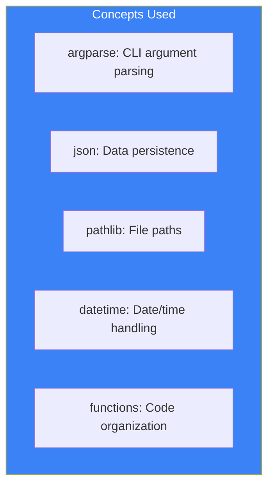
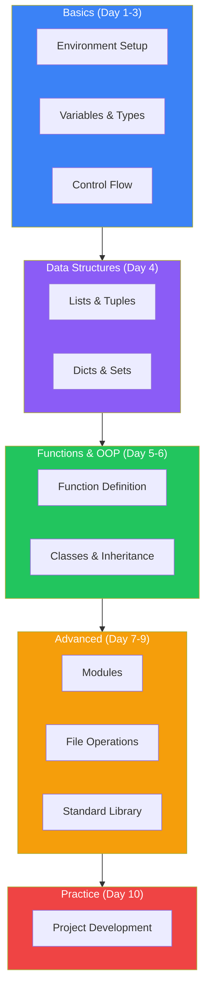

# Day 10: Practical Projects

## What You'll Learn Today

On this final day, we'll apply everything we've learned to build practical projects.

- Project 1: TODO App (CLI)
- Project 2: Weather Information Tool
- Guide to Next Steps

---

## Project 1: TODO App (CLI)

Build a simple command-line TODO application.

### Requirements

- Add tasks
- List tasks
- Mark tasks as complete
- Delete tasks
- Data persistence (JSON)

### Complete Code

```python
#!/usr/bin/env python3
"""
Simple TODO App
Usage: python todo.py [command] [arguments]
"""

import json
import argparse
from pathlib import Path
from datetime import datetime

# Data file path
TODO_FILE = Path.home() / '.todo.json'

def load_todos():
    """Load TODO list"""
    if not TODO_FILE.exists():
        return []
    try:
        with open(TODO_FILE, 'r', encoding='utf-8') as f:
            return json.load(f)
    except json.JSONDecodeError:
        return []

def save_todos(todos):
    """Save TODO list"""
    with open(TODO_FILE, 'w', encoding='utf-8') as f:
        json.dump(todos, f, indent=2)

def add_todo(title):
    """Add a task"""
    todos = load_todos()
    todo = {
        'id': len(todos) + 1,
        'title': title,
        'done': False,
        'created_at': datetime.now().isoformat()
    }
    todos.append(todo)
    save_todos(todos)
    print(f"Added task: {title}")

def list_todos(show_all=False):
    """Display task list"""
    todos = load_todos()
    if not todos:
        print("No tasks found")
        return

    print("\nTODO List:")
    print("-" * 50)
    for todo in todos:
        if not show_all and todo['done']:
            continue
        status = "x" if todo['done'] else " "
        print(f"  [{status}] {todo['id']}. {todo['title']}")
    print("-" * 50)

def complete_todo(todo_id):
    """Mark task as complete"""
    todos = load_todos()
    for todo in todos:
        if todo['id'] == todo_id:
            todo['done'] = True
            save_todos(todos)
            print(f"Completed: {todo['title']}")
            return
    print(f"Task not found: ID {todo_id}")

def delete_todo(todo_id):
    """Delete a task"""
    todos = load_todos()
    for i, todo in enumerate(todos):
        if todo['id'] == todo_id:
            removed = todos.pop(i)
            save_todos(todos)
            print(f"Deleted: {removed['title']}")
            return
    print(f"Task not found: ID {todo_id}")

def main():
    parser = argparse.ArgumentParser(description='Simple TODO App')
    subparsers = parser.add_subparsers(dest='command', help='Commands')

    # add command
    add_parser = subparsers.add_parser('add', help='Add a task')
    add_parser.add_argument('title', help='Task title')

    # list command
    list_parser = subparsers.add_parser('list', help='List tasks')
    list_parser.add_argument('-a', '--all', action='store_true', help='Show completed')

    # done command
    done_parser = subparsers.add_parser('done', help='Complete a task')
    done_parser.add_argument('id', type=int, help='Task ID')

    # delete command
    delete_parser = subparsers.add_parser('delete', help='Delete a task')
    delete_parser.add_argument('id', type=int, help='Task ID')

    args = parser.parse_args()

    if args.command == 'add':
        add_todo(args.title)
    elif args.command == 'list':
        list_todos(args.all)
    elif args.command == 'done':
        complete_todo(args.id)
    elif args.command == 'delete':
        delete_todo(args.id)
    else:
        parser.print_help()

if __name__ == '__main__':
    main()
```

### Usage

```bash
# Add tasks
python todo.py add "Study Python"
python todo.py add "Go shopping"

# List tasks
python todo.py list
python todo.py list --all  # Include completed

# Complete a task
python todo.py done 1

# Delete a task
python todo.py delete 2
```

### Learning Points



---

## Project 2: Weather Information Tool

A tool that fetches weather information using a Web API.

### Requirements

- Get weather by city name
- Display current temperature and weather
- Error handling

### Complete Code

```python
#!/usr/bin/env python3
"""
Weather Information Tool
Uses Open-Meteo API (no API key required)
"""

import argparse
import urllib.request
import urllib.error
import json
from dataclasses import dataclass

# Major city coordinates
CITIES = {
    'tokyo': {'lat': 35.6762, 'lon': 139.6503, 'name': 'Tokyo'},
    'osaka': {'lat': 34.6937, 'lon': 135.5023, 'name': 'Osaka'},
    'new_york': {'lat': 40.7128, 'lon': -74.0060, 'name': 'New York'},
    'london': {'lat': 51.5074, 'lon': -0.1278, 'name': 'London'},
    'paris': {'lat': 48.8566, 'lon': 2.3522, 'name': 'Paris'},
    'sydney': {'lat': -33.8688, 'lon': 151.2093, 'name': 'Sydney'},
    'berlin': {'lat': 52.5200, 'lon': 13.4050, 'name': 'Berlin'},
    'singapore': {'lat': 1.3521, 'lon': 103.8198, 'name': 'Singapore'},
}

# Weather code descriptions
WEATHER_CODES = {
    0: 'Clear sky',
    1: 'Mainly clear',
    2: 'Partly cloudy',
    3: 'Overcast',
    45: 'Foggy',
    48: 'Depositing rime fog',
    51: 'Light drizzle',
    53: 'Moderate drizzle',
    55: 'Dense drizzle',
    61: 'Slight rain',
    63: 'Moderate rain',
    65: 'Heavy rain',
    71: 'Slight snow',
    73: 'Moderate snow',
    75: 'Heavy snow',
    80: 'Slight rain showers',
    81: 'Moderate rain showers',
    82: 'Violent rain showers',
    95: 'Thunderstorm',
    96: 'Thunderstorm with hail',
    99: 'Thunderstorm with heavy hail',
}

@dataclass
class Weather:
    """Weather information container"""
    city: str
    temperature: float
    weather_code: int
    humidity: int
    wind_speed: float

    @property
    def weather_description(self):
        return WEATHER_CODES.get(self.weather_code, 'Unknown')

    def __str__(self):
        return f"""
Weather in {self.city}
========================
  Conditions: {self.weather_description}
  Temperature: {self.temperature}C
  Humidity: {self.humidity}%
  Wind Speed: {self.wind_speed} km/h
========================
"""

def fetch_weather(city_key):
    """Fetch weather information"""
    if city_key not in CITIES:
        raise ValueError(f"Unknown city: {city_key}")

    city = CITIES[city_key]
    url = (
        f"https://api.open-meteo.com/v1/forecast?"
        f"latitude={city['lat']}&longitude={city['lon']}"
        f"&current=temperature_2m,weather_code,relative_humidity_2m,wind_speed_10m"
    )

    try:
        with urllib.request.urlopen(url, timeout=10) as response:
            data = json.loads(response.read().decode())
    except urllib.error.URLError as e:
        raise ConnectionError(f"Failed to connect to API: {e}")
    except json.JSONDecodeError:
        raise ValueError("Failed to parse API response")

    current = data.get('current', {})
    return Weather(
        city=city['name'],
        temperature=current.get('temperature_2m', 0),
        weather_code=current.get('weather_code', 0),
        humidity=current.get('relative_humidity_2m', 0),
        wind_speed=current.get('wind_speed_10m', 0)
    )

def list_cities():
    """Display available cities"""
    print("\nAvailable Cities:")
    print("-" * 30)
    for key, info in CITIES.items():
        print(f"  {key:12} : {info['name']}")
    print("-" * 30)

def main():
    parser = argparse.ArgumentParser(description='Weather Information Tool')
    parser.add_argument('city', nargs='?', help='City name (e.g., tokyo, london)')
    parser.add_argument('-l', '--list', action='store_true', help='List available cities')

    args = parser.parse_args()

    if args.list:
        list_cities()
        return

    if not args.city:
        parser.print_help()
        list_cities()
        return

    city_key = args.city.lower()

    try:
        weather = fetch_weather(city_key)
        print(weather)
    except ValueError as e:
        print(f"Error: {e}")
        list_cities()
    except ConnectionError as e:
        print(f"Connection Error: {e}")
    except Exception as e:
        print(f"Unexpected Error: {e}")

if __name__ == '__main__':
    main()
```

### Usage

```bash
# Get weather for a city
python weather.py tokyo
python weather.py london
python weather.py new_york

# List available cities
python weather.py --list
```

### Learning Points

| Concept | Usage |
|---------|-------|
| **urllib** | HTTP requests |
| **dataclass** | Data structuring |
| **Exception handling** | Error handling |
| **Dictionaries** | City data management |
| **f-strings** | Output formatting |

---

## Project Extension Ideas

### TODO App Extensions

1. **Priority levels**: high, medium, low
2. **Due dates**: Set deadlines
3. **Categories**: Work, personal, shopping tags
4. **Search**: Find tasks by title
5. **Export**: CSV/Markdown format output

### Weather App Extensions

1. **Weekly forecast**: 7-day weather
2. **Multiple cities**: Compare at once
3. **Graphs**: Text-based temperature charts
4. **Alerts**: Notifications for conditions
5. **Caching**: Cache API responses

---

## Completing the 10-Day Journey

Congratulations! You've learned Python from basics to practical application over 10 days.

### What You've Learned



---

## Next Steps

### Web Development

```python
# Flask example
from flask import Flask
app = Flask(__name__)

@app.route('/')
def hello():
    return 'Hello, World!'
```

- **Flask**: Lightweight web framework
- **Django**: Full-stack web framework
- **FastAPI**: High-performance API framework

### Data Analysis

```python
# pandas example
import pandas as pd

df = pd.read_csv('data.csv')
print(df.describe())
```

- **pandas**: Data analysis library
- **NumPy**: Numerical computing library
- **Matplotlib**: Graphing library

### Machine Learning

```python
# scikit-learn example
from sklearn.linear_model import LinearRegression

model = LinearRegression()
model.fit(X_train, y_train)
```

- **scikit-learn**: Machine learning library
- **TensorFlow/PyTorch**: Deep learning frameworks

### Automation

- **Selenium**: Browser automation
- **Beautiful Soup**: Web scraping
- **Schedule**: Task scheduling

---

## Learning Resources

### Official Documentation

- [Python Official Tutorial](https://docs.python.org/3/tutorial/)
- [Python Standard Library](https://docs.python.org/3/library/)

### Online Learning

- [Real Python](https://realpython.com/)
- [Python.org](https://www.python.org/about/gettingstarted/)

### Books

- "Python Crash Course" - Eric Matthes
- "Fluent Python" - Luciano Ramalho
- "Effective Python" - Brett Slatkin

### Communities

- [Stack Overflow](https://stackoverflow.com/questions/tagged/python)
- [Reddit r/learnpython](https://www.reddit.com/r/learnpython/)
- [Python Discord](https://pythondiscord.com/)

---

## Summary

| Day | Topic | Skills Acquired |
|-----|-------|-----------------|
| 1 | Welcome to Python | Setup, Hello World |
| 2 | Variables & Types | int, str, bool, conversion |
| 3 | Control Flow | if, for, while |
| 4 | Data Structures | list, dict, set, tuple |
| 5 | Functions | def, lambda, decorators |
| 6 | OOP | class, inheritance, encapsulation |
| 7 | Modules | import, pip, venv |
| 8 | Files & Exceptions | open, try-except |
| 9 | Standard Library | collections, re, logging |
| 10 | Practical Projects | Application development |

### Final Words

Programming is a journey of continuous learning. Use the foundation from this course to explore areas that interest you.

**"Write code 100 times rather than read about it once"**

Keep coding and learning! Don't fear failure, and challenge yourself with many projects!

---

## References

- [Python Official Site](https://www.python.org/)
- [PyPI - Python Package Index](https://pypi.org/)
- [GitHub - Awesome Python](https://github.com/vinta/awesome-python)
- [Python Weekly](https://www.pythonweekly.com/)

---

**Congratulations! You've completed the Python Fundamentals Course!** 🎉
