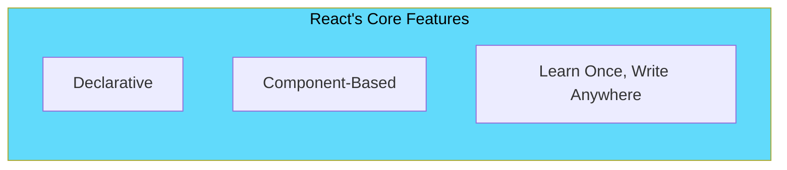
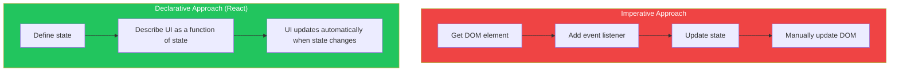
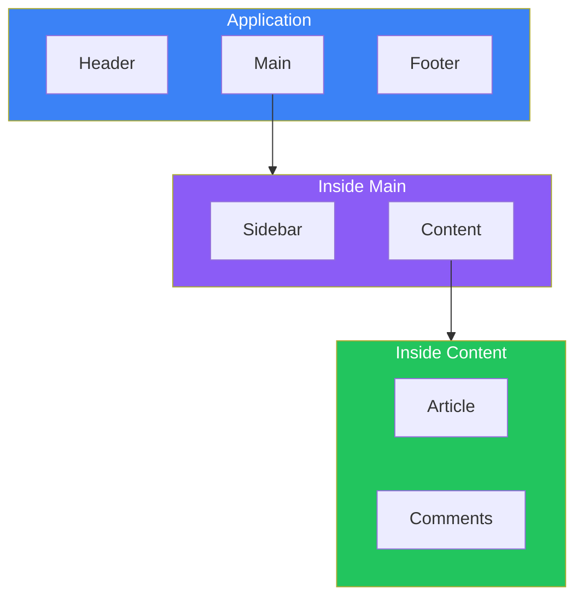
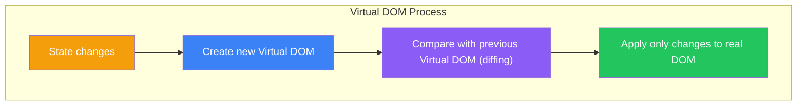

# Day 1: Welcome to React

## What You'll Learn Today

- What React is and why it's popular
- The difference between imperative and declarative code
- Benefits of component-based architecture
- Setting up a development environment with Vite
- Creating your first React application

---

## What is React?

**React** is a JavaScript library for building user interfaces, developed by Facebook. Since its open-source release in 2013, it has become one of the most popular frontend libraries, beloved by developers worldwide.



### Problems React Solves

In traditional JavaScript web development, you had to manipulate the DOM (Document Object Model) directly.

```javascript
// Traditional JavaScript (imperative code)
const button = document.getElementById('counter-button');
const display = document.getElementById('counter-display');
let count = 0;

button.addEventListener('click', () => {
  count++;
  display.textContent = `Count: ${count}`;
});
```

This approach has problems:

1. **Complexity**: As applications grow, tracking which elements update when becomes difficult
2. **Performance**: DOM operations are slow, and avoiding unnecessary updates is hard
3. **Maintainability**: Code becomes scattered and hard to reuse

React solves these problems with a **declarative approach** and the **Virtual DOM**.

---

## What is Declarative UI?

Programming has two styles: "imperative" and "declarative."

### Imperative

You specify "how" to do something step by step.

```javascript
// Imperative: step-by-step cooking instructions
// 1. Get a pot
// 2. Add water
// 3. Turn on the heat
// 4. When boiling, add noodles
// 5. Wait 3 minutes
// 6. Drain the water
```

### Declarative

You specify "what" you want.

```javascript
// Declarative: state the result
// "I'd like some ramen, please"
```



In React, you declaratively describe what the UI should look like:

```jsx
// React (declarative code)
function Counter() {
  const [count, setCount] = useState(0);

  return (
    <div>
      <p>Count: {count}</p>
      <button onClick={() => setCount(count + 1)}>
        Increment
      </button>
    </div>
  );
}
```

When the state (`count`) changes, React automatically updates the UI. Developers don't need to worry about DOM updates.

---

## Component-Based Architecture

React's greatest feature is **components**. Components are independent, reusable pieces that make up your UI.



### Benefits of Components

| Benefit | Description |
|---------|-------------|
| **Reusability** | Create once, use many times |
| **Maintainability** | Each component is independent, limiting the impact of changes |
| **Testability** | Test individual components in isolation |
| **Team Development** | Multiple developers can work on different components simultaneously |

```jsx
// Button component - reusable
function Button({ children, onClick }) {
  return (
    <button onClick={onClick} className="btn">
      {children}
    </button>
  );
}

// Reuse in various places
<Button onClick={handleSave}>Save</Button>
<Button onClick={handleCancel}>Cancel</Button>
<Button onClick={handleDelete}>Delete</Button>
```

---

## Setting Up Your Development Environment

We'll use **Vite** to develop React applications. Vite is a fast build tool perfect for React development.

### Prerequisites

- **Node.js** 18.0 or higher installed

```bash
# Check Node.js version
node --version
```

### Creating a Project

Run the following commands in your terminal:

```bash
# Create a project
npm create vite@latest my-react-app -- --template react

# Navigate to project directory
cd my-react-app

# Install dependencies
npm install

# Start development server
npm run dev
```

Open `http://localhost:5173` in your browser to see your React application.

### Project Structure

```
my-react-app/
├── node_modules/     # Dependencies
├── public/           # Static files
├── src/              # Source code
│   ├── App.jsx       # Main component
│   ├── App.css       # Styles
│   ├── main.jsx      # Entry point
│   └── index.css     # Global styles
├── index.html        # HTML template
├── package.json      # Project configuration
└── vite.config.js    # Vite configuration
```

---

## Your First React Application

Open `src/App.jsx` and replace its contents with:

```jsx
function App() {
  return (
    <div>
      <h1>Hello, React!</h1>
      <p>This is my first React app.</p>
    </div>
  );
}

export default App;
```

Save the file and your browser will automatically refresh (hot module replacement).

### Code Explanation

```jsx
// 1. Define the App function component
function App() {
  // 2. Return JSX (HTML-like syntax)
  return (
    <div>
      <h1>Hello, React!</h1>
      <p>This is my first React app.</p>
    </div>
  );
}

// 3. Export the component
export default App;
```

### Displaying Dynamic Values

In JSX, you can embed JavaScript values using curly braces `{}`:

```jsx
function App() {
  const name = "Alice";
  const currentYear = new Date().getFullYear();

  return (
    <div>
      <h1>Hello, {name}!</h1>
      <p>The current year is {currentYear}.</p>
    </div>
  );
}

export default App;
```

---

## How the Virtual DOM Works

One reason React is fast is the **Virtual DOM**.



The Virtual DOM is a lightweight JavaScript object representation of the actual DOM. React updates the UI through these steps:

1. **State Change**: Application state changes
2. **Virtual DOM Creation**: Create a new Virtual DOM tree
3. **Diffing (Reconciliation)**: Compare with the previous Virtual DOM to identify changes
4. **Minimal Updates**: Apply only the changed parts to the actual DOM

This avoids unnecessary DOM operations and improves performance.

---

## Summary

| Concept | Description |
|---------|-------------|
| **React** | A JavaScript library for building UIs |
| **Declarative UI** | Describe "what" you want; React handles "how" |
| **Components** | Independent, reusable UI pieces |
| **Virtual DOM** | Lightweight copy of the real DOM enabling efficient updates |
| **Vite** | Fast build tool for React development |

### Key Takeaways

1. React's **declarative** approach makes code easier to understand
2. **Components** let you break UI into small, manageable pieces
3. The **Virtual DOM** automatically handles efficient DOM updates
4. **Vite** gets you started with React development in minutes

---

## Exercises

### Exercise 1: Basics
Create a new React project with Vite and edit `App.jsx` to display your name and today's date.

### Exercise 2: Application
Create a component that displays multiple pieces of information:
- Self-introduction (name, hobbies)
- What you learned today
- Your expectations for React

### Challenge
Use a JavaScript array to display a list of your favorite programming languages.

```jsx
const languages = ["JavaScript", "Python", "Go"];
```

Hint: Use the array's `map()` method (we'll cover this in detail on Day 2).

---

## References

- [React Official Documentation](https://react.dev/)
- [Vite Official Documentation](https://vitejs.dev/)
- [MDN - Introduction to the DOM](https://developer.mozilla.org/en-US/docs/Web/API/Document_Object_Model/Introduction)

---

**Coming Up Next**: On Day 2, we'll learn about "Understanding JSX." We'll explore why React lets you write HTML-like syntax and learn the detailed rules of JSX.
