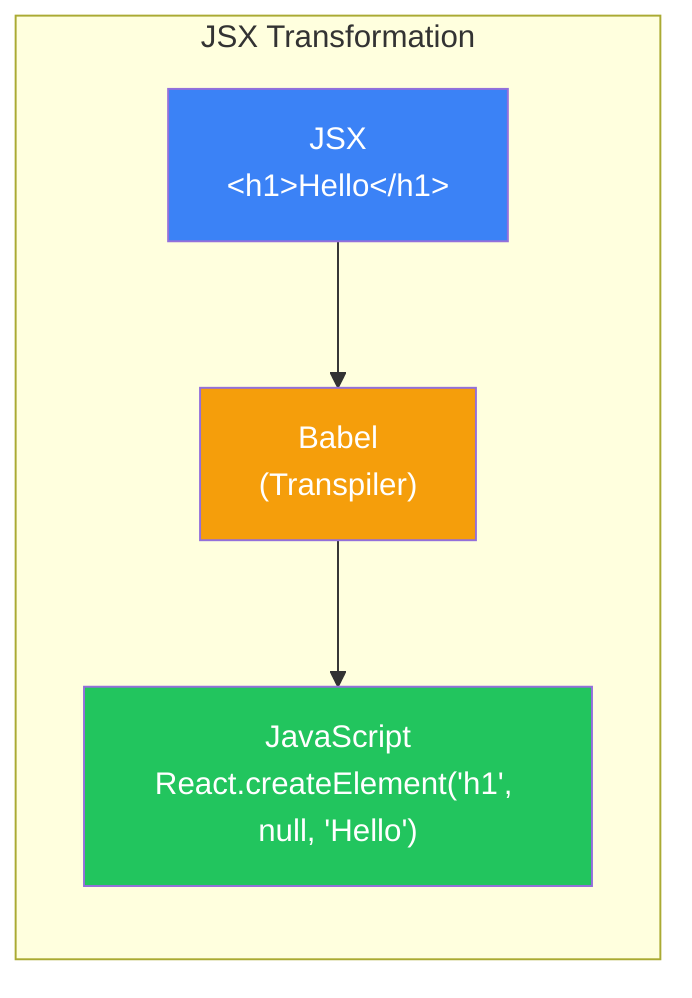
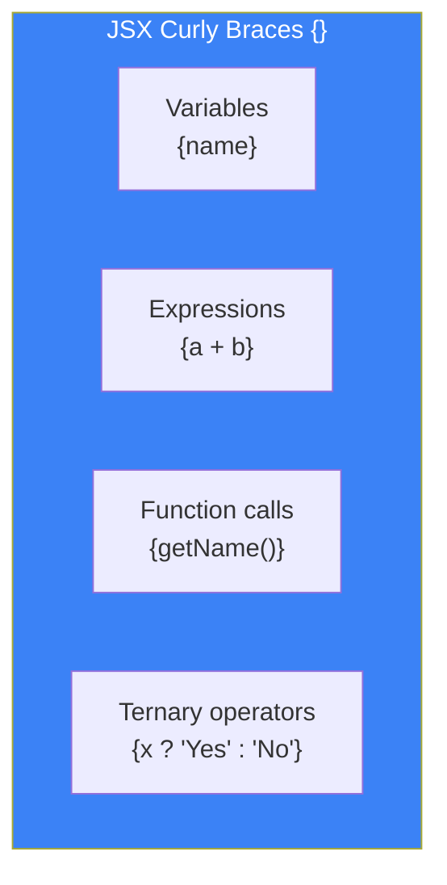
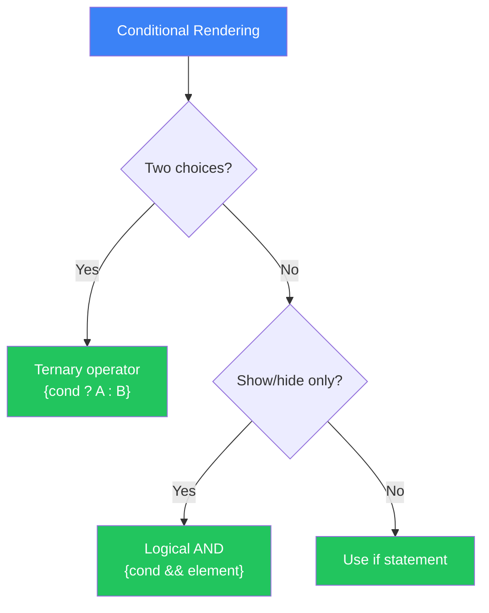
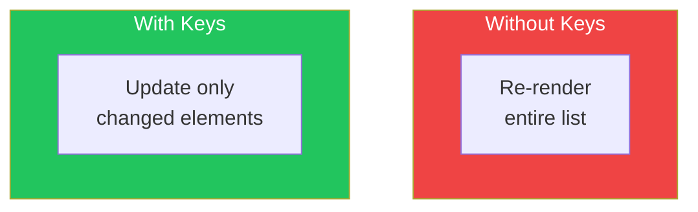

# Day 2: Understanding JSX

## What You'll Learn Today

- What JSX is and why we use it
- Basic JSX syntax rules
- How to embed dynamic values
- Conditional rendering techniques
- Rendering lists and the importance of keys

---

## What is JSX?

**JSX (JavaScript XML)** is a syntax extension for JavaScript that lets you write React elements using HTML-like notation.

```jsx
// This is JSX
const element = <h1>Hello, World!</h1>;
```

This is neither a string nor HTML. It's JavaScript code.

### Why Use JSX?

Without JSX, you would create React elements like this:

```javascript
// Without JSX
const element = React.createElement(
  'h1',
  { className: 'greeting' },
  'Hello, World!'
);
```

```jsx
// With JSX
const element = <h1 className="greeting">Hello, World!</h1>;
```

Benefits of using JSX:

| Benefit | Description |
|---------|-------------|
| **Readability** | HTML-like syntax is intuitive to understand |
| **Conciseness** | No need to write `React.createElement` repeatedly |
| **Error Detection** | Errors caught at compile time |
| **Productivity** | UI structure is visible at a glance |



---

## JSX Basic Rules

### Rule 1: Single Root Element

JSX must return a **single root element**.

```jsx
// ❌ Error: Multiple root elements
function App() {
  return (
    <h1>Title</h1>
    <p>Content</p>
  );
}

// ✅ Correct: Wrapped in a div
function App() {
  return (
    <div>
      <h1>Title</h1>
      <p>Content</p>
    </div>
  );
}

// ✅ Correct: Using Fragment
function App() {
  return (
    <>
      <h1>Title</h1>
      <p>Content</p>
    </>
  );
}
```

`<>...</>` is called a **Fragment** and groups multiple elements without adding extra DOM nodes.

### Rule 2: Close All Tags

Tags that can be left unclosed in HTML must be closed in JSX.

```jsx
// ❌ Works in HTML but errors in JSX

<input type="text">
<br>

// ✅ Correct: Use self-closing tags

<input type="text" />
<br />
```

### Rule 3: Use camelCase for Attributes

Many HTML attribute names become camelCase in JSX.

```jsx
// HTML
<div class="container" onclick="handleClick()">
  <label for="name">Name</label>
</div>

// JSX
<div className="container" onClick={handleClick}>
  <label htmlFor="name">Name</label>
</div>
```

| HTML | JSX |
|------|-----|
| `class` | `className` |
| `for` | `htmlFor` |
| `onclick` | `onClick` |
| `onchange` | `onChange` |
| `tabindex` | `tabIndex` |

### Rule 4: style Attribute Takes an Object

```jsx
// HTML
<div style="background-color: blue; font-size: 16px;">

// JSX - Object with camelCase property names
<div style={{ backgroundColor: 'blue', fontSize: '16px' }}>
```

---

## Embedding Dynamic Values

In JSX, use curly braces `{}` to embed JavaScript expressions.

### Embedding Variables

```jsx
function Greeting() {
  const name = "Alice";
  const age = 25;

  return (
    <div>
      <h1>Hello, {name}!</h1>
      <p>You are {age} years old.</p>
    </div>
  );
}
```

### Embedding Expressions

```jsx
function Calculator() {
  const a = 10;
  const b = 20;

  return (
    <div>
      <p>{a} + {b} = {a + b}</p>
      <p>Current time: {new Date().toLocaleTimeString()}</p>
      <p>Uppercase: {"hello".toUpperCase()}</p>
    </div>
  );
}
```

### Embedding in Attributes

```jsx
function Avatar() {
  const user = {
    name: "Alice",
    imageUrl: "/images/alice.jpg"
  };

  return (
    
  );
}
```



---

## Conditional Rendering

There are several ways to show or hide parts of the UI based on conditions.

### Method 1: Using if Statements

```jsx
function Greeting({ isLoggedIn }) {
  if (isLoggedIn) {
    return <h1>Welcome back!</h1>;
  }
  return <h1>Please sign in</h1>;
}
```

### Method 2: Ternary Operator

```jsx
function Greeting({ isLoggedIn }) {
  return (
    <h1>
      {isLoggedIn ? 'Welcome back!' : 'Please sign in'}
    </h1>
  );
}
```

### Method 3: Logical AND Operator

Useful when you only want to display something if a condition is true.

```jsx
function Notification({ hasNewMessage }) {
  return (
    <div>
      <h1>Dashboard</h1>
      {hasNewMessage && <p>You have new messages!</p>}
    </div>
  );
}
```

### Choosing the Right Approach



| Method | When to Use |
|--------|-------------|
| if statement | Complex conditions, switching entire components |
| Ternary operator | Choosing between two options |
| Logical AND | Showing something only when condition is true |

---

## Rendering Lists

Use the `map()` method to display array data.

### Basic Usage

```jsx
function FruitList() {
  const fruits = ['Apple', 'Banana', 'Orange'];

  return (
    <ul>
      {fruits.map((fruit) => (
        <li>{fruit}</li>
      ))}
    </ul>
  );
}
```

### The Importance of Keys

Running the code above will show a console warning:

> Warning: Each child in a list should have a unique "key" prop.

A **key** is a special attribute React uses to identify elements in a list.

```jsx
function FruitList() {
  const fruits = ['Apple', 'Banana', 'Orange'];

  return (
    <ul>
      {fruits.map((fruit, index) => (
        <li key={index}>{fruit}</li>
      ))}
    </ul>
  );
}
```

### Why Keys Are Needed



Without keys, React can't identify which elements changed and must re-render the entire list. With keys, React efficiently updates only the changed elements.

### Key Best Practices

```jsx
// ✅ Recommended: Use unique IDs
function TodoList({ todos }) {
  return (
    <ul>
      {todos.map((todo) => (
        <li key={todo.id}>{todo.text}</li>
      ))}
    </ul>
  );
}

// ⚠️ Caution: index only when list doesn't change
function StaticList() {
  const items = ['A', 'B', 'C'];
  return (
    <ul>
      {items.map((item, index) => (
        <li key={index}>{item}</li>
      ))}
    </ul>
  );
}

// ❌ Avoid: Random values
function BadList() {
  const items = ['A', 'B', 'C'];
  return (
    <ul>
      {items.map((item) => (
        <li key={Math.random()}>{item}</li>  // Different key every render
      ))}
    </ul>
  );
}
```

---

## Rendering Arrays of Objects

Real applications often work with arrays of objects.

```jsx
function UserList() {
  const users = [
    { id: 1, name: 'Alice', email: 'alice@example.com' },
    { id: 2, name: 'Bob', email: 'bob@example.com' },
    { id: 3, name: 'Carol', email: 'carol@example.com' },
  ];

  return (
    <div>
      <h2>User List</h2>
      <ul>
        {users.map((user) => (
          <li key={user.id}>
            <strong>{user.name}</strong> - {user.email}
          </li>
        ))}
      </ul>
    </div>
  );
}
```

### Extracting to Separate Components

When list items are complex, extract them into separate components.

```jsx
// UserCard component
function UserCard({ user }) {
  return (
    <div className="user-card">
      <h3>{user.name}</h3>
      <p>{user.email}</p>
    </div>
  );
}

// UserList component
function UserList() {
  const users = [
    { id: 1, name: 'Alice', email: 'alice@example.com' },
    { id: 2, name: 'Bob', email: 'bob@example.com' },
  ];

  return (
    <div>
      {users.map((user) => (
        <UserCard key={user.id} user={user} />
      ))}
    </div>
  );
}
```

---

## Summary

| Concept | Description |
|---------|-------------|
| **JSX** | Syntax extension for writing HTML-like code in JavaScript |
| **Fragment** | `<>...</>` groups elements without extra DOM nodes |
| **Curly braces {}** | Embed JavaScript expressions in JSX |
| **Conditional rendering** | Display conditionally using ternary or logical AND |
| **key** | Attribute that uniquely identifies list elements |

### Key Takeaways

1. JSX must return a **single root element**
2. All tags must be **closed**
3. HTML attributes are written in **camelCase** (`className`, `onClick`, etc.)
4. Curly braces `{}` embed **JavaScript expressions**
5. Lists must have **unique keys**

---

## Exercises

### Exercise 1: Basics
Create a component that displays:
- A name (from a variable)
- Current age and age next year (calculated)

### Exercise 2: Conditional Rendering
Create a StatusIndicator component that receives an `isOnline` prop and displays "Online" in green when online, or "Offline" in gray when offline.

### Challenge
Create a ProductList component that displays the following product data. Show "Out of Stock" for products that aren't in stock.

```jsx
const products = [
  { id: 1, name: 'Laptop', price: 1200, inStock: true },
  { id: 2, name: 'Mouse', price: 30, inStock: true },
  { id: 3, name: 'Keyboard', price: 150, inStock: false },
];
```

---

## References

- [React Docs - Writing Markup with JSX](https://react.dev/learn/writing-markup-with-jsx)
- [React Docs - Conditional Rendering](https://react.dev/learn/conditional-rendering)
- [React Docs - Rendering Lists](https://react.dev/learn/rendering-lists)

---

**Coming Up Next**: On Day 3, we'll learn about "Components and Props." Understand how to pass data between components.
