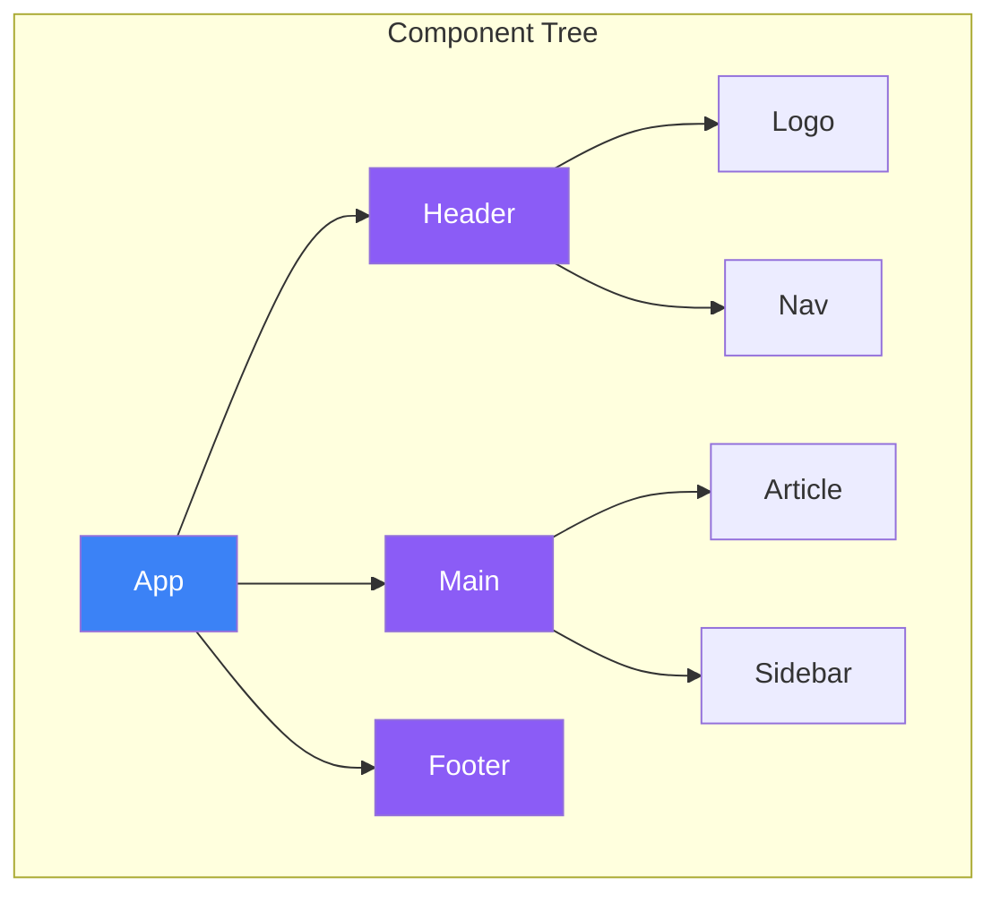
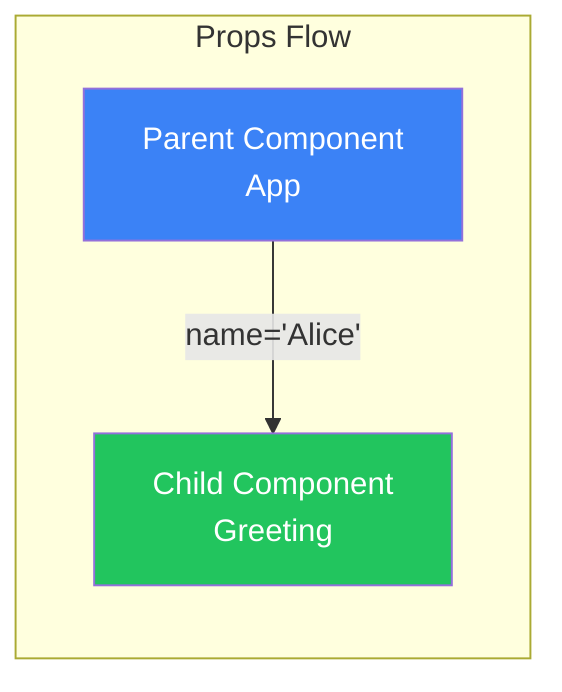
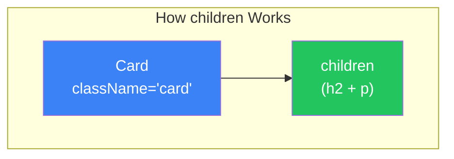
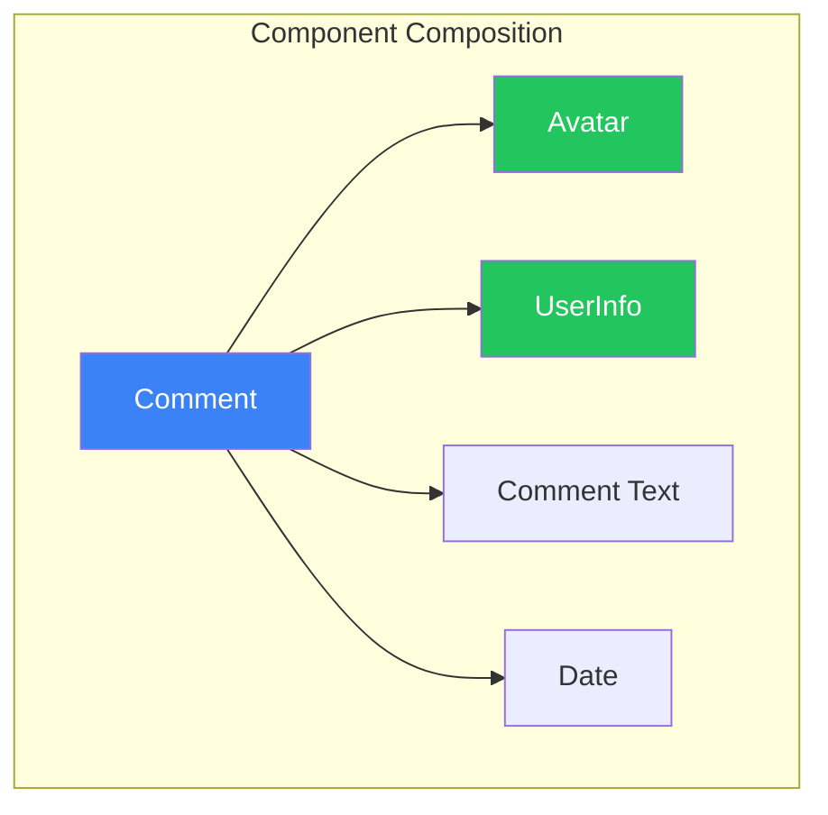

# Day 3: Components and Props

## What You'll Learn Today

- How to create and structure components
- Passing data with Props
- Using the children property
- Guidelines for component splitting
- Setting default Props

---

## What Are Components?

Components are independent, reusable pieces that make up your UI. React applications are built as a tree of components.



### Creating Components

In React, you create components using functions.

```jsx
// A simple component
function Welcome() {
  return <h1>Welcome!</h1>;
}

// Using the component
function App() {
  return (
    <div>
      <Welcome />
      <Welcome />
      <Welcome />
    </div>
  );
}
```

### Component Naming Conventions

| Rule | Description |
|------|-------------|
| **Start with uppercase** | `Welcome`, `UserCard` (lowercase is interpreted as HTML tags) |
| **PascalCase** | Multiple words like `UserProfileCard` |
| **Meaningful names** | Names should describe the function |

---

## What Are Props?

**Props (Properties)** are the mechanism for passing data from parent to child components.



### Basic Props Usage

```jsx
// Child component - receives props
function Greeting(props) {
  return <h1>Hello, {props.name}!</h1>;
}

// Parent component - passes props
function App() {
  return (
    <div>
      <Greeting name="Alice" />
      <Greeting name="Bob" />
      <Greeting name="Carol" />
    </div>
  );
}
```

### Destructuring Props

Use destructuring for cleaner code.

```jsx
// Using destructuring
function Greeting({ name }) {
  return <h1>Hello, {name}!</h1>;
}

// Receiving multiple props
function UserCard({ name, age, email }) {
  return (
    <div className="user-card">
      <h2>{name}</h2>
      <p>Age: {age}</p>
      <p>Email: {email}</p>
    </div>
  );
}

// Usage
<UserCard name="Alice" age={25} email="alice@example.com" />
```

### Props Types

Props can accept various types of values.

```jsx
function Example({
  text,        // string
  count,       // number
  isActive,    // boolean
  items,       // array
  user,        // object
  onClick,     // function
}) {
  return (
    <div>
      <p>{text}</p>
      <p>Count: {count}</p>
      <p>Status: {isActive ? 'Active' : 'Inactive'}</p>
      <ul>
        {items.map((item, i) => <li key={i}>{item}</li>)}
      </ul>
      <p>User: {user.name}</p>
      <button onClick={onClick}>Click</button>
    </div>
  );
}

// Usage
<Example
  text="Hello"
  count={42}
  isActive={true}
  items={['A', 'B', 'C']}
  user={{ name: 'Alice', age: 25 }}
  onClick={() => alert('Clicked!')}
/>
```

---

## The children Property

`children` is a special prop that receives content placed between a component's opening and closing tags.

```jsx
// Card component
function Card({ children }) {
  return (
    <div className="card">
      {children}
    </div>
  );
}

// Usage
function App() {
  return (
    <Card>
      <h2>Title</h2>
      <p>This is the card content.</p>
    </Card>
  );
}
```



### children Use Cases

```jsx
// Layout component
function PageLayout({ children }) {
  return (
    <div className="page">
      <header>Header</header>
      <main>{children}</main>
      <footer>Footer</footer>
    </div>
  );
}

// Button component
function Button({ children, onClick }) {
  return (
    <button className="btn" onClick={onClick}>
      {children}
    </button>
  );
}

// Usage
<PageLayout>
  <h1>Welcome</h1>
  <Button onClick={() => alert('Click')}>
    Learn More
  </Button>
</PageLayout>
```

---

## Component Composition

Build complex UIs by combining small components.

```jsx
// Avatar component
function Avatar({ src, alt }) {
  return ;
}

// User info component
function UserInfo({ name, title }) {
  return (
    <div className="user-info">
      <p className="name">{name}</p>
      <p className="title">{title}</p>
    </div>
  );
}

// Comment component (composed)
function Comment({ author, text, date }) {
  return (
    <div className="comment">
      <Avatar src={author.avatarUrl} alt={author.name} />
      <UserInfo name={author.name} title={author.title} />
      <p className="comment-text">{text}</p>
      <p className="comment-date">{date}</p>
    </div>
  );
}
```



---

## Guidelines for Splitting Components

### When to Split Components

| Indicator | Description |
|-----------|-------------|
| **Reusability** | Same UI used in multiple places |
| **Complexity** | Component is getting too large |
| **Separation of concerns** | Different concerns are mixed together |
| **Testability** | Parts that need independent testing |

### Example: Before and After Splitting

```jsx
// ❌ Before: Too much in one component
function ProductPage() {
  return (
    <div>
      <header>
        
        <nav>
          <a href="/">Home</a>
          <a href="/products">Products</a>
        </nav>
      </header>
      <main>
        <div className="product">
          
          <h1>Product Name</h1>
          <p>$100</p>
          <button>Add to Cart</button>
        </div>
        <div className="reviews">
          <h2>Reviews</h2>
          {/* Review list */}
        </div>
      </main>
      <footer>© 2024</footer>
    </div>
  );
}
```

```jsx
// ✅ After: Components separated by responsibility
function Logo() {
  return ;
}

function Navigation() {
  return (
    <nav>
      <a href="/">Home</a>
      <a href="/products">Products</a>
    </nav>
  );
}

function Header() {
  return (
    <header>
      <Logo />
      <Navigation />
    </header>
  );
}

function ProductDetail({ product }) {
  return (
    <div className="product">
      
      <h1>{product.name}</h1>
      <p>${product.price}</p>
      <button>Add to Cart</button>
    </div>
  );
}

function ReviewList({ reviews }) {
  return (
    <div className="reviews">
      <h2>Reviews</h2>
      {reviews.map(review => (
        <ReviewItem key={review.id} review={review} />
      ))}
    </div>
  );
}

function Footer() {
  return <footer>© 2024</footer>;
}

function ProductPage({ product, reviews }) {
  return (
    <div>
      <Header />
      <main>
        <ProductDetail product={product} />
        <ReviewList reviews={reviews} />
      </main>
      <Footer />
    </div>
  );
}
```

---

## Default Props

You can set default values for props.

```jsx
// Method 1: Default parameters (recommended)
function Button({ text = 'Click', color = 'blue' }) {
  return (
    <button style={{ backgroundColor: color }}>
      {text}
    </button>
  );
}

// Usage
<Button />                    // Uses defaults
<Button text="Submit" />      // Overrides text only
<Button color="red" />        // Overrides color only
<Button text="Delete" color="red" />  // Overrides both
```

```jsx
// Method 2: OR operator
function Greeting({ name }) {
  return <h1>Hello, {name || 'Guest'}!</h1>;
}

// Method 3: Nullish coalescing operator
function Counter({ count }) {
  return <p>Count: {count ?? 0}</p>;
}
```

### Choosing Default Value Methods

| Method | When to Use |
|--------|-------------|
| Default parameters | Use this as the default approach |
| OR operator `\|\|` | When falsy values (0, '') should also use default |
| Nullish coalescing `??` | When only null/undefined should use default |

---

## Spreading Props

You can pass all properties of an object as props at once.

```jsx
function UserProfile({ name, age, email, avatar }) {
  return (
    <div>
      
      <h2>{name}</h2>
      <p>{age} years old</p>
      <p>{email}</p>
    </div>
  );
}

// Normal way
const user = { name: 'Alice', age: 25, email: 'alice@example.com', avatar: '/alice.jpg' };

<UserProfile
  name={user.name}
  age={user.age}
  email={user.email}
  avatar={user.avatar}
/>

// Using spread syntax
<UserProfile {...user} />
```

### Extracting Some Props

```jsx
function Button({ children, className, ...rest }) {
  return (
    <button className={`btn ${className}`} {...rest}>
      {children}
    </button>
  );
}

// Usage
<Button className="primary" onClick={handleClick} disabled={true}>
  Submit
</Button>
```

---

## Summary

| Concept | Description |
|---------|-------------|
| **Component** | Independent, reusable UI pieces |
| **Props** | Mechanism for passing data from parent to child |
| **children** | Special prop that receives content between tags |
| **Component composition** | Building UI by combining small components |
| **Default Props** | Setting initial values for props |

### Key Takeaways

1. Component names must **start with uppercase**
2. Props are **read-only** (don't modify them in child components)
3. `children` enables **flexible components**
4. Keep components **small** for better maintainability
5. **Default parameters** set initial prop values

---

## Exercises

### Exercise 1: Basics
Create a `ProfileCard` component that receives these props:
- name
- job
- bio (biography)

### Exercise 2: children
Create a `Panel` component that receives a title and children, displaying them in a styled panel.

```jsx
<Panel title="Notice">
  <p>We're closed tomorrow.</p>
</Panel>
```

### Challenge
Create a `ProductCard` component that meets these requirements:
- Receives product name, price, image URL, and stock count
- Shows "Sold Out" badge when out of stock
- Shows "Premium" badge when price is over $100

---

## References

- [React Docs - Passing Props to a Component](https://react.dev/learn/passing-props-to-a-component)
- [React Docs - Passing JSX as children](https://react.dev/learn/passing-props-to-a-component#passing-jsx-as-children)

---

**Coming Up Next**: On Day 4, we'll learn about "State and Events." Create interactive UIs that respond to user actions.
