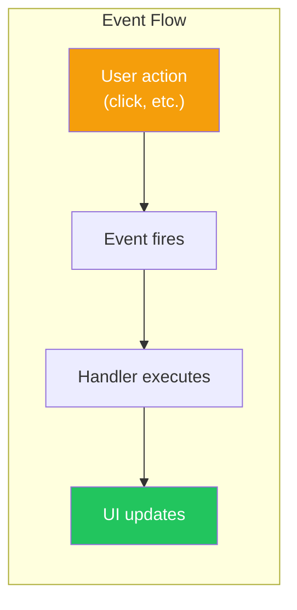
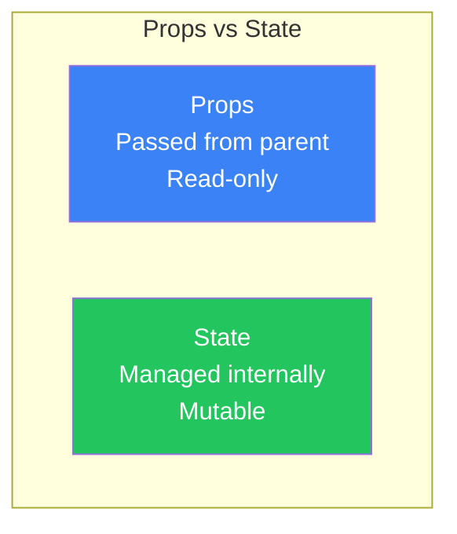
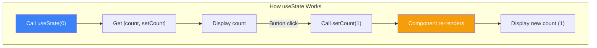
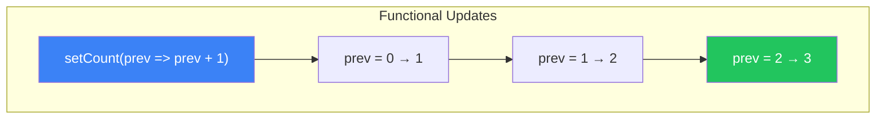
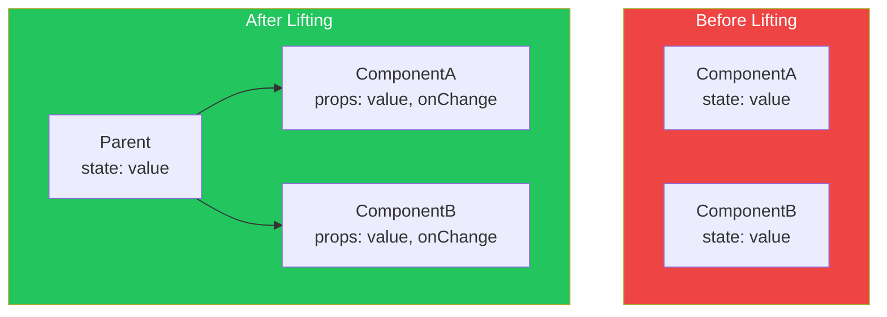

# Day 4: State and Events

## What You'll Learn Today

- Event handling basics
- Using the useState hook
- How state updates work
- Managing multiple states
- Updating state based on previous values

---

## Event Handling Basics

In React, you use event handlers to respond to user actions.

### Click Events

```jsx
function Button() {
  function handleClick() {
    alert('Clicked!');
  }

  return <button onClick={handleClick}>Click me</button>;
}
```

### Event Handler Naming Conventions

| Pattern | Example |
|---------|---------|
| `handle` + event name | `handleClick`, `handleSubmit` |
| `on` + action | `onSave`, `onDelete` |

```jsx
function Form() {
  function handleSubmit(event) {
    event.preventDefault();  // Prevent default behavior
    console.log('Form submitted');
  }

  function handleChange(event) {
    console.log('Input value:', event.target.value);
  }

  return (
    <form onSubmit={handleSubmit}>
      <input type="text" onChange={handleChange} />
      <button type="submit">Submit</button>
    </form>
  );
}
```

### Inline Event Handlers

For simple operations, you can write handlers inline.

```jsx
// Inline
<button onClick={() => alert('Click!')}>Click</button>

// Passing arguments
<button onClick={() => handleDelete(id)}>Delete</button>
```



---

## What Is State?

**State** is data that a component can "remember." When state changes, React automatically re-renders the UI.

### Difference from Props



| Feature | Props | State |
|---------|-------|-------|
| Data source | Parent component | Component itself |
| Mutability | Read-only | Mutable |
| Purpose | Configuration, data passing | Dynamic data management |

---

## The useState Hook

`useState` is a hook that adds state to function components.

### Basic Usage

```jsx
import { useState } from 'react';

function Counter() {
  // [current value, update function] = useState(initial value)
  const [count, setCount] = useState(0);

  return (
    <div>
      <p>Count: {count}</p>
      <button onClick={() => setCount(count + 1)}>
        Increment
      </button>
    </div>
  );
}
```

### useState Structure

```jsx
const [state, setState] = useState(initialValue);
```

| Element | Description |
|---------|-------------|
| `state` | Current state value |
| `setState` | Function to update state |
| `initialValue` | Initial state value |



### Various State Types

```jsx
function Examples() {
  // Number
  const [count, setCount] = useState(0);

  // String
  const [name, setName] = useState('');

  // Boolean
  const [isVisible, setIsVisible] = useState(false);

  // Array
  const [items, setItems] = useState([]);

  // Object
  const [user, setUser] = useState({ name: '', age: 0 });

  return (
    // ...
  );
}
```

---

## How State Updates Work

### State Updates Are Asynchronous

State updates don't happen immediately. React batches multiple updates together.

```jsx
function Counter() {
  const [count, setCount] = useState(0);

  function handleClick() {
    setCount(count + 1);
    console.log(count);  // Still logs 0!
  }

  return <button onClick={handleClick}>{count}</button>;
}
```

### Batching

Multiple state updates are combined into a single re-render.

```jsx
function Example() {
  const [count, setCount] = useState(0);
  const [flag, setFlag] = useState(false);

  function handleClick() {
    setCount(count + 1);  // Queue update
    setFlag(!flag);       // Queue update
    // → Only 1 re-render, not 2
  }

  return (
    // ...
  );
}
```

---

## Updating Based on Previous Value

For consecutive updates, you need to use the functional form.

### Problematic Code

```jsx
function Counter() {
  const [count, setCount] = useState(0);

  function handleTripleClick() {
    // ❌ This doesn't work as expected!
    setCount(count + 1);  // count = 0 → 1
    setCount(count + 1);  // count = 0 → 1 (still references 0)
    setCount(count + 1);  // count = 0 → 1 (still references 0)
    // Result: 1 (not 3)
  }

  return <button onClick={handleTripleClick}>{count}</button>;
}
```

### Correct Code (Functional Form)

```jsx
function Counter() {
  const [count, setCount] = useState(0);

  function handleTripleClick() {
    // ✅ Use functional form
    setCount(prev => prev + 1);  // 0 → 1
    setCount(prev => prev + 1);  // 1 → 2
    setCount(prev => prev + 1);  // 2 → 3
    // Result: 3
  }

  return <button onClick={handleTripleClick}>{count}</button>;
}
```



### When to Use Each Form

| Situation | Form to Use |
|-----------|-------------|
| Simple assignment | `setState(newValue)` |
| Based on previous value | `setState(prev => ...)` |
| Toggle operation | `setState(prev => !prev)` |

---

## Managing Multiple States

### Independent States

Unrelated data should be managed in separate states.

```jsx
function UserForm() {
  const [name, setName] = useState('');
  const [age, setAge] = useState(0);
  const [email, setEmail] = useState('');

  return (
    <form>
      <input
        value={name}
        onChange={(e) => setName(e.target.value)}
        placeholder="Name"
      />
      <input
        type="number"
        value={age}
        onChange={(e) => setAge(Number(e.target.value))}
        placeholder="Age"
      />
      <input
        type="email"
        value={email}
        onChange={(e) => setEmail(e.target.value)}
        placeholder="Email"
      />
    </form>
  );
}
```

### Object State

Related data can be grouped as an object.

```jsx
function UserForm() {
  const [user, setUser] = useState({
    name: '',
    age: 0,
    email: ''
  });

  function handleChange(field, value) {
    setUser(prev => ({
      ...prev,        // Copy existing properties
      [field]: value  // Update specified field
    }));
  }

  return (
    <form>
      <input
        value={user.name}
        onChange={(e) => handleChange('name', e.target.value)}
        placeholder="Name"
      />
      <input
        type="number"
        value={user.age}
        onChange={(e) => handleChange('age', Number(e.target.value))}
        placeholder="Age"
      />
      <input
        type="email"
        value={user.email}
        onChange={(e) => handleChange('email', e.target.value)}
        placeholder="Email"
      />
    </form>
  );
}
```

### Array State

```jsx
function TodoList() {
  const [todos, setTodos] = useState([]);
  const [input, setInput] = useState('');

  // Add
  function addTodo() {
    if (input.trim()) {
      setTodos(prev => [...prev, { id: Date.now(), text: input }]);
      setInput('');
    }
  }

  // Delete
  function removeTodo(id) {
    setTodos(prev => prev.filter(todo => todo.id !== id));
  }

  // Update
  function updateTodo(id, newText) {
    setTodos(prev => prev.map(todo =>
      todo.id === id ? { ...todo, text: newText } : todo
    ));
  }

  return (
    <div>
      <input
        value={input}
        onChange={(e) => setInput(e.target.value)}
        placeholder="New task"
      />
      <button onClick={addTodo}>Add</button>
      <ul>
        {todos.map(todo => (
          <li key={todo.id}>
            {todo.text}
            <button onClick={() => removeTodo(todo.id)}>Delete</button>
          </li>
        ))}
      </ul>
    </div>
  );
}
```

---

## Lifting State Up

When multiple components need to share state, move it to their common parent component.



### Example: Temperature Converter

```jsx
// Parent component - manages state
function TemperatureConverter() {
  const [celsius, setCelsius] = useState(0);

  const fahrenheit = (celsius * 9/5) + 32;

  return (
    <div>
      <TemperatureInput
        label="Celsius"
        value={celsius}
        onChange={setCelsius}
      />
      <TemperatureInput
        label="Fahrenheit"
        value={fahrenheit}
        onChange={(f) => setCelsius((f - 32) * 5/9)}
      />
    </div>
  );
}

// Child component - no state
function TemperatureInput({ label, value, onChange }) {
  return (
    <label>
      {label}:
      <input
        type="number"
        value={value}
        onChange={(e) => onChange(Number(e.target.value))}
      />
    </label>
  );
}
```

---

## Derived State

Values that can be calculated from state shouldn't be stored as state.

```jsx
function ShoppingCart() {
  const [items, setItems] = useState([
    { id: 1, name: 'Product A', price: 10, quantity: 2 },
    { id: 2, name: 'Product B', price: 5, quantity: 3 },
  ]);

  // ❌ Bad: Storing derived value as state
  // const [total, setTotal] = useState(0);

  // ✅ Good: Calculate from state
  const total = items.reduce(
    (sum, item) => sum + item.price * item.quantity,
    0
  );

  const itemCount = items.reduce(
    (sum, item) => sum + item.quantity,
    0
  );

  return (
    <div>
      <p>Items: {itemCount}</p>
      <p>Total: ${total}</p>
    </div>
  );
}
```

---

## Summary

| Concept | Description |
|---------|-------------|
| **Event handlers** | Respond to user actions with `onClick`, etc. |
| **useState** | Hook to add state to components |
| **State updates** | Calling `setState` triggers re-render |
| **Functional updates** | Use `prev => ...` for previous value-based updates |
| **Lifting state up** | Move shared state to parent component |

### Key Takeaways

1. State updates are **asynchronous**
2. Use **functional form** for previous value-based updates
3. Update objects and arrays with **spread syntax** to create new references
4. **Calculate** derived values instead of storing as state
5. **Lift up** shared state to parent components

---

## Exercises

### Exercise 1: Basics
Create a counter component with three buttons: "+1", "-1", and "Reset" that displays the count value.

### Exercise 2: Application
Create an input form that displays "Hello, {name}!" in real-time as you type. Show "Please enter your name" when empty.

### Challenge
Create a simple Todo list:
- Text input to add new todos
- Delete button for each todo
- Toggle complete/incomplete
- Display count of incomplete todos

---

## References

- [React Docs - State: A Component's Memory](https://react.dev/learn/state-a-components-memory)
- [React Docs - Updating State](https://react.dev/learn/updating-objects-in-state)
- [React Docs - Sharing State Between Components](https://react.dev/learn/sharing-state-between-components)

---

**Coming Up Next**: On Day 5, we'll learn about "Working with Forms." Understand the difference between controlled and uncontrolled components.
