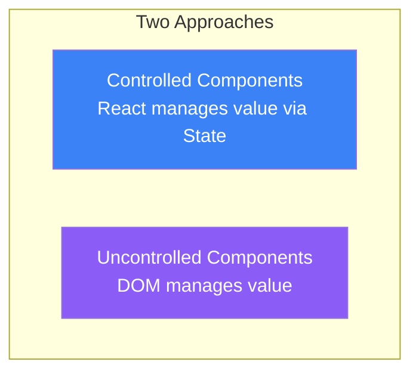
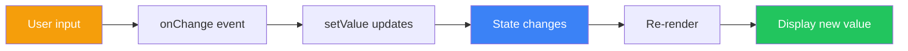
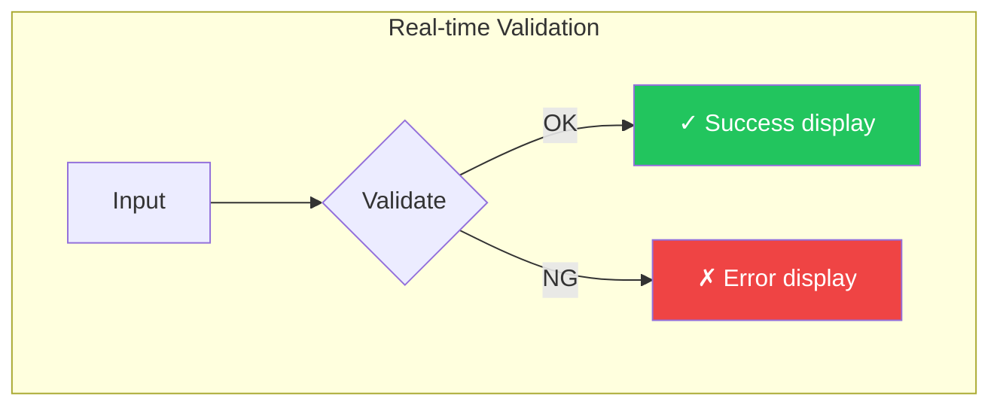
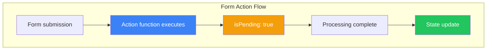

# Day 5: Working with Forms

## What You'll Learn Today

- Difference between controlled and uncontrolled components
- How to manage form inputs
- Implementing validation
- Handling form submission
- React 19 Form Actions

---

## Controlled vs Uncontrolled Components

There are two ways to handle forms in React.



| Feature | Controlled | Uncontrolled |
|---------|------------|--------------|
| Value management | React State | DOM |
| Getting values | Directly from state | Via ref |
| Real-time validation | Easy | Difficult |
| Dynamic changes | Easy | Difficult |
| Implementation effort | More | Less |

---

## Controlled Components

In controlled components, input values are managed by React state.

### Basic Controlled Component

```jsx
import { useState } from 'react';

function ControlledInput() {
  const [value, setValue] = useState('');

  function handleChange(event) {
    setValue(event.target.value);
  }

  return (
    <input
      type="text"
      value={value}
      onChange={handleChange}
    />
  );
}
```

### Controlled Component Flow



### Various Input Types

```jsx
function FormExample() {
  const [text, setText] = useState('');
  const [number, setNumber] = useState(0);
  const [isChecked, setIsChecked] = useState(false);
  const [selected, setSelected] = useState('');
  const [description, setDescription] = useState('');

  return (
    <form>
      {/* Text input */}
      <input
        type="text"
        value={text}
        onChange={(e) => setText(e.target.value)}
      />

      {/* Number input */}
      <input
        type="number"
        value={number}
        onChange={(e) => setNumber(Number(e.target.value))}
      />

      {/* Checkbox */}
      <input
        type="checkbox"
        checked={isChecked}
        onChange={(e) => setIsChecked(e.target.checked)}
      />

      {/* Select */}
      <select
        value={selected}
        onChange={(e) => setSelected(e.target.value)}
      >
        <option value="">Please select</option>
        <option value="a">Option A</option>
        <option value="b">Option B</option>
      </select>

      {/* Textarea */}
      <textarea
        value={description}
        onChange={(e) => setDescription(e.target.value)}
      />
    </form>
  );
}
```

---

## Uncontrolled Components

In uncontrolled components, the DOM manages values, and you retrieve them via refs when needed.

```jsx
import { useRef } from 'react';

function UncontrolledInput() {
  const inputRef = useRef(null);

  function handleSubmit(event) {
    event.preventDefault();
    console.log('Input value:', inputRef.current.value);
  }

  return (
    <form onSubmit={handleSubmit}>
      <input type="text" ref={inputRef} />
      <button type="submit">Submit</button>
    </form>
  );
}
```

### File Input

File inputs are always uncontrolled.

```jsx
function FileUpload() {
  const fileRef = useRef(null);

  function handleSubmit(event) {
    event.preventDefault();
    const file = fileRef.current.files[0];
    if (file) {
      console.log('File name:', file.name);
      console.log('Size:', file.size);
    }
  }

  return (
    <form onSubmit={handleSubmit}>
      <input type="file" ref={fileRef} />
      <button type="submit">Upload</button>
    </form>
  );
}
```

---

## Form Implementation Example

### Login Form

```jsx
function LoginForm() {
  const [formData, setFormData] = useState({
    email: '',
    password: ''
  });
  const [errors, setErrors] = useState({});

  function handleChange(event) {
    const { name, value } = event.target;
    setFormData(prev => ({
      ...prev,
      [name]: value
    }));
    // Clear error
    if (errors[name]) {
      setErrors(prev => ({ ...prev, [name]: '' }));
    }
  }

  function validate() {
    const newErrors = {};

    if (!formData.email) {
      newErrors.email = 'Email is required';
    } else if (!/\S+@\S+\.\S+/.test(formData.email)) {
      newErrors.email = 'Please enter a valid email';
    }

    if (!formData.password) {
      newErrors.password = 'Password is required';
    } else if (formData.password.length < 8) {
      newErrors.password = 'Password must be at least 8 characters';
    }

    setErrors(newErrors);
    return Object.keys(newErrors).length === 0;
  }

  function handleSubmit(event) {
    event.preventDefault();
    if (validate()) {
      console.log('Submit:', formData);
    }
  }

  return (
    <form onSubmit={handleSubmit}>
      <div>
        <label htmlFor="email">Email</label>
        <input
          id="email"
          name="email"
          type="email"
          value={formData.email}
          onChange={handleChange}
        />
        {errors.email && <span className="error">{errors.email}</span>}
      </div>

      <div>
        <label htmlFor="password">Password</label>
        <input
          id="password"
          name="password"
          type="password"
          value={formData.password}
          onChange={handleChange}
        />
        {errors.password && <span className="error">{errors.password}</span>}
      </div>

      <button type="submit">Login</button>
    </form>
  );
}
```

---

## Real-time Validation

Validate in real-time as users type.

```jsx
function RealtimeValidation() {
  const [username, setUsername] = useState('');
  const [touched, setTouched] = useState(false);

  // Validation logic
  const isValid = username.length >= 3;
  const errorMessage = !isValid && touched
    ? 'Username must be at least 3 characters'
    : '';

  return (
    <div>
      <input
        type="text"
        value={username}
        onChange={(e) => setUsername(e.target.value)}
        onBlur={() => setTouched(true)}
        className={errorMessage ? 'error' : ''}
      />
      {errorMessage && <span className="error">{errorMessage}</span>}

      {/* Input status display */}
      {username && (
        <span className={isValid ? 'valid' : 'invalid'}>
          {isValid ? '✓' : '✗'} {username.length}/3
        </span>
      )}
    </div>
  );
}
```



---

## Managing Multiple Fields

### Abstracting with Custom Hook

```jsx
function useForm(initialValues) {
  const [values, setValues] = useState(initialValues);
  const [errors, setErrors] = useState({});
  const [touched, setTouched] = useState({});

  function handleChange(event) {
    const { name, value, type, checked } = event.target;
    setValues(prev => ({
      ...prev,
      [name]: type === 'checkbox' ? checked : value
    }));
  }

  function handleBlur(event) {
    const { name } = event.target;
    setTouched(prev => ({ ...prev, [name]: true }));
  }

  function reset() {
    setValues(initialValues);
    setErrors({});
    setTouched({});
  }

  return {
    values,
    errors,
    touched,
    handleChange,
    handleBlur,
    setErrors,
    reset
  };
}

// Usage
function RegistrationForm() {
  const {
    values,
    errors,
    touched,
    handleChange,
    handleBlur,
    setErrors,
    reset
  } = useForm({
    name: '',
    email: '',
    password: '',
    confirmPassword: ''
  });

  function validate() {
    const newErrors = {};
    if (!values.name) newErrors.name = 'Name is required';
    if (!values.email) newErrors.email = 'Email is required';
    if (values.password !== values.confirmPassword) {
      newErrors.confirmPassword = 'Passwords do not match';
    }
    return newErrors;
  }

  function handleSubmit(event) {
    event.preventDefault();
    const validationErrors = validate();
    if (Object.keys(validationErrors).length === 0) {
      console.log('Submit:', values);
      reset();
    } else {
      setErrors(validationErrors);
    }
  }

  return (
    <form onSubmit={handleSubmit}>
      <input
        name="name"
        value={values.name}
        onChange={handleChange}
        onBlur={handleBlur}
        placeholder="Name"
      />
      {touched.name && errors.name && <span>{errors.name}</span>}

      <input
        name="email"
        type="email"
        value={values.email}
        onChange={handleChange}
        onBlur={handleBlur}
        placeholder="Email"
      />
      {touched.email && errors.email && <span>{errors.email}</span>}

      <input
        name="password"
        type="password"
        value={values.password}
        onChange={handleChange}
        placeholder="Password"
      />

      <input
        name="confirmPassword"
        type="password"
        value={values.confirmPassword}
        onChange={handleChange}
        placeholder="Confirm Password"
      />
      {errors.confirmPassword && <span>{errors.confirmPassword}</span>}

      <button type="submit">Register</button>
    </form>
  );
}
```

---

## React 19 Form Actions

React 19 introduced new APIs that simplify form handling.

### Basic Form Action

```jsx
function ContactForm() {
  async function submitAction(formData) {
    const name = formData.get('name');
    const email = formData.get('email');
    const message = formData.get('message');

    // Send to server
    await fetch('/api/contact', {
      method: 'POST',
      body: JSON.stringify({ name, email, message })
    });
  }

  return (
    <form action={submitAction}>
      <input name="name" placeholder="Name" required />
      <input name="email" type="email" placeholder="Email" required />
      <textarea name="message" placeholder="Message" required />
      <button type="submit">Send</button>
    </form>
  );
}
```

### useActionState Hook

A hook for managing form state.

```jsx
import { useActionState } from 'react';

function FeedbackForm() {
  async function submitFeedback(prevState, formData) {
    const rating = formData.get('rating');
    const comment = formData.get('comment');

    try {
      await fetch('/api/feedback', {
        method: 'POST',
        body: JSON.stringify({ rating, comment })
      });
      return { success: true, message: 'Feedback submitted successfully' };
    } catch (error) {
      return { success: false, message: 'Submission failed' };
    }
  }

  const [state, formAction, isPending] = useActionState(
    submitFeedback,
    { success: false, message: '' }
  );

  return (
    <form action={formAction}>
      <select name="rating" required>
        <option value="">Select rating</option>
        <option value="5">★★★★★</option>
        <option value="4">★★★★☆</option>
        <option value="3">★★★☆☆</option>
        <option value="2">★★☆☆☆</option>
        <option value="1">★☆☆☆☆</option>
      </select>

      <textarea name="comment" placeholder="Comment" />

      <button type="submit" disabled={isPending}>
        {isPending ? 'Submitting...' : 'Submit'}
      </button>

      {state.message && (
        <p className={state.success ? 'success' : 'error'}>
          {state.message}
        </p>
      )}
    </form>
  );
}
```



---

## Choosing the Right Approach

| Scenario | Recommended Approach |
|----------|---------------------|
| Real-time validation | Controlled components |
| Simple forms | Uncontrolled or Form Actions |
| Complex forms (many fields) | Custom hooks |
| Server submission focused | Form Actions |
| File uploads | Uncontrolled components |

---

## Summary

| Concept | Description |
|---------|-------------|
| **Controlled components** | Manage input via State, enables real-time control |
| **Uncontrolled components** | DOM manages values, simpler implementation |
| **Validation** | Verify input values, display error messages |
| **Form Actions** | React 19 API that simplifies form handling |
| **useActionState** | Manages form state and submission |

### Key Takeaways

1. **Controlled components** are best for real-time validation and dynamic changes
2. **Uncontrolled components** work well for simple cases
3. Combine validation with **touched state** to improve UX
4. Abstract complex forms with **custom hooks**
5. React 19 **Form Actions** simplify server submissions

---

## Exercises

### Exercise 1: Basics
Create a user registration form:
- Name (required)
- Email (required, format check)
- Age (number, 18 or older)
- Display validation errors for each field

### Exercise 2: Application
Create a search form:
- Search keyword input
- Category selection (select box)
- "New items only" checkbox
- Real-time preview of input

### Challenge
Create a multi-step wizard form:
- Step 1: Personal info (name, email)
- Step 2: Address info (address, phone)
- Step 3: Confirmation screen
- "Next" and "Back" buttons for navigation

---

## References

- [React Docs - Form](https://react.dev/reference/react-dom/components/form)
- [React Docs - input](https://react.dev/reference/react-dom/components/input)
- [React Docs - useActionState](https://react.dev/reference/react/useActionState)

---

**Coming Up Next**: On Day 6, we'll learn about "Effects and useEffect." Understand how to interact with external systems.
