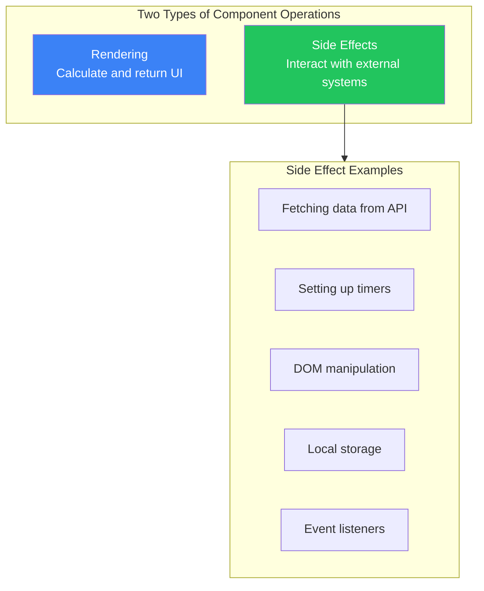
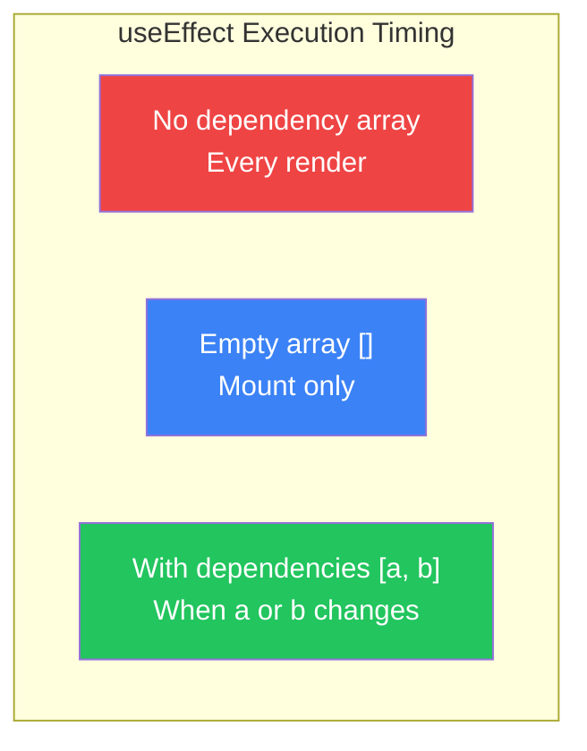
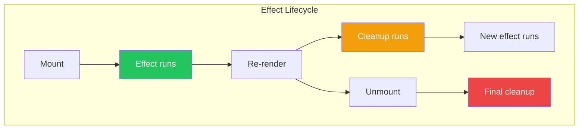

# Day 6: Effects and useEffect

## What You'll Learn Today

- What side effects are
- Basic usage of the useEffect hook
- Understanding the dependency array
- Cleanup functions
- Implementing data fetching

---

## What Are Side Effects?

**Side effects** are operations performed outside of component rendering.



### Why Separate Side Effects?

```jsx
// ❌ Bad: Side effect during render
function BadComponent() {
  // This runs on every render!
  fetch('/api/data')
    .then(res => res.json())
    .then(data => console.log(data));

  return <div>...</div>;
}

// ✅ Good: Side effect in useEffect
function GoodComponent() {
  useEffect(() => {
    fetch('/api/data')
      .then(res => res.json())
      .then(data => console.log(data));
  }, []);

  return <div>...</div>;
}
```

---

## useEffect Basics

`useEffect` is a hook for executing side effects.

### Basic Syntax

```jsx
import { useEffect } from 'react';

useEffect(() => {
  // Side effect code
}, [dependencies]);
```

### Execution Timing with Dependency Array



### Pattern 1: Run After Every Render

```jsx
function Counter() {
  const [count, setCount] = useState(0);

  // No dependency array → runs every time
  useEffect(() => {
    console.log('Component rendered');
  });

  return <button onClick={() => setCount(count + 1)}>{count}</button>;
}
```

### Pattern 2: Run Only on Mount

```jsx
function App() {
  const [data, setData] = useState(null);

  // Empty dependency array → mount only
  useEffect(() => {
    console.log('Component mounted');
    fetch('/api/data')
      .then(res => res.json())
      .then(setData);
  }, []);

  return <div>{data ? JSON.stringify(data) : 'Loading...'}</div>;
}
```

### Pattern 3: Run When Specific Values Change

```jsx
function UserProfile({ userId }) {
  const [user, setUser] = useState(null);

  // Runs when userId changes
  useEffect(() => {
    console.log(`Fetching user ${userId}`);
    fetch(`/api/users/${userId}`)
      .then(res => res.json())
      .then(setUser);
  }, [userId]);

  return <div>{user ? user.name : 'Loading...'}</div>;
}
```

---

## Dependency Array Details

The dependency array should include all "reactive values" used in the effect.

### What Are Reactive Values?

```jsx
function SearchResults({ query }) {  // props → reactive
  const [page, setPage] = useState(1);  // state → reactive
  const limit = 10;  // constant → not reactive

  useEffect(() => {
    // Uses query and page → include in dependencies
    fetch(`/api/search?q=${query}&page=${page}&limit=${limit}`)
      .then(res => res.json())
      .then(data => console.log(data));
  }, [query, page]);  // limit is constant, not needed

  return (...);
}
```

### Common Mistakes

```jsx
// ❌ Missing dependency
function BadExample({ userId }) {
  const [user, setUser] = useState(null);

  useEffect(() => {
    fetch(`/api/users/${userId}`)  // uses userId
      .then(res => res.json())
      .then(setUser);
  }, []);  // userId missing from dependencies!

  return <div>{user?.name}</div>;
}

// ✅ Correct dependencies
function GoodExample({ userId }) {
  const [user, setUser] = useState(null);

  useEffect(() => {
    fetch(`/api/users/${userId}`)
      .then(res => res.json())
      .then(setUser);
  }, [userId]);  // userId included

  return <div>{user?.name}</div>;
}
```

---

## Cleanup Functions

Some side effects require cleanup.



### Timer Cleanup

```jsx
function Timer() {
  const [seconds, setSeconds] = useState(0);

  useEffect(() => {
    const intervalId = setInterval(() => {
      setSeconds(prev => prev + 1);
    }, 1000);

    // Return cleanup function
    return () => {
      clearInterval(intervalId);
      console.log('Timer cleared');
    };
  }, []);

  return <div>Elapsed: {seconds} seconds</div>;
}
```

### Event Listener Cleanup

```jsx
function WindowSize() {
  const [size, setSize] = useState({
    width: window.innerWidth,
    height: window.innerHeight
  });

  useEffect(() => {
    function handleResize() {
      setSize({
        width: window.innerWidth,
        height: window.innerHeight
      });
    }

    window.addEventListener('resize', handleResize);

    // Cleanup
    return () => {
      window.removeEventListener('resize', handleResize);
    };
  }, []);

  return (
    <div>
      Window size: {size.width} x {size.height}
    </div>
  );
}
```

### WebSocket Cleanup

```jsx
function ChatRoom({ roomId }) {
  const [messages, setMessages] = useState([]);

  useEffect(() => {
    const socket = new WebSocket(`wss://chat.example.com/${roomId}`);

    socket.onmessage = (event) => {
      const message = JSON.parse(event.data);
      setMessages(prev => [...prev, message]);
    };

    // Cleanup: close connection
    return () => {
      socket.close();
    };
  }, [roomId]);

  return (
    <ul>
      {messages.map((msg, i) => <li key={i}>{msg.text}</li>)}
    </ul>
  );
}
```

---

## Data Fetching

A common pattern for fetching data from APIs.

### Basic Data Fetching

```jsx
function UserList() {
  const [users, setUsers] = useState([]);
  const [loading, setLoading] = useState(true);
  const [error, setError] = useState(null);

  useEffect(() => {
    async function fetchUsers() {
      try {
        setLoading(true);
        const response = await fetch('/api/users');
        if (!response.ok) {
          throw new Error('Failed to fetch data');
        }
        const data = await response.json();
        setUsers(data);
      } catch (err) {
        setError(err.message);
      } finally {
        setLoading(false);
      }
    }

    fetchUsers();
  }, []);

  if (loading) return <div>Loading...</div>;
  if (error) return <div>Error: {error}</div>;

  return (
    <ul>
      {users.map(user => (
        <li key={user.id}>{user.name}</li>
      ))}
    </ul>
  );
}
```

### Handling Race Conditions

Prevent state updates after component unmounts.

```jsx
function SearchResults({ query }) {
  const [results, setResults] = useState([]);

  useEffect(() => {
    let isCancelled = false;

    async function search() {
      const response = await fetch(`/api/search?q=${query}`);
      const data = await response.json();

      // Only update if not cancelled
      if (!isCancelled) {
        setResults(data);
      }
    }

    search();

    // Set cancel flag in cleanup
    return () => {
      isCancelled = true;
    };
  }, [query]);

  return (
    <ul>
      {results.map(item => <li key={item.id}>{item.title}</li>)}
    </ul>
  );
}
```

### Using AbortController

```jsx
function FetchWithAbort({ url }) {
  const [data, setData] = useState(null);
  const [loading, setLoading] = useState(true);

  useEffect(() => {
    const controller = new AbortController();

    async function fetchData() {
      try {
        setLoading(true);
        const response = await fetch(url, {
          signal: controller.signal
        });
        const json = await response.json();
        setData(json);
      } catch (err) {
        if (err.name !== 'AbortError') {
          console.error('Fetch error:', err);
        }
      } finally {
        setLoading(false);
      }
    }

    fetchData();

    return () => {
      controller.abort();
    };
  }, [url]);

  if (loading) return <div>Loading...</div>;
  return <pre>{JSON.stringify(data, null, 2)}</pre>;
}
```

---

## Extracting to Custom Hooks

Extract data fetching logic into a custom hook.

```jsx
function useFetch(url) {
  const [data, setData] = useState(null);
  const [loading, setLoading] = useState(true);
  const [error, setError] = useState(null);

  useEffect(() => {
    const controller = new AbortController();

    async function fetchData() {
      try {
        setLoading(true);
        setError(null);
        const response = await fetch(url, {
          signal: controller.signal
        });
        if (!response.ok) {
          throw new Error(`HTTP error! status: ${response.status}`);
        }
        const json = await response.json();
        setData(json);
      } catch (err) {
        if (err.name !== 'AbortError') {
          setError(err.message);
        }
      } finally {
        setLoading(false);
      }
    }

    fetchData();

    return () => controller.abort();
  }, [url]);

  return { data, loading, error };
}

// Usage
function UserProfile({ userId }) {
  const { data: user, loading, error } = useFetch(`/api/users/${userId}`);

  if (loading) return <div>Loading...</div>;
  if (error) return <div>Error: {error}</div>;

  return (
    <div>
      <h1>{user.name}</h1>
      <p>{user.email}</p>
    </div>
  );
}
```

---

## useEffect Best Practices

### Avoid Unnecessary Effects

```jsx
// ❌ Unnecessary effect: derived value calculation
function BadExample({ items }) {
  const [total, setTotal] = useState(0);

  useEffect(() => {
    setTotal(items.reduce((sum, item) => sum + item.price, 0));
  }, [items]);

  return <div>Total: {total}</div>;
}

// ✅ Calculate during render
function GoodExample({ items }) {
  const total = items.reduce((sum, item) => sum + item.price, 0);

  return <div>Total: {total}</div>;
}
```

### Event Handlers vs useEffect

```jsx
// ❌ Using useEffect for form submission
function BadForm() {
  const [submitted, setSubmitted] = useState(false);

  useEffect(() => {
    if (submitted) {
      fetch('/api/submit', { method: 'POST' });
    }
  }, [submitted]);

  return <button onClick={() => setSubmitted(true)}>Submit</button>;
}

// ✅ Use event handler
function GoodForm() {
  function handleSubmit() {
    fetch('/api/submit', { method: 'POST' });
  }

  return <button onClick={handleSubmit}>Submit</button>;
}
```

---

## Summary

| Concept | Description |
|---------|-------------|
| **Side effects** | Operations outside rendering (API calls, timers, etc.) |
| **useEffect** | Hook for executing side effects |
| **Dependency array** | Controls when effect runs |
| **Cleanup** | Clean up after effects (clear timers, etc.) |
| **Race conditions** | Prevent competing async operations |

### Key Takeaways

1. Include all reactive values used in the effect in the **dependency array**
2. Use **cleanup functions** to release resources
3. Implement cancellation to prevent **race conditions**
4. Calculate **derived values** during render, not in useEffect
5. Handle **event responses** in event handlers, not useEffect

---

## Exercises

### Exercise 1: Basics
Create a Clock component that updates and displays the current time every second.

### Exercise 2: Application
Create a component that fetches data from an API when a search query is entered. Display loading and error states.

### Challenge
Create a ScrollProgress component that monitors window scroll position and displays what percentage of the page has been scrolled.

---

## References

- [React Docs - useEffect](https://react.dev/reference/react/useEffect)
- [React Docs - Synchronizing with Effects](https://react.dev/learn/synchronizing-with-effects)
- [React Docs - You Might Not Need an Effect](https://react.dev/learn/you-might-not-need-an-effect)

---

**Coming Up Next**: On Day 7, we'll learn about "Refs and Portals." Understand direct DOM access and rendering outside the DOM tree.
