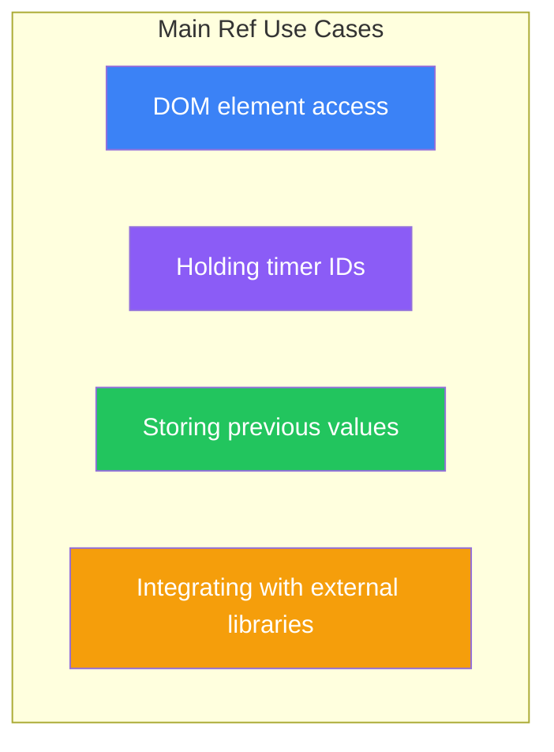
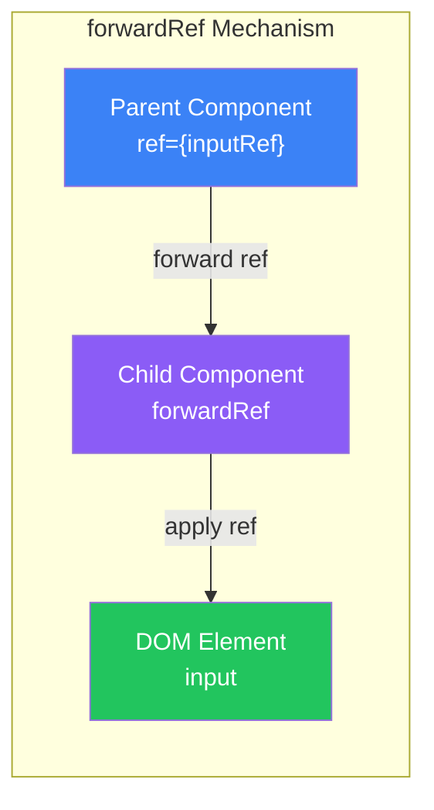
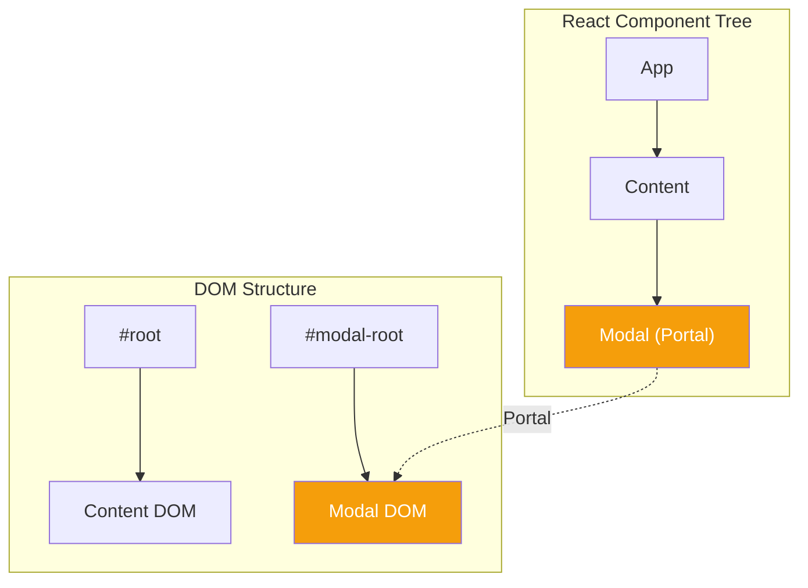

# Day 7: Refs and Portals

## What You'll Learn Today

- useRef hook basics
- Direct DOM element access
- Difference between Ref and State
- Forwarding Refs with forwardRef
- Using Portals

---

## What Are Refs?

**Refs (References)** are a way to hold values that don't affect rendering. They're primarily used for direct DOM access.



### Difference from State

| Feature | State | Ref |
|---------|-------|-----|
| Re-render on update | Yes | No |
| Value persistence | Across renders | Across renders |
| Main use | UI display data | Non-rendering data |
| Access method | Direct | `.current` property |

---

## useRef Basics

`useRef` is a hook that creates a Ref object.

### Basic Syntax

```jsx
import { useRef } from 'react';

function Component() {
  const ref = useRef(initialValue);
  // Access via ref.current
}
```

### Simple Example

```jsx
function Counter() {
  const countRef = useRef(0);

  function handleClick() {
    countRef.current += 1;
    console.log(`Click count: ${countRef.current}`);
    // Note: UI won't update!
  }

  return <button onClick={handleClick}>Click</button>;
}
```

---

## Accessing DOM Elements

The most common use of Refs is direct DOM access.

### Focus Control

```jsx
function TextInput() {
  const inputRef = useRef(null);

  function handleFocus() {
    inputRef.current.focus();
  }

  return (
    <div>
      <input ref={inputRef} type="text" />
      <button onClick={handleFocus}>Focus</button>
    </div>
  );
}
```

### Scroll Control

```jsx
function ScrollableList() {
  const listRef = useRef(null);

  function scrollToTop() {
    listRef.current.scrollTo({
      top: 0,
      behavior: 'smooth'
    });
  }

  function scrollToBottom() {
    listRef.current.scrollTo({
      top: listRef.current.scrollHeight,
      behavior: 'smooth'
    });
  }

  return (
    <div>
      <button onClick={scrollToTop}>Top</button>
      <button onClick={scrollToBottom}>Bottom</button>
      <ul ref={listRef} style={{ height: '200px', overflow: 'auto' }}>
        {Array.from({ length: 50 }, (_, i) => (
          <li key={i}>Item {i + 1}</li>
        ))}
      </ul>
    </div>
  );
}
```

### Getting Element Dimensions

```jsx
function MeasureBox() {
  const boxRef = useRef(null);
  const [dimensions, setDimensions] = useState({ width: 0, height: 0 });

  useEffect(() => {
    if (boxRef.current) {
      const { width, height } = boxRef.current.getBoundingClientRect();
      setDimensions({ width, height });
    }
  }, []);

  return (
    <div>
      <div ref={boxRef} style={{ width: '200px', height: '100px', background: 'lightblue' }}>
        Box
      </div>
      <p>Size: {dimensions.width} x {dimensions.height}</p>
    </div>
  );
}
```

---

## Storing Previous Values

Refs can store values from previous renders.

```jsx
function PreviousValue() {
  const [count, setCount] = useState(0);
  const prevCountRef = useRef();

  useEffect(() => {
    prevCountRef.current = count;
  });

  const prevCount = prevCountRef.current;

  return (
    <div>
      <p>Current: {count}, Previous: {prevCount ?? 'none'}</p>
      <button onClick={() => setCount(count + 1)}>Increment</button>
    </div>
  );
}
```

### Extracting to Custom Hook

```jsx
function usePrevious(value) {
  const ref = useRef();

  useEffect(() => {
    ref.current = value;
  }, [value]);

  return ref.current;
}

// Usage
function Counter() {
  const [count, setCount] = useState(0);
  const prevCount = usePrevious(count);

  return (
    <div>
      <p>Current: {count}, Previous: {prevCount ?? 'none'}</p>
      <button onClick={() => setCount(count + 1)}>Increment</button>
    </div>
  );
}
```

---

## Managing Timers

Storing timer IDs in Refs ensures reliable cleanup.

```jsx
function Stopwatch() {
  const [time, setTime] = useState(0);
  const [isRunning, setIsRunning] = useState(false);
  const intervalRef = useRef(null);

  function start() {
    if (!isRunning) {
      setIsRunning(true);
      intervalRef.current = setInterval(() => {
        setTime(prev => prev + 10);
      }, 10);
    }
  }

  function stop() {
    if (isRunning) {
      clearInterval(intervalRef.current);
      setIsRunning(false);
    }
  }

  function reset() {
    clearInterval(intervalRef.current);
    setIsRunning(false);
    setTime(0);
  }

  // Cleanup
  useEffect(() => {
    return () => {
      if (intervalRef.current) {
        clearInterval(intervalRef.current);
      }
    };
  }, []);

  const formatTime = (ms) => {
    const minutes = Math.floor(ms / 60000);
    const seconds = Math.floor((ms % 60000) / 1000);
    const centiseconds = Math.floor((ms % 1000) / 10);
    return `${minutes}:${seconds.toString().padStart(2, '0')}.${centiseconds.toString().padStart(2, '0')}`;
  };

  return (
    <div>
      <p style={{ fontSize: '2rem' }}>{formatTime(time)}</p>
      <button onClick={start} disabled={isRunning}>Start</button>
      <button onClick={stop} disabled={!isRunning}>Stop</button>
      <button onClick={reset}>Reset</button>
    </div>
  );
}
```

---

## forwardRef

Use `forwardRef` to access a child component's DOM element from the parent.



### Basic Usage

```jsx
import { forwardRef, useRef } from 'react';

// Child component: wrapped with forwardRef
const TextInput = forwardRef(function TextInput(props, ref) {
  return (
    <input
      ref={ref}
      type="text"
      className="custom-input"
      {...props}
    />
  );
});

// Parent component
function Form() {
  const inputRef = useRef(null);

  function handleFocus() {
    inputRef.current.focus();
  }

  return (
    <div>
      <TextInput ref={inputRef} placeholder="Enter text" />
      <button onClick={handleFocus}>Focus</button>
    </div>
  );
}
```

### useImperativeHandle

Limit the methods exposed by child components.

```jsx
import { forwardRef, useImperativeHandle, useRef } from 'react';

const CustomInput = forwardRef(function CustomInput(props, ref) {
  const inputRef = useRef(null);

  // Define exposed methods
  useImperativeHandle(ref, () => ({
    focus() {
      inputRef.current.focus();
    },
    clear() {
      inputRef.current.value = '';
    },
    getValue() {
      return inputRef.current.value;
    }
  }));

  return <input ref={inputRef} {...props} />;
});

// Usage
function Form() {
  const inputRef = useRef(null);

  return (
    <div>
      <CustomInput ref={inputRef} />
      <button onClick={() => inputRef.current.focus()}>Focus</button>
      <button onClick={() => inputRef.current.clear()}>Clear</button>
      <button onClick={() => alert(inputRef.current.getValue())}>Get Value</button>
    </div>
  );
}
```

---

## Portals

**Portals** let you render outside your component's DOM tree hierarchy.



### Basic Usage

```jsx
import { createPortal } from 'react-dom';

function Modal({ children, onClose }) {
  return createPortal(
    <div className="modal-overlay" onClick={onClose}>
      <div className="modal-content" onClick={e => e.stopPropagation()}>
        {children}
      </div>
    </div>,
    document.getElementById('modal-root')
  );
}

// Add <div id="modal-root"></div> to index.html
```

### Complete Modal Implementation

```jsx
import { useState } from 'react';
import { createPortal } from 'react-dom';

function Modal({ isOpen, onClose, title, children }) {
  if (!isOpen) return null;

  return createPortal(
    <div className="modal-overlay">
      <div className="modal-content">
        <div className="modal-header">
          <h2>{title}</h2>
          <button onClick={onClose} className="close-button">×</button>
        </div>
        <div className="modal-body">
          {children}
        </div>
      </div>
    </div>,
    document.getElementById('modal-root')
  );
}

function App() {
  const [isModalOpen, setIsModalOpen] = useState(false);

  return (
    <div>
      <h1>Main Content</h1>
      <button onClick={() => setIsModalOpen(true)}>
        Open Modal
      </button>

      <Modal
        isOpen={isModalOpen}
        onClose={() => setIsModalOpen(false)}
        title="Confirm"
      >
        <p>Are you sure you want to proceed?</p>
        <button onClick={() => setIsModalOpen(false)}>Cancel</button>
        <button onClick={() => {
          console.log('Confirmed');
          setIsModalOpen(false);
        }}>OK</button>
      </Modal>
    </div>
  );
}
```

### Portal Use Cases

| Use Case | Description |
|----------|-------------|
| Modals | Full-screen overlay dialogs |
| Tooltips | Element-attached popups |
| Dropdowns | Escape parent overflow settings |
| Notifications | Fixed position at screen edge |

---

## Best Practices

### When to Use Refs

```jsx
// ✅ Good use of Refs
// - DOM manipulation (focus, scroll)
// - Storing timer IDs
// - Storing previous values
// - Integrating with external libraries

// ❌ Don't use Refs for
// - Data to display in UI → Use State
// - Derived calculations → Use regular variables
```

### When to Use Portals

```jsx
// ✅ Good use of Portals
// - Modals, dialogs
// - Tooltips, popovers
// - Escaping parent CSS constraints

// ❌ Don't use Portals for
// - Cases solvable with normal component composition
```

---

## Summary

| Concept | Description |
|---------|-------------|
| **useRef** | Hook to hold values without re-rendering |
| **DOM Ref** | Direct access to DOM elements |
| **forwardRef** | Forward Refs to child components |
| **useImperativeHandle** | Customize exposed Ref API |
| **Portal** | Render outside DOM tree |

### Key Takeaways

1. Ref changes **don't cause re-renders**
2. DOM Refs are available **after rendering**
3. Use **forwardRef** to access child component's DOM
4. Use **useImperativeHandle** to limit exposed API
5. **Portals** solve z-index and overflow issues

---

## Exercises

### Exercise 1: Basics
Create a component with a text input and button. Clicking the button should focus the input and select its contents.

### Exercise 2: Application
Create an image gallery. Clicking a thumbnail opens a modal showing the full image (use Portal).

### Challenge
Create a custom video player component. Use useImperativeHandle to expose `play()`, `pause()`, and `seekTo(time)` methods to parent components.

---

## References

- [React Docs - useRef](https://react.dev/reference/react/useRef)
- [React Docs - forwardRef](https://react.dev/reference/react/forwardRef)
- [React Docs - createPortal](https://react.dev/reference/react-dom/createPortal)

---

**Coming Up Next**: On Day 8, we'll learn about "Context API and State Management." Understand how to efficiently share data between components.
