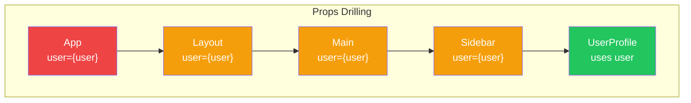
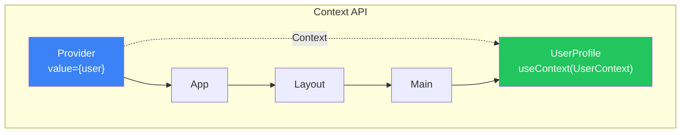
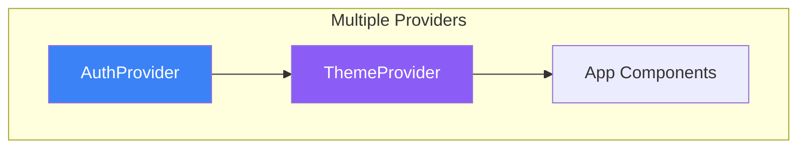
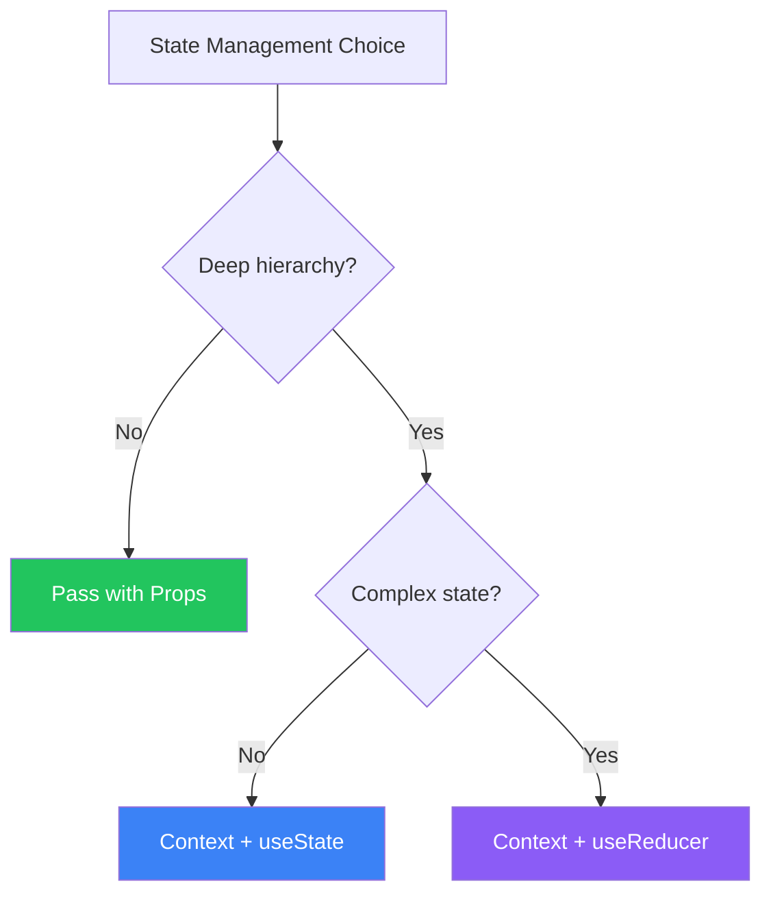

# Day 8: Context and State Management

## What You'll Learn Today

- The Props drilling problem
- Context API basics
- The useContext hook
- Context design patterns
- Combining with useReducer

---

## The Props Drilling Problem

When passing data to deeply nested components, you need to pass through intermediate components. This is called **Props drilling**.



### The Problem

```jsx
// ❌ Props drilling: Intermediate components pass user without using it
function App() {
  const [user, setUser] = useState({ name: 'Alice', role: 'admin' });

  return <Layout user={user} />;
}

function Layout({ user }) {
  return (
    <div>
      <Header />
      <Main user={user} />  {/* Just passing */}
      <Footer />
    </div>
  );
}

function Main({ user }) {
  return <Sidebar user={user} />;  {/* Just passing */}
}

function Sidebar({ user }) {
  return <UserProfile user={user} />;  {/* Just passing */}
}

function UserProfile({ user }) {
  return <p>Welcome, {user.name}</p>;  {/* Actually uses it */}
}
```

---

## What Is the Context API?

The **Context API** is a mechanism for "tunneling" data through the component tree.



---

## Basic Context Usage

### Step 1: Create the Context

```jsx
import { createContext } from 'react';

// Create Context with default value
const UserContext = createContext(null);

export default UserContext;
```

### Step 2: Wrap with Provider

```jsx
import { useState } from 'react';
import UserContext from './UserContext';

function App() {
  const [user, setUser] = useState({ name: 'Alice', role: 'admin' });

  return (
    <UserContext.Provider value={user}>
      <Layout />
    </UserContext.Provider>
  );
}
```

### Step 3: Use with useContext

```jsx
import { useContext } from 'react';
import UserContext from './UserContext';

function UserProfile() {
  const user = useContext(UserContext);

  return <p>Welcome, {user.name}</p>;
}
```

### Complete Code

```jsx
import { createContext, useContext, useState } from 'react';

// Create Context
const UserContext = createContext(null);

// Top-level component
function App() {
  const [user, setUser] = useState({ name: 'Alice', role: 'admin' });

  return (
    <UserContext.Provider value={user}>
      <Layout />
    </UserContext.Provider>
  );
}

// Intermediate components (don't need to know about user)
function Layout() {
  return (
    <div>
      <Header />
      <Main />
      <Footer />
    </div>
  );
}

function Main() {
  return <Sidebar />;
}

function Sidebar() {
  return <UserProfile />;
}

// Component that uses Context
function UserProfile() {
  const user = useContext(UserContext);
  return <p>Welcome, {user.name}</p>;
}
```

---

## Updatable Context

Provide state and update functions through Context.

```jsx
import { createContext, useContext, useState } from 'react';

// Create Context
const ThemeContext = createContext(null);

// Provider component
function ThemeProvider({ children }) {
  const [theme, setTheme] = useState('light');

  function toggleTheme() {
    setTheme(prev => prev === 'light' ? 'dark' : 'light');
  }

  const value = {
    theme,
    toggleTheme
  };

  return (
    <ThemeContext.Provider value={value}>
      {children}
    </ThemeContext.Provider>
  );
}

// Custom hook
function useTheme() {
  const context = useContext(ThemeContext);
  if (context === null) {
    throw new Error('useTheme must be used within ThemeProvider');
  }
  return context;
}

// Usage
function App() {
  return (
    <ThemeProvider>
      <Header />
      <Main />
    </ThemeProvider>
  );
}

function Header() {
  const { theme, toggleTheme } = useTheme();

  return (
    <header style={{ background: theme === 'light' ? '#fff' : '#333' }}>
      <button onClick={toggleTheme}>
        {theme === 'light' ? '🌙' : '☀️'}
      </button>
    </header>
  );
}
```

---

## Combining Multiple Contexts

```jsx
// Auth Context
const AuthContext = createContext(null);

function AuthProvider({ children }) {
  const [user, setUser] = useState(null);

  const login = (userData) => setUser(userData);
  const logout = () => setUser(null);

  return (
    <AuthContext.Provider value={{ user, login, logout }}>
      {children}
    </AuthContext.Provider>
  );
}

// Theme Context
const ThemeContext = createContext(null);

function ThemeProvider({ children }) {
  const [theme, setTheme] = useState('light');
  const toggleTheme = () => setTheme(t => t === 'light' ? 'dark' : 'light');

  return (
    <ThemeContext.Provider value={{ theme, toggleTheme }}>
      {children}
    </ThemeContext.Provider>
  );
}

// Combining multiple Providers
function App() {
  return (
    <AuthProvider>
      <ThemeProvider>
        <MainApp />
      </ThemeProvider>
    </AuthProvider>
  );
}
```



---

## Combining with useReducer

Use `useReducer` for complex state management.

### useReducer Basics

```jsx
import { useReducer } from 'react';

// Initial state
const initialState = { count: 0 };

// Reducer function
function reducer(state, action) {
  switch (action.type) {
    case 'increment':
      return { count: state.count + 1 };
    case 'decrement':
      return { count: state.count - 1 };
    case 'reset':
      return initialState;
    default:
      throw new Error(`Unknown action: ${action.type}`);
  }
}

function Counter() {
  const [state, dispatch] = useReducer(reducer, initialState);

  return (
    <div>
      <p>Count: {state.count}</p>
      <button onClick={() => dispatch({ type: 'increment' })}>+</button>
      <button onClick={() => dispatch({ type: 'decrement' })}>-</button>
      <button onClick={() => dispatch({ type: 'reset' })}>Reset</button>
    </div>
  );
}
```

### Context + useReducer Combined

```jsx
import { createContext, useContext, useReducer, useState } from 'react';

// Todo type (in comments)
// { id: number, text: string, completed: boolean }

// Initial state
const initialState = {
  todos: [],
  filter: 'all'  // 'all' | 'active' | 'completed'
};

// Reducer
function todoReducer(state, action) {
  switch (action.type) {
    case 'ADD_TODO':
      return {
        ...state,
        todos: [
          ...state.todos,
          { id: Date.now(), text: action.payload, completed: false }
        ]
      };

    case 'TOGGLE_TODO':
      return {
        ...state,
        todos: state.todos.map(todo =>
          todo.id === action.payload
            ? { ...todo, completed: !todo.completed }
            : todo
        )
      };

    case 'DELETE_TODO':
      return {
        ...state,
        todos: state.todos.filter(todo => todo.id !== action.payload)
      };

    case 'SET_FILTER':
      return {
        ...state,
        filter: action.payload
      };

    default:
      return state;
  }
}

// Context
const TodoContext = createContext(null);

// Provider
function TodoProvider({ children }) {
  const [state, dispatch] = useReducer(todoReducer, initialState);

  // Filtered todos
  const filteredTodos = state.todos.filter(todo => {
    if (state.filter === 'active') return !todo.completed;
    if (state.filter === 'completed') return todo.completed;
    return true;
  });

  const value = {
    todos: filteredTodos,
    allTodos: state.todos,
    filter: state.filter,
    dispatch
  };

  return (
    <TodoContext.Provider value={value}>
      {children}
    </TodoContext.Provider>
  );
}

// Custom hook
function useTodo() {
  const context = useContext(TodoContext);
  if (!context) {
    throw new Error('useTodo must be used within TodoProvider');
  }
  return context;
}

// Components
function TodoApp() {
  return (
    <TodoProvider>
      <h1>Todo App</h1>
      <AddTodo />
      <FilterButtons />
      <TodoList />
      <TodoStats />
    </TodoProvider>
  );
}

function AddTodo() {
  const { dispatch } = useTodo();
  const [text, setText] = useState('');

  function handleSubmit(e) {
    e.preventDefault();
    if (text.trim()) {
      dispatch({ type: 'ADD_TODO', payload: text });
      setText('');
    }
  }

  return (
    <form onSubmit={handleSubmit}>
      <input
        value={text}
        onChange={(e) => setText(e.target.value)}
        placeholder="New task"
      />
      <button type="submit">Add</button>
    </form>
  );
}

function FilterButtons() {
  const { filter, dispatch } = useTodo();

  return (
    <div>
      {['all', 'active', 'completed'].map(f => (
        <button
          key={f}
          onClick={() => dispatch({ type: 'SET_FILTER', payload: f })}
          style={{ fontWeight: filter === f ? 'bold' : 'normal' }}
        >
          {f}
        </button>
      ))}
    </div>
  );
}

function TodoList() {
  const { todos, dispatch } = useTodo();

  return (
    <ul>
      {todos.map(todo => (
        <li key={todo.id}>
          <input
            type="checkbox"
            checked={todo.completed}
            onChange={() => dispatch({ type: 'TOGGLE_TODO', payload: todo.id })}
          />
          <span style={{ textDecoration: todo.completed ? 'line-through' : 'none' }}>
            {todo.text}
          </span>
          <button onClick={() => dispatch({ type: 'DELETE_TODO', payload: todo.id })}>
            Delete
          </button>
        </li>
      ))}
    </ul>
  );
}

function TodoStats() {
  const { allTodos } = useTodo();
  const completed = allTodos.filter(t => t.completed).length;

  return (
    <p>
      Completed: {completed} / {allTodos.length}
    </p>
  );
}
```

---

## Context Best Practices

### Proper Separation

```jsx
// ❌ Too much in one Context
const AppContext = createContext({
  user: null,
  theme: 'light',
  language: 'en',
  notifications: [],
  cart: [],
  // ...
});

// ✅ Separate by concern
const AuthContext = createContext(null);
const ThemeContext = createContext(null);
const LanguageContext = createContext(null);
const NotificationContext = createContext(null);
const CartContext = createContext(null);
```

### Performance Considerations

```jsx
// ❌ Creating new object each render (unnecessary re-renders)
function BadProvider({ children }) {
  const [count, setCount] = useState(0);

  return (
    <MyContext.Provider value={{ count, setCount }}>
      {children}
    </MyContext.Provider>
  );
}

// ✅ Memoize with useMemo
function GoodProvider({ children }) {
  const [count, setCount] = useState(0);

  const value = useMemo(() => ({ count, setCount }), [count]);

  return (
    <MyContext.Provider value={value}>
      {children}
    </MyContext.Provider>
  );
}
```

---

## Choosing the Right Approach

| Scenario | Recommended Approach |
|----------|---------------------|
| 2-3 levels of Props | Props are sufficient |
| Theme, auth, language | Context |
| Global state management | Context + useReducer |
| Complex app-wide state | Consider external libraries |



---

## Summary

| Concept | Description |
|---------|-------------|
| **Props drilling** | Problem of passing Props through deep hierarchies |
| **Context** | Share data across the component tree |
| **Provider** | Component that provides Context values |
| **useContext** | Hook to retrieve Context values |
| **useReducer** | Manage complex state update logic |

### Key Takeaways

1. Context is ideal for **global state**
2. **Encapsulate** Context usage in custom hooks
3. **Separate Contexts** by concern
4. Combine **useReducer** for complex state
5. Use **useMemo** for performance

---

## Exercises

### Exercise 1: Basics
Create a Context for language settings (English/Japanese). Add a button to switch languages and display text that changes accordingly.

### Exercise 2: Application
Create a shopping cart Context:
- Add/remove products
- Change quantities
- Calculate total price

### Challenge
Create an authentication system Context (using useReducer):
- Login/logout functionality
- Loading state management
- Error message handling
- Routing based on auth state

---

## References

- [React Docs - Context](https://react.dev/learn/passing-data-deeply-with-context)
- [React Docs - useReducer](https://react.dev/reference/react/useReducer)
- [React Docs - Scaling Up with Reducer and Context](https://react.dev/learn/scaling-up-with-reducer-and-context)

---

**Coming Up Next**: On Day 9, we'll learn about "Performance Optimization." Understand techniques to keep your React apps fast.
