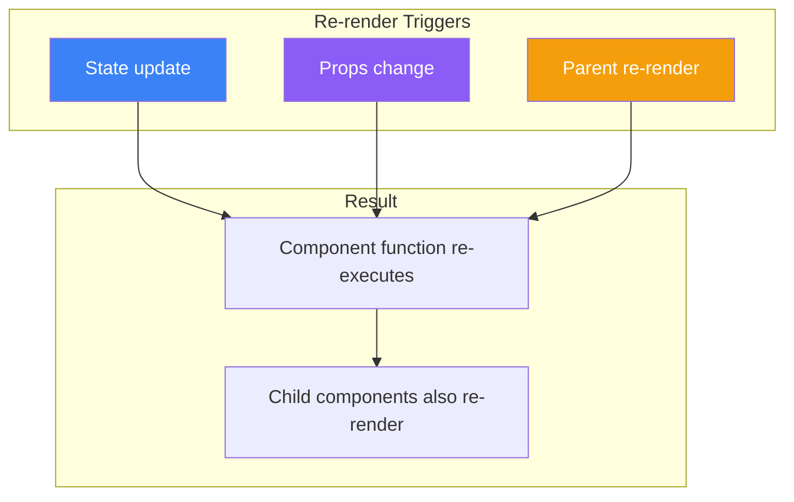
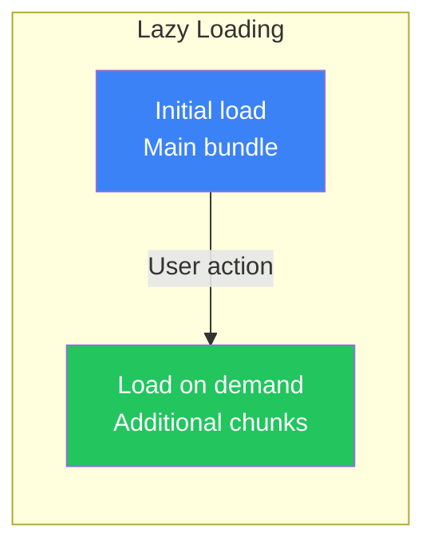
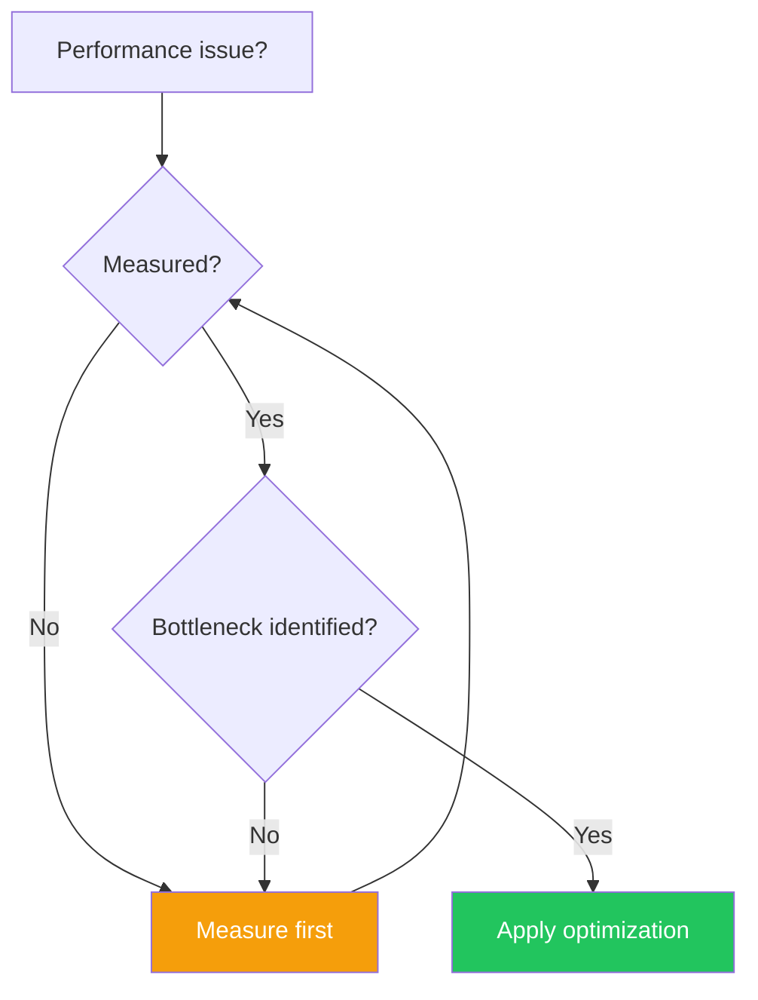

# Day 9: Performance Optimization

## What You'll Learn Today

- How re-rendering works
- Memoizing components with React.memo
- Memoizing values with useMemo
- Memoizing functions with useCallback
- Code splitting and Lazy Loading

---

## How Re-rendering Works

In React, components re-render when their **State** or **Props** change.



### Re-rendering Example

```jsx
function Parent() {
  const [count, setCount] = useState(0);
  console.log('Parent rendered');

  return (
    <div>
      <p>Count: {count}</p>
      <button onClick={() => setCount(count + 1)}>Increment</button>
      <Child />  {/* Re-renders every time */}
    </div>
  );
}

function Child() {
  console.log('Child rendered');  // Runs whenever parent updates
  return <p>I am a child</p>;
}
```

---

## React.memo

`React.memo` is a higher-order component that skips re-rendering when Props haven't changed.

### Basic Usage

```jsx
import { memo } from 'react';

// Wrap with memo()
const Child = memo(function Child({ name }) {
  console.log('Child rendered');
  return <p>Hello, {name}</p>;
});

function Parent() {
  const [count, setCount] = useState(0);

  return (
    <div>
      <p>Count: {count}</p>
      <button onClick={() => setCount(count + 1)}>Increment</button>
      <Child name="Alice" />  {/* Won't re-render unless name changes */}
    </div>
  );
}
```

### Custom Comparison Function

```jsx
const UserCard = memo(
  function UserCard({ user }) {
    return (
      <div>
        <h3>{user.name}</h3>
        <p>{user.email}</p>
      </div>
    );
  },
  // Custom comparison function
  (prevProps, nextProps) => {
    return prevProps.user.id === nextProps.user.id;
  }
);
```

### React.memo Gotchas

```jsx
// ❌ Objects and arrays create new references each time
function Parent() {
  const [count, setCount] = useState(0);

  return (
    <Child
      style={{ color: 'red' }}  // New object every render
      items={[1, 2, 3]}         // New array every render
    />
  );
}

// ✅ Stabilize references with useMemo
function Parent() {
  const [count, setCount] = useState(0);

  const style = useMemo(() => ({ color: 'red' }), []);
  const items = useMemo(() => [1, 2, 3], []);

  return <Child style={style} items={items} />;
}
```

---

## useMemo

`useMemo` is a hook that memoizes expensive calculations.

### Basic Usage

```jsx
import { useMemo, useState } from 'react';

function ExpensiveComponent({ items, filter }) {
  // ❌ Calculated every render
  const filteredItems = items.filter(item => item.includes(filter));

  // ✅ Only recalculated when filter or items change
  const filteredItems = useMemo(() => {
    console.log('Filtering...');
    return items.filter(item => item.includes(filter));
  }, [items, filter]);

  return (
    <ul>
      {filteredItems.map(item => <li key={item}>{item}</li>)}
    </ul>
  );
}
```

### Appropriate Use Cases

```jsx
function DataTable({ data, sortKey, sortOrder }) {
  // Sorting can be expensive
  const sortedData = useMemo(() => {
    console.log('Sorting data...');
    return [...data].sort((a, b) => {
      const comparison = a[sortKey] > b[sortKey] ? 1 : -1;
      return sortOrder === 'asc' ? comparison : -comparison;
    });
  }, [data, sortKey, sortOrder]);

  return (
    <table>
      <tbody>
        {sortedData.map(row => (
          <tr key={row.id}>
            <td>{row.name}</td>
            <td>{row.value}</td>
          </tr>
        ))}
      </tbody>
    </table>
  );
}
```

### When useMemo Is Unnecessary

```jsx
// ❌ useMemo not needed for simple calculations
const double = useMemo(() => count * 2, [count]);

// ✅ Calculate directly
const double = count * 2;
```

---

## useCallback

`useCallback` is a hook that memoizes functions. It's mainly used when passing functions to memoized components.

### Basic Usage

```jsx
import { useCallback, memo, useState } from 'react';

const Button = memo(function Button({ onClick, children }) {
  console.log(`Button "${children}" rendered`);
  return <button onClick={onClick}>{children}</button>;
});

function Parent() {
  const [count, setCount] = useState(0);
  const [text, setText] = useState('');

  // ❌ New function created every render
  const handleClick = () => setCount(count + 1);

  // ✅ Returns same function unless dependencies change
  const handleIncrement = useCallback(() => {
    setCount(prev => prev + 1);
  }, []);

  return (
    <div>
      <p>Count: {count}</p>
      <input value={text} onChange={(e) => setText(e.target.value)} />
      <Button onClick={handleIncrement}>Increment</Button>
    </div>
  );
}
```

### Optimizing Event Handlers

```jsx
function TodoList({ todos, onToggle, onDelete }) {
  return (
    <ul>
      {todos.map(todo => (
        <TodoItem
          key={todo.id}
          todo={todo}
          onToggle={onToggle}
          onDelete={onDelete}
        />
      ))}
    </ul>
  );
}

const TodoItem = memo(function TodoItem({ todo, onToggle, onDelete }) {
  return (
    <li>
      <input
        type="checkbox"
        checked={todo.completed}
        onChange={() => onToggle(todo.id)}
      />
      {todo.text}
      <button onClick={() => onDelete(todo.id)}>Delete</button>
    </li>
  );
});

function App() {
  const [todos, setTodos] = useState([]);

  // Memoize with useCallback
  const handleToggle = useCallback((id) => {
    setTodos(prev =>
      prev.map(todo =>
        todo.id === id ? { ...todo, completed: !todo.completed } : todo
      )
    );
  }, []);

  const handleDelete = useCallback((id) => {
    setTodos(prev => prev.filter(todo => todo.id !== id));
  }, []);

  return <TodoList todos={todos} onToggle={handleToggle} onDelete={handleDelete} />;
}
```

---

## Code Splitting and Lazy Loading

Load large components only when needed.



### React.lazy

```jsx
import { lazy, Suspense, useState } from 'react';

// Dynamic import
const HeavyComponent = lazy(() => import('./HeavyComponent'));

function App() {
  const [showHeavy, setShowHeavy] = useState(false);

  return (
    <div>
      <button onClick={() => setShowHeavy(true)}>
        Show Heavy Component
      </button>

      {showHeavy && (
        <Suspense fallback={<div>Loading...</div>}>
          <HeavyComponent />
        </Suspense>
      )}
    </div>
  );
}
```

### Route-Based Splitting

```jsx
import { lazy, Suspense } from 'react';
import { BrowserRouter, Routes, Route } from 'react-router-dom';

// Lazy load each page
const Home = lazy(() => import('./pages/Home'));
const About = lazy(() => import('./pages/About'));
const Dashboard = lazy(() => import('./pages/Dashboard'));

function App() {
  return (
    <BrowserRouter>
      <Suspense fallback={<div>Loading page...</div>}>
        <Routes>
          <Route path="/" element={<Home />} />
          <Route path="/about" element={<About />} />
          <Route path="/dashboard" element={<Dashboard />} />
        </Routes>
      </Suspense>
    </BrowserRouter>
  );
}
```

---

## Analysis with React DevTools

### Using the Profiler

Analyze rendering performance with the Profiler tab in React DevTools.

```jsx
// Debug markers
import { Profiler } from 'react';

function onRenderCallback(
  id,             // Profiler id
  phase,          // "mount" or "update"
  actualDuration, // Time spent rendering
  baseDuration,   // Estimated time without memoization
  startTime,      // When rendering started
  commitTime      // When commit happened
) {
  console.log(`${id} ${phase}: ${actualDuration.toFixed(2)}ms`);
}

function App() {
  return (
    <Profiler id="App" onRender={onRenderCallback}>
      <MainContent />
    </Profiler>
  );
}
```

---

## Optimization Guidelines

### When to Optimize



### Optimization Checklist

| Check | Solution |
|-------|----------|
| Unnecessary re-renders | React.memo |
| Expensive calculations | useMemo |
| Function recreation | useCallback |
| Large bundles | lazy + Suspense |
| Long lists | Virtualization (react-window) |

### Avoid Over-Optimization

```jsx
// ❌ Over-optimization
function Component() {
  // useMemo not needed for simple values
  const greeting = useMemo(() => 'Hello', []);

  // useCallback not needed for simple functions
  const log = useCallback(() => console.log('clicked'), []);

  return <div>{greeting}</div>;
}

// ✅ Optimize only when needed
function Component() {
  const greeting = 'Hello';
  const log = () => console.log('clicked');

  return <div onClick={log}>{greeting}</div>;
}
```

---

## Practical Optimization Example

### List Optimization

```jsx
import { memo, useCallback, useMemo, useState } from 'react';

const ListItem = memo(function ListItem({ item, onSelect }) {
  console.log(`ListItem ${item.id} rendered`);
  return (
    <li onClick={() => onSelect(item.id)}>
      {item.name}
    </li>
  );
});

function OptimizedList({ items }) {
  const [selected, setSelected] = useState(null);
  const [filter, setFilter] = useState('');

  // Memoize filtered results
  const filteredItems = useMemo(() => {
    return items.filter(item =>
      item.name.toLowerCase().includes(filter.toLowerCase())
    );
  }, [items, filter]);

  // Memoize callback
  const handleSelect = useCallback((id) => {
    setSelected(id);
  }, []);

  return (
    <div>
      <input
        value={filter}
        onChange={(e) => setFilter(e.target.value)}
        placeholder="Filter"
      />
      <ul>
        {filteredItems.map(item => (
          <ListItem
            key={item.id}
            item={item}
            onSelect={handleSelect}
          />
        ))}
      </ul>
      {selected && <p>Selected: {selected}</p>}
    </div>
  );
}
```

---

## Summary

| Concept | Description |
|---------|-------------|
| **Re-rendering** | Component function re-executes on State/Props change |
| **React.memo** | Skip re-render if Props unchanged |
| **useMemo** | Memoize calculated values |
| **useCallback** | Memoize functions |
| **lazy/Suspense** | Load components on demand |

### Key Takeaways

1. **Measure first**, then identify bottlenecks
2. **React.memo** prevents unnecessary child re-renders
3. **useMemo** only for expensive calculations
4. **useCallback** for functions passed to memoized components
5. **Over-optimization** just complicates code

---

## Exercises

### Exercise 1: Basics
Create a component displaying a large list (1000 items) and optimize it with React.memo. Clicking an item should select it.

### Exercise 2: Application
Create a product list with search functionality. Cache filtered results with useMemo to optimize performance.

### Challenge
Create a dashboard with multiple sections that switch via tabs. Use lazy loading for each section to reduce initial load time.

---

## References

- [React Docs - memo](https://react.dev/reference/react/memo)
- [React Docs - useMemo](https://react.dev/reference/react/useMemo)
- [React Docs - useCallback](https://react.dev/reference/react/useCallback)
- [React Docs - lazy](https://react.dev/reference/react/lazy)

---

**Coming Up Next**: On Day 10, we'll learn about "Custom Hooks and Styling." Understand logic reuse and styling approaches in React.
