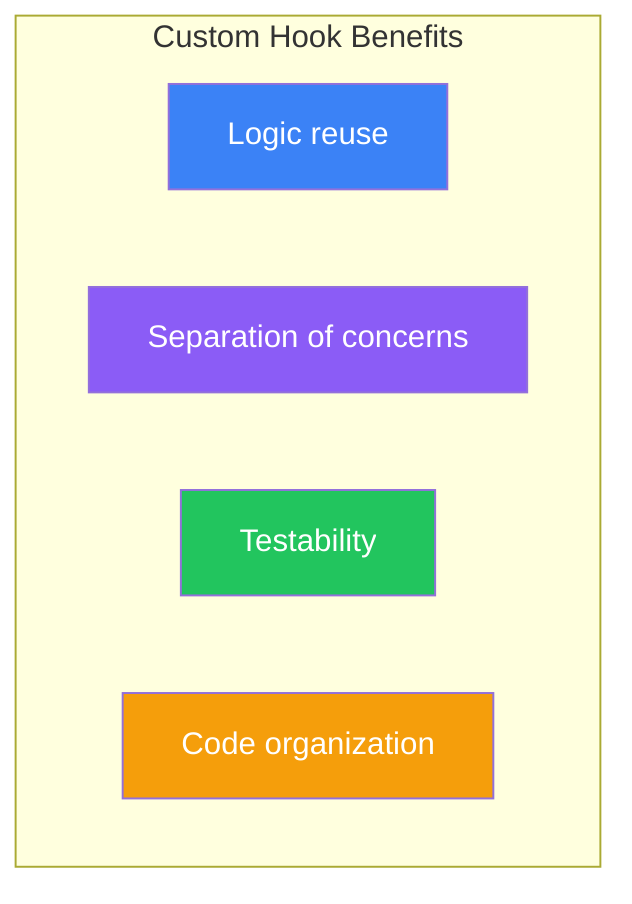
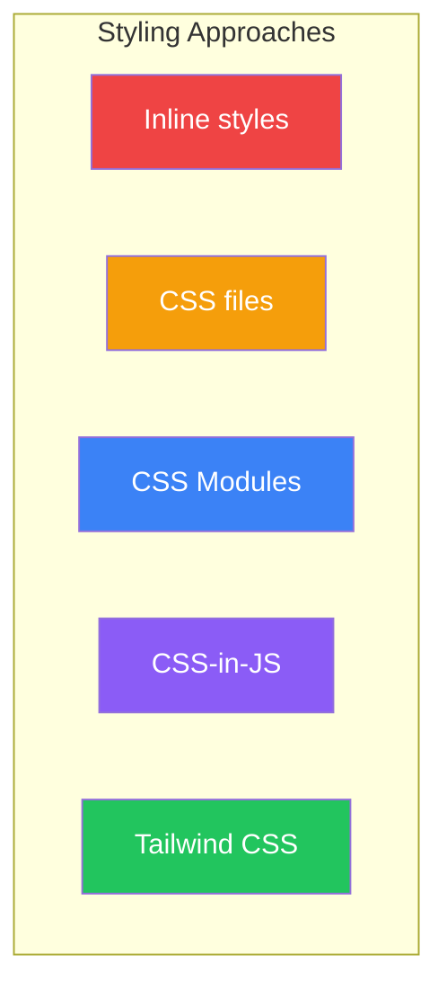
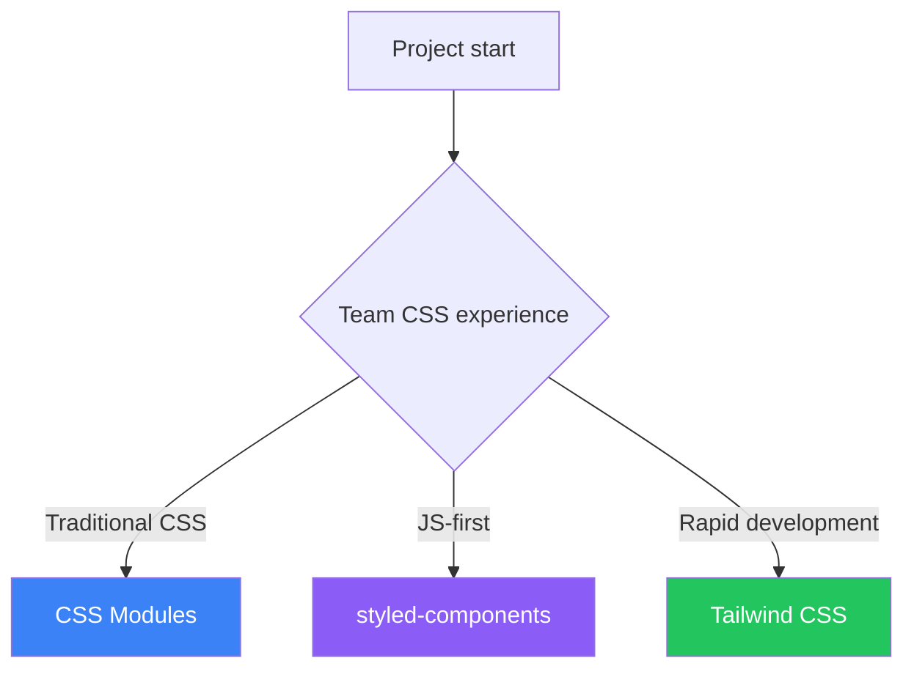

# Day 10: Custom Hooks and Styling

## What You'll Learn Today

- How to create custom hooks
- Common custom hook patterns
- CSS Modules
- CSS-in-JS (styled-components)
- Tailwind CSS

---

## What Are Custom Hooks?

**Custom hooks** are a mechanism for reusing logic between components. They must start with `use`.



### Basic Example

```jsx
import { useState, useEffect } from 'react';

// Custom hook: Get window size
function useWindowSize() {
  const [size, setSize] = useState({
    width: window.innerWidth,
    height: window.innerHeight
  });

  useEffect(() => {
    function handleResize() {
      setSize({
        width: window.innerWidth,
        height: window.innerHeight
      });
    }

    window.addEventListener('resize', handleResize);
    return () => window.removeEventListener('resize', handleResize);
  }, []);

  return size;
}

// Usage
function ResponsiveComponent() {
  const { width, height } = useWindowSize();

  return (
    <div>
      <p>Width: {width}px</p>
      <p>Height: {height}px</p>
      {width < 768 ? <MobileLayout /> : <DesktopLayout />}
    </div>
  );
}
```

---

## Common Custom Hook Patterns

### useToggle - Toggle State

```jsx
function useToggle(initialValue = false) {
  const [value, setValue] = useState(initialValue);

  const toggle = useCallback(() => {
    setValue(prev => !prev);
  }, []);

  const setTrue = useCallback(() => setValue(true), []);
  const setFalse = useCallback(() => setValue(false), []);

  return { value, toggle, setTrue, setFalse };
}

// Usage
function Modal() {
  const { value: isOpen, toggle, setFalse: close } = useToggle();

  return (
    <>
      <button onClick={toggle}>Open Modal</button>
      {isOpen && (
        <div className="modal">
          <p>Modal Content</p>
          <button onClick={close}>Close</button>
        </div>
      )}
    </>
  );
}
```

### useLocalStorage - Local Storage

```jsx
function useLocalStorage(key, initialValue) {
  const [storedValue, setStoredValue] = useState(() => {
    try {
      const item = window.localStorage.getItem(key);
      return item ? JSON.parse(item) : initialValue;
    } catch (error) {
      console.error(error);
      return initialValue;
    }
  });

  const setValue = useCallback((value) => {
    try {
      const valueToStore = value instanceof Function
        ? value(storedValue)
        : value;
      setStoredValue(valueToStore);
      window.localStorage.setItem(key, JSON.stringify(valueToStore));
    } catch (error) {
      console.error(error);
    }
  }, [key, storedValue]);

  return [storedValue, setValue];
}

// Usage
function Settings() {
  const [theme, setTheme] = useLocalStorage('theme', 'light');

  return (
    <select value={theme} onChange={(e) => setTheme(e.target.value)}>
      <option value="light">Light</option>
      <option value="dark">Dark</option>
    </select>
  );
}
```

### useFetch - Data Fetching

```jsx
function useFetch(url) {
  const [data, setData] = useState(null);
  const [loading, setLoading] = useState(true);
  const [error, setError] = useState(null);

  useEffect(() => {
    const controller = new AbortController();

    async function fetchData() {
      try {
        setLoading(true);
        setError(null);

        const response = await fetch(url, {
          signal: controller.signal
        });

        if (!response.ok) {
          throw new Error(`HTTP error! status: ${response.status}`);
        }

        const json = await response.json();
        setData(json);
      } catch (err) {
        if (err.name !== 'AbortError') {
          setError(err.message);
        }
      } finally {
        setLoading(false);
      }
    }

    fetchData();

    return () => controller.abort();
  }, [url]);

  return { data, loading, error };
}

// Usage
function UserProfile({ userId }) {
  const { data: user, loading, error } = useFetch(`/api/users/${userId}`);

  if (loading) return <p>Loading...</p>;
  if (error) return <p>Error: {error}</p>;

  return <h1>{user.name}</h1>;
}
```

### useDebounce - Delayed Input

```jsx
function useDebounce(value, delay = 500) {
  const [debouncedValue, setDebouncedValue] = useState(value);

  useEffect(() => {
    const timer = setTimeout(() => {
      setDebouncedValue(value);
    }, delay);

    return () => clearTimeout(timer);
  }, [value, delay]);

  return debouncedValue;
}

// Usage
function SearchInput() {
  const [query, setQuery] = useState('');
  const debouncedQuery = useDebounce(query, 300);

  useEffect(() => {
    if (debouncedQuery) {
      console.log('Searching:', debouncedQuery);
      // API call
    }
  }, [debouncedQuery]);

  return (
    <input
      value={query}
      onChange={(e) => setQuery(e.target.value)}
      placeholder="Search..."
    />
  );
}
```

---

## Styling in React

React offers various styling approaches.



| Approach | Features | Best For |
|----------|----------|----------|
| Inline styles | Simple, dynamic | Small dynamic styles |
| CSS files | Traditional, global | Small projects |
| CSS Modules | Scoped | Medium to large projects |
| CSS-in-JS | JS integration | Component libraries |
| Tailwind CSS | Utility-first | Rapid development |

---

## CSS Modules

CSS Modules automatically scope CSS class names.

### Setup

Vite supports CSS Modules out of the box. Just name your files `.module.css`.

### Usage Example

```css
/* Button.module.css */
.button {
  padding: 10px 20px;
  border: none;
  border-radius: 4px;
  cursor: pointer;
}

.primary {
  background-color: #3b82f6;
  color: white;
}

.secondary {
  background-color: #6b7280;
  color: white;
}

.danger {
  background-color: #ef4444;
  color: white;
}
```

```jsx
// Button.jsx
import styles from './Button.module.css';

function Button({ variant = 'primary', children, ...props }) {
  return (
    <button
      className={`${styles.button} ${styles[variant]}`}
      {...props}
    >
      {children}
    </button>
  );
}

// Usage
<Button variant="primary">Submit</Button>
<Button variant="danger">Delete</Button>
```

### Dynamic Class Names

```jsx
import styles from './Card.module.css';

function Card({ isActive, children }) {
  const cardClass = [
    styles.card,
    isActive && styles.active
  ].filter(Boolean).join(' ');

  return <div className={cardClass}>{children}</div>;
}
```

---

## CSS-in-JS (styled-components)

styled-components is a popular library for writing CSS in JavaScript.

### Installation

```bash
npm install styled-components
```

### Basic Usage

```jsx
import styled from 'styled-components';

// Create styled component
const Button = styled.button`
  padding: 10px 20px;
  border: none;
  border-radius: 4px;
  cursor: pointer;
  background-color: ${props => props.$primary ? '#3b82f6' : '#6b7280'};
  color: white;

  &:hover {
    opacity: 0.9;
  }
`;

// Usage
function App() {
  return (
    <>
      <Button $primary>Primary Button</Button>
      <Button>Secondary Button</Button>
    </>
  );
}
```

### Extending Components

```jsx
const BaseButton = styled.button`
  padding: 10px 20px;
  border: none;
  border-radius: 4px;
  cursor: pointer;
`;

// Extend
const PrimaryButton = styled(BaseButton)`
  background-color: #3b82f6;
  color: white;
`;

const DangerButton = styled(BaseButton)`
  background-color: #ef4444;
  color: white;
`;
```

### Using Themes

```jsx
import styled, { ThemeProvider } from 'styled-components';

const theme = {
  colors: {
    primary: '#3b82f6',
    secondary: '#6b7280',
    danger: '#ef4444'
  },
  spacing: {
    small: '8px',
    medium: '16px',
    large: '24px'
  }
};

const Button = styled.button`
  padding: ${props => props.theme.spacing.medium};
  background-color: ${props => props.theme.colors.primary};
  color: white;
`;

function App() {
  return (
    <ThemeProvider theme={theme}>
      <Button>Themed Button</Button>
    </ThemeProvider>
  );
}
```

---

## Tailwind CSS

Tailwind CSS is a utility-first CSS framework.

### Setup (Vite)

```bash
npm install -D tailwindcss postcss autoprefixer
npx tailwindcss init -p
```

```javascript
// tailwind.config.js
export default {
  content: [
    "./index.html",
    "./src/**/*.{js,ts,jsx,tsx}",
  ],
  theme: {
    extend: {},
  },
  plugins: [],
}
```

```css
/* index.css */
@tailwind base;
@tailwind components;
@tailwind utilities;
```

### Basic Usage

```jsx
function Button({ variant = 'primary', children }) {
  const baseClasses = "px-4 py-2 rounded font-medium";

  const variantClasses = {
    primary: "bg-blue-500 text-white hover:bg-blue-600",
    secondary: "bg-gray-500 text-white hover:bg-gray-600",
    danger: "bg-red-500 text-white hover:bg-red-600",
  };

  return (
    <button className={`${baseClasses} ${variantClasses[variant]}`}>
      {children}
    </button>
  );
}

// Usage
<Button variant="primary">Submit</Button>
```

### Responsive Design

```jsx
function Card() {
  return (
    <div className="p-4 md:p-6 lg:p-8">
      <h2 className="text-lg md:text-xl lg:text-2xl font-bold">
        Title
      </h2>
      <p className="text-sm md:text-base text-gray-600">
        Description goes here.
      </p>
    </div>
  );
}
```

### Conditional Styles

```jsx
function Alert({ type = 'info', children }) {
  const classes = {
    info: 'bg-blue-100 text-blue-800 border-blue-300',
    success: 'bg-green-100 text-green-800 border-green-300',
    warning: 'bg-yellow-100 text-yellow-800 border-yellow-300',
    error: 'bg-red-100 text-red-800 border-red-300',
  };

  return (
    <div className={`p-4 border rounded ${classes[type]}`}>
      {children}
    </div>
  );
}
```

---

## Comparing Styling Approaches

| Criteria | CSS Modules | styled-components | Tailwind |
|----------|-------------|-------------------|----------|
| Learning curve | Low | Medium | Medium |
| Bundle size | Small | Medium | Small-Medium |
| Runtime cost | None | Yes | None |
| Dynamic styles | Difficult | Easy | Possible |
| Editor support | Good | Good | Excellent |

### Choosing Based on Project



---

## 10-Day Summary

Congratulations! You've completed the 10-day React fundamentals course.

### What You Learned

| Day | Topic | Key Points |
|-----|-------|------------|
| 1 | Welcome to React | Declarative UI, Components, Vite |
| 2 | Understanding JSX | JSX syntax, Conditional rendering, Lists |
| 3 | Components and Props | Props, children, Component composition |
| 4 | State and Events | useState, Event handlers |
| 5 | Working with Forms | Controlled/Uncontrolled components |
| 6 | Effects and useEffect | useEffect, Cleanup, Data fetching |
| 7 | Refs and Portals | useRef, forwardRef, createPortal |
| 8 | Context and State Management | Context API, useReducer |
| 9 | Performance Optimization | memo, useMemo, useCallback, lazy |
| 10 | Custom Hooks and Styling | Custom hooks, CSS Modules, Tailwind |

### Next Steps

1. **Practice Projects**: Todo app, Blog, E-commerce
2. **Testing**: Jest, React Testing Library
3. **State Management**: Zustand, Redux Toolkit
4. **Frameworks**: Next.js, Remix
5. **TypeScript**: Type-safe React development

---

## Exercises

### Exercise 1: Basics
Create a `useCounter` custom hook with increment, decrement, reset functions, and min/max value limits.

### Exercise 2: Application
Implement a dark mode toggle feature:
- `useDarkMode` custom hook (persisted to local storage)
- Tailwind CSS dark mode styles
- Toggle button

### Challenge
Create a complete Todo app:
- Custom hook (`useTodos`) for logic management
- Local storage persistence
- CSS Modules or Tailwind for styling
- Filter functionality (all/completed/active)
- Animations

---

## References

- [React Docs - Custom Hooks](https://react.dev/learn/reusing-logic-with-custom-hooks)
- [styled-components Official](https://styled-components.com/)
- [Tailwind CSS Official](https://tailwindcss.com/)
- [React TypeScript Cheatsheet](https://react-typescript-cheatsheet.netlify.app/)

---

## Closing

Congratulations on completing the 10-day React learning journey!

The content covered in this book forms a solid foundation for React development. However, true skill comes through practice.

**Put what you've learned to use and build your own projects.**

Don't fear failure. Write lots of code and continue on your path to becoming a React master!
